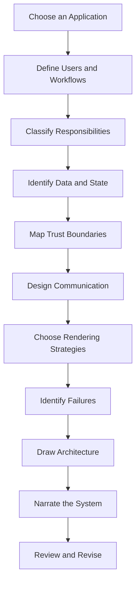
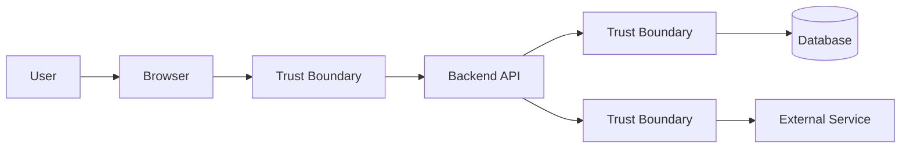
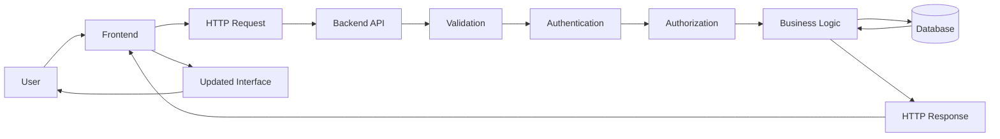
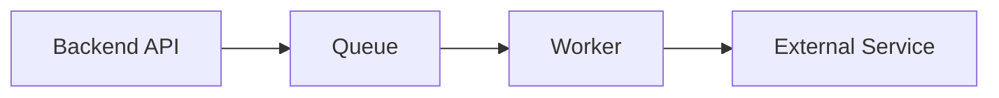
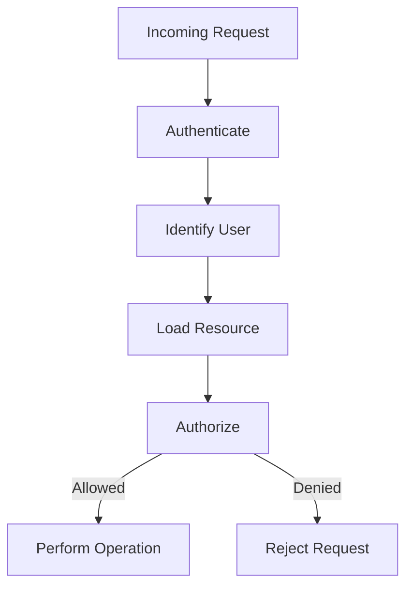
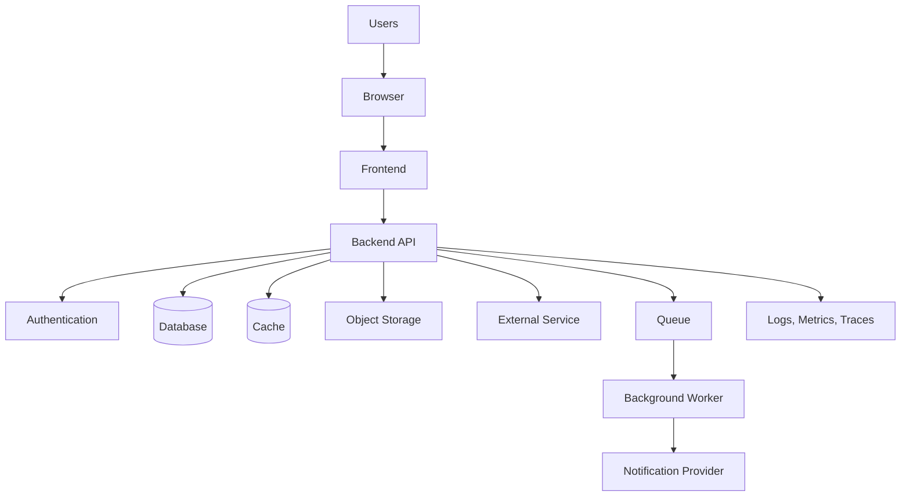
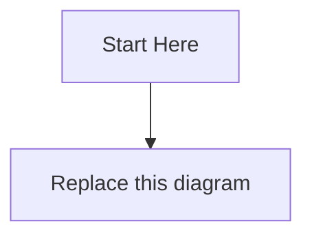

# Workbook 1 — Architecture Mapping  
## Frontend, Backend, Data, Trust Boundaries, State, and System Responsibilities

---

# Workbook Overview

This workbook accompanies:

> **Part 1 — Deconstructing Software Architecture**  
> Frontend, Backend, and the Evolution of the Stack

This is a **no-code architecture workbook**.

You do not need to use:

- JavaScript
- Python
- React
- Node.js
- SQL
- Docker
- A cloud provider
- A specific database
- A specific frontend or backend framework

Instead, you will plan and explain a web application by identifying:

```text
Users
Frontend responsibilities
Backend responsibilities
Database responsibilities
External services
Authentication
Authorization
Client-side state
Server-side state
Trust boundaries
API communication
Rendering strategies
Failure points
Architectural tradeoffs
```

The goal is to learn how to think about an application before implementing it.

---

# Learning Objectives

By completing this workbook, you should be able to:

- Separate frontend and backend responsibilities.
- Explain what the browser should and should not be trusted to do.
- Identify business logic.
- Identify data sources and sources of truth.
- Distinguish client-side state from server-side state.
- Identify authentication and authorization boundaries.
- Describe how the frontend and backend communicate.
- Compare static, server-rendered, client-rendered, and hybrid applications.
- Identify external dependencies.
- Identify possible failures.
- Create a basic architecture diagram.
- Narrate a complete user interaction.

---

# How to Use This Workbook

Complete the workbook in order.



For each activity:

1. Write your answer.
2. Explain your reasoning.
3. Record assumptions.
4. Identify anything you are uncertain about.
5. Revise your design when later activities reveal problems.

There may be multiple valid answers. The important requirement is that your design is:

```text
Clear
Consistent
Secure
Reasonable
Explainable
```

---

# Suggested Applications

Choose one application for the entire workbook.

Possible choices:

```text
Online store
Task manager
Learning platform
Appointment booking system
Social network
Video platform
Recipe application
Event registration system
Banking dashboard
Project-management tool
```

For this workbook, an online store is used in several examples, but you may choose another application.

---

# Activity 1 — Choose Your Application

## Application name

```text
____________________________________________________________
```

## One-sentence description

Complete:

> This application allows users to ___________________________________________

```text
____________________________________________________________
____________________________________________________________
```

## Longer description

Explain what the application does in two to five sentences.

```text
____________________________________________________________
____________________________________________________________
____________________________________________________________
____________________________________________________________
____________________________________________________________
```

## Primary users

List the main people or systems that interact with the application.

```text
1. ________________________________________________________
2. ________________________________________________________
3. ________________________________________________________
4. ________________________________________________________
```

## What problem does the application solve?

```text
____________________________________________________________
____________________________________________________________
____________________________________________________________
```

---

# Activity 2 — Define the Scope

A system becomes difficult to design when its boundaries are unclear.

## In-scope features

List features that this workbook will include.

```text
1. ________________________________________________________
2. ________________________________________________________
3. ________________________________________________________
4. ________________________________________________________
5. ________________________________________________________
6. ________________________________________________________
```

## Out-of-scope features

List features that the application will not address in this version.

```text
1. ________________________________________________________
2. ________________________________________________________
3. ________________________________________________________
4. ________________________________________________________
```

## Example

For an online store:

```text
In scope:
- Browse products
- Search products
- Create an account
- Add items to a cart
- Place an order
- View order history

Out of scope:
- Warehouse robotics
- International tax compliance
- Advanced fraud detection
- Native mobile applications
```

## Scope reflection

Why did you exclude the out-of-scope features?

```text
____________________________________________________________
____________________________________________________________
____________________________________________________________
```

---

# Activity 3 — Identify User Roles

Different users may have different permissions.

## User-role table

| Role | Who are they? | What can they do? | What can they not do? |
|---|---|---|---|
|  |  |  |  |
|  |  |  |  |
|  |  |  |  |
|  |  |  |  |

## Example

| Role | Who are they? | What can they do? | What can they not do? |
|---|---|---|---|
| Visitor | Unauthenticated user | Browse public products | Place orders or view private data |
| Customer | Authenticated user | Manage cart and orders | Manage other users |
| Administrator | Staff user | Manage products and orders | Access infrastructure secrets |

## Your role definitions

```text
Role 1:
  Name: _________________________________________________
  Description: __________________________________________
  Can do: _______________________________________________
  Cannot do: ____________________________________________

Role 2:
  Name: _________________________________________________
  Description: __________________________________________
  Can do: _______________________________________________
  Cannot do: ____________________________________________

Role 3:
  Name: _________________________________________________
  Description: __________________________________________
  Can do: _______________________________________________
  Cannot do: ____________________________________________
```

---

# Activity 4 — Define User Journeys

A user journey describes an interaction from the user’s perspective.

Choose three important workflows.

## Workflow 1

```text
Name:
____________________________________________________________
```

### Starting condition

What is true before the workflow begins?

```text
____________________________________________________________
```

### User action

What does the user do?

```text
____________________________________________________________
```

### Expected result

What should the user see or receive?

```text
____________________________________________________________
```

### Systems involved

```text
- _________________________________________________________
- _________________________________________________________
- _________________________________________________________
```

---

## Workflow 2

```text
Name:
____________________________________________________________
```

### Starting condition

```text
____________________________________________________________
```

### User action

```text
____________________________________________________________
```

### Expected result

```text
____________________________________________________________
```

### Systems involved

```text
- _________________________________________________________
- _________________________________________________________
- _________________________________________________________
```

---

## Workflow 3

```text
Name:
____________________________________________________________
```

### Starting condition

```text
____________________________________________________________
```

### User action

```text
____________________________________________________________
```

### Expected result

```text
____________________________________________________________
```

### Systems involved

```text
- _________________________________________________________
- _________________________________________________________
- _________________________________________________________
```

---

# Activity 5 — Separate Frontend and Backend Responsibilities

For each responsibility, decide where the final responsibility belongs.

Use:

```text
Frontend
Backend
Database
External service
Shared or coordinated
```

| Responsibility | Primary owner | Why? |
|---|---|---|
| Display product cards |  |  |
| Open a navigation menu |  |  |
| Validate that quantity is positive |  |  |
| Calculate final order total |  |  |
| Check whether an item is in stock |  |  |
| Store an order permanently |  |  |
| Show a loading spinner |  |  |
| Verify user identity |  |  |
| Check whether a user owns an order |  |  |
| Send an email |  |  |
| Store product images |  |  |
| Display an error message |  |  |
| Choose the current page tab |  |  |
| Process a payment |  |  |
| Apply a discount rule |  |  |

## Responsibility classification

Add five responsibilities specific to your application.

| Responsibility | Primary owner | Why? |
|---|---|---|
|  |  |  |
|  |  |  |
|  |  |  |
|  |  |  |
|  |  |  |

---

# Activity 6 — Identify the Trust Boundary

The browser is controlled by the user.

That means the browser may:

```text
Inspect client-side code
Modify page elements
Change form values
Send custom requests
Replay requests
Change local state
Bypass client-side validation
```

## Trust-boundary diagram

Complete this diagram:



Add labels to each trust boundary.

```text
Boundary 1:
____________________________________________________________

Boundary 2:
____________________________________________________________

Boundary 3:
____________________________________________________________
```

## Trust-boundary questions

### Question A

What can the user modify?

```text
____________________________________________________________
____________________________________________________________
```

### Question B

Which decisions must not depend only on frontend code?

```text
____________________________________________________________
____________________________________________________________
____________________________________________________________
```

### Question C

Which system should enforce permissions?

```text
____________________________________________________________
```

### Question D

Which information must never be included in browser code?

```text
____________________________________________________________
____________________________________________________________
```

---

# Activity 7 — Client-Side Validation vs Backend Enforcement

Choose three rules from your application.

For each rule, describe:

```text
Frontend behavior
Backend enforcement
What could happen if only the frontend checked it?
```

| Rule | Frontend behavior | Backend enforcement | Risk if frontend-only |
|---|---|---|---|
|  |  |  |  |
|  |  |  |  |
|  |  |  |  |

## Example

| Rule | Frontend behavior | Backend enforcement | Risk if frontend-only |
|---|---|---|---|
| Quantity must be positive | Prevent negative input | Reject nonpositive values | Malformed order or inventory corruption |
| Only admins can create products | Hide button | Check role on API request | Regular user could create products |
| Price must be current | Display price | Look up price server-side | User could submit a fake price |

---

# Activity 8 — Identify Business Logic

Business logic consists of rules that define how the application behaves.

List at least ten business rules.

```text
1. ________________________________________________________
2. ________________________________________________________
3. ________________________________________________________
4. ________________________________________________________
5. ________________________________________________________
6. ________________________________________________________
7. ________________________________________________________
8. ________________________________________________________
9. ________________________________________________________
10. _______________________________________________________
```

## Classify your rules

| Rule | Must be enforced on the backend? | Why? |
|---|---:|---|
|  |  |  |
|  |  |  |
|  |  |  |
|  |  |  |
|  |  |  |

## Example business rules

```text
A customer cannot order a negative quantity.
A customer can view only their own orders.
An administrator can update product inventory.
An order cannot be cancelled after shipment.
A payment must be confirmed before an order is marked paid.
An email notification does not determine whether the order exists.
```

---

# Activity 9 — Identify Data

List the data your application needs.

| Data item | Example value | Public or private? | Where should it be stored? |
|---|---|---|---|
|  |  |  |  |
|  |  |  |  |
|  |  |  |  |
|  |  |  |  |
|  |  |  |  |
|  |  |  |  |
|  |  |  |  |
|  |  |  |  |

## Example

| Data item | Example value | Public or private? | Where should it be stored? |
|---|---|---|---|
| Product name | Mechanical Keyboard | Public | Database |
| Product price | 79.99 USD | Public but authoritative | Database |
| Password hash | Protected value | Private | Database |
| Product image | Image file | Public or restricted | Object storage |
| Order status | Pending | Private | Database |
| Session ID | Opaque credential | Highly sensitive | Secure cookie/session store |

---

# Activity 10 — Sources of Truth

For each item, choose the authoritative source.

Use:

```text
Browser
Backend
Database
Cache
External service
Object storage
Queue or worker system
```

| Item | Source of truth | Why? |
|---|---|---|
| Open menu |  |  |
| Search text being typed |  |  |
| Product price |  |  |
| Inventory count |  |  |
| User role |  |  |
| Order status |  |  |
| Payment status |  |  |
| Uploaded image bytes |  |  |
| Email delivery status |  |  |
| Session validity |  |  |

## Conflict exercise

For each conflict, identify which value should win.

### Conflict 1

```text
Browser shows:
  Price = $79.99

Database says:
  Price = $69.99
```

Authoritative value:

```text
____________________________________________________________
```

Reason:

```text
____________________________________________________________
```

### Conflict 2

```text
Browser shows:
  Order status = shipped

Backend says:
  Order status = pending
```

Authoritative value:

```text
____________________________________________________________
```

Reason:

```text
____________________________________________________________
```

### Conflict 3

```text
Cache says:
  Product available

Database says:
  Product unavailable
```

Authoritative value:

```text
____________________________________________________________
```

Reason:

```text
____________________________________________________________
```

---

# Activity 11 — Client State and Server State

Classify each item:

```text
Client-side state
Server-side state
Shared or synchronized state
```

| State | Classification | Explanation |
|---|---|---|
| Menu is open |  |  |
| Current tab |  |  |
| User account |  |  |
| Product price |  |  |
| Cart display |  |  |
| Inventory |  |  |
| Current form input |  |  |
| Order status |  |  |
| Payment status |  |  |
| Loading indicator |  |  |

---

# Activity 12 — Design the Frontend-Backend Boundary

Complete the diagram:



## Explain each boundary

### Frontend to backend

```text
What does the frontend send?
____________________________________________________________

What does the backend return?
____________________________________________________________
```

### Backend to database

```text
What does the backend ask the database for?
____________________________________________________________

What should the database never receive directly from the browser?
____________________________________________________________
```

### Backend to external service

```text
Which external service is involved?
____________________________________________________________

What happens if it fails?
____________________________________________________________
```

---

# Activity 13 — API Contract Planning

Choose one important operation.

Examples:

```text
List products
Log in
Create an order
Upload an image
View order history
Update a product
```

## Operation

```text
____________________________________________________________
```

## Endpoint

```http
METHOD /path
```

```text
____________________________________________________________
```

## Purpose

```text
____________________________________________________________
____________________________________________________________
```

## Authentication required?

```text
Yes / No

Explain:
____________________________________________________________
```

## Authorization required?

```text
Yes / No

Explain:
____________________________________________________________
```

## Request parameters

| Name | Location | Type | Required? | Meaning |
|---|---|---|---:|---|
|  |  |  |  |  |
|  |  |  |  |  |
|  |  |  |  |  |

## Request body

```json
{
}
```

## Success response

```http
200 OK
```

```json
{
}
```

## Possible errors

| Status | Condition | Meaning |
|---:|---|---|
|  |  |  |
|  |  |  |
|  |  |  |
|  |  |  |

## Is the operation idempotent?

```text
Yes / No / Depends

Explain:
____________________________________________________________
```

---

# Activity 14 — Rendering Strategy Selection

Choose a rendering strategy for each feature.

Use:

```text
Static generation
Server-side rendering
Client-side rendering
Hybrid rendering
Background processing
```

| Feature | Strategy | Why? |
|---|---|---|
| Public homepage |  |  |
| Public documentation |  |  |
| Product detail page |  |  |
| Private dashboard |  |  |
| Shopping cart |  |  |
| Checkout |  |  |
| Real-time order tracking |  |  |
| Monthly report generation |  |  |

## Reflection

Why might one application use multiple rendering strategies?

```text
____________________________________________________________
____________________________________________________________
____________________________________________________________
```

---

# Activity 15 — External Services

List external services your application may need.

```text
1. ________________________________________________________
2. ________________________________________________________
3. ________________________________________________________
4. ________________________________________________________
5. ________________________________________________________
```

Complete the table:

| Service | Purpose | Critical? | What happens if unavailable? |
|---|---|---:|---|
|  |  |  |  |
|  |  |  |  |
|  |  |  |  |
|  |  |  |  |
|  |  |  |  |

Classify each dependency:

```text
Critical:
  The core operation cannot safely complete without it.

Important but recoverable:
  The operation can continue or become pending.

Optional:
  The main experience should continue without it.
```

---

# Activity 16 — Background Work

List tasks that should not necessarily block the user’s immediate request.

```text
1. ________________________________________________________
2. ________________________________________________________
3. ________________________________________________________
4. ________________________________________________________
5. ________________________________________________________
```

Complete the queue design:



## Queue purpose

```text
____________________________________________________________
```

## Worker responsibility

```text
____________________________________________________________
```

## Retry behavior

```text
____________________________________________________________
```

## Permanent failure behavior

```text
____________________________________________________________
```

## Duplicate-job protection

```text
____________________________________________________________
```

---

# Activity 17 — Failure Mapping

For each component, identify at least one failure.

| Component | Possible failure | User impact | Proposed response |
|---|---|---|---|
| Browser/frontend |  |  |  |
| API |  |  |  |
| Database |  |  |  |
| Cache |  |  |  |
| Payment provider |  |  |  |
| Email provider |  |  |  |
| Object storage |  |  |  |
| Queue |  |  |  |
| Worker |  |  |  |

## Example

| Component | Possible failure | User impact | Proposed response |
|---|---|---|---|
| Email provider | Temporarily unavailable | Confirmation delayed | Retry asynchronously |
| Database | Cannot connect | Product data unavailable | Safe error and alert |
| Cache | Unavailable | Slower responses | Fall back to database if safe |

---

# Activity 18 — Authentication and Authorization Map

Create a security flow for a protected action.



## Protected action

```text
____________________________________________________________
```

## Authentication method

```text
Session cookie / bearer token / other:

____________________________________________________________
```

## Authentication failure

What should happen?

```text
____________________________________________________________
```

## Authorization failure

What should happen?

```text
____________________________________________________________
```

## Ownership rule

```text
____________________________________________________________
____________________________________________________________
```

---

# Activity 19 — Architecture Diagram

Create your main architecture diagram.

Start with this template:



Replace or extend the labels for your application.

## Your architecture diagram



## Diagram annotations

After creating the diagram, write:

### Public components

```text
____________________________________________________________
```

### Private components

```text
____________________________________________________________
```

### Untrusted components

```text
____________________________________________________________
```

### Authoritative data stores

```text
____________________________________________________________
```

### Optional dependencies

```text
____________________________________________________________
```

### Background work

```text
____________________________________________________________
```

---

# Activity 20 — Architecture Narration

Write a three-to-five-paragraph explanation of your diagram.

Use this structure:

## Paragraph 1 — User and frontend

Explain:

```text
Who the user is
What the browser does
What the frontend displays
What temporary state it manages
```

```text
____________________________________________________________
____________________________________________________________
____________________________________________________________
____________________________________________________________
```

## Paragraph 2 — Backend and API

Explain:

```text
How requests reach the backend
How input is validated
How authentication and authorization work
Where business logic is applied
```

```text
____________________________________________________________
____________________________________________________________
____________________________________________________________
____________________________________________________________
```

## Paragraph 3 — Data and external systems

Explain:

```text
Where data is stored
Which system is authoritative
Which external services are involved
What is cached
```

```text
____________________________________________________________
____________________________________________________________
____________________________________________________________
____________________________________________________________
```

## Paragraph 4 — Failure and operations

Explain:

```text
What happens when dependencies fail
How errors are observed
How work is retried
How the system is recovered
```

```text
____________________________________________________________
____________________________________________________________
____________________________________________________________
____________________________________________________________
```

---

# Activity 21 — Design Review

Review your own architecture.

## Client-server boundary

```text
[ ] Browser is treated as untrusted.
[ ] Backend enforces authorization.
[ ] Backend validates input.
[ ] Private credentials remain server-side.
[ ] Database is not directly exposed to the browser.
```

## Data ownership

```text
[ ] Sources of truth are identified.
[ ] Cache is not treated as permanent authority.
[ ] Browser state is distinguished from server state.
[ ] External-provider state is identified.
```

## API

```text
[ ] Important operations have endpoints.
[ ] HTTP methods are appropriate.
[ ] Request and response formats are described.
[ ] Errors are described.
[ ] Pagination is considered.
[ ] Idempotency is considered for important operations.
```

## Reliability

```text
[ ] Timeouts are considered.
[ ] Retries are bounded.
[ ] Optional dependencies can fail gracefully.
[ ] Background work uses a queue where appropriate.
[ ] Backups are considered.
```

## Performance

```text
[ ] Large collections are paginated.
[ ] Images are optimized.
[ ] Public content can be cached where appropriate.
[ ] Database queries can be indexed.
[ ] Noncritical work does not block the main experience.
```

---

# Activity 22 — Revision Log

Record changes you made to your design.

| Original decision | Problem discovered | Revised decision | Reason |
|---|---|---|---|
|  |  |  |  |
|  |  |  |  |
|  |  |  |  |
|  |  |  |  |
|  |  |  |  |

This section is important because good architecture is usually iterative.

---

# Activity 23 — Reflection Questions

Answer in your own words.

## Question A

Which component was easiest to define?

```text
____________________________________________________________
____________________________________________________________
```

## Question B

Which responsibility was hardest to assign?

```text
____________________________________________________________
____________________________________________________________
```

## Question C

Which data item required the clearest source-of-truth decision?

```text
____________________________________________________________
____________________________________________________________
```

## Question D

Which dependency is most dangerous if it fails?

```text
____________________________________________________________
____________________________________________________________
```

## Question E

What did you initially place in the frontend that should belong on the backend?

```text
____________________________________________________________
____________________________________________________________
```

## Question F

What did you initially forget?

```text
____________________________________________________________
____________________________________________________________
```

## Question G

What would you simplify if only two people were building the first version?

```text
____________________________________________________________
____________________________________________________________
```

## Question H

What would you change if the system grew to ten times its expected traffic?

```text
____________________________________________________________
____________________________________________________________
```

---

# Activity 24 — Final Architecture Summary

Complete the following statements.

```text
The browser is responsible for:
____________________________________________________________
____________________________________________________________

The backend is responsible for:
____________________________________________________________
____________________________________________________________

The database is responsible for:
____________________________________________________________
____________________________________________________________

The cache is responsible for:
____________________________________________________________
____________________________________________________________

The external services are responsible for:
____________________________________________________________
____________________________________________________________

The queue and workers are responsible for:
____________________________________________________________
____________________________________________________________

The most important security boundary is:
____________________________________________________________

The most important source of truth is:
____________________________________________________________

The most likely failure is:
____________________________________________________________

The most important performance improvement is:
____________________________________________________________

The most important operational concern is:
____________________________________________________________
```

---

# Workbook Completion Checklist

```text
[ ] I selected an application.
[ ] I defined the scope.
[ ] I identified users and roles.
[ ] I described three user journeys.
[ ] I classified frontend and backend responsibilities.
[ ] I identified trust boundaries.
[ ] I documented business rules.
[ ] I listed important data.
[ ] I identified sources of truth.
[ ] I separated client and server state.
[ ] I designed at least one API contract.
[ ] I selected rendering strategies.
[ ] I listed external dependencies.
[ ] I planned background work.
[ ] I mapped failure scenarios.
[ ] I planned authentication and authorization.
[ ] I created an architecture diagram.
[ ] I narrated the architecture.
[ ] I reviewed performance and reliability.
[ ] I revised my design.
[ ] I completed the reflection questions.
```

---

# Final Submission

Submit the following artifacts:

```text
1. Application overview
2. User-role table
3. User journeys
4. Responsibility table
5. Trust-boundary explanation
6. Business-rule list
7. Data and source-of-truth table
8. API contract
9. Rendering strategy table
10. Dependency table
11. Failure map
12. Authentication and authorization plan
13. Architecture diagram
14. Architecture narration
15. Revision log
16. Reflection answers
```

---

# Completion Standard

You have completed this workbook when you can explain your application without relying on framework or programming-language names.

You should be able to answer:

```text
Who uses the system?
What does the browser do?
What does the backend do?
Where is important data stored?
Which system is authoritative?
How do requests travel?
How is identity verified?
How are permissions enforced?
What happens if a dependency fails?
What is cached?
What work is asynchronous?
How could the system become faster?
How could it be monitored?
```

The central goal of this workbook is:

> Design the system clearly enough that another person could understand what needs to be built before any programming language or framework is selected.
