# Workbook 2 — Internet and Network Mapping  
## DNS, IP Addresses, Packets, Routing, Ports, CDNs, Data Centers, and Request Journeys

---

# Workbook Overview

This workbook accompanies:

> **Part 2 — How the Internet and the Web Work**  
> Data Highways, DNS Resolution, Client-Server Topology, and Global Infrastructure

This is a **no-code networking workbook**.

You do not need to build network software or configure production infrastructure. You will instead:

- Map how devices communicate
- Analyze domain names and URLs
- Trace DNS resolution
- Distinguish public and private addresses
- Explain routers, switches, and ISPs
- Compare latency and bandwidth
- Identify network failure points
- Design a CDN and data-center layout
- Explain how a browser request travels across the Internet
- Narrate what happens when the network behaves normally or fails

You may use simple inspection tools such as:

```bash
nslookup
dig
curl
traceroute
tracert
```

Only inspect systems you own or are authorized to inspect. Do not perform aggressive scanning or load testing.

---

# Learning Objectives

By completing this workbook, you should be able to:

- Explain the difference between the Internet and the Web.
- Describe the network layers involved in web communication.
- Explain packets and packet switching.
- Distinguish IPv4 from IPv6.
- Distinguish public and private IP addresses.
- Explain NAT.
- Analyze domain names and hostnames.
- Trace a DNS lookup.
- Identify common DNS records.
- Explain DNS caching and TTL.
- Distinguish routers from switches.
- Explain ISP and data-center roles.
- Distinguish latency from bandwidth.
- Explain jitter and packet loss.
- Explain ports and services.
- Design a CDN and origin-server layout.
- Identify public and private network boundaries.
- Diagnose basic DNS, connection, firewall, and routing problems.

---

# How to Use This Workbook

Work through the activities in order.

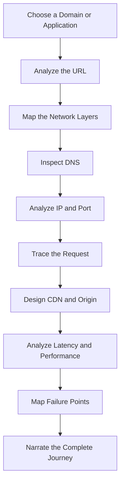

For each activity:

1. Write what you observe.
2. Separate facts from assumptions.
3. Identify what tool or evidence supports your answer.
4. Record uncertainties.
5. Explain what you would investigate next.

---

# Activity 1 — Choose a Domain or Application

Choose one public website you are authorized to inspect, or use an application you designed in Workbook 1.

## Domain or application

```text
____________________________________________________________
```

## What does it appear to provide?

```text
____________________________________________________________
____________________________________________________________
```

## Is it primarily:

```text
[ ] Public website
[ ] Web application
[ ] API
[ ] Documentation site
[ ] Media platform
[ ] E-commerce site
[ ] Other: _________________________________________________
```

## Why did you choose it?

```text
____________________________________________________________
____________________________________________________________
```

---

# Activity 2 — Internet vs Web

Complete the comparison.

| Internet | Web |
|---|---|
|  |  |
|  |  |
|  |  |
|  |  |

## Questions

### What physical or infrastructure components belong to the Internet?

```text
____________________________________________________________
____________________________________________________________
____________________________________________________________
```

### What software and application technologies belong to the Web?

```text
____________________________________________________________
____________________________________________________________
____________________________________________________________
```

### Name three Internet-based systems that are not primarily the Web.

```text
1. ________________________________________________________
2. ________________________________________________________
3. ________________________________________________________
```

---

# Activity 3 — Network Layers

Use this simplified model:

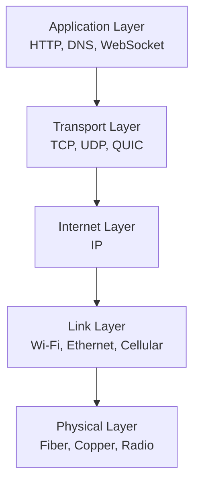

Complete the table.

| Layer | Main question it answers | Example |
|---|---|---|
| Application |  |  |
| Transport |  |  |
| Internet |  |  |
| Link |  |  |
| Physical |  |  |

## Reflection

Why is it useful to divide networking into layers?

```text
____________________________________________________________
____________________________________________________________
____________________________________________________________
```

## Failure mapping

For each failure, identify the likely layer.

| Failure | Likely layer |
|---|---|
| DNS name cannot be resolved |  |
| HTTP status is `404` |  |
| Wi-Fi signal is unstable |  |
| TLS certificate is invalid |  |
| Packets are being lost |  |
| Backend returns `500` |  |

---

# Activity 4 — Analyze a URL

Choose a URL from your application or an authorized public site.

```text
URL:
____________________________________________________________
```

Break it into parts:

```text
Scheme:
____________________________________________________________

Host:
____________________________________________________________

Port:
____________________________________________________________

Path:
____________________________________________________________

Query string:
____________________________________________________________

Fragment:
____________________________________________________________
```

If a component is absent, write:

```text
Not present
```

## URL diagram

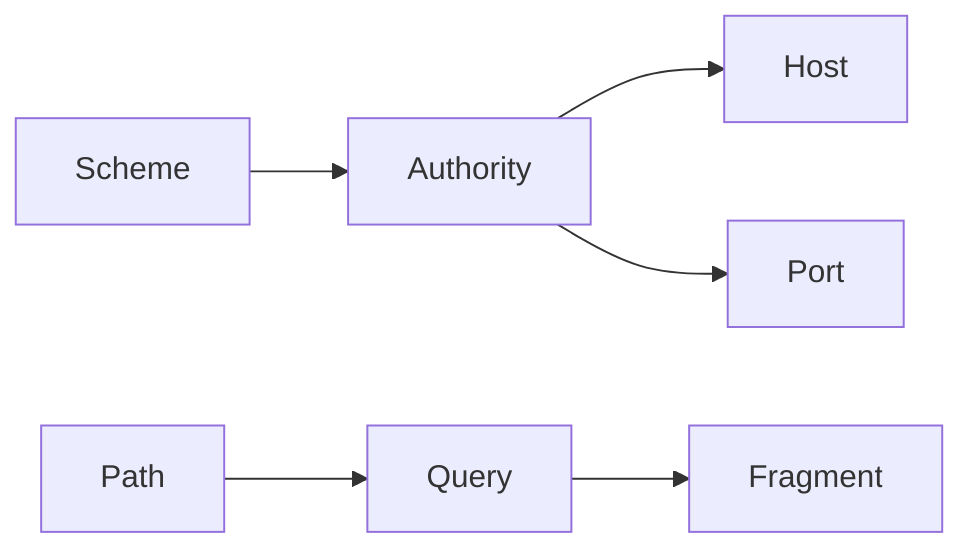

Replace the labels with the actual parts of your URL.

---

# Activity 5 — Domain Name Structure

Analyze this hostname:

```text
api.shop.example.com
```

Break it into labels:

```text
Label 1:
____________________________________________________________

Label 2:
____________________________________________________________

Label 3:
____________________________________________________________

Label 4:
____________________________________________________________
```

Complete the table:

| Part | Possible meaning |
|---|---|
| `com` |  |
| `example` |  |
| `shop` |  |
| `api` |  |

## Analyze your chosen hostname

```text
Hostname:
____________________________________________________________

Top-level domain:
____________________________________________________________

Registered domain:
____________________________________________________________

Subdomain or service label:
____________________________________________________________
```

## Important note

A hostname label does not guarantee a specific infrastructure design.

For example:

```text
api.example.com
```

may point to:

- A load balancer
- A CDN
- An API gateway
- A server cluster
- A serverless platform
- A single development server

Explain what your hostname might represent.

```text
____________________________________________________________
____________________________________________________________
```

---

# Activity 6 — IPv4 and IPv6

Complete the comparison.

| Feature | IPv4 | IPv6 |
|---|---|---|
| Address size |  |  |
| Example format |  |  |
| Number of bits |  |  |
| Common notation |  |  |
| Common record type |  |  |

## Classify these addresses

| Address | IPv4 or IPv6? | Public, private, or special? |
|---|---|---|
| `192.168.1.10` |  |  |
| `10.0.0.5` |  |  |
| `127.0.0.1` |  |  |
| `203.0.113.10` |  |  |
| `2001:db8::1` |  |  |
| `::1` |  |  |

## Reflection

Why does IPv6 exist?

```text
____________________________________________________________
____________________________________________________________
```

---

# Activity 7 — Public and Private Networks

Complete the diagram:

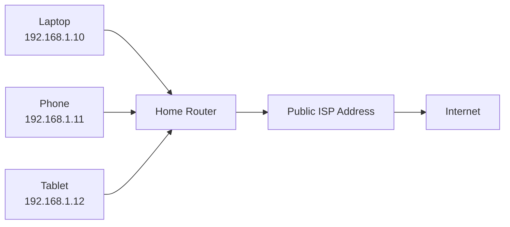

## Questions

### Which addresses are private?

```text
____________________________________________________________
```

### Which component connects the private network to the public Internet?

```text
____________________________________________________________
```

### What does NAT commonly do?

```text
____________________________________________________________
____________________________________________________________
```

### Why are private addresses useful?

```text
____________________________________________________________
____________________________________________________________
```

### What limitations can NAT introduce?

```text
____________________________________________________________
____________________________________________________________
```

---

# Activity 8 — DNS Record Investigation

Use an authorized domain.

Try:

```bash
nslookup example.com
```

or:

```bash
dig example.com
```

Inspect the following record types where available:

```bash
dig A example.com
dig AAAA example.com
dig CNAME example.com
dig MX example.com
dig TXT example.com
dig NS example.com
```

If a record does not exist, record:

```text
Not present or not returned
```

## Record table

| Record type | Result | What does it mean? |
|---|---|---|
| `A` |  |  |
| `AAAA` |  |  |
| `CNAME` |  |  |
| `MX` |  |  |
| `TXT` |  |  |
| `NS` |  |  |

## Questions

### Which record would a browser commonly need to find an IPv4 destination?

```text
____________________________________________________________
```

### Which record would a browser commonly need to find an IPv6 destination?

```text
____________________________________________________________
```

### Which record identifies mail servers?

```text
____________________________________________________________
```

### Which record can create a hostname alias?

```text
____________________________________________________________
```

---

# Activity 9 — DNS Lookup Narrative

Write a simplified DNS lookup for:

```text
www.example.com
```

Use this diagram:

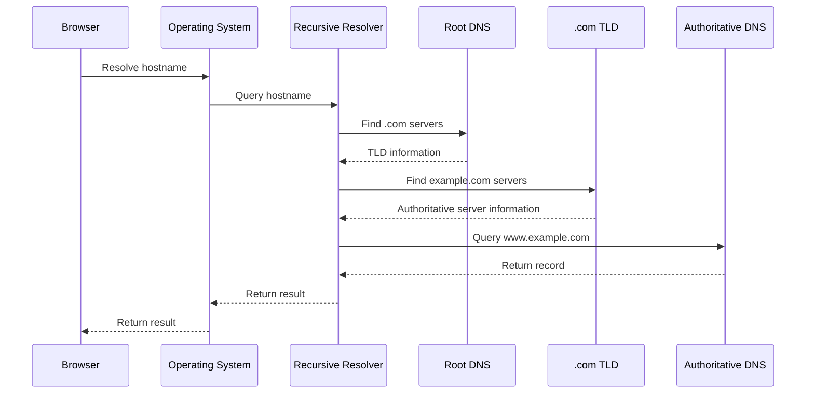

## Describe each step

### Step 1 — Browser

```text
____________________________________________________________
```

### Step 2 — Browser or operating-system cache

```text
____________________________________________________________
```

### Step 3 — Recursive resolver

```text
____________________________________________________________
```

### Step 4 — Root DNS system

```text
____________________________________________________________
```

### Step 5 — TLD server

```text
____________________________________________________________
```

### Step 6 — Authoritative server

```text
____________________________________________________________
```

---

# Activity 10 — DNS Caching and TTL

Suppose the DNS record is:

```text
shop.example.com. 300 IN A 203.0.113.50
```

## Questions

### What is the TTL?

```text
____________________________________________________________
```

### How long may a resolver cache this result?

```text
____________________________________________________________
```

### Why might users still reach the old server after a DNS change?

```text
____________________________________________________________
____________________________________________________________
```

### What are the benefits of DNS caching?

```text
____________________________________________________________
____________________________________________________________
```

### What are the tradeoffs of a very long TTL?

```text
____________________________________________________________
____________________________________________________________
```

---

# Activity 11 — Forward and Reverse DNS

## Forward lookup

```text
Hostname:
  example.com

Result:
  IP address
```

Describe what forward DNS does.

```text
____________________________________________________________
```

## Reverse lookup

Choose an authorized IP address and inspect it if appropriate.

```text
IP address:
____________________________________________________________

Hostname result:
____________________________________________________________
```

Describe what reverse DNS does.

```text
____________________________________________________________
```

## Comparison

| Forward DNS | Reverse DNS |
|---|---|
|  |  |
|  |  |
|  |  |

---

# Activity 12 — Router vs Switch

Complete the table.

| Device | Main role | Typical location |
|---|---|---|
| Switch |  |  |
| Router |  |  |

## Scenario classification

Identify whether each situation primarily involves a switch or router.

| Situation | Switch or router? | Why? |
|---|---|---|
| Connect a laptop and printer in one office LAN |  |  |
| Connect a home network to an ISP |  |  |
| Forward traffic between data-center networks |  |  |
| Connect devices within a server rack |  |  |

---

# Activity 13 — ISP and Autonomous Networks

## ISP

What does an Internet Service Provider do?

```text
____________________________________________________________
____________________________________________________________
```

## Larger networks

Large providers may operate autonomous networks with their own routing policies.

Why might different networks need to exchange routing information?

```text
____________________________________________________________
____________________________________________________________
```

## Routing policies

List three reasons a route might change.

```text
1. ________________________________________________________
2. ________________________________________________________
3. ________________________________________________________
```

---

# Activity 14 — Packets and Packet Switching

Complete the diagram:

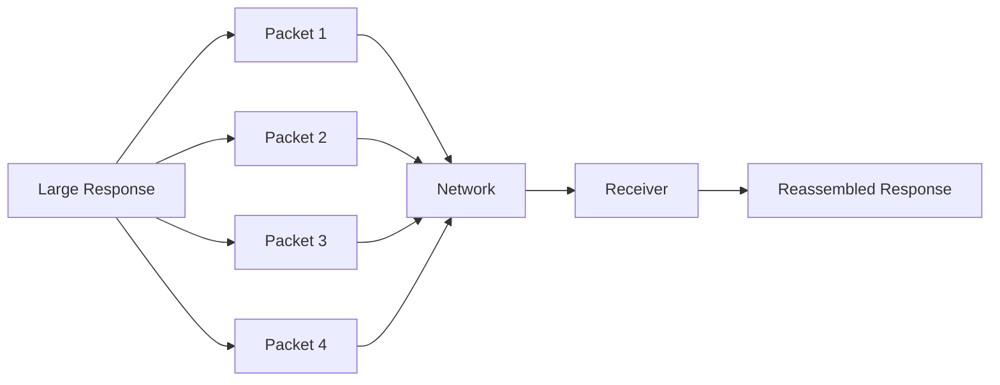

## Questions

### Why is the response divided into packets?

```text
____________________________________________________________
```

### Can packets potentially take different paths?

```text
____________________________________________________________
```

### What happens if a packet is lost?

```text
____________________________________________________________
```

### Which systems help restore order and reliability?

```text
____________________________________________________________
```

---

# Activity 15 — Latency, Bandwidth, Jitter, and Packet Loss

Complete the table.

| Term | Meaning | User-visible effect |
|---|---|---|
| Latency |  |  |
| Bandwidth |  |  |
| Jitter |  |  |
| Packet loss |  |  |

## Compare these networks

### Network A

```text
High bandwidth
High latency
Low packet loss
```

### Network B

```text
Low bandwidth
Low latency
Low packet loss
```

### Which network may feel better for a small API request?

```text
____________________________________________________________
```

### Which network may be better for downloading a large video?

```text
____________________________________________________________
```

### Can a network have high bandwidth and high latency?

```text
____________________________________________________________
```

Explain.

```text
____________________________________________________________
```

---

# Activity 16 — Ports and Services

Complete this table.

| Port | Common service | Why does the port matter? |
|---:|---|---|
| `22` |  |  |
| `53` |  |  |
| `80` |  |  |
| `443` |  |  |
| `3000` |  |  |
| `5432` |  |  |

## Analyze this destination

```text
203.0.113.10:443
```

```text
IP address:
____________________________________________________________

Port:
____________________________________________________________

Likely protocol:
____________________________________________________________
```

## Local development

Analyze:

```text
http://localhost:4000
```

```text
Scheme:
____________________________________________________________

Host:
____________________________________________________________

Port:
____________________________________________________________

Likely service:
____________________________________________________________
```

---

# Activity 17 — Network Topology

Design a basic network topology for your chosen application.

Start with:

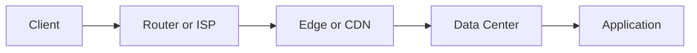

Add:

```text
DNS
Firewall
Load balancer
Database
Private network
Object storage
External services
```

## Your diagram

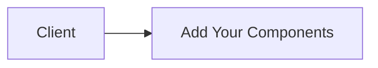

## Explain the topology

```text
____________________________________________________________
____________________________________________________________
____________________________________________________________
____________________________________________________________
```

---

# Activity 18 — Data Center Design

A data center may contain:

```text
Application servers
Database servers
Storage systems
Routers
Switches
Load balancers
Power systems
Cooling systems
Monitoring
```

Complete the diagram:

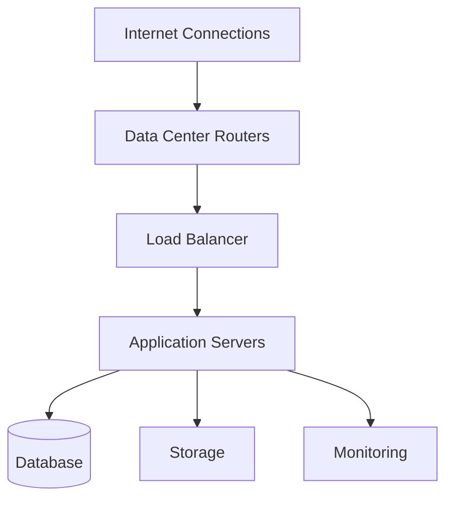

## Questions

### Which components should usually be publicly reachable?

```text
____________________________________________________________
```

### Which components should usually remain private?

```text
____________________________________________________________
```

### Why should a database not normally be exposed directly to the public Internet?

```text
____________________________________________________________
____________________________________________________________
```

---

# Activity 19 — CDN and Origin Server

Design how your application might use a CDN.

## Cacheable content

List content that could be cached:

```text
1. ________________________________________________________
2. ________________________________________________________
3. ________________________________________________________
4. ________________________________________________________
5. ________________________________________________________
```

## Non-cacheable or sensitive content

List content that requires more caution:

```text
1. ________________________________________________________
2. ________________________________________________________
3. ________________________________________________________
4. ________________________________________________________
```

## CDN diagram

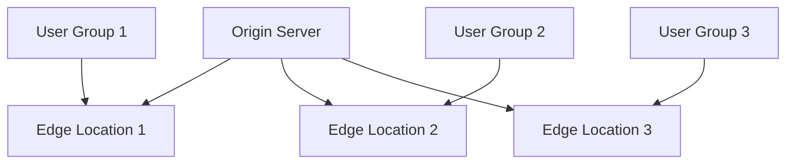

## Explain

### What happens on a cache hit?

```text
____________________________________________________________
```

### What happens on a cache miss?

```text
____________________________________________________________
```

### What are two CDN benefits?

```text
1. ________________________________________________________
2. ________________________________________________________
```

### What are two CDN risks or limitations?

```text
1. ________________________________________________________
2. ________________________________________________________
```

---

# Activity 20 — Load Balancer Design

Complete the diagram:

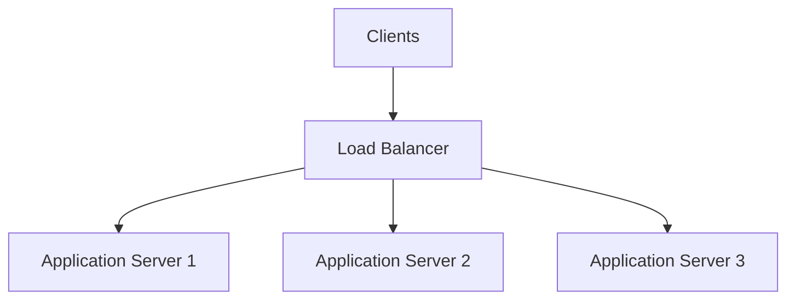

## Questions

### Why use multiple application servers?

```text
____________________________________________________________
```

### What does the load balancer check?

```text
____________________________________________________________
```

### What happens if Server 2 fails?

```text
____________________________________________________________
```

### What happens if all servers fail?

```text
____________________________________________________________
```

### What state-management problem can occur when requests move between servers?

```text
____________________________________________________________
```

---

# Activity 21 — Trace a Complete Web Request

Trace this request:

```text
https://shop.example.com/products/123
```

Use the following stages:

```text
User
Browser
DNS
IP address
Network routing
TLS
HTTP
CDN or edge
Load balancer
Backend
Database
Response
Browser rendering
```

## Complete sequence

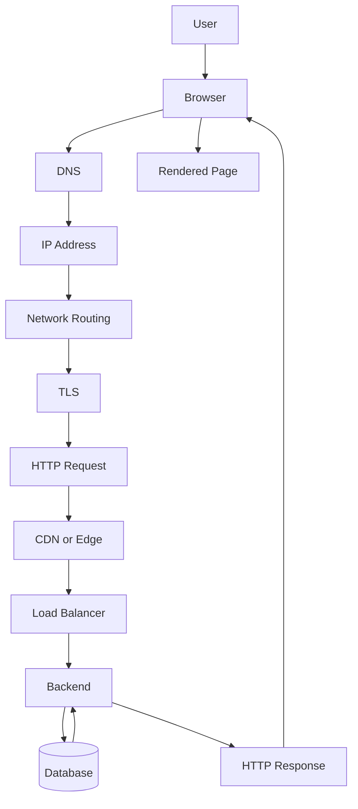

## Narrate the request

```text
1. _________________________________________________________
2. _________________________________________________________
3. _________________________________________________________
4. _________________________________________________________
5. _________________________________________________________
6. _________________________________________________________
7. _________________________________________________________
8. _________________________________________________________
9. _________________________________________________________
10. ________________________________________________________
```

---

# Activity 22 — Network Failure Mapping

For each failure, identify:

```text
Likely layer
Evidence
Next diagnostic tool
```

| Symptom | Likely layer | Evidence | Next tool |
|---|---|---|---|
| Hostname cannot be resolved |  |  |  |
| Connection times out |  |  |  |
| Connection refused |  |  |  |
| Certificate is invalid |  |  |  |
| HTTP `404` |  |  |  |
| HTTP `500` |  |  |  |
| Slow first byte |  |  |  |
| Slow download |  |  |  |

---

# Activity 23 — Network Troubleshooting Decision Tree

Complete or expand this decision tree:

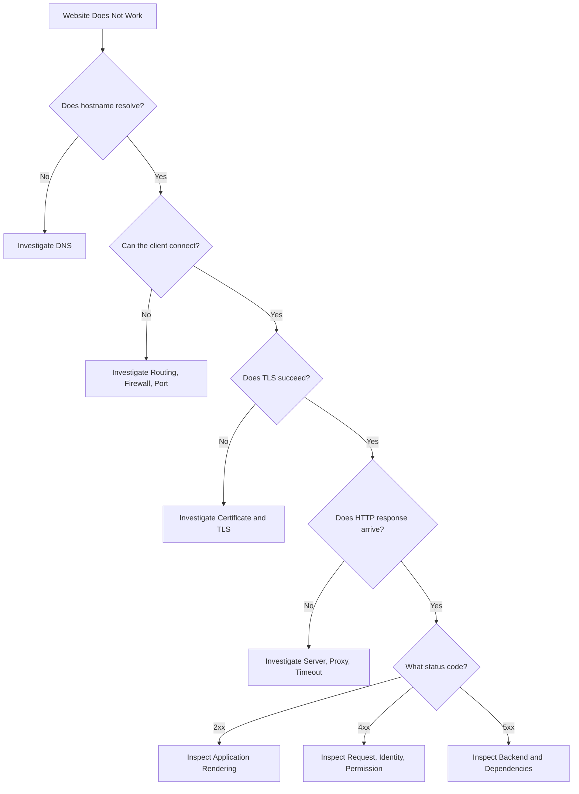

Add at least three additional diagnostic branches.

```text
1. _________________________________________________________
2. _________________________________________________________
3. _________________________________________________________
```

---

# Activity 24 — Network Inspection

Use an authorized domain or local application.

Run:

```bash
nslookup example.com
```

or:

```bash
dig example.com
```

Then:

```bash
curl -v https://example.com
```

Record:

```text
Hostname:
____________________________________________________________

Resolved IPv4 address:
____________________________________________________________

Resolved IPv6 address:
____________________________________________________________

Destination port:
____________________________________________________________

TLS information:
____________________________________________________________

HTTP status:
____________________________________________________________

Response content type:
____________________________________________________________
```

---

# Activity 25 — Performance and Network Timing

Run:

```bash
curl \
  -o /dev/null \
  -s \
  -w "\
status=%{http_code}\n\
dns=%{time_namelookup}s\n\
connect=%{time_connect}s\n\
tls=%{time_appconnect}s\n\
ttfb=%{time_starttransfer}s\n\
total=%{time_total}s\n" \
  https://example.com
```

Record:

```text
DNS time:
____________________________________________________________

Connection time:
____________________________________________________________

TLS time:
____________________________________________________________

TTFB:
____________________________________________________________

Total time:
____________________________________________________________
```

## Interpretation

Which phase is largest?

```text
____________________________________________________________
```

What might that suggest?

```text
____________________________________________________________
____________________________________________________________
```

---

# Activity 26 — Network Design Tradeoffs

Complete the table.

| Design choice | Benefit | Cost or risk |
|---|---|---|
| Use a CDN |  |  |
| Deploy multiple regions |  |  |
| Use IPv6 |  |  |
| Use a private database network |  |  |
| Use a load balancer |  |  |
| Use a long DNS TTL |  |  |
| Use a short DNS TTL |  |  |
| Use a read replica |  |  |

---

# Activity 27 — Final Network Narration

Write a narration of how your chosen application uses the Internet and Web.

Include:

```text
How users find the application
How DNS participates
How the client receives an IP address
How packets travel
How HTTPS protects the connection
How HTTP carries the request
How the request reaches the backend
How the database participates
How the response returns
How a CDN helps
Where failures can occur
```

```text
____________________________________________________________
____________________________________________________________
____________________________________________________________
____________________________________________________________
____________________________________________________________
____________________________________________________________
____________________________________________________________
____________________________________________________________
____________________________________________________________
____________________________________________________________
```

---

# Activity 28 — Reflection Questions

## Question A

Which networking concept was easiest to understand?

```text
____________________________________________________________
```

## Question B

Which concept was most difficult?

```text
____________________________________________________________
```

## Question C

What is the difference between locating a server and communicating with an application?

```text
____________________________________________________________
____________________________________________________________
```

## Question D

What happens if DNS works but the server is down?

```text
____________________________________________________________
```

## Question E

What happens if DNS fails?

```text
____________________________________________________________
```

## Question F

Why does physical distance matter?

```text
____________________________________________________________
```

## Question G

What problem does a CDN solve?

```text
____________________________________________________________
```

## Question H

What problem does a load balancer solve?

```text
____________________________________________________________
```

## Question I

What problem does a firewall solve?

```text
____________________________________________________________
```

## Question J

What network assumption in your original design did you revise?

```text
____________________________________________________________
```

---

# Workbook Completion Checklist

```text
[ ] I explained Internet versus Web.
[ ] I mapped network layers.
[ ] I analyzed a URL.
[ ] I analyzed a domain name.
[ ] I compared IPv4 and IPv6.
[ ] I classified public and private addresses.
[ ] I explained NAT.
[ ] I inspected DNS records.
[ ] I narrated DNS resolution.
[ ] I explained DNS caching and TTL.
[ ] I distinguished routers and switches.
[ ] I explained ISP responsibilities.
[ ] I explained packets.
[ ] I compared latency, bandwidth, jitter, and packet loss.
[ ] I identified ports.
[ ] I designed a network topology.
[ ] I designed a data-center layout.
[ ] I designed a CDN and origin relationship.
[ ] I designed a load-balancer relationship.
[ ] I traced a complete web request.
[ ] I mapped network failure layers.
[ ] I completed a troubleshooting decision tree.
[ ] I inspected an authorized domain or local service.
[ ] I measured request timing.
[ ] I explained network tradeoffs.
[ ] I completed the final narration.
```

---

# Final Submission

Submit:

```text
1. URL analysis
2. Domain-name analysis
3. Network-layer worksheet
4. IP-address worksheet
5. DNS record table
6. DNS lookup narrative
7. Public/private network diagram
8. Router and switch comparison
9. Packet-switching explanation
10. Latency and bandwidth comparison
11. Port and service table
12. Network topology diagram
13. Data-center diagram
14. CDN and origin design
15. Load-balancer design
16. Complete request trace
17. Failure-mapping table
18. Troubleshooting decision tree
19. DNS and cURL observations
20. Timing analysis
21. Network tradeoff table
22. Final network narration
23. Reflection answers
```

---

# Completion Standard

You have completed this workbook when you can explain:

```text
What the Internet provides
What the Web adds
How a hostname becomes an IP address
How packets travel
How routers and switches differ
How private networks connect to public networks
What NAT does
How ports identify services
How latency differs from bandwidth
How CDNs reduce delivery distance
How origin servers provide content
How load balancers distribute requests
How firewalls control access
How a browser request travels from user to server
Where the network can fail
How to collect evidence when it fails
```

The central goal of this workbook is:

> Understand the network path well enough to explain how a browser finds, reaches, communicates with, and receives data from a web application.
