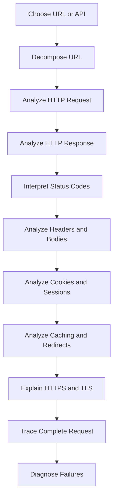
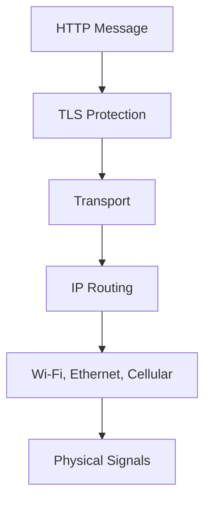
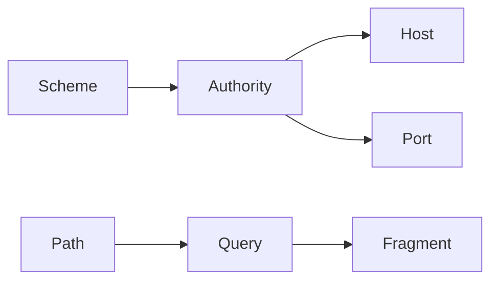
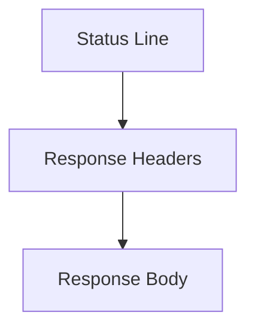
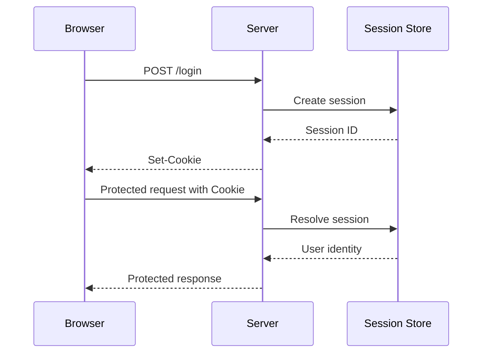
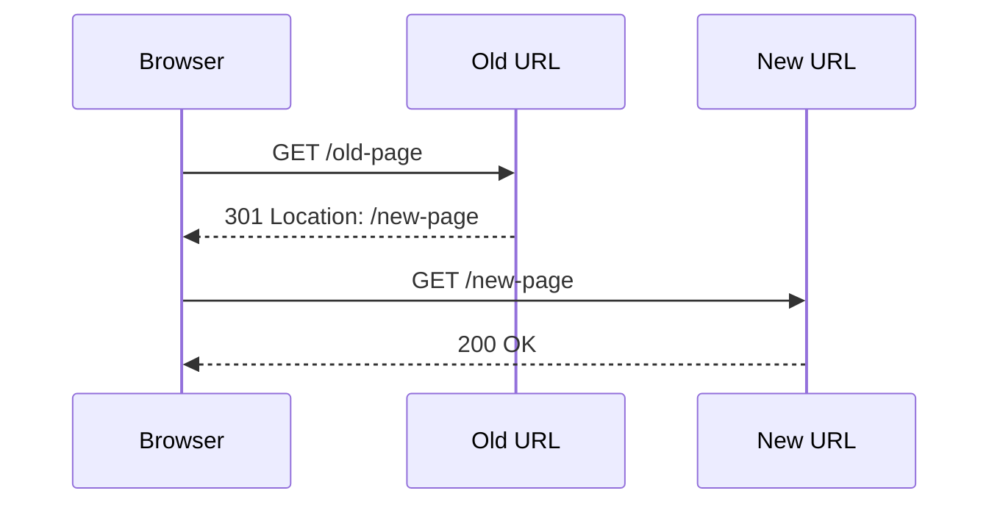
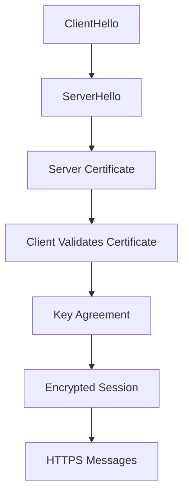
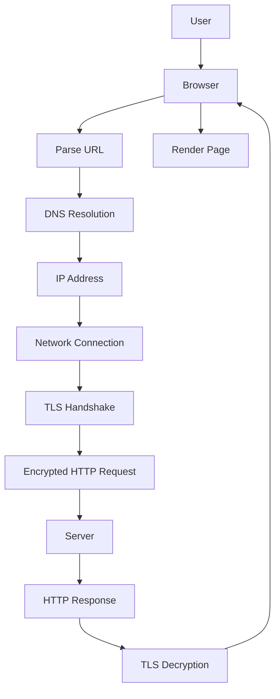

# Workbook 3 — HTTP and HTTPS Message Analysis  
## URLs, Requests, Responses, Headers, Bodies, Status Codes, Cookies, Caching, and TLS

---

# Workbook Overview

This workbook accompanies:

> **Part 3 — HTTP, HTTPS, and the Request-Response Cycle**

This is a **no-code and low-code HTTP analysis workbook**.

You will not build a web server or implement TLS. Instead, you will learn to:

- Analyze URLs
- Construct HTTP requests
- Interpret HTTP responses
- Match HTTP methods to intended operations
- Identify headers and bodies
- Interpret status codes
- Analyze cookies and sessions
- Explain redirects
- Examine caching
- Describe TLS at a high level
- Distinguish HTTP errors from network failures
- Narrate a complete HTTPS request

You may use:

```bash
curl
```

and browser Developer Tools against:

- Your own local applications
- Public websites
- Public APIs
- Systems you are authorized to inspect

Do not include real passwords, tokens, cookies, API keys, or personal information in your workbook.

---

# Learning Objectives

By completing this workbook, you should be able to:

- Explain the purpose of HTTP.
- Distinguish HTTP from HTTPS.
- Decompose a URL into its parts.
- Explain HTTP methods.
- Construct a basic HTTP request.
- Construct a basic HTTP response.
- Explain request and response headers.
- Explain request and response bodies.
- Interpret common status codes.
- Distinguish `401`, `403`, `404`, `422`, and `500`.
- Explain cookies and sessions.
- Explain redirects and caching.
- Explain symmetric and asymmetric encryption.
- Describe the TLS handshake.
- Explain what HTTPS protects and does not protect.
- Diagnose basic HTTP and HTTPS problems.

---

# How to Use This Workbook

Work through the activities in sequence.



For every observation:

```text
Record what happened.
Explain what it means.
Separate facts from assumptions.
Identify what you would inspect next.
```

---

# Activity 1 — Choose a Web Resource

Choose one resource to analyze.

Possible choices:

```text
A local application
A public webpage
A public API
A public image
A documentation page
A health endpoint you control
```

Do not inspect private systems without authorization.

## Resource

```text
____________________________________________________________
```

## Full URL

```text
____________________________________________________________
```

## Why did you choose it?

```text
____________________________________________________________
____________________________________________________________
```

## What do you expect the resource to return?

```text
[ ] HTML
[ ] JSON
[ ] Plain text
[ ] Image
[ ] File download
[ ] Redirect
[ ] Other: _________________________________________________
```

---

# Activity 2 — HTTP Vocabulary

Complete the definitions in your own words.

| Term | Your definition |
|---|---|
| HTTP |  |
| HTTPS |  |
| Request |  |
| Response |  |
| Method |  |
| Header |  |
| Body |  |
| Status code |  |
| URL |  |
| Endpoint |  |
| Cookie |  |
| Session |  |
| Payload |  |
| Redirect |  |
| Cache |  |

Then choose three terms and explain how they relate.

```text
Term 1:
____________________________________________________________

Term 2:
____________________________________________________________

Term 3:
____________________________________________________________

Relationship:
____________________________________________________________
____________________________________________________________
```

---

# Activity 3 — Internet, TCP, TLS, and HTTP

Complete the layered model:



Complete the table:

| Layer | What does it do? | Example |
|---|---|---|
| HTTP |  |  |
| TLS |  |  |
| Transport |  |  |
| IP |  |  |
| Link |  |  |
| Physical |  |  |

## Reflection

Why is HTTP not responsible for every part of network communication?

```text
____________________________________________________________
____________________________________________________________
```

---

# Activity 4 — Decompose a URL

Analyze this URL:

```text
https://api.shop.example.com:8443/v2/products/123?category=keyboards&sort=price#details
```

Complete:

```text
Scheme:
____________________________________________________________

User information:
____________________________________________________________

Host:
____________________________________________________________

Port:
____________________________________________________________

Path:
____________________________________________________________

Path parameters or identifiers:
____________________________________________________________

Query string:
____________________________________________________________

Fragment:
____________________________________________________________
```

## URL diagram



Replace the labels with the actual parts of the URL.

## Which part is usually not sent to the server?

```text
____________________________________________________________
```

---

# Activity 5 — Analyze Your Chosen URL

Return to the URL selected in Activity 1.

```text
URL:
____________________________________________________________
```

Complete:

| Component | Value |
|---|---|
| Scheme |  |
| Host |  |
| Port |  |
| Path |  |
| Query parameters |  |
| Fragment |  |

## Questions

### What resource does the path appear to identify?

```text
____________________________________________________________
```

### Do the query parameters filter, sort, search, paginate, or modify behavior?

```text
____________________________________________________________
```

### Would the URL be safe to share publicly?

Explain.

```text
____________________________________________________________
____________________________________________________________
```

---

# Activity 6 — HTTP Methods

Complete the table.

| Method | Typical meaning | Safe? | Idempotent? | Example |
|---|---|---:|---:|---|
| `GET` |  |  |  |  |
| `POST` |  |  |  |  |
| `PUT` |  |  |  |  |
| `PATCH` |  |  |  |  |
| `DELETE` |  |  |  |  |
| `HEAD` |  |  |  |  |
| `OPTIONS` |  |  |  |  |

## Method-selection exercise

Choose a method for each operation.

| Operation | Method | Why? |
|---|---|---|
| Retrieve products |  |  |
| Create an order |  |  |
| Replace a user profile |  |  |
| Change only an email address |  |  |
| Delete a saved address |  |  |
| Ask what methods an endpoint supports |  |  |
| Check file headers without downloading it |  |  |

---

# Activity 7 — Safe and Idempotent Operations

## Safe methods

A safe method is intended to retrieve information without changing server state.

List methods that are generally safe:

```text
____________________________________________________________
```

## Idempotent methods

An idempotent operation produces the same intended final state when repeated.

List methods that are generally idempotent:

```text
____________________________________________________________
```

## Scenario

A client sends:

```http
POST /api/orders
```

The server creates the order, but the response is lost.

The client retries the request.

What could happen?

```text
____________________________________________________________
____________________________________________________________
```

What could protect the operation?

```text
____________________________________________________________
```

---

# Activity 8 — Construct an HTTP Request

Construct a request for:

```text
Retrieve product 123 as JSON
```

Use:

```text
Host:
  shop.example.com

Path:
  /api/products/123
```

Write the request:

```http
____________________________________________________________
____________________________________________________________
____________________________________________________________
____________________________________________________________
```

Identify:

```text
Method:
____________________________________________________________

Path:
____________________________________________________________

HTTP version:
____________________________________________________________

Headers:
____________________________________________________________
```

---

# Activity 9 — Analyze a Request

Analyze this request:

```http
POST /api/orders?notify=true HTTP/1.1
Host: shop.example.com
Accept: application/json
Content-Type: application/json
Authorization: Bearer REDACTED
User-Agent: ExampleBrowser/1.0

{
  "items": [
    {
      "productId": 123,
      "quantity": 2
    }
  ]
}
```

Complete:

```text
Method:
____________________________________________________________

Path:
____________________________________________________________

Query parameter:
____________________________________________________________

Host:
____________________________________________________________

Preferred response format:
____________________________________________________________

Request body format:
____________________________________________________________

Authentication mechanism:
____________________________________________________________

Body fields:
____________________________________________________________
```

## Which values must the server validate?

```text
____________________________________________________________
____________________________________________________________
```

---

# Activity 10 — Request Headers

Complete the table.

| Header | What it communicates |
|---|---|
| `Host` |  |
| `Accept` |  |
| `Content-Type` |  |
| `Authorization` |  |
| `Cookie` |  |
| `Origin` |  |
| `Referer` |  |
| `User-Agent` |  |
| `Accept-Encoding` |  |
| `Cache-Control` |  |

## Select five headers and answer:

### What happens if this header is missing or incorrect?

```text
Header:
____________________________________________________________

Possible problem:
____________________________________________________________
____________________________________________________________
```

Repeat four more times.

---

# Activity 11 — Request Bodies

Complete the table.

| Body format | Example use | Content type |
|---|---|---|
| JSON |  |  |
| URL-encoded form |  |  |
| Multipart form |  |  |
| Plain text |  |  |
| Binary data |  |  |

## Choose a format

Which format would you use for:

| Operation | Format | Why? |
|---|---|---|
| Create an order with structured items |  |  |
| Submit username and password through a traditional form |  |  |
| Upload an image with a title |  |  |
| Download an image |  |  |

---

# Activity 12 — HTTP Response Anatomy

Analyze this response:

```http
HTTP/1.1 201 Created
Content-Type: application/json
Location: /api/orders/9001
Cache-Control: no-store
X-Request-ID: req_abc123

{
  "id": 9001,
  "status": "pending"
}
```

Complete:

```text
HTTP version:
____________________________________________________________

Status code:
____________________________________________________________

Status meaning:
____________________________________________________________

Response format:
____________________________________________________________

Created resource:
____________________________________________________________

Caching behavior:
____________________________________________________________

Diagnostic identifier:
____________________________________________________________
```

## Response diagram



Label each part of the response.

---

# Activity 13 — Status-Code Categories

Complete the table.

| Range | Category | Example |
|---|---|---|
| `1xx` |  |  |
| `2xx` |  |  |
| `3xx` |  |  |
| `4xx` |  |  |
| `5xx` |  |  |

For each category, explain how a browser or API client may react.

```text
1xx:
____________________________________________________________

2xx:
____________________________________________________________

3xx:
____________________________________________________________

4xx:
____________________________________________________________

5xx:
____________________________________________________________
```

---

# Activity 14 — Common Status Codes

Complete the table.

| Code | Meaning | Example cause | Client response |
|---:|---|---|---|
| `200` |  |  |  |
| `201` |  |  |  |
| `202` |  |  |  |
| `204` |  |  |  |
| `301` |  |  |  |
| `304` |  |  |  |
| `400` |  |  |  |
| `401` |  |  |  |
| `403` |  |  |  |
| `404` |  |  |  |
| `409` |  |  |  |
| `422` |  |  |  |
| `429` |  |  |  |
| `500` |  |  |  |
| `502` |  |  |  |
| `503` |  |  |  |
| `504` |  |  |  |

---

# Activity 15 — Compare Similar Status Codes

## `401` vs `403`

```text
401 means:
____________________________________________________________

403 means:
____________________________________________________________

Example of 401:
____________________________________________________________

Example of 403:
____________________________________________________________
```

## `400` vs `422`

```text
400 means:
____________________________________________________________

422 means:
____________________________________________________________
```

## `404` vs network failure

```text
404 means:
____________________________________________________________

Network failure means:
____________________________________________________________
```

## `500` vs `503`

```text
500 means:
____________________________________________________________

503 means:
____________________________________________________________
```

---

# Activity 16 — Cookies and Sessions

Complete the authentication flow:



## Explain each step

```text
1. _________________________________________________________
2. _________________________________________________________
3. _________________________________________________________
4. _________________________________________________________
5. _________________________________________________________
6. _________________________________________________________
```

## Cookie attributes

Complete:

| Attribute | Purpose |
|---|---|
| `Secure` |  |
| `HttpOnly` |  |
| `SameSite` |  |
| `Domain` |  |
| `Path` |  |
| `Max-Age` |  |

---

# Activity 17 — Authentication Headers

Analyze:

```http
Authorization: Bearer REDACTED
```

## Questions

### What authentication style does this suggest?

```text
____________________________________________________________
```

### Why must the value be protected?

```text
____________________________________________________________
```

### Where should it not be exposed?

```text
____________________________________________________________
```

### What might cause a `401` response?

```text
____________________________________________________________
____________________________________________________________
```

---

# Activity 18 — Redirects

Analyze:

```http
HTTP/1.1 301 Moved Permanently
Location: https://example.com/new-page
```

## Questions

### What should a browser commonly do?

```text
____________________________________________________________
```

### What is the difference between a permanent and temporary redirect?

```text
____________________________________________________________
```

### Why can redirect chains hurt performance?

```text
____________________________________________________________
```

## Redirect flow



Explain the flow:

```text
____________________________________________________________
____________________________________________________________
```

---

# Activity 19 — Caching

Analyze this response:

```http
HTTP/1.1 200 OK
Content-Type: text/css
Cache-Control: public, max-age=3600
ETag: "styles-v5"
```

## Questions

### What may a browser or shared cache do with this response?

```text
____________________________________________________________
```

### What does `max-age=3600` mean?

```text
____________________________________________________________
```

### What does the ETag identify?

```text
____________________________________________________________
```

### What might the browser send later?

```http
____________________________________________________________
```

### What might the server return if the file has not changed?

```http
____________________________________________________________
```

---

# Activity 20 — Private and Public Caching

Classify each response.

| Response | Publicly cacheable? | Why? |
|---|---:|---|
| Public CSS file |  |  |
| Public product image |  |  |
| User account page |  |  |
| Private messages |  |  |
| Public documentation page |  |  |
| Personalized recommendations |  |  |
| Payment response |  |  |

## Reflection

Why can incorrect caching become a security problem?

```text
____________________________________________________________
____________________________________________________________
```

---

# Activity 21 — Compression and Content Negotiation

A client sends:

```http
Accept: application/json
Accept-Encoding: gzip, br
Accept-Language: en-US
```

The server returns:

```http
Content-Type: application/json
Content-Encoding: br
Content-Language: en-US
```

## Explain the negotiation

```text
Accept:
____________________________________________________________

Accept-Encoding:
____________________________________________________________

Accept-Language:
____________________________________________________________

Content-Type:
____________________________________________________________

Content-Encoding:
____________________________________________________________

Content-Language:
____________________________________________________________
```

---

# Activity 22 — HTTPS and TLS

Complete the TLS model:



## Questions

### Why does the server send a certificate?

```text
____________________________________________________________
```

### What does the browser check?

```text
____________________________________________________________
____________________________________________________________
```

### What is symmetric encryption used for?

```text
____________________________________________________________
```

### What is asymmetric cryptography used for?

```text
____________________________________________________________
```

### What happens after the handshake?

```text
____________________________________________________________
```

---

# Activity 23 — HTTPS Boundaries

Complete the table.

| HTTPS protects against | HTTPS does not automatically protect against |
|---|---|
|  |  |
|  |  |
|  |  |
|  |  |

## Examples

```text
HTTPS protects:
____________________________________________________________

HTTPS does not automatically protect:
____________________________________________________________
```

---

# Activity 24 — Network Error vs HTTP Error

Classify each symptom.

| Symptom | Network error or HTTP error? | Why? |
|---|---|---|
| DNS cannot resolve hostname |  |  |
| Connection times out |  |  |
| TLS certificate rejected |  |  |
| `404 Not Found` |  |  |
| `401 Unauthorized` |  |  |
| `500 Internal Server Error` |  |  |
| Browser blocks CORS response |  |  |
| `503 Service Unavailable` |  |  |

---

# Activity 25 — Complete HTTPS Request Trace

Trace:

```text
https://shop.example.com/products/123
```

Use:



## Narrate each stage

```text
1. _________________________________________________________
2. _________________________________________________________
3. _________________________________________________________
4. _________________________________________________________
5. _________________________________________________________
6. _________________________________________________________
7. _________________________________________________________
8. _________________________________________________________
9. _________________________________________________________
10. ________________________________________________________
```

---

# Activity 26 — HTTP Diagnostic Practice

Use an authorized domain or local application.

Run:

```bash
curl -i https://example.com
```

Record:

```text
Status:
____________________________________________________________

Response content type:
____________________________________________________________

Cache behavior:
____________________________________________________________

Security headers:
____________________________________________________________
```

Run:

```bash
curl -v https://example.com
```

Record:

```text
Resolved address:
____________________________________________________________

Connection details:
____________________________________________________________

TLS details:
____________________________________________________________

Request method:
____________________________________________________________

Response status:
____________________________________________________________
```

---

# Activity 27 — Request Construction Practice

Design a request for:

```text
Create an order containing two units of product 123.
```

Write:

```http
METHOD /path HTTP/1.1
Host: ...
Accept: ...
Content-Type: ...
Authorization: ...
Idempotency-Key: ...

...
```

Your request:

```http
____________________________________________________________
____________________________________________________________
____________________________________________________________
____________________________________________________________
____________________________________________________________
____________________________________________________________
____________________________________________________________
```

## Explain your choices

```text
Why this method?
____________________________________________________________

Why this content type?
____________________________________________________________

Why authentication?
____________________________________________________________

Why an idempotency key?
____________________________________________________________
```

---

# Activity 28 — Response Construction Practice

Design a successful response for the order request.

```http
____________________________________________________________
____________________________________________________________
____________________________________________________________
____________________________________________________________
____________________________________________________________
```

Include:

```text
Status
Content-Type
Location
Request ID
Response body
```

Then design an inventory-conflict response.

```http
____________________________________________________________
____________________________________________________________
____________________________________________________________
____________________________________________________________
```

---

# Activity 29 — Failure Mapping

For each failure, identify:

```text
Likely cause
HTTP status if applicable
Evidence to inspect
Client behavior
```

| Failure | Cause | Status | Evidence | Client behavior |
|---|---|---:|---|---|
| Missing token |  |  |  |  |
| User lacks permission |  |  |  |  |
| Product does not exist |  |  |  |  |
| Invalid quantity |  |  |  |  |
| Inventory changed |  |  |  |  |
| Backend exception |  |  |  |  |
| Payment provider timeout |  |  |  |  |

---

# Activity 30 — Reflection and Narration

## Explain HTTP in your own words

```text
____________________________________________________________
____________________________________________________________
____________________________________________________________
```

## Explain HTTPS in your own words

```text
____________________________________________________________
____________________________________________________________
____________________________________________________________
```

## Explain why status codes matter

```text
____________________________________________________________
____________________________________________________________
```

## Explain why headers matter

```text
____________________________________________________________
____________________________________________________________
```

## Explain what happens when a browser receives a response

```text
____________________________________________________________
____________________________________________________________
____________________________________________________________
```

---

# Workbook Completion Checklist

```text
[ ] I defined HTTP and HTTPS.
[ ] I identified HTTP’s place in the network stack.
[ ] I decomposed a URL.
[ ] I analyzed a query string and fragment.
[ ] I matched methods to operations.
[ ] I analyzed a request line.
[ ] I analyzed request headers.
[ ] I analyzed request bodies.
[ ] I analyzed a response.
[ ] I interpreted status-code categories.
[ ] I compared common status codes.
[ ] I explained cookies and sessions.
[ ] I explained bearer tokens.
[ ] I analyzed redirects.
[ ] I analyzed cache headers.
[ ] I distinguished public and private caching.
[ ] I explained compression and content negotiation.
[ ] I narrated the TLS handshake.
[ ] I explained HTTPS boundaries.
[ ] I distinguished network and HTTP errors.
[ ] I traced a complete HTTPS request.
[ ] I practiced HTTP inspection with cURL.
[ ] I designed an order request.
[ ] I designed success and failure responses.
[ ] I completed failure mapping.
[ ] I completed the final narration.
```

---

# Final Submission

Submit:

```text
1. HTTP vocabulary table
2. Network-layer table
3. URL decomposition
4. HTTP-method table
5. Request-construction exercise
6. Request-header analysis
7. Request-body analysis
8. Response anatomy analysis
9. Status-code table
10. Status-code comparison
11. Cookie and session flow
12. Authentication-header analysis
13. Redirect analysis
14. Cache analysis
15. Compression and content-negotiation exercise
16. TLS handshake explanation
17. HTTPS protection table
18. Network-versus-HTTP failure table
19. Complete HTTPS trace
20. cURL inspection notes
21. Order-request design
22. Response-design exercise
23. Failure-mapping table
24. Final narration
```

---

# Completion Standard

You have completed this workbook when you can explain:

```text
What HTTP is
What HTTPS adds
How a URL is structured
How requests are formed
How responses are formed
What headers communicate
What bodies contain
What status codes mean
How cookies maintain sessions
How redirects work
How caches validate responses
How TLS protects messages
What HTTPS does not protect
How to distinguish network and HTTP errors
How to narrate a complete browser request
```

The central goal of this workbook is:

> Understand HTTP well enough to inspect, explain, construct, and diagnose the messages that web applications exchange.
