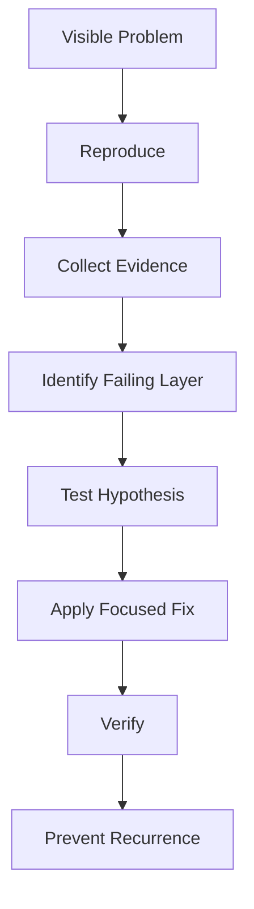
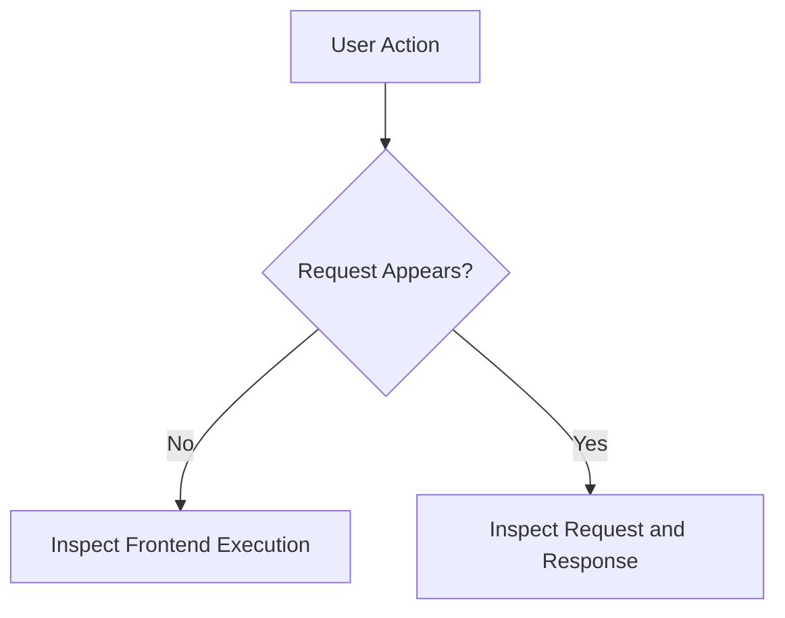
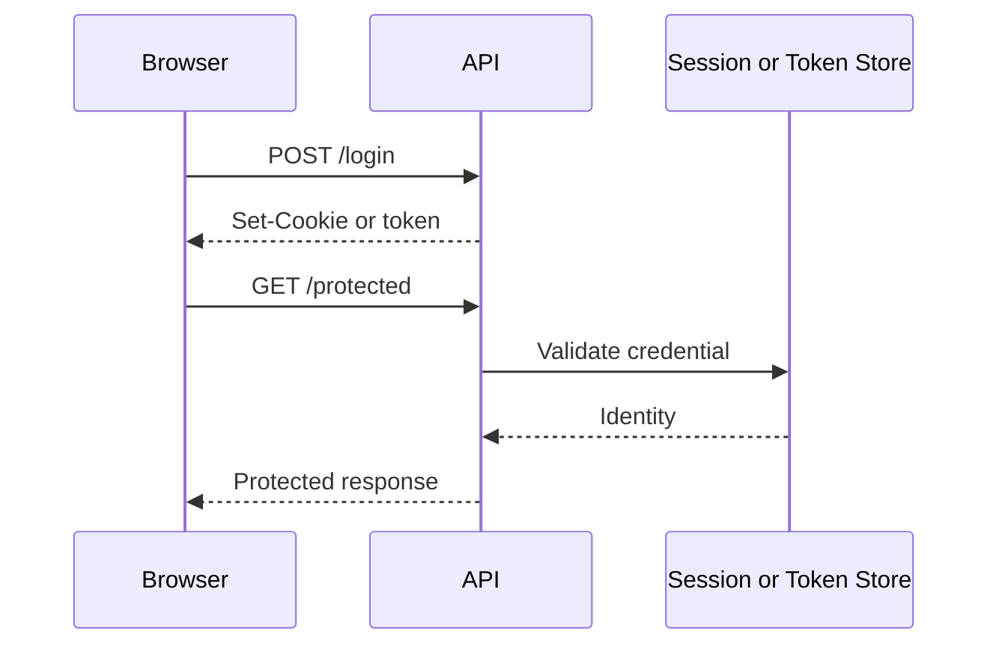
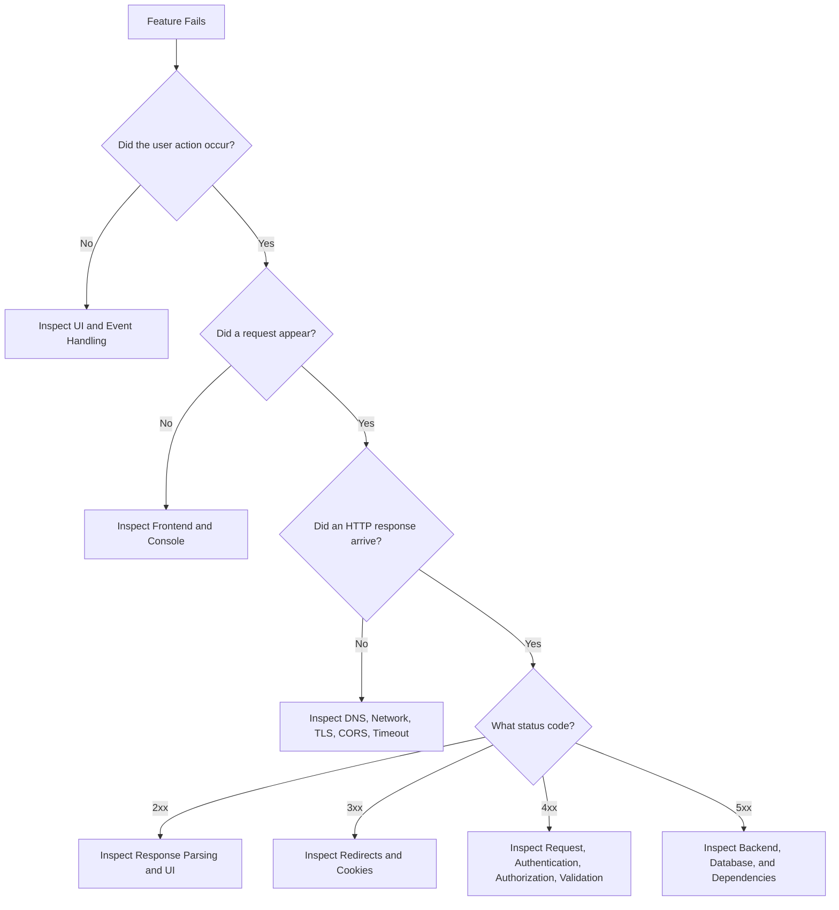

# Workbook 5 — Network Inspection and Diagnostic Workflows  
## DevTools, cURL, API Clients, Timing, Errors, CORS, Authentication, and Evidence-Based Troubleshooting

---

# Workbook Overview

This workbook accompanies:

> **Part 5 — Network Inspection and Diagnostic Workflows**

This is a practical, no-code-first workbook.

You will learn to investigate web applications by observing what actually happens rather than guessing what should happen.

You will practice:

- Opening browser Developer Tools
- Inspecting Console messages
- Inspecting Network requests
- Filtering requests
- Reading URLs and methods
- Inspecting headers and payloads
- Reading status codes
- Inspecting response bodies
- Analyzing timing
- Understanding request initiators
- Copying requests as cURL
- Testing APIs independently
- Diagnosing CORS
- Diagnosing authentication
- Investigating redirects
- Investigating caches and service workers
- Separating frontend, network, backend, and database failures
- Writing a clear troubleshooting report

The core troubleshooting model is:



---

# Learning Objectives

By completing this workbook, you should be able to:

- Use the Console and Network panels together.
- Identify whether a request occurred.
- Inspect request URLs, methods, parameters, headers, and payloads.
- Inspect response status, headers, body, and timing.
- Interpret DNS, connection, TLS, TTFB, and download timing.
- Identify likely frontend, browser, network, API, database, and dependency failures.
- Reproduce browser requests with cURL.
- Diagnose authentication and CORS failures.
- Investigate redirects, stale caches, and service workers.
- Write an evidence-based troubleshooting report.
- Propose safe mitigation and regression prevention.

---

# Safety and Privacy Rules

Before beginning:

```text
[ ] Use only applications and systems you own or are authorized to inspect.
[ ] Do not perform aggressive traffic generation.
[ ] Do not replay payment or deletion requests casually.
[ ] Redact cookies and authorization headers.
[ ] Do not share passwords, tokens, API keys, or personal data.
[ ] Do not disable security controls as a permanent fix.
[ ] Use test accounts and test environments where possible.
```

---

# Activity 1 — Choose a Diagnostic Target

Choose one application or workflow.

Examples:

```text
Local product page
Local login form
Public documentation page
Local API endpoint
Online store search
Task-manager dashboard
File-upload workflow
```

## Application

```text
____________________________________________________________
```

## Workflow

```text
____________________________________________________________
```

## Expected behavior

```text
____________________________________________________________
____________________________________________________________
```

## Actual behavior

```text
____________________________________________________________
____________________________________________________________
```

## Environment

```text
[ ] Local development
[ ] Staging
[ ] Production
[ ] Public website
[ ] Other: _________________________________________________
```

---

# Activity 2 — Define the Reproduction Steps

Write exact steps another person could follow.

```text
1. _________________________________________________________
2. _________________________________________________________
3. _________________________________________________________
4. _________________________________________________________
5. _________________________________________________________
```

## Frequency

```text
[ ] Always
[ ] Often
[ ] Sometimes
[ ] Rarely
[ ] Cannot reproduce consistently
```

## Conditions

```text
Browser:
____________________________________________________________

Device:
____________________________________________________________

Network:
____________________________________________________________

User state:
____________________________________________________________

Relevant account or role:
____________________________________________________________
```

---

# Activity 3 — Open Developer Tools

Open the following panels:

```text
[ ] Console
[ ] Network
[ ] Application or Storage
[ ] Security
[ ] Performance
```

## Before reproducing

```text
[ ] Clear Console messages.
[ ] Clear old Network requests.
[ ] Enable Preserve log if navigation is involved.
[ ] Decide whether to disable cache.
[ ] Filter to relevant request types.
```

## Why clear old requests?

```text
____________________________________________________________
____________________________________________________________
```

## Why might Preserve log be useful?

```text
____________________________________________________________
____________________________________________________________
```

---

# Activity 4 — Console Investigation

Perform the workflow once.

Record any Console messages.

## Errors

```text
____________________________________________________________
____________________________________________________________
____________________________________________________________
```

## Warnings

```text
____________________________________________________________
____________________________________________________________
____________________________________________________________
```

## Information messages

```text
____________________________________________________________
____________________________________________________________
```

## Classify the Console message

```text
[ ] JavaScript exception
[ ] Network failure
[ ] CORS error
[ ] Mixed-content warning
[ ] JSON parsing error
[ ] Authentication error
[ ] Deprecation warning
[ ] Other: _________________________________________________
```

## What does the message suggest?

```text
____________________________________________________________
____________________________________________________________
```

---

# Activity 5 — Did a Request Occur?

Use the Network panel.



## Result

```text
Did a request appear?

[ ] Yes
[ ] No
[ ] Not sure
```

## If no request appeared

What could explain this?

```text
[ ] JavaScript exception
[ ] Event handler not attached
[ ] Form validation returned early
[ ] Button was disabled
[ ] Wrong selector
[ ] Request was never created
[ ] Other: _________________________________________________
```

## If a request appeared

Record its name or path:

```text
____________________________________________________________
```

---

# Activity 6 — Request Inspection

Select the relevant request.

Record:

```text
Request URL:
____________________________________________________________

Request method:
____________________________________________________________

Host:
____________________________________________________________

Path:
____________________________________________________________

Query parameters:
____________________________________________________________

Request type:
____________________________________________________________

Initiator:
____________________________________________________________
```

## Is the request URL correct?

```text
[ ] Yes
[ ] No
[ ] Unsure
```

Explain:

```text
____________________________________________________________
```

## Is the HTTP method correct?

```text
[ ] Yes
[ ] No
[ ] Unsure
```

Explain:

```text
____________________________________________________________
```

---

# Activity 7 — Query Parameter Analysis

If the request contains a query string, record each parameter.

| Parameter | Value | Expected? | Meaning |
|---|---|---:|---|
|  |  |  |  |
|  |  |  |  |
|  |  |  |  |
|  |  |  |  |

Check:

```text
[ ] Required parameters exist.
[ ] Parameter names are spelled correctly.
[ ] Values are encoded correctly.
[ ] Numeric values have acceptable ranges.
[ ] Empty values are intentional.
[ ] No secrets appear in the URL.
```

## Could any query parameter be sensitive?

```text
____________________________________________________________
```

---

# Activity 8 — Request Headers

Record the important request headers.

| Header | Value | Purpose |
|---|---|---|
| `Host` |  |  |
| `Accept` |  |  |
| `Content-Type` |  |  |
| `Authorization` |  |  |
| `Cookie` |  |  |
| `Origin` |  |  |
| `Referer` |  |  |
| `User-Agent` |  |  |

Redact sensitive values:

```text
Authorization:
  REDACTED

Cookie:
  REDACTED
```

## Questions

### Is authentication present?

```text
____________________________________________________________
```

### Is the request body format declared correctly?

```text
____________________________________________________________
```

### Is the request coming from the expected origin?

```text
____________________________________________________________
```

---

# Activity 9 — Request Payload

If the request has a body, record a redacted version.

```json
{
}
```

## Payload format

```text
____________________________________________________________
```

## Content type

```text
____________________________________________________________
```

## Payload field table

| Field | Value type | Required? | Valid? | Sensitive? |
|---|---|---:|---:|---:|
|  |  |  |  |  |
|  |  |  |  |  |
|  |  |  |  |  |

## What could be wrong with the payload?

```text
____________________________________________________________
____________________________________________________________
```

---

# Activity 10 — Response Inspection

Record:

```text
Status code:
____________________________________________________________

Status meaning:
____________________________________________________________

Response content type:
____________________________________________________________

Response size:
____________________________________________________________

Response body:
____________________________________________________________
____________________________________________________________
```

## Response classification

```text
[ ] Success
[ ] Redirect
[ ] Authentication failure
[ ] Authorization failure
[ ] Validation failure
[ ] Not found
[ ] Rate limited
[ ] Server failure
[ ] Network failure
[ ] Unexpected response
```

## Did the response match the expected API contract?

```text
[ ] Yes
[ ] No
[ ] Partially
```

Explain:

```text
____________________________________________________________
```

---

# Activity 11 — Status-Code Investigation

Use the status code from Activity 10.

## If `2xx`

What should you inspect next if the interface is still wrong?

```text
____________________________________________________________
____________________________________________________________
```

## If `401`

What should you inspect?

```text
____________________________________________________________
```

## If `403`

What should you inspect?

```text
____________________________________________________________
```

## If `404`

What should you inspect?

```text
____________________________________________________________
```

## If `422`

What should you inspect?

```text
____________________________________________________________
```

## If `5xx`

What should you inspect?

```text
____________________________________________________________
```

---

# Activity 12 — Response Headers

Record important response headers.

| Header | Value | Meaning |
|---|---|---|
| `Content-Type` |  |  |
| `Cache-Control` |  |  |
| `Set-Cookie` |  |  |
| `Location` |  |  |
| `ETag` |  |  |
| `Access-Control-Allow-Origin` |  |  |
| `Content-Encoding` |  |  |
| `X-Request-ID` |  |  |

## Questions

### Is the response cacheable?

```text
____________________________________________________________
```

### Did the server set a cookie?

```text
____________________________________________________________
```

### Did the server provide a request ID?

```text
____________________________________________________________
```

### Is CORS configured?

```text
____________________________________________________________
```

---

# Activity 13 — Response Body Analysis

Inspect the raw response body.

## Is it the expected format?

```text
[ ] JSON
[ ] HTML
[ ] Plain text
[ ] XML
[ ] Image
[ ] Binary data
[ ] Other: _________________________________________________
```

## Does the body contain the expected fields?

```text
____________________________________________________________
```

## Did the server return a fallback or error page?

```text
[ ] Yes
[ ] No
[ ] Unsure
```

## What does the body suggest?

```text
____________________________________________________________
____________________________________________________________
```

---

# Activity 14 — Timing Analysis

Record the timing information for the request.

```text
Queueing:
____________________________________________________________

DNS lookup:
____________________________________________________________

Connection:
____________________________________________________________

TLS:
____________________________________________________________

Request sent:
____________________________________________________________

Waiting / TTFB:
____________________________________________________________

Content download:
____________________________________________________________

Total:
____________________________________________________________
```

## Which phase is largest?

```text
____________________________________________________________
```

## What might that suggest?

```text
____________________________________________________________
____________________________________________________________
```

## Timing interpretation

Complete:

```text
High DNS time may suggest:
____________________________________________________________

High connection time may suggest:
____________________________________________________________

High TLS time may suggest:
____________________________________________________________

High TTFB may suggest:
____________________________________________________________

Long download time may suggest:
____________________________________________________________
```

---

# Activity 15 — Waterfall Analysis

Inspect the full page waterfall.

Identify:

```text
First request:
____________________________________________________________

Largest request:
____________________________________________________________

Slowest request:
____________________________________________________________

Request that blocks important content:
____________________________________________________________

Third-party requests:
____________________________________________________________

Repeated requests:
____________________________________________________________
```

## What is loaded serially?

```text
____________________________________________________________
```

## What could be loaded in parallel or deferred?

```text
____________________________________________________________
```

## What might be causing the page to feel slow?

```text
____________________________________________________________
____________________________________________________________
```

---

# Activity 16 — Initiator Analysis

For the selected request:

```text
Initiator:
____________________________________________________________
```

What caused it?

```text
[ ] HTML document
[ ] CSS
[ ] JavaScript
[ ] User action
[ ] Another request
[ ] Service worker
[ ] Browser preload
[ ] Unknown
```

## If the request repeats unexpectedly, what might cause it?

```text
____________________________________________________________
____________________________________________________________
```

---

# Activity 17 — Copy as cURL

In Developer Tools:

```text
Right-click request
→ Copy
→ Copy as cURL
```

Paste the command below, but redact secrets.

```bash
____________________________________________________________
____________________________________________________________
____________________________________________________________
```

## Redactions made

```text
[ ] Authorization token
[ ] Cookie
[ ] API key
[ ] Password
[ ] Personal data
[ ] Private query parameter
```

## What does the command contain?

```text
Method:
____________________________________________________________

URL:
____________________________________________________________

Headers:
____________________________________________________________

Body:
____________________________________________________________
```

---

# Activity 18 — Reproduce with cURL

Run the redacted or safe version.

Record:

```text
cURL status:
____________________________________________________________

cURL response type:
____________________________________________________________

cURL response body:
____________________________________________________________

cURL timing:
____________________________________________________________
```

## Compare browser and cURL

| Detail | Browser | cURL | Same? |
|---|---|---|---:|
| URL |  |  |  |
| Method |  |  |  |
| Authentication |  |  |  |
| Cookies |  |  |  |
| Body |  |  |  |
| Status |  |  |  |
| Response |  |  |  |

## If results differ, what could explain it?

```text
____________________________________________________________
____________________________________________________________
```

---

# Activity 19 — CORS Investigation

Use this only with an authorized cross-origin application.

Look for:

```http
Origin
Access-Control-Allow-Origin
Access-Control-Allow-Methods
Access-Control-Allow-Headers
Access-Control-Allow-Credentials
```

## Does the request use different origins?

```text
Frontend origin:
____________________________________________________________

API origin:
____________________________________________________________

Different origin?
[ ] Yes
[ ] No
```

## Was an `OPTIONS` request sent?

```text
[ ] Yes
[ ] No
[ ] Not sure
```

## Preflight result

```text
Status:
____________________________________________________________

Allowed origin:
____________________________________________________________

Allowed methods:
____________________________________________________________

Allowed headers:
____________________________________________________________
```

## What is the likely CORS problem?

```text
____________________________________________________________
____________________________________________________________
```

---

# Activity 20 — Authentication Investigation

Inspect the login and protected-resource flow.



Record:

```text
Login status:
____________________________________________________________

Session cookie or token created:
____________________________________________________________

Protected request status:
____________________________________________________________

Credential sent:
____________________________________________________________

Authentication result:
____________________________________________________________
```

## If the protected request returns `401`, possible causes:

```text
____________________________________________________________
____________________________________________________________
```

## If it returns `403`, possible causes:

```text
____________________________________________________________
____________________________________________________________
```

---

# Activity 21 — Redirect Investigation

Inspect whether the request redirects.

| Step | URL | Status | Location |
|---:|---|---:|---|
| 1 |  |  |  |
| 2 |  |  |  |
| 3 |  |  |  |

## Is there a redirect loop?

```text
[ ] Yes
[ ] No
```

## What could cause a loop?

```text
____________________________________________________________
____________________________________________________________
```

## What should you inspect?

```text
Cookies
Authentication
HTTPS detection
Reverse proxy headers
Location headers
Environment
```

Add other evidence:

```text
____________________________________________________________
```

---

# Activity 22 — Cache and Service Worker Investigation

Inspect:

```text
Cache-Control
ETag
Age
Response source
Service worker
Cache Storage
Browser cache
CDN headers
```

## Does the browser appear to use a cached response?

```text
[ ] Yes
[ ] No
[ ] Unsure
```

## Is a service worker registered?

```text
[ ] Yes
[ ] No
[ ] Unsure
```

## Could stale content come from:

```text
[ ] Browser cache
[ ] CDN cache
[ ] Service worker cache
[ ] Application cache
[ ] Database cache
[ ] Other: _________________________________________________
```

## What would you test?

```text
____________________________________________________________
____________________________________________________________
```

---

# Activity 23 — Environment Investigation

Record the actual request environment.

```text
Frontend host:
____________________________________________________________

API host:
____________________________________________________________

Protocol:
____________________________________________________________

Port:
____________________________________________________________

Expected environment:
____________________________________________________________

Actual environment:
____________________________________________________________
```

## Could the frontend be calling the wrong environment?

```text
[ ] Yes
[ ] No
[ ] Unsure
```

## What evidence supports your conclusion?

```text
____________________________________________________________
```

---

# Activity 24 — Server and Database Evidence

If the request reaches the backend, collect authorized server-side evidence.

```text
Request ID:
____________________________________________________________

Application log:
____________________________________________________________

Database log:
____________________________________________________________

External dependency:
____________________________________________________________

Recent deployment:
____________________________________________________________

Database query time:
____________________________________________________________
```

## Does the evidence indicate:

```text
[ ] Application exception
[ ] Database failure
[ ] Slow query
[ ] Missing configuration
[ ] External service failure
[ ] Authentication failure
[ ] Authorization failure
[ ] Cache miss
[ ] Unknown
```

Explain:

```text
____________________________________________________________
____________________________________________________________
```

---

# Activity 25 — Troubleshooting Report

Complete this report for the chosen issue.

## Symptom

```text
____________________________________________________________
```

## Expected behavior

```text
____________________________________________________________
```

## Reproduction steps

```text
1. _________________________________________________________
2. _________________________________________________________
3. _________________________________________________________
```

## Evidence collected

```text
Console:
____________________________________________________________

Network:
____________________________________________________________

Request:
____________________________________________________________

Response:
____________________________________________________________

Timing:
____________________________________________________________

Server logs:
____________________________________________________________

Database or dependency:
____________________________________________________________
```

## Earliest failed layer

```text
____________________________________________________________
```

## Likely cause

```text
____________________________________________________________
```

## Alternative causes

```text
1. ________________________________________________________
2. ________________________________________________________
```

## Next diagnostic test

```text
____________________________________________________________
```

## Proposed mitigation

```text
____________________________________________________________
```

## Verification plan

```text
____________________________________________________________
```

## Regression prevention

```text
____________________________________________________________
```

---

# Activity 26 — Troubleshooting Decision Tree

Start with this model:



Add branches for:

```text
Slow request
____________________________________________________________

Stale response
____________________________________________________________

Repeated request
____________________________________________________________

Incorrect environment
____________________________________________________________
```

---

# Activity 27 — Diagnose Provided Scenarios

## Scenario A — No request

```text
Button click
Console:
  TypeError: Cannot read properties of null

Network:
  No API request
```

Likely layer:

```text
____________________________________________________________
```

Next step:

```text
____________________________________________________________
```

---

## Scenario B — Authentication

```text
GET /api/me
Status: 401
Cookie header: absent
```

Likely cause:

```text
____________________________________________________________
```

Next step:

```text
____________________________________________________________
```

---

## Scenario C — Permission

```text
GET /api/admin/reports
Status: 403
User is authenticated as member
```

Likely cause:

```text
____________________________________________________________
```

Next step:

```text
____________________________________________________________
```

---

## Scenario D — Backend

```text
POST /api/orders
Status: 500
X-Request-ID: req_123
```

Likely cause:

```text
____________________________________________________________
```

Next step:

```text
____________________________________________________________
```

---

## Scenario E — Performance

```text
DNS: 10 ms
TLS: 20 ms
TTFB: 4,000 ms
Download: 50 ms
```

Likely bottleneck:

```text
____________________________________________________________
```

Next step:

```text
____________________________________________________________
```

---

## Scenario F — Stale content

```text
cURL:
  New JavaScript bundle

Browser:
  Old JavaScript behavior

Service worker:
  Registered
```

Likely cause:

```text
____________________________________________________________
```

Next step:

```text
____________________________________________________________
```

---

# Activity 28 — Verification and Prevention

After fixing the problem, complete the table.

| Fix | How will you verify it? | What regression test or alert should be added? |
|---|---|---|
|  |  |  |
|  |  |  |
|  |  |  |
|  |  |  |

## Verification checklist

```text
[ ] Original symptom no longer occurs.
[ ] Correct request is sent.
[ ] Correct status is returned.
[ ] Response body matches contract.
[ ] UI updates correctly.
[ ] Authentication still works.
[ ] Authorization still works.
[ ] Error behavior still works.
[ ] Performance is acceptable.
[ ] No sensitive data is exposed.
```

---

# Activity 29 — Reflection

## Question A

Which diagnostic tool was most useful?

```text
____________________________________________________________
```

## Question B

What evidence changed your initial hypothesis?

```text
____________________________________________________________
```

## Question C

Which layer was most difficult to isolate?

```text
____________________________________________________________
```

## Question D

What did you initially assume incorrectly?

```text
____________________________________________________________
```

## Question E

What would you inspect first next time?

```text
____________________________________________________________
```

## Question F

What information would make the issue easier for another developer to investigate?

```text
____________________________________________________________
```

---

# Workbook Completion Checklist

```text
[ ] I defined a reproducible problem.
[ ] I recorded environment and context.
[ ] I used the Console.
[ ] I used the Network panel.
[ ] I filtered requests.
[ ] I inspected request URL and method.
[ ] I inspected query parameters.
[ ] I inspected headers.
[ ] I inspected payload.
[ ] I inspected response status.
[ ] I inspected response headers.
[ ] I inspected response body.
[ ] I inspected timing.
[ ] I inspected initiator.
[ ] I copied a request as cURL.
[ ] I compared browser and cURL.
[ ] I investigated CORS.
[ ] I investigated authentication.
[ ] I investigated redirects.
[ ] I investigated caching.
[ ] I checked environment configuration.
[ ] I used server or database evidence.
[ ] I identified the earliest failed layer.
[ ] I proposed a focused mitigation.
[ ] I verified the fix.
[ ] I proposed regression prevention.
```

---

# Final Submission

Submit:

```text
1. Diagnostic target
2. Reproduction steps
3. Console notes
4. Network request analysis
5. Query-parameter analysis
6. Header analysis
7. Payload analysis
8. Response analysis
9. Timing analysis
10. Waterfall analysis
11. Initiator analysis
12. cURL reproduction
13. Browser-versus-cURL comparison
14. CORS investigation
15. Authentication investigation
16. Redirect investigation
17. Cache and service-worker investigation
18. Environment investigation
19. Server-side evidence
20. Troubleshooting report
21. Decision tree
22. Provided-scenario answers
23. Verification plan
24. Regression-prevention plan
25. Reflection answers
```

---

# Completion Standard

You have completed this workbook when you can move from:

```text
The feature does not work.
```

to:

```text
The user action occurred.
The frontend created a request.
The request used this URL and method.
These headers and payload were sent.
The server returned this status and response.
The timing shows this bottleneck.
The earliest failed layer is this.
The likely cause is this.
This is the safest next test.
This is the mitigation.
This verifies the fix.
This prevents recurrence.
```

The central goal of this workbook is:

> Learn to investigate web applications through observable evidence instead of guessing from symptoms.
