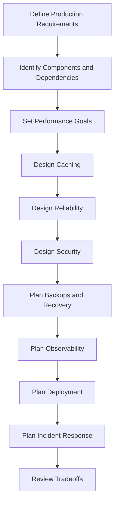
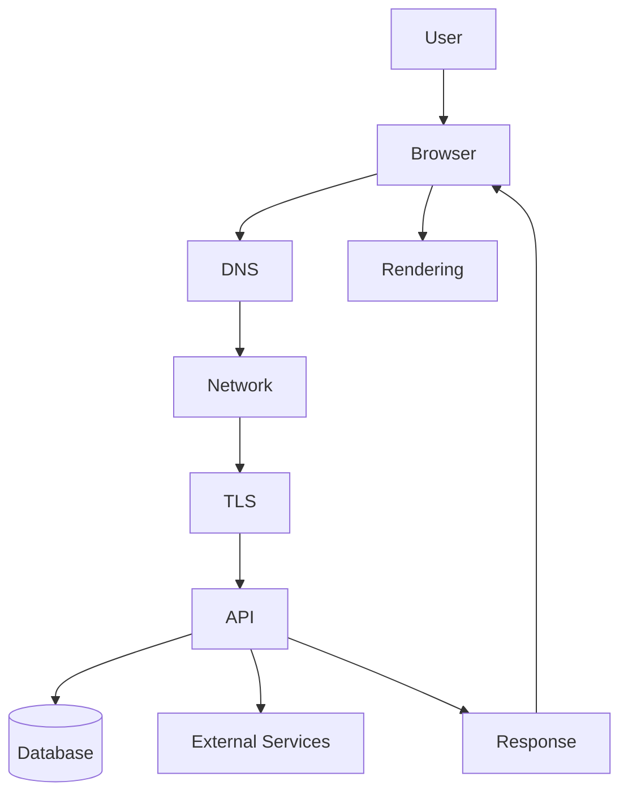
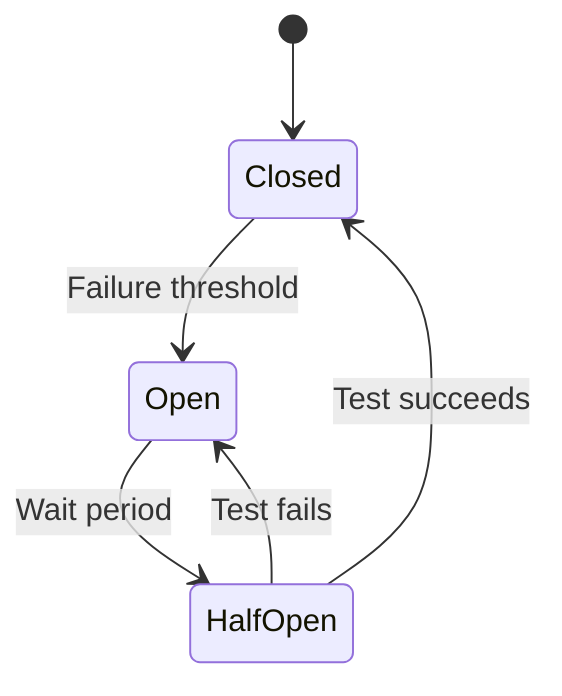
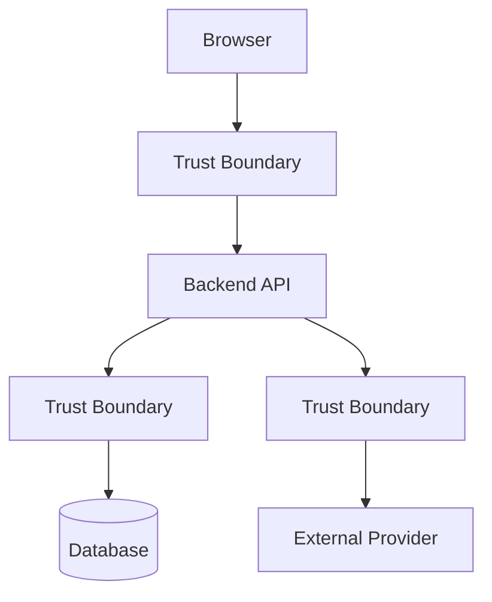
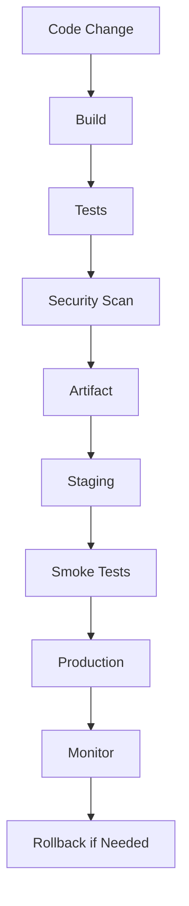
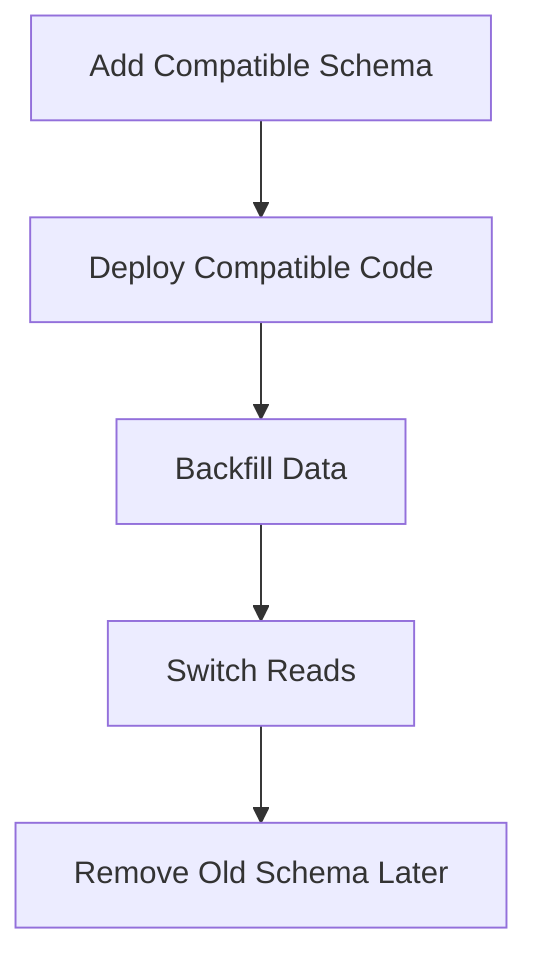
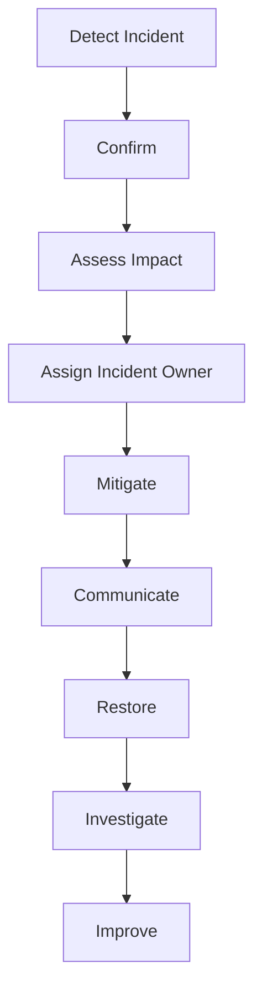

# Workbook 6 — Performance, Reliability, Security, and Production Planning  
## Designing an Application That Works Quickly, Safely, Reliably, and Operably

---

# Workbook Overview

This workbook accompanies:

> **Part 6 — Web Performance, Reliability, Security, and Production Delivery**

This is a **no-code production-planning workbook**.

You will plan how an application behaves when it is:

```text
Serving real users
Handling real traffic
Processing sensitive data
Calling external services
Running across multiple servers
Deployed to production
Experiencing failures
Recovering from incidents
```

You will design:

- Performance goals
- Caching
- Database optimization
- Timeouts
- Retries
- Circuit breakers
- Graceful degradation
- Security controls
- Authentication and authorization
- Secrets management
- Backups
- Recovery targets
- Logs
- Metrics
- Traces
- Alerts
- Deployment
- Rollback
- Incident response

You will not configure a real cloud environment or write production code.

The goal is to design and explain how the application should operate.

---

# Learning Objectives

By completing this workbook, you should be able to:

- Define production-readiness requirements.
- Identify performance bottlenecks.
- Design a cache strategy.
- Distinguish cache data from authoritative data.
- Plan database and API performance improvements.
- Design timeout and retry behavior.
- Explain circuit breakers.
- Design graceful degradation.
- Identify security threats and controls.
- Plan secret management.
- Define backup and recovery goals.
- Explain RPO and RTO.
- Design logs, metrics, traces, and alerts.
- Plan CI/CD and deployment.
- Compare rolling, blue-green, and canary deployments.
- Plan rollback and incident response.
- Identify production risks and tradeoffs.

---

# How to Use This Workbook

Work through the activities in order.



For each decision:

```text
State what you chose.
Explain why.
Identify risks.
Describe how you would measure it.
Describe how you would recover if it failed.
```

---

# Activity 1 — Choose the Application

Use the application from your previous workbooks.

## Application name

```text
____________________________________________________________
```

## Short description

```text
____________________________________________________________
____________________________________________________________
```

## Primary users

```text
1. ________________________________________________________
2. ________________________________________________________
3. ________________________________________________________
```

## Critical workflows

```text
1. ________________________________________________________
2. ________________________________________________________
3. ________________________________________________________
4. ________________________________________________________
```

## Most important workflow

```text
____________________________________________________________
```

Why is it most important?

```text
____________________________________________________________
____________________________________________________________
```

---

# Activity 2 — Define Production Requirements

## Availability requirements

How available should the application be?

```text
[ ] Best effort
[ ] Available during business hours
[ ] High availability
[ ] Mission critical
[ ] Other: _________________________________________________
```

Explain:

```text
____________________________________________________________
```

## Data requirements

What data must not be lost?

```text
____________________________________________________________
____________________________________________________________
```

## Security requirements

What information must be protected?

```text
____________________________________________________________
____________________________________________________________
```

## Performance requirements

What should feel fast?

```text
____________________________________________________________
____________________________________________________________
```

---

# Activity 3 — Dependency Inventory

List every important dependency.

```text
Database
Cache
Authentication
Payment
Email
File storage
Search
Queue
Monitoring
CDN
```

## Dependency table

| Dependency | Purpose | Criticality | Owner | Failure impact |
|---|---|---|---|---|
|  |  |  |  |  |
|  |  |  |  |  |
|  |  |  |  |  |
|  |  |  |  |  |
|  |  |  |  |  |
|  |  |  |  |  |
|  |  |  |  |  |

## Classify criticality

```text
Critical:
  The main operation cannot safely complete without it.

Important but recoverable:
  The operation can continue, become pending, or retry.

Optional:
  The application can continue without it.
```

---

# Activity 4 — Performance Goals

Create performance targets.

| Measurement | Target | How measured |
|---|---:|---|
| Initial page display |  |  |
| Largest visible content |  |  |
| API P95 latency |  |  |
| Database query time |  |  |
| JavaScript bundle size |  |  |
| Product image size |  |  |
| Error rate |  |  |
| Search response time |  |  |

## Example

| Measurement | Target | How measured |
|---|---:|---|
| Product API P95 | Under 500 ms | API metrics |
| Initial JS | Under 500 KB compressed | Build report |
| Search P95 | Under 800 ms | Application metrics |
| Error rate | Under 1% | HTTP metrics |

---

# Activity 5 — Performance Bottleneck Mapping

Use this model:



For each layer, list a possible performance problem.

| Layer | Possible problem | Measurement |
|---|---|---|
| Browser |  |  |
| DNS |  |  |
| Network |  |  |
| TLS |  |  |
| API |  |  |
| Database |  |  |
| External service |  |  |
| Response |  |  |
| Rendering |  |  |

---

# Activity 6 — Browser Performance Plan

Identify assets and browser work.

## Initial assets

```text
HTML:
____________________________________________________________

CSS:
____________________________________________________________

JavaScript:
____________________________________________________________

Fonts:
____________________________________________________________

Images:
____________________________________________________________
```

## What should load immediately?

```text
____________________________________________________________
____________________________________________________________
```

## What could be deferred?

```text
____________________________________________________________
____________________________________________________________
```

## Optimization strategies

Check applicable strategies:

```text
[ ] Code splitting
[ ] Lazy loading
[ ] Image compression
[ ] Responsive images
[ ] Font subsetting
[ ] Compression
[ ] CDN
[ ] Removing unused dependencies
[ ] Virtualized lists
[ ] Reduced DOM size
[ ] Deferred analytics
[ ] Other: _________________________________________________
```

Explain three selected strategies:

```text
Strategy 1:
____________________________________________________________

Strategy 2:
____________________________________________________________

Strategy 3:
____________________________________________________________
```

---

# Activity 7 — Network Performance Plan

Complete the table.

| Network stage | Possible problem | Improvement |
|---|---|---|
| DNS |  |  |
| Connection |  |  |
| TLS |  |  |
| Request travel |  |  |
| Server waiting |  |  |
| Response download |  |  |

## Questions

### How might a CDN help?

```text
____________________________________________________________
____________________________________________________________
```

### How might compression help?

```text
____________________________________________________________
____________________________________________________________
```

### How might HTTP caching help?

```text
____________________________________________________________
____________________________________________________________
```

---

# Activity 8 — API and Database Performance

Choose one slow or important API operation.

```text
Endpoint:
____________________________________________________________
```

## What data does it return?

```text
____________________________________________________________
```

## Could it return too much data?

```text
____________________________________________________________
```

## Pagination plan

```text
____________________________________________________________
```

## Filtering plan

```text
____________________________________________________________
```

## Database query concerns

```text
____________________________________________________________
```

## Possible indexes

```text
____________________________________________________________
```

## Could an N+1 query problem occur?

```text
____________________________________________________________
```

Explain:

```text
____________________________________________________________
```

---

# Activity 9 — Cache Design

Identify data that might be cached.

| Data | Cacheable? | Cache duration | Source of truth | Invalidation |
|---|---:|---:|---|---|
| Public product list |  |  |  |  |
| Product image |  |  |  |  |
| User account page |  |  |  |  |
| Product price |  |  |  |  |
| Inventory count |  |  |  |  |
| Search results |  |  |  |  |
| CSS asset |  |  |  |  |
| JavaScript asset |  |  |  |  |

## Cache layers

Which layers will your application use?

```text
[ ] Browser cache
[ ] CDN cache
[ ] Reverse-proxy cache
[ ] Application cache
[ ] Database cache
[ ] No cache for selected data
```

## Cache invalidation plan

```text
____________________________________________________________
____________________________________________________________
____________________________________________________________
```

## Private-data safety

What data must never be publicly cached?

```text
____________________________________________________________
____________________________________________________________
```

---

# Activity 10 — Timeout Plan

For each dependency, define a timeout.

| Dependency | Timeout | Why? | User-facing behavior |
|---|---:|---|---|
| Database |  |  |  |
| Payment provider |  |  |  |
| Email provider |  |  |  |
| Search service |  |  |  |
| Object storage |  |  |  |
| Authentication provider |  |  |  |

## Reflection

What happens if a timeout is not configured?

```text
____________________________________________________________
____________________________________________________________
```

---

# Activity 11 — Retry Plan

Identify operations that may be retried.

| Operation | Retryable? | Maximum attempts | Backoff | Idempotency needed? |
|---|---:|---:|---|---:|
| Read product |  |  |  |  |
| Create order |  |  |  |  |
| Charge payment |  |  |  |  |
| Send email |  |  |  |  |
| Query search service |  |  |  |  |

## Retry rules

```text
Retry only when:
____________________________________________________________
____________________________________________________________

Do not retry when:
____________________________________________________________
____________________________________________________________
```

## Exponential backoff

Explain why retry delays should increase.

```text
____________________________________________________________
____________________________________________________________
```

---

# Activity 12 — Circuit Breaker Design

Choose one external dependency.

```text
Dependency:
____________________________________________________________
```

Complete the circuit-breaker model:



## Closed state

```text
What happens?
____________________________________________________________
```

## Open state

```text
What happens?
____________________________________________________________
```

## Half-open state

```text
What happens?
____________________________________________________________
```

## Fallback

```text
____________________________________________________________
```

---

# Activity 13 — Graceful Degradation

Complete the table.

| Dependency failure | Essential or optional? | User experience | Fallback |
|---|---|---|---|
| Email unavailable |  |  |  |
| Recommendations unavailable |  |  |  |
| Cache unavailable |  |  |  |
| Search unavailable |  |  |  |
| Payment unavailable |  |  |  |
| Database unavailable |  |  |  |

## Reflection

Which failures should prevent the main operation from completing?

```text
____________________________________________________________
____________________________________________________________
```

Which should allow a partial or pending result?

```text
____________________________________________________________
____________________________________________________________
```

---

# Activity 14 — Security Asset Inventory

List sensitive assets.

```text
1. ________________________________________________________
2. ________________________________________________________
3. ________________________________________________________
4. ________________________________________________________
5. ________________________________________________________
6. ________________________________________________________
```

Complete:

| Asset | Threat | Protection |
|---|---|---|
|  |  |  |
|  |  |  |
|  |  |  |
|  |  |  |
|  |  |  |

## Example

| Asset | Threat | Protection |
|---|---|---|
| Session cookie | Theft | HTTPS, Secure, HttpOnly, SameSite |
| Database | Unauthorized access | Private network, least privilege |
| Product upload | Malware | Type checking, scanning, safe storage |

---

# Activity 15 — Authentication and Authorization Plan

## Authentication method

```text
____________________________________________________________
```

## Credential storage

```text
____________________________________________________________
```

## Session or token lifetime

```text
____________________________________________________________
```

## Logout behavior

```text
____________________________________________________________
```

## Authorization rules

```text
1. ________________________________________________________
2. ________________________________________________________
3. ________________________________________________________
4. ________________________________________________________
```

## Security boundaries



Label each boundary:

```text
T1:
____________________________________________________________

T2:
____________________________________________________________

T3:
____________________________________________________________
```

---

# Activity 16 — Input and Output Security

List external inputs:

```text
1. ________________________________________________________
2. ________________________________________________________
3. ________________________________________________________
4. ________________________________________________________
5. ________________________________________________________
```

For each, define validation.

| Input | Validation |
|---|---|
|  |  |
|  |  |
|  |  |
|  |  |
|  |  |

## Output contexts

Where does your application display or use untrusted data?

```text
[ ] HTML
[ ] URLs
[ ] Logs
[ ] Database queries
[ ] Shell commands
[ ] CSS
[ ] JavaScript
[ ] Other: _________________________________________________
```

What safe handling is required?

```text
____________________________________________________________
____________________________________________________________
```

---

# Activity 17 — Reliability and Redundancy

Identify components that require redundancy.

| Component | Redundant? | Why? | Failure behavior |
|---|---:|---|---|
| Application server |  |  |  |
| Database |  |  |  |
| Queue worker |  |  |  |
| CDN |  |  |  |
| Authentication provider |  |  |  |
| Payment provider |  |  |  |

## Single points of failure

List them:

```text
____________________________________________________________
____________________________________________________________
```

How could the design reduce them?

```text
____________________________________________________________
____________________________________________________________
```

---

# Activity 18 — Backup and Recovery

## What data must be backed up?

```text
____________________________________________________________
____________________________________________________________
```

## Backup schedule

```text
____________________________________________________________
```

## Backup storage

```text
____________________________________________________________
```

## Restore test

How will you verify that backups work?

```text
____________________________________________________________
____________________________________________________________
```

## RPO

How much recent data can the application afford to lose?

```text
RPO:
____________________________________________________________
```

Why?

```text
____________________________________________________________
```

## RTO

How quickly should the application be restored?

```text
RTO:
____________________________________________________________
```

Why?

```text
____________________________________________________________
```

---

# Activity 19 — Observability Plan

## Structured logs

What fields should each important request log contain?

```text
____________________________________________________________
____________________________________________________________
____________________________________________________________
```

## Metrics

List at least ten metrics.

```text
1. ________________________________________________________
2. ________________________________________________________
3. ________________________________________________________
4. ________________________________________________________
5. ________________________________________________________
6. ________________________________________________________
7. ________________________________________________________
8. ________________________________________________________
9. ________________________________________________________
10. _______________________________________________________
```

## Traces

What operations should be connected in a trace?

```text
____________________________________________________________
____________________________________________________________
____________________________________________________________
```

## Alerts

Design five alerts.

| Alert | Condition | Action |
|---|---|---|
|  |  |  |
|  |  |  |
|  |  |  |
|  |  |  |
|  |  |  |

---

# Activity 20 — Health and Readiness

## Liveness

What does it mean for your process to be alive?

```text
____________________________________________________________
```

## Readiness

What does it mean for your application to be ready for traffic?

```text
____________________________________________________________
```

## Health endpoint

Design conceptual responses.

Healthy:

```json
{
  "status": ""
}
```

Unhealthy:

```json
{
  "status": "",
  "reason": ""
}
```

## Which dependencies should readiness check?

```text
____________________________________________________________
____________________________________________________________
```

---

# Activity 21 — Deployment Strategy

Choose a strategy:

```text
[ ] All-at-once
[ ] Rolling
[ ] Blue-green
[ ] Canary
[ ] Other: _________________________________________________
```

## Why?

```text
____________________________________________________________
____________________________________________________________
```

## Deployment flow



Describe each step:

```text
Build:
____________________________________________________________

Tests:
____________________________________________________________

Security scan:
____________________________________________________________

Staging:
____________________________________________________________

Smoke tests:
____________________________________________________________

Production:
____________________________________________________________

Monitoring:
____________________________________________________________

Rollback:
____________________________________________________________
```

---

# Activity 22 — Database Migration Safety

Choose a schema change:

```text
____________________________________________________________
```

Write an unsafe migration sequence:

```text
____________________________________________________________
____________________________________________________________
```

Now write a safer sequence:



Explain:

```text
____________________________________________________________
____________________________________________________________
____________________________________________________________
```

---

# Activity 23 — Incident Response Plan

Create a plan for a production incident.



## Detection

How is the incident detected?

```text
____________________________________________________________
```

## Impact assessment

What do you measure?

```text
____________________________________________________________
```

## Mitigation

What actions might reduce impact?

```text
____________________________________________________________
```

## Communication

Who is informed?

```text
____________________________________________________________
```

## Recovery

How do you verify service restoration?

```text
____________________________________________________________
```

## Follow-up

What should happen after recovery?

```text
____________________________________________________________
```

---

# Activity 24 — Production Incident Scenario

Scenario:

```text
A new deployment increases API latency.
Database CPU reaches 95%.
Cache hit rate falls from 80% to 5%.
Users report checkout failures.
```

## What should you investigate first?

```text
____________________________________________________________
____________________________________________________________
```

## What evidence should you collect?

```text
____________________________________________________________
____________________________________________________________
```

## What immediate mitigation could you apply?

```text
____________________________________________________________
```

## What should you monitor during mitigation?

```text
____________________________________________________________
```

## What long-term prevention should be added?

```text
____________________________________________________________
```

---

# Activity 25 — Production Readiness Review

Mark each item:

```text
Complete
Incomplete
Unknown
Not applicable
```

## Architecture

```text
[ ] Frontend/backend boundary defined.
[ ] Database boundary defined.
[ ] External dependencies documented.
[ ] Data ownership documented.
[ ] Trust boundaries documented.
```

## Security

```text
[ ] HTTPS planned.
[ ] Secrets protected.
[ ] Authentication designed.
[ ] Authorization designed.
[ ] Input validation designed.
[ ] File uploads considered.
[ ] Rate limiting considered.
[ ] Logs redact secrets.
```

## Performance

```text
[ ] Performance budgets exist.
[ ] API latency targets exist.
[ ] Database queries are considered.
[ ] Caching is deliberate.
[ ] Large collections are paginated.
[ ] Assets are optimized.
```

## Reliability

```text
[ ] Timeouts defined.
[ ] Retries bounded.
[ ] Idempotency considered.
[ ] Circuit breakers considered.
[ ] Graceful degradation defined.
[ ] Backups planned.
[ ] Restore tests planned.
```

## Operations

```text
[ ] Logs defined.
[ ] Metrics defined.
[ ] Traces defined.
[ ] Alerts defined.
[ ] Health checks defined.
[ ] Deployment strategy defined.
[ ] Rollback defined.
[ ] Incident response defined.
```

---

# Activity 26 — Production Narration

Write a five-to-eight-paragraph explanation of how your application operates in production.

Include:

```text
Traffic entry
Frontend delivery
Backend processing
Database and cache
External dependencies
Security
Performance
Failure handling
Monitoring
Deployment
Recovery
```

```text
____________________________________________________________
____________________________________________________________
____________________________________________________________
____________________________________________________________
____________________________________________________________
____________________________________________________________
____________________________________________________________
____________________________________________________________
____________________________________________________________
____________________________________________________________
____________________________________________________________
____________________________________________________________
```

---

# Activity 27 — Final Reflection

## Question A

What is the most important performance risk in your design?

```text
____________________________________________________________
```

## Question B

What is the most important security risk?

```text
____________________________________________________________
```

## Question C

What is the most important reliability risk?

```text
____________________________________________________________
```

## Question D

Which dependency is most critical?

```text
____________________________________________________________
```

## Question E

What happens if the cache fails?

```text
____________________________________________________________
```

## Question F

What happens if the database fails?

```text
____________________________________________________________
```

## Question G

What happens if the email provider fails?

```text
____________________________________________________________
```

## Question H

What would you monitor first after deployment?

```text
____________________________________________________________
```

## Question I

What would trigger a rollback?

```text
____________________________________________________________
```

## Question J

What would you simplify for a small team?

```text
____________________________________________________________
```

---

# Workbook Completion Checklist

```text
[ ] I defined production requirements.
[ ] I listed dependencies.
[ ] I classified dependency criticality.
[ ] I created performance targets.
[ ] I mapped performance bottlenecks.
[ ] I planned browser optimization.
[ ] I planned network optimization.
[ ] I planned API and database optimization.
[ ] I designed cache behavior.
[ ] I identified private data that must not be publicly cached.
[ ] I designed timeouts.
[ ] I designed retries.
[ ] I considered idempotency.
[ ] I designed a circuit breaker.
[ ] I planned graceful degradation.
[ ] I identified security assets.
[ ] I planned authentication and authorization.
[ ] I planned input and output security.
[ ] I planned redundancy.
[ ] I defined backups.
[ ] I defined RPO and RTO.
[ ] I defined logs, metrics, and traces.
[ ] I defined alerts.
[ ] I defined health and readiness checks.
[ ] I chose a deployment strategy.
[ ] I planned migration safety.
[ ] I planned incident response.
[ ] I completed a production incident exercise.
[ ] I completed a production-readiness review.
[ ] I wrote a production narration.
[ ] I completed the final reflection.
```

---

# Final Submission

Submit:

```text
1. Production requirements
2. Dependency inventory
3. Performance goals
4. Performance bottleneck map
5. Browser performance plan
6. Network performance plan
7. API and database performance plan
8. Cache strategy
9. Timeout plan
10. Retry plan
11. Circuit-breaker design
12. Graceful-degradation plan
13. Security asset inventory
14. Authentication and authorization plan
15. Input and output security plan
16. Reliability and redundancy plan
17. Backup and recovery plan
18. RPO and RTO
19. Observability plan
20. Health and readiness design
21. Deployment strategy
22. Migration-safety plan
23. Incident-response plan
24. Production incident analysis
25. Production-readiness review
26. Production narration
27. Reflection answers
```

---

# Completion Standard

You have completed this workbook when you can explain:

```text
What production-ready means
How the application should perform
What can be cached
What must remain authoritative
What happens when dependencies fail
How retries are controlled
How duplicate operations are prevented
How secrets and private data are protected
How backups are restored
What RPO and RTO mean
How logs, metrics, and traces work
How deployments are tested
How releases are rolled back
How incidents are detected and handled
```

The central goal of this workbook is:

> Design an application that is not only functional, but also secure, performant, observable, reliable, deployable, and recoverable.
