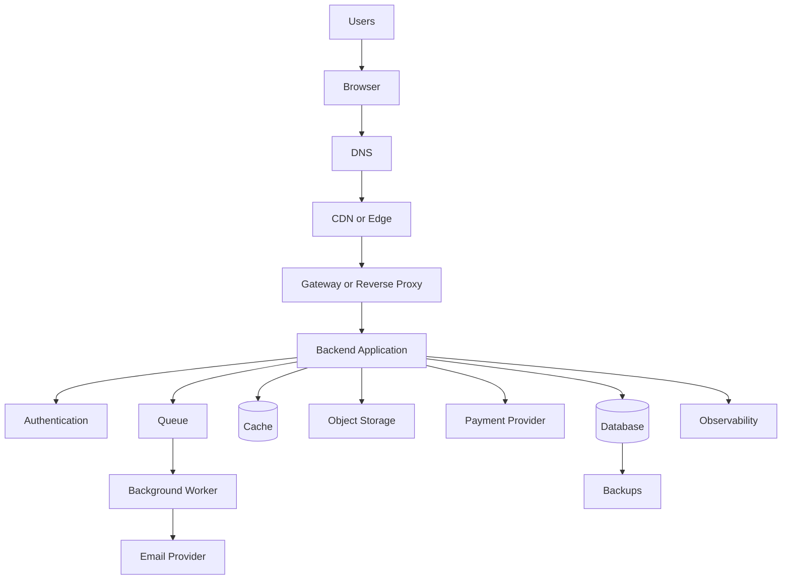
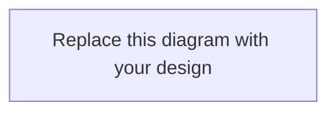
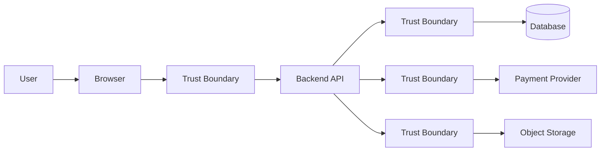
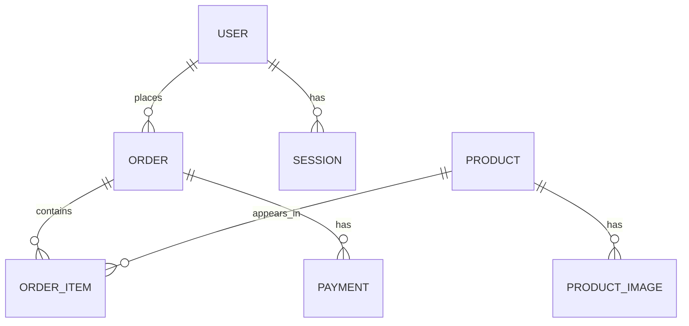
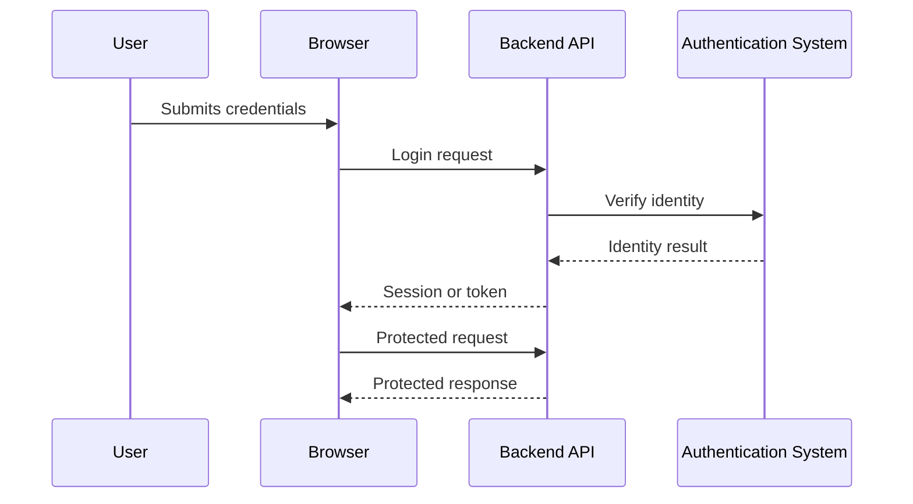
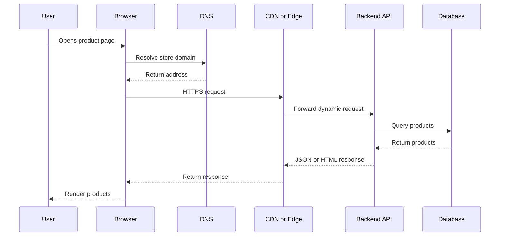
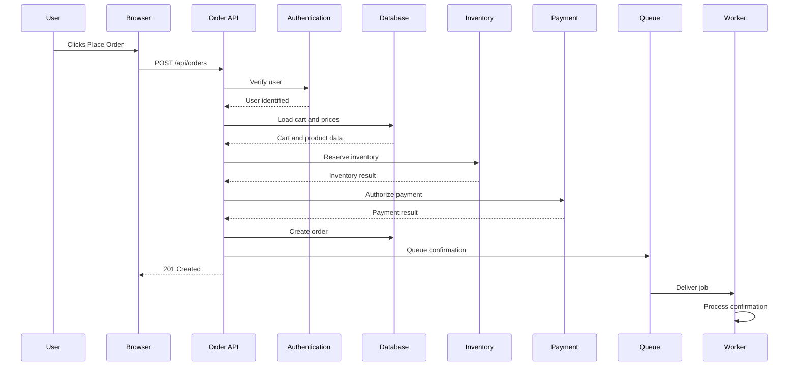
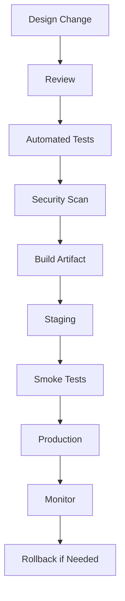
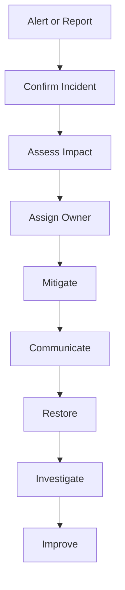

# Workbook 7 — No-Code End-to-End Capstone  
## Planning, Designing, and Narrating a Web Application

---

# Workbook Overview

This workbook is the final capstone for the **Web Mechanics, Architecture & Network Fundamentals** series.

The capstone is intentionally **no-code**.

You are not expected to build a working application in:

- JavaScript
- Python
- Java
- React
- Vue
- Node.js
- Django
- Laravel
- SQL
- Docker
- Kubernetes
- A cloud platform

Instead, you will produce a complete design and narration for a realistic web application.

The goal is to demonstrate that you can explain:

```text
What the application does
Who uses it
Which components exist
Where each component runs
How components communicate
Which data is authoritative
How users authenticate
How permissions are enforced
What happens when things fail
How performance is protected
How the system is monitored
How the system is deployed
How the system is recovered
```

The capstone brings together:

```text
Architecture
Networking
DNS
HTTP
HTTPS
APIs
Data
Security
Diagnostics
Performance
Reliability
Production planning
```

---

# Capstone Project

## Design an Online Store Platform

Design an online store that supports:

- Public product browsing
- Product search and filtering
- Product details
- Customer accounts
- Login and logout
- Shopping carts
- Order creation
- Order history
- Administrator product management
- Product image uploads
- Inventory management
- Payment processing or payment-provider integration
- Order-confirmation notifications

Your project will be evaluated as a **system design and explanation**, not as a codebase.

---

# 1. Capstone Deliverables

Your completed workbook should produce the following artifacts:

```text
1. Project overview
2. Scope definition
3. User roles
4. User journeys
5. Functional requirements
6. Nonfunctional requirements
7. Assumptions and open questions
8. Architecture diagram
9. Component responsibility table
10. Trust-boundary analysis
11. Data ownership table
12. Conceptual data model
13. API contract
14. Authentication and authorization plan
15. Request-tracing narratives
16. Failure scenarios
17. Performance plan
18. Reliability plan
19. Security plan
20. Observability plan
21. Deployment concept
22. Backup and recovery concept
23. Incident-response plan
24. Final architecture narration
25. Design review and reflection
```

---

# 2. Suggested Submission Structure

You may complete this workbook directly, or organize your final submission like this:

```text
capstone/
├── README.md
├── project-overview.md
├── scope-and-requirements.md
├── user-journeys.md
├── architecture.md
├── component-responsibilities.md
├── data-model.md
├── api-contract.md
├── authentication.md
├── request-traces.md
├── failure-scenarios.md
├── performance.md
├── reliability.md
├── security.md
├── observability.md
├── deployment.md
├── recovery.md
└── final-narration.md
```

---

# 3. Capstone Rules

## Rule 1 — Explain responsibilities

Do not merely list technologies.

Weak:

```text
Use React, Node, PostgreSQL, Redis, Docker, and Kubernetes.
```

Stronger:

```text
The browser renders the interface.
The backend validates orders and enforces permissions.
The database stores authoritative order state.
The cache stores frequently accessed public product data.
The queue holds notification jobs.
```

## Rule 2 — Treat the browser as untrusted

The browser may be modified by the user.

Important rules must be enforced server-side.

## Rule 3 — Identify sources of truth

For each important value, state which system is authoritative.

## Rule 4 — Explain failure behavior

Do not assume every dependency always works.

## Rule 5 — Prefer appropriate complexity

A small team may reasonably begin with a modular monolith instead of many microservices.

## Rule 6 — Separate current design from future evolution

You may describe:

```text
Initial architecture
Future scaling architecture
```

Do not mix them together without explanation.

---

# Part 1 — Project Overview

## Project name

```text
____________________________________________________________
```

## One-sentence description

Complete:

> This application allows _____________________________________________

```text
____________________________________________________________
```

## Project summary

Write a short overview.

```text
____________________________________________________________
____________________________________________________________
____________________________________________________________
____________________________________________________________
____________________________________________________________
```

## Main problem being solved

```text
____________________________________________________________
____________________________________________________________
____________________________________________________________
```

## Target users

```text
1. ________________________________________________________
2. ________________________________________________________
3. ________________________________________________________
```

---

# Part 2 — Scope

## In-scope functionality

List what the first version supports.

```text
1. ________________________________________________________
2. ________________________________________________________
3. ________________________________________________________
4. ________________________________________________________
5. ________________________________________________________
6. ________________________________________________________
7. ________________________________________________________
8. ________________________________________________________
```

## Out-of-scope functionality

List features intentionally excluded.

```text
1. ________________________________________________________
2. ________________________________________________________
3. ________________________________________________________
4. ________________________________________________________
5. ________________________________________________________
```

## Scope justification

Why did you include and exclude these features?

```text
____________________________________________________________
____________________________________________________________
____________________________________________________________
```

---

# Part 3 — Users and Roles

Define the roles in your system.

| Role | Description | Can do | Cannot do |
|---|---|---|---|
| Visitor |  |  |  |
| Customer |  |  |  |
| Administrator |  |  |  |
| Support staff |  |  |  |
| External provider |  |  |  |

You may remove roles that do not apply.

## Permissions matrix

| Capability | Visitor | Customer | Administrator | Support |
|---|---:|---:|---:|---:|
| Browse products |  |  |  |  |
| Search products |  |  |  |  |
| Manage own cart |  |  |  |  |
| Place order |  |  |  |  |
| View own orders |  |  |  |  |
| View all orders |  |  |  |  |
| Create products |  |  |  |  |
| Update inventory |  |  |  |  |
| Update order status |  |  |  |  |
| Manage users |  |  |  |  |

---

# Part 4 — User Journeys

Design at least four journeys.

Recommended journeys:

```text
Browse products
Log in
Add an item to the cart
Place an order
View order history
Administrator uploads a product image
```

---

## Journey 1

### Name

```text
____________________________________________________________
```

### Starting condition

```text
____________________________________________________________
```

### User action

```text
____________________________________________________________
```

### Frontend behavior

```text
____________________________________________________________
```

### Backend behavior

```text
____________________________________________________________
```

### Data involved

```text
____________________________________________________________
```

### External services involved

```text
____________________________________________________________
```

### Expected result

```text
____________________________________________________________
```

### Possible failures

```text
____________________________________________________________
```

---

## Journey 2

### Name

```text
____________________________________________________________
```

### Starting condition

```text
____________________________________________________________
```

### User action

```text
____________________________________________________________
```

### Frontend behavior

```text
____________________________________________________________
```

### Backend behavior

```text
____________________________________________________________
```

### Data involved

```text
____________________________________________________________
```

### External services involved

```text
____________________________________________________________
```

### Expected result

```text
____________________________________________________________
```

### Possible failures

```text
____________________________________________________________
```

---

## Journey 3

### Name

```text
____________________________________________________________
```

### Starting condition

```text
____________________________________________________________
```

### User action

```text
____________________________________________________________
```

### Frontend behavior

```text
____________________________________________________________
```

### Backend behavior

```text
____________________________________________________________
```

### Data involved

```text
____________________________________________________________
```

### External services involved

```text
____________________________________________________________
```

### Expected result

```text
____________________________________________________________
```

### Possible failures

```text
____________________________________________________________
```

---

## Journey 4

### Name

```text
____________________________________________________________
```

### Starting condition

```text
____________________________________________________________
```

### User action

```text
____________________________________________________________
```

### Frontend behavior

```text
____________________________________________________________
```

### Backend behavior

```text
____________________________________________________________
```

### Data involved

```text
____________________________________________________________
```

### External services involved

```text
____________________________________________________________
```

### Expected result

```text
____________________________________________________________
```

### Possible failures

```text
____________________________________________________________
```

---

# Part 5 — Functional Requirements

Write requirements using:

```text
The system shall...
```

## Product requirements

```text
1. The system shall _________________________________________
2. The system shall _________________________________________
3. The system shall _________________________________________
4. The system shall _________________________________________
```

## Account requirements

```text
1. The system shall _________________________________________
2. The system shall _________________________________________
3. The system shall _________________________________________
```

## Cart requirements

```text
1. The system shall _________________________________________
2. The system shall _________________________________________
3. The system shall _________________________________________
```

## Order requirements

```text
1. The system shall _________________________________________
2. The system shall _________________________________________
3. The system shall _________________________________________
4. The system shall _________________________________________
```

## Administrator requirements

```text
1. The system shall _________________________________________
2. The system shall _________________________________________
3. The system shall _________________________________________
```

---

# Part 6 — Nonfunctional Requirements

## Security requirements

```text
1. The system shall _________________________________________
2. The system shall _________________________________________
3. The system shall _________________________________________
```

## Performance requirements

```text
1. The system shall _________________________________________
2. The system shall _________________________________________
3. The system shall _________________________________________
```

## Reliability requirements

```text
1. The system shall _________________________________________
2. The system shall _________________________________________
3. The system shall _________________________________________
```

## Operational requirements

```text
1. The system shall _________________________________________
2. The system shall _________________________________________
3. The system shall _________________________________________
```

---

# Part 7 — Assumptions and Open Questions

## Assumptions

```text
1. ________________________________________________________
2. ________________________________________________________
3. ________________________________________________________
4. ________________________________________________________
5. ________________________________________________________
```

## Open questions

```text
1. ________________________________________________________
2. ________________________________________________________
3. ________________________________________________________
4. ________________________________________________________
5. ________________________________________________________
```

## Assumption-impact table

| Assumption | If wrong, what changes? |
|---|---|
|  |  |
|  |  |
|  |  |
|  |  |

---

# Part 8 — Main Architecture Diagram

Begin with this template:



## Your architecture diagram



## Diagram annotations

### Public components

```text
____________________________________________________________
```

### Private components

```text
____________________________________________________________
```

### Untrusted components

```text
____________________________________________________________
```

### Authoritative data stores

```text
____________________________________________________________
```

### External dependencies

```text
____________________________________________________________
```

### Asynchronous components

```text
____________________________________________________________
```

### Monitoring components

```text
____________________________________________________________
```

---

# Part 9 — Component Responsibility Table

| Component | Responsibility | Runs where? | Trust level | Stores data? |
|---|---|---|---|---|
| Browser |  |  |  |  |
| Frontend |  |  |  |  |
| Backend API |  |  |  |  |
| Authentication |  |  |  |  |
| Database |  |  |  |  |
| Cache |  |  |  |  |
| Object storage |  |  |  |  |
| Payment provider |  |  |  |  |
| Queue |  |  |  |  |
| Worker |  |  |  |  |
| Email provider |  |  |  |  |
| CDN |  |  |  |  |
| Monitoring |  |  |  |  |

---

# Part 10 — Trust-Boundary Analysis

Use this diagram:



Complete the table:

| Boundary | What crosses it? | What could be untrusted? | Required controls |
|---|---|---|---|
| User → Browser |  |  |  |
| Browser → Backend |  |  |  |
| Backend → Database |  |  |  |
| Backend → Payment provider |  |  |  |
| Backend → Object storage |  |  |  |

## Security principle

Write a paragraph explaining why the frontend is not a trusted security boundary.

```text
____________________________________________________________
____________________________________________________________
____________________________________________________________
____________________________________________________________
```

---

# Part 11 — Data Ownership and Sources of Truth

Complete the table:

| Data | Source of truth | Secondary copies | What if values disagree? |
|---|---|---|---|
| Product price |  |  |  |
| Inventory |  |  |  |
| User account |  |  |  |
| Session validity |  |  |  |
| Cart |  |  |  |
| Order status |  |  |  |
| Payment status |  |  |  |
| Product image |  |  |  |
| Email status |  |  |  |

## Important conflict

```text
Browser:
  Product price = $79.99

Server:
  Product price = $69.99
```

Which value controls checkout?

```text
____________________________________________________________
```

Why?

```text
____________________________________________________________
```

---

# Part 12 — Conceptual Data Model

List the major entities.

```text
1. ________________________________________________________
2. ________________________________________________________
3. ________________________________________________________
4. ________________________________________________________
5. ________________________________________________________
6. ________________________________________________________
7. ________________________________________________________
```

Create a conceptual relationship diagram.



Replace or extend the entities for your application.

## Relationship explanations

```text
Relationship 1:
____________________________________________________________

Relationship 2:
____________________________________________________________

Relationship 3:
____________________________________________________________

Relationship 4:
____________________________________________________________
```

---

# Part 13 — API Contract

Choose one important operation.

```text
Operation:
____________________________________________________________
```

## Endpoint

```http
METHOD /path
```

```text
____________________________________________________________
```

## Purpose

```text
____________________________________________________________
____________________________________________________________
```

## Authentication

```text
____________________________________________________________
```

## Authorization

```text
____________________________________________________________
```

## Request

```http
____________________________________________________________
```

```json
{
}
```

## Parameters

| Name | Location | Type | Required? | Validation |
|---|---|---|---:|---|
|  |  |  |  |  |
|  |  |  |  |  |
|  |  |  |  |  |

## Success response

```http
____________________________________________________________
```

```json
{
}
```

## Error responses

| Status | Condition | Client behavior |
|---:|---|---|
|  |  |  |
|  |  |  |
|  |  |  |
|  |  |  |

## Idempotency

```text
____________________________________________________________
```

## Caching

```text
____________________________________________________________
```

---

# Part 14 — Authentication and Authorization Plan

## Authentication approach

Choose one conceptually:

```text
[ ] Session cookies
[ ] Bearer access tokens
[ ] OAuth or OpenID Connect
[ ] API keys for service clients
[ ] Other: _________________________________________________
```

Explain:

```text
____________________________________________________________
____________________________________________________________
```

## Login flow



## Authentication failures

```text
Missing credentials:
____________________________________________________________

Invalid credentials:
____________________________________________________________

Expired session:
____________________________________________________________
```

## Authorization rules

```text
Rule 1:
____________________________________________________________

Rule 2:
____________________________________________________________

Rule 3:
____________________________________________________________

Rule 4:
____________________________________________________________
```

## Ownership rule

```text
____________________________________________________________
____________________________________________________________
```

---

# Part 15 — Request-Trace 1: Browse Products

Trace a public product-list request.



## Narrate each step

```text
1. _________________________________________________________
2. _________________________________________________________
3. _________________________________________________________
4. _________________________________________________________
5. _________________________________________________________
6. _________________________________________________________
7. _________________________________________________________
8. _________________________________________________________
```

## Possible failures

```text
____________________________________________________________
____________________________________________________________
```

---

# Part 16 — Request-Trace 2: Place an Order

Trace the order workflow.



## Narrate the workflow

```text
1. _________________________________________________________
2. _________________________________________________________
3. _________________________________________________________
4. _________________________________________________________
5. _________________________________________________________
6. _________________________________________________________
7. _________________________________________________________
8. _________________________________________________________
9. _________________________________________________________
10. ________________________________________________________
```

## Which steps are synchronous?

```text
____________________________________________________________
```

## Which steps are asynchronous?

```text
____________________________________________________________
```

---

# Part 17 — Failure Scenarios

Complete the table.

| Failure | User impact | System response | Recovery |
|---|---|---|---|
| Database unavailable |  |  |  |
| Cache unavailable |  |  |  |
| Payment timeout |  |  |  |
| Inventory conflict |  |  |  |
| Email provider unavailable |  |  |  |
| Queue unavailable |  |  |  |
| Image storage unavailable |  |  |  |
| Authentication provider unavailable |  |  |  |

## Choose the three most serious failures

```text
1. ________________________________________________________
2. ________________________________________________________
3. ________________________________________________________
```

Why?

```text
____________________________________________________________
____________________________________________________________
```

---

# Part 18 — Performance Plan

## Browser performance

```text
Initial content:
____________________________________________________________

JavaScript:
____________________________________________________________

Images:
____________________________________________________________

Fonts:
____________________________________________________________

Loading states:
____________________________________________________________
```

## API performance

```text
Pagination:
____________________________________________________________

Filtering:
____________________________________________________________

Caching:
____________________________________________________________

Asynchronous work:
____________________________________________________________
```

## Database performance

```text
Indexes:
____________________________________________________________

Query limits:
____________________________________________________________

Potential N+1 problems:
____________________________________________________________
```

## Performance budget

| Metric | Target |
|---|---:|
| Initial JavaScript |  |
| Product API P95 |  |
| Search API P95 |  |
| Largest image |  |
| Database query |  |
| Error rate |  |

---

# Part 19 — Security Plan

Complete the table.

| Security concern | Planned control | Where enforced? |
|---|---|---|
| Password storage |  |  |
| Session protection |  |  |
| Authorization |  |  |
| Input validation |  |  |
| SQL injection |  |  |
| XSS |  |  |
| CSRF |  |  |
| File uploads |  |  |
| Secrets |  |  |
| Rate limiting |  |  |
| Database exposure |  |  |
| Logging |  |  |

## Sensitive data

List sensitive data your system handles:

```text
1. ________________________________________________________
2. ________________________________________________________
3. ________________________________________________________
4. ________________________________________________________
5. ________________________________________________________
```

## Data minimization

What data should the application avoid collecting or retaining?

```text
____________________________________________________________
____________________________________________________________
```

---

# Part 20 — Observability Plan

## Logs

What events should be logged?

```text
1. ________________________________________________________
2. ________________________________________________________
3. ________________________________________________________
4. ________________________________________________________
5. ________________________________________________________
```

## Log fields

```text
Request ID:
____________________________________________________________

Trace ID:
____________________________________________________________

Endpoint:
____________________________________________________________

Status:
____________________________________________________________

Duration:
____________________________________________________________
```

## Metrics

List metrics for:

### Application

```text
____________________________________________________________
```

### Database

```text
____________________________________________________________
```

### Cache

```text
____________________________________________________________
```

### Queue

```text
____________________________________________________________
```

### External services

```text
____________________________________________________________
```

## Alerts

Design five alerts.

| Alert | Trigger | Action |
|---|---|---|
|  |  |  |
|  |  |  |
|  |  |  |
|  |  |  |
|  |  |  |

---

# Part 21 — Deployment Concept

Design a deployment flow without writing deployment code.



## Describe each stage

```text
Review:
____________________________________________________________

Tests:
____________________________________________________________

Security scan:
____________________________________________________________

Artifact:
____________________________________________________________

Staging:
____________________________________________________________

Smoke tests:
____________________________________________________________

Production rollout:
____________________________________________________________

Monitoring:
____________________________________________________________

Rollback:
____________________________________________________________
```

## Deployment strategy

Choose:

```text
[ ] Rolling
[ ] Blue-green
[ ] Canary
[ ] All-at-once
[ ] Other: _________________________________________________
```

Why?

```text
____________________________________________________________
____________________________________________________________
```

---

# Part 22 — Backup and Recovery

## What must be backed up?

```text
____________________________________________________________
____________________________________________________________
```

## Backup frequency

```text
____________________________________________________________
```

## Backup storage

```text
____________________________________________________________
```

## Restore process

```text
1. _________________________________________________________
2. _________________________________________________________
3. _________________________________________________________
4. _________________________________________________________
```

## RPO

```text
____________________________________________________________
```

## RTO

```text
____________________________________________________________
```

## Restore verification

How will you prove that recovery works?

```text
____________________________________________________________
____________________________________________________________
```

---

# Part 23 — Incident-Response Plan



## Incident roles

```text
Incident lead:
____________________________________________________________

Technical investigator:
____________________________________________________________

Communications owner:
____________________________________________________________

Database or infrastructure owner:
____________________________________________________________
```

## Incident scenario

A deployment causes:

```text
High API latency
Login failures
Checkout failures
Queue growth
Database CPU at 95%
```

### What do you investigate first?

```text
____________________________________________________________
```

### What should you monitor?

```text
____________________________________________________________
```

### What immediate mitigation might you apply?

```text
____________________________________________________________
```

### What would trigger rollback?

```text
____________________________________________________________
```

### How would you verify recovery?

```text
____________________________________________________________
```

---

# Part 24 — Final Architecture Narration

Write a complete narration of your application.

Your narration should answer:

```text
Who are the users?
What does the browser do?
How does DNS participate?
How does HTTPS protect communication?
What does the frontend do?
What does the backend do?
How does the API work?
Where is data stored?
Which system is authoritative?
How do authentication and authorization work?
What happens during checkout?
Which work is asynchronous?
What happens when payment fails?
What happens when email fails?
How does caching help?
How is performance measured?
How is the system monitored?
How is it deployed?
How is it recovered?
```

```text
____________________________________________________________
____________________________________________________________
____________________________________________________________
____________________________________________________________
____________________________________________________________
____________________________________________________________
____________________________________________________________
____________________________________________________________
____________________________________________________________
____________________________________________________________
____________________________________________________________
____________________________________________________________
____________________________________________________________
____________________________________________________________
____________________________________________________________
```

---

# Part 25 — Design Review

## Architecture

```text
[ ] Components are clearly identified.
[ ] Responsibilities are clearly assigned.
[ ] Trust boundaries are shown.
[ ] Data ownership is documented.
[ ] The design is not unnecessarily complex.
```

## API

```text
[ ] Important operations have contracts.
[ ] Methods and paths are appropriate.
[ ] Errors are defined.
[ ] Pagination is defined.
[ ] Authentication is documented.
[ ] Idempotency is considered.
```

## Security

```text
[ ] Browser is treated as untrusted.
[ ] Authorization is server-enforced.
[ ] Secrets stay private.
[ ] Input is validated.
[ ] Private data is protected.
[ ] File uploads are considered.
```

## Reliability

```text
[ ] Dependencies are classified.
[ ] Timeouts exist.
[ ] Retries are bounded.
[ ] Duplicate operations are controlled.
[ ] Graceful degradation is considered.
[ ] Backups exist.
[ ] Recovery is tested.
```

## Operations

```text
[ ] Logs are defined.
[ ] Metrics are defined.
[ ] Traces are defined.
[ ] Alerts are defined.
[ ] Health checks exist.
[ ] Deployment is documented.
[ ] Rollback is documented.
```

---

# Part 26 — Reflection

## Question A

What was the most difficult design decision?

```text
____________________________________________________________
```

## Question B

Which source-of-truth decision was most important?

```text
____________________________________________________________
```

## Question C

Which dependency presents the greatest operational risk?

```text
____________________________________________________________
```

## Question D

What would you simplify for the first version?

```text
____________________________________________________________
```

## Question E

What would you change at ten times the traffic?

```text
____________________________________________________________
```

## Question F

What would you change if the application handled highly sensitive data?

```text
____________________________________________________________
```

## Question G

What assumption could most seriously affect your design?

```text
____________________________________________________________
```

## Question H

What did you learn about the difference between designing a system and implementing one?

```text
____________________________________________________________
____________________________________________________________
```

---

# Workbook Completion Checklist

```text
[ ] I defined the capstone project.
[ ] I defined scope.
[ ] I identified users and roles.
[ ] I wrote user journeys.
[ ] I wrote functional requirements.
[ ] I wrote nonfunctional requirements.
[ ] I recorded assumptions.
[ ] I created an architecture diagram.
[ ] I assigned component responsibilities.
[ ] I documented trust boundaries.
[ ] I identified sources of truth.
[ ] I created a conceptual data model.
[ ] I designed an API contract.
[ ] I designed authentication and authorization.
[ ] I traced a browse workflow.
[ ] I traced an order workflow.
[ ] I mapped failure scenarios.
[ ] I created a performance plan.
[ ] I created a security plan.
[ ] I created an observability plan.
[ ] I created a deployment plan.
[ ] I created a backup and recovery plan.
[ ] I created an incident-response plan.
[ ] I wrote the final architecture narration.
[ ] I completed the design review.
[ ] I completed the reflection.
```

---

# Final Submission

Submit:

```text
1. Project overview
2. Scope definition
3. User roles
4. User journeys
5. Functional requirements
6. Nonfunctional requirements
7. Assumptions and open questions
8. Architecture diagram
9. Component responsibility table
10. Trust-boundary analysis
11. Data ownership table
12. Conceptual data model
13. API contract
14. Authentication and authorization plan
15. Request trace 1
16. Request trace 2
17. Failure scenarios
18. Performance plan
19. Security plan
20. Observability plan
21. Deployment concept
22. Backup and recovery plan
23. Incident-response plan
24. Final architecture narration
25. Design review
26. Reflection
```

---

# Completion Standard

You have completed the capstone workbook when you can explain your application from beginning to end:

```text
A user opens the application.
DNS helps locate it.
The browser establishes HTTPS.
The frontend displays the interface.
The backend receives API requests.
Authentication identifies the user.
Authorization checks permissions.
Business logic validates operations.
The database stores authoritative data.
Caches improve repeated access.
External services provide specialized capabilities.
Queues handle asynchronous work.
Logs, metrics, and traces reveal behavior.
Deployments move changes safely.
Backups and recovery protect the system.
Incident procedures handle failure.
```

The central goal of this capstone is:

> Demonstrate that you can plan, design, and narrate a complete web application before writing its implementation.
