# Foundation Primers

# Primer 1 — Basic Computer Concepts for Web Learners  
## Files, Programs, Processes, Memory, Storage, Networks, Terminals, and Local Systems

---

# Primer Overview

Before learning how websites, APIs, servers, and databases work, it helps to understand the computer systems that run them.

You do not need to become a hardware engineer or operating-system specialist. However, a basic understanding of computers will make web development terminology much easier.

This primer explains:

- What hardware and software are
- What an operating system does
- The difference between files, folders, programs, and processes
- How memory differs from storage
- What a CPU does
- What local and remote systems are
- What a terminal is
- What commands do
- What paths represent
- What permissions are
- What environment variables are
- What ports are
- What services are
- What “running locally” means
- What happens when a program starts
- How web development uses these concepts

The central model is:

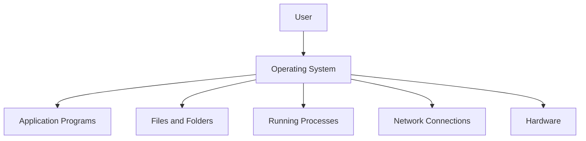

---

# 1. What Is a Computer?

A computer is a machine that:

1. Receives input
2. Processes information
3. Stores information
4. Produces output

Examples of input:

- Keyboard
- Mouse
- Touchscreen
- Microphone
- Network request
- Uploaded file
- Sensor

Examples of processing:

- Calculating a total
- Searching a database
- Rendering a webpage
- Encrypting a message
- Running a program

Examples of output:

- Screen display
- Saved file
- Sound
- Printed document
- HTTP response
- Updated database record

A simplified model:

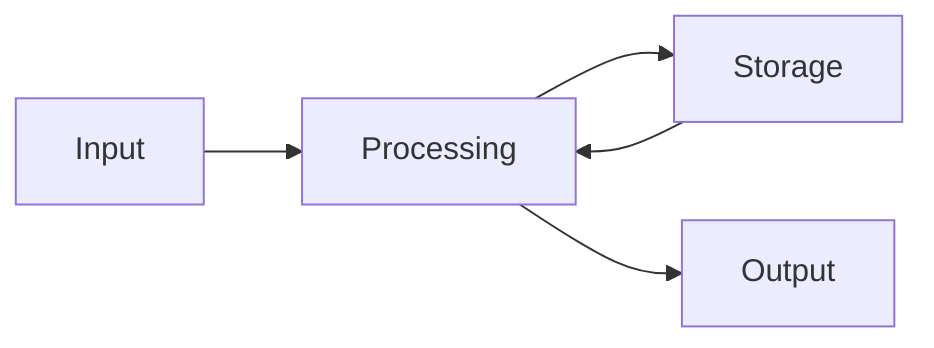

A web server follows the same general model:

```text
Input:
  HTTP request

Processing:
  Routing, authentication, business logic

Storage:
  Database, files, cache

Output:
  HTTP response
```

---

# 2. Hardware and Software

## Hardware

Hardware is the physical equipment that makes computing possible.

Examples:

- CPU
- Memory
- Storage drive
- Network card
- Keyboard
- Monitor
- Router
- Server
- Phone
- Data-center machine

Hardware can be touched or physically installed.

## Software

Software is the set of instructions and data that tells hardware what to do.

Examples:

- Operating system
- Browser
- Text editor
- Web server
- Database
- JavaScript program
- Mobile application
- Shell command

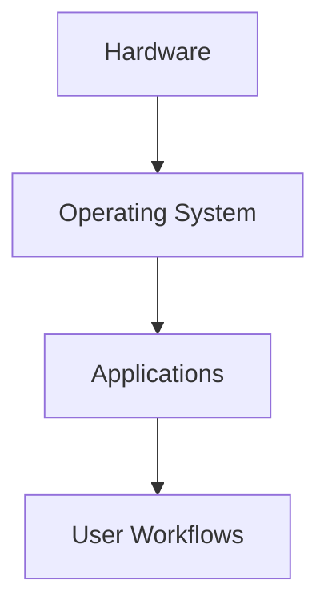

A browser is software running on hardware through the operating system.

---

# 3. The CPU

CPU stands for **Central Processing Unit**.

The CPU executes instructions.

A program contains instructions such as:

```text
Read this value.
Add these numbers.
Compare these strings.
Open this file.
Send this network request.
```

The CPU performs the actual processing.

A simplified flow:

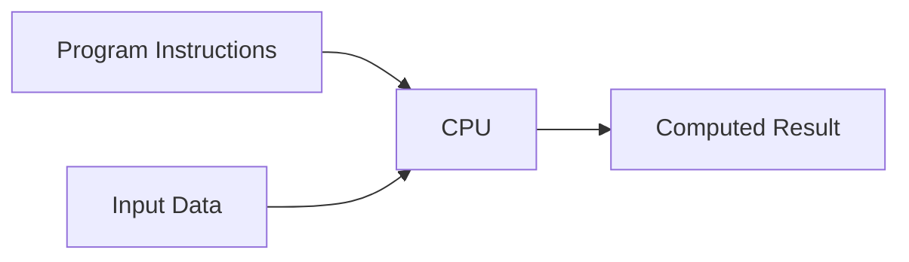

A CPU performs many small operations very quickly.

For example, calculating an order total may involve:

```text
Read product price
Read quantity
Multiply price × quantity
Add tax
Apply discount
Return total
```

A modern application may use multiple CPU cores to perform work concurrently.

---

# 4. CPU Cores and Concurrency

A CPU core is an execution unit capable of processing instructions.

A computer may have:

```text
1 core
2 cores
4 cores
8 cores
Many cores
```

A system with multiple cores can execute independent work at the same time.

For example:

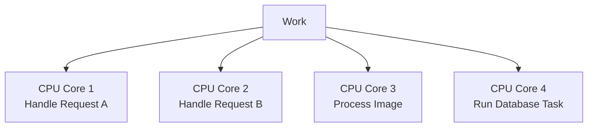

However, having more cores does not automatically make every program faster.

The program must be capable of using parallel execution effectively.

---

# 5. Memory and Storage Are Different

Beginners often use “memory” and “storage” interchangeably, but they serve different purposes.

## Memory

Memory usually means RAM, or Random Access Memory.

RAM stores data that programs are actively using.

It is:

- Fast
- Temporary
- Usually cleared when the computer shuts down
- Used by running programs

## Storage

Storage usually means a disk or solid-state drive.

It stores data persistently.

It holds:

- Operating system files
- Applications
- Documents
- Images
- Databases
- Source code
- Logs

Storage is generally slower than RAM but preserves data when power is removed.

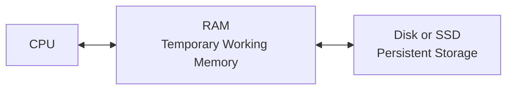

---

# 6. An Analogy for Memory and Storage

Imagine a desk and a filing cabinet.

```text
Desk:
  Fast access
  Limited space
  Work currently in progress

Filing cabinet:
  Larger storage
  Slower to access
  Keeps documents for later
```

RAM is like the desk.

Storage is like the filing cabinet.

When you open a program:

```text
Program stored on disk
  ↓
Loaded into RAM
  ↓
CPU executes instructions
```

When you save a file:

```text
Data in RAM
  ↓
Written to storage
  ↓
Available later
```

---

# 7. What Happens When a Program Starts?

Suppose you open a browser.

A simplified process is:

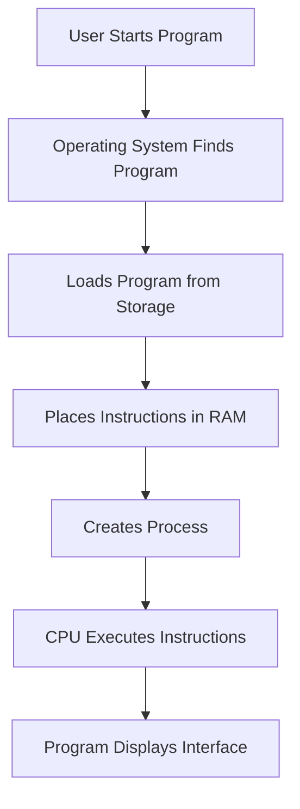

The operating system:

1. Finds the application files.
2. Loads necessary instructions into memory.
3. Creates a running process.
4. Gives the process access to permitted resources.
5. Schedules its work on the CPU.
6. Provides input and output services.

---

# 8. Programs and Processes

## Program

A program is a set of instructions stored on disk.

Examples:

```text
browser.exe
node
python
database-server
```

A program is not necessarily doing anything while it is only stored.

## Process

A process is a running instance of a program.

If you open a browser, the operating system creates one or more browser processes.

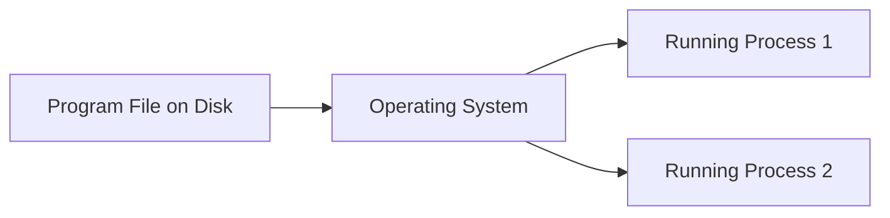

One program can create multiple processes.

One process can create other processes.

---

# 9. Process Resources

A process may receive access to:

- Memory
- CPU time
- Files
- Network connections
- Environment variables
- Input and output streams
- Operating-system services

The operating system controls these resources.

This prevents one program from freely controlling everything on the computer.

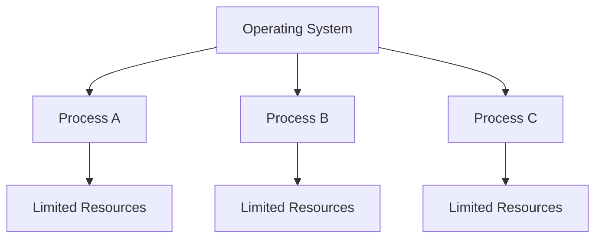

---

# 10. Why Processes Matter in Web Development

When you start a development server, you are starting a process.

For example:

```bash
npm run dev
```

may start a process that:

- Reads your source code
- Watches for file changes
- Opens a network port
- Serves files
- Compiles code
- Responds to browser requests

When a database runs locally, it is also a process.

When a backend server runs locally, it is another process.

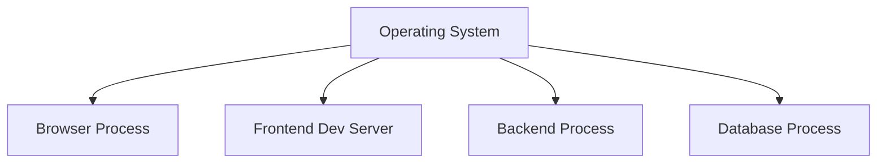

These processes may communicate through local network connections.

---

# 11. The Operating System

An operating system manages the computer and provides common services to programs.

Examples:

- Windows
- macOS
- Linux
- Android
- iOS

The operating system manages:

- Files
- Memory
- Processes
- Users
- Permissions
- Devices
- Networking
- Time
- System settings

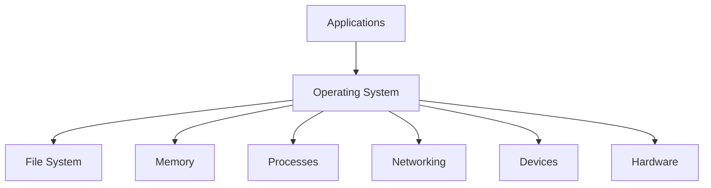

Applications usually do not communicate with hardware directly. They use operating-system services.

---

# 12. Operating-System Abstraction

Suppose a program wants to read a file.

It does not normally need to know:

- The physical disk sector
- The electrical behavior of the storage device
- The exact filesystem implementation

Instead, it asks the operating system:

```text
Open this file.
Read these bytes.
Save this data.
```

This is an abstraction.

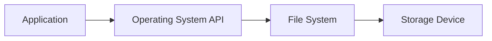

Web frameworks provide similar abstractions.

A framework may let you write:

```javascript
readFile("config.json")
```

without requiring you to manage the physical storage directly.

---

# 13. The File System

A file system organizes data into:

- Files
- Folders or directories
- Paths
- Metadata
- Permissions

Example:

```text
project/
├── src/
│   ├── app.js
│   └── styles.css
├── public/
│   └── logo.png
├── package.json
└── README.md
```

Each item has a location represented by a path.

---

# 14. Files

A file is a named collection of data stored on a device.

Files may contain:

- Text
- Source code
- Images
- Audio
- Video
- Configuration
- Database data
- Logs
- Compiled code

Examples:

```text
index.html
app.js
styles.css
config.json
database.sqlite
server.log
```

A file extension often suggests its format:

```text
.html = HTML
.css  = CSS
.js   = JavaScript
.json = JSON
.png  = PNG image
```

The extension is a convention. It does not guarantee that the contents are valid.

---

# 15. Directories and Folders

A directory, commonly called a folder, organizes files and other directories.

Example:

```text
website/
├── frontend/
├── backend/
├── public/
└── tests/
```

Directories create structure.

A large project may use:

```text
src/
tests/
docs/
scripts/
config/
public/
dist/
```

Good organization helps humans and tools locate resources.

---

# 16. Paths

A path describes the location of a file or directory.

Example:

```text
project/src/app.js
```

A path may be:

- Relative
- Absolute

## Relative path

A relative path is interpreted from the current location.

```text
src/app.js
```

## Absolute path

An absolute path begins from the filesystem root or drive.

Unix-like example:

```text
/home/alex/project/src/app.js
```

Windows example:

```text
C:\Users\Alex\project\src\app.js
```

---

# 17. Current Working Directory

The current working directory is the folder a command is currently operating in.

You can imagine the terminal as “standing inside” one directory.

If you run:

```bash
ls
```

the command lists files in the current working directory.

If you run:

```bash
cd project
```

you move into the `project` directory.

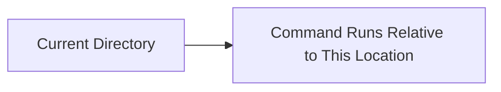

Many development errors are caused by running a command from the wrong directory.

---

# 18. Absolute and Relative Paths

Suppose the project is located at:

```text
/home/alex/project
```

Absolute path:

```text
/home/alex/project/src/app.js
```

Relative path from the project directory:

```text
src/app.js
```

Relative path from the `src` directory:

```text
app.js
```

The same file can have different relative paths depending on the current working directory.

---

# 19. Special Path Symbols

Common path symbols:

```text
.   Current directory
..  Parent directory
~   User home directory on many Unix-like shells
/   Root or path separator on Unix-like systems
```

Examples:

```bash
cd .
cd ..
cd ~/projects
```

If you are in:

```text
/home/alex/project/src
```

then:

```text
.. 
```

refers to:

```text
/home/alex/project
```

---

# 20. File Extensions and Formats

A filename extension is a label used by operating systems and tools.

Examples:

```text
.html
.css
.js
.ts
.py
.json
.yaml
.md
.sql
```

The extension does not change the content automatically.

A file called:

```text
data.json
```

containing invalid JSON is still invalid.

Tools may use extensions to determine:

- Syntax highlighting
- How to open the file
- Which parser to use
- Which build process applies

---

# 21. Text and Binary Files

## Text files

Text files contain characters that can be displayed and edited as text.

Examples:

- HTML
- CSS
- JavaScript
- JSON
- SQL
- Markdown
- Logs

## Binary files

Binary files contain bytes that may not be meaningful as ordinary text.

Examples:

- Images
- Videos
- Audio
- Compiled programs
- Fonts
- Archives
- PDFs

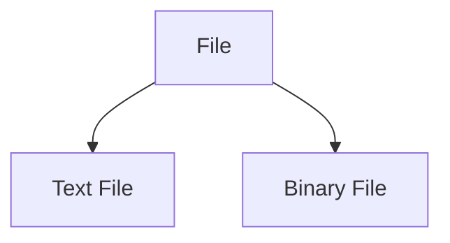

Both are ultimately stored as bytes, but their interpretation differs.

---

# 22. Bytes and Bits

Computers store and transfer data as bits.

A bit has two possible values:

```text
0
1
```

A byte contains eight bits.

```text
1 byte = 8 bits
```

Examples:

```text
1 KB ≈ 1,000 bytes
1 MB ≈ 1,000,000 bytes
1 GB ≈ 1,000,000,000 bytes
```

The exact definitions vary between decimal and binary measurement systems.

When an HTTP response says:

```text
Content-Length: 5000
```

the size is measured in bytes.

---

# 23. Character Encoding

Text must be represented as bytes.

A character encoding defines how characters map to bytes.

UTF-8 is widely used on the Web.

Example:

```html
<meta charset="UTF-8">
```

Without correct encoding, text may appear corrupted:

```text
Café
```

instead of:

```text
Café
```

Encoding matters for:

- HTML
- JSON
- URLs
- HTTP headers
- Databases
- File storage
- Logs

---

# 24. Permissions

Operating systems control who can access files, processes, and resources.

Permissions may include:

```text
Read
Write
Execute
```

They may apply to:

```text
Owner
Group
Other users
```

A file might be:

```text
Readable by the application
Writable only by an administrator
Not accessible to other users
```

Permissions are especially important on servers.

---

# 25. Read, Write, and Execute

## Read

Allows viewing file contents.

## Write

Allows changing or deleting file contents.

## Execute

Allows running a file as a program or entering a directory, depending on the operating system.

A web server may need:

```text
Read access to public assets
Write access to an upload directory
No write access to application source code
```

Granting excessive permissions increases risk.

---

# 26. Users and Groups

Operating systems often associate processes and files with users and groups.

A web server process may run as a restricted service user:

```text
web-server
```

A database may run as:

```text
database
```

This limits what each service can access.

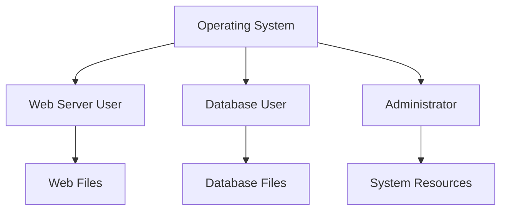

---

# 27. The Principle of Least Privilege

A program should receive only the permissions it needs.

Bad:

```text
Web application can read and write every system file.
```

Better:

```text
Web application can read application files,
write only to a specific upload directory,
and access only the required database operations.
```

Least privilege reduces the impact of:

- Bugs
- Compromised dependencies
- Stolen credentials
- Malicious requests

---

# 28. The Terminal

A terminal is a text-based interface for interacting with a computer.

You type commands, and the operating system executes them.

Examples:

```bash
pwd
ls
cd
mkdir
curl
```

The terminal is useful for:

- Running development servers
- Managing files
- Installing packages
- Testing APIs
- Reading logs
- Running scripts
- Checking network behavior
- Automating workflows

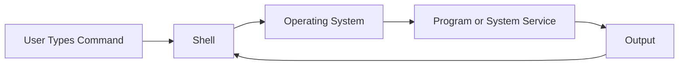

---

# 29. Shell vs Terminal

These terms are related but different.

## Terminal

The application window that accepts text input.

Examples:

- Windows Terminal
- Terminal.app
- GNOME Terminal
- Integrated terminal in an editor

## Shell

The program that interprets commands.

Examples:

- Bash
- Zsh
- Fish
- PowerShell
- Command Prompt

```text
Terminal = Interface window
Shell    = Command interpreter
```

---

# 30. Basic Terminal Commands

## Print current directory

```bash
pwd
```

## List files

```bash
ls
```

On Windows PowerShell:

```powershell
Get-ChildItem
```

## Change directory

```bash
cd project
```

## Move to parent directory

```bash
cd ..
```

## Create directory

```bash
mkdir project
```

## Create an empty file

```bash
touch notes.txt
```

## Display a file

```bash
cat notes.txt
```

## Search text

```bash
grep "error" server.log
```

Command names vary across shells and operating systems.

---

# 31. Terminal Output

Commands may write output to:

```text
Standard output
Standard error
```

You may see:

```text
Successful result → standard output
Error message     → standard error
```

You can redirect output.

```bash
command > output.txt
```

This writes standard output to a file.

Append instead:

```bash
command >> output.txt
```

Redirect errors:

```bash
command 2> errors.txt
```

Redirect both:

```bash
command > all-output.txt 2>&1
```

---

# 32. Pipes

A pipe sends the output of one command into another command.

```bash
cat server.log | grep "error"
```

Conceptually:

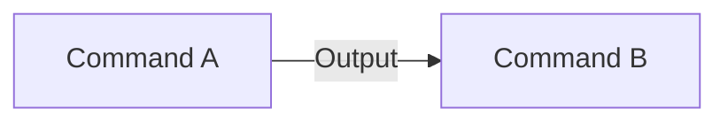

Example:

```bash
ps aux | grep node
```

This lists processes and filters for lines containing `node`.

Pipes are useful for combining small tools into workflows.

---

# 33. Exit Codes

Programs usually return an exit code when they finish.

Convention:

```text
0      Success
Nonzero Failure or special condition
```

In many shells:

```bash
echo $?
```

displays the previous command’s exit code.

Example:

```bash
curl -fsS https://example.com
echo $?
```

A script can use exit codes to decide whether to continue.

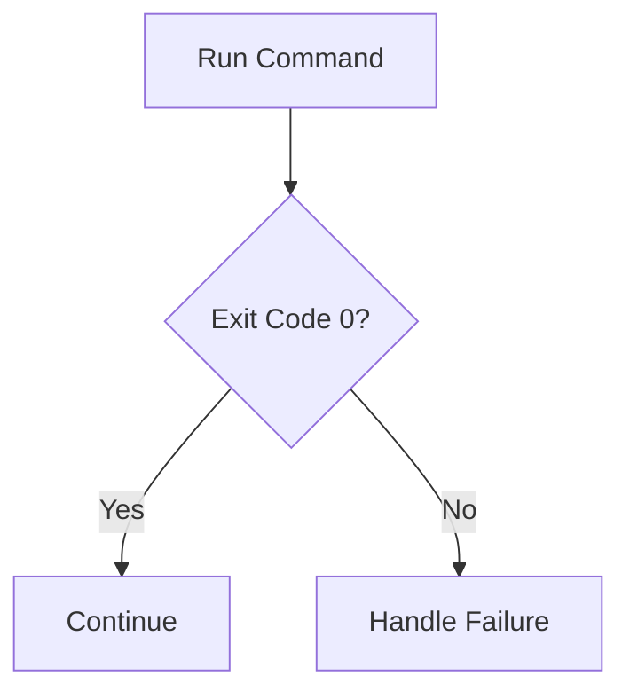

---

# 34. Processes and Commands

When you run:

```bash
npm run dev
```

the shell starts a process.

That process may continue running until:

- You press `Ctrl + C`
- The program exits
- The operating system terminates it
- The process crashes
- Another process stops it

The terminal may appear occupied because it is connected to the running process.

Use another terminal window to run additional commands.

---

# 35. Background Processes

Some shells allow a command to run in the background:

```bash
command &
```

A server running in the background may continue after the command returns.

Be careful with background processes because you may forget they are running and later encounter:

```text
Port already in use
```

---

# 36. Finding Processes

On Unix-like systems:

```bash
ps aux
```

Find a process:

```bash
ps aux | grep node
```

List processes listening on ports:

```bash
lsof -i :3000
```

Other tools may include:

```bash
ss -ltnp
netstat -ano
```

On Windows, useful commands include:

```powershell
Get-Process
netstat -ano
```

Command availability depends on the operating system.

---

# 37. Stopping a Process

On Unix-like systems:

```bash
kill <process-id>
```

Forcefully, when necessary:

```bash
kill -9 <process-id>
```

On Windows:

```powershell
Stop-Process -Id <process-id>
```

Avoid forceful termination unless normal shutdown fails.

A program may need time to:

- Finish requests
- Flush logs
- Close files
- Complete database transactions
- Release resources

---

# 38. Environment Variables

Environment variables are named values provided to processes by the operating system or execution environment.

Examples:

```text
PORT=3000
DATABASE_URL=...
NODE_ENV=development
API_BASE_URL=https://api.example.com
```

They are commonly used for:

- Configuration
- Environment selection
- Ports
- Feature flags
- Paths
- Credentials
- Service URLs

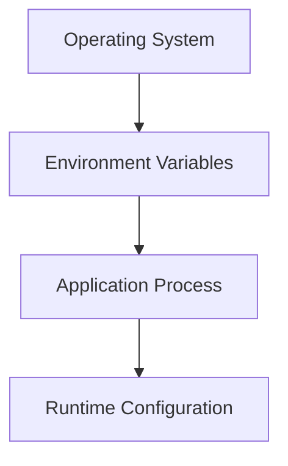

---

# 39. Public vs Private Configuration

Some configuration is safe for browser code:

```text
PUBLIC_SITE_NAME
PUBLIC_API_URL
PUBLIC_ANALYTICS_ID
```

Other values must remain server-side:

```text
DATABASE_PASSWORD
PAYMENT_SECRET
PRIVATE_SIGNING_KEY
```

A useful rule:

> If a value grants authority, it is probably secret.

Environment variables are not automatically private. If a build process includes a variable in frontend code, users may be able to inspect it.

---

# 40. Setting Environment Variables

Unix-like shells:

```bash
export PORT=3000
export NODE_ENV=development
```

Use them for one command:

```bash
PORT=3000 npm run dev
```

PowerShell:

```powershell
$env:PORT = "3000"
$env:NODE_ENV = "development"
```

The syntax depends on the shell.

---

# 41. `.env` Files

Many applications use files such as:

```text
.env
.env.local
.env.development
.env.production
```

Example:

```text
PORT=3000
DATABASE_URL=postgres://...
PUBLIC_API_URL=https://api.example.com
```

Treat `.env` files as sensitive if they contain secrets.

Add private files to `.gitignore`:

```text
.env
.env.local
```

Use a safe example file for documentation:

```text
.env.example
```

Example:

```text
PORT=3000
DATABASE_URL=
PUBLIC_API_URL=
```

---

# 42. Processes and Environment Variables

Each process receives an environment at startup.

If you change an environment variable, a running process may not automatically notice.

Usually you must restart it:

```text
Stop process
Set new variable
Start process again
```

This explains why changing a `.env` file may appear to have no effect until the development server restarts.

---

# 43. Ports

A port identifies a service running on a network address.

A local address may look like:

```text
localhost:3000
```

This means:

```text
Host:
  localhost

Port:
  3000
```

One computer can run multiple services:

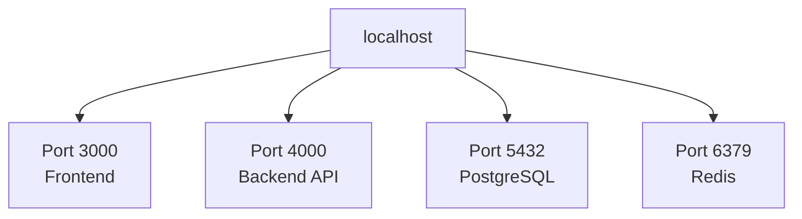

---

# 44. Common Development Ports

Common conventions include:

```text
3000  Frontend or Node application
4000  Backend API
5000  Development server
5173  Vite development server
8000  Python or general development server
8080  HTTP development server
5432  PostgreSQL
3306  MySQL
6379  Redis
```

These are conventions, not guarantees.

A program can use another available port.

---

# 45. Localhost

`localhost` usually refers to the current computer.

Common forms:

```text
localhost
127.0.0.1
::1
```

Example:

```text
http://localhost:3000
```

The request usually stays on the local machine.

```mermaid
flowchart LR
    B[Browser] --> L[localhost:3000]
    L --> P[Local Process]
```

---

# 46. `127.0.0.1` and `::1`

```text
127.0.0.1
```

is the IPv4 loopback address.

```text
::1
```

is the IPv6 loopback address.

They refer to the local machine.

Potential subtlety:

```text
localhost
```

may resolve to IPv4, IPv6, or both depending on system configuration.

If a service listens only on one address family, behavior may differ.

---

# 47. Binding to an Address

A server may listen on:

```text
127.0.0.1
```

This usually makes it accessible only from the local machine.

Or:

```text
0.0.0.0
```

This commonly means listening on all IPv4 network interfaces.

For local development:

```text
127.0.0.1 = Local-only access
0.0.0.0   = Potentially accessible through network interfaces
```

Binding to all interfaces can expose a development server to other devices on the network. Use it deliberately.

---

# 48. Localhost vs Remote Server

## Local

Runs on your own computer:

```text
Browser → localhost → Local process
```

## Remote

Runs on another computer:

```text
Browser → Internet or private network → Remote server
```

```mermaid
flowchart LR
    A[Local Development] --> L[Your Computer]
    B[Production] --> R[Remote Data Center or Cloud]
```

A local application may behave differently because:

- Network latency is near zero
- Database is local
- TLS may be absent
- Traffic is low
- Files are local
- Dependencies may be mocked
- Permissions differ

---

# 49. Frontend and Backend Running Locally

A common development setup:

```text
Frontend:
  http://localhost:3000

Backend:
  http://localhost:4000

Database:
  localhost:5432
```

```mermaid
flowchart TD
    B[Browser] --> F[Frontend :3000]
    F --> API[Backend API :4000]
    API --> DB[(Database :5432)]
```

The browser’s frontend code may call:

```text
http://localhost:4000/api/products
```

If the frontend uses a different port from the backend, they may be different origins, which can make CORS relevant even though both are local.

---

# 50. Services

A service is a running process that provides a capability.

Examples:

```text
Web server
Database server
Cache server
Message queue
Authentication server
File server
```

A service usually:

1. Starts as a process.
2. Listens on an address and port.
3. Accepts requests.
4. Performs work.
5. Returns responses.

```mermaid
flowchart LR
    C[Client] --> P[Port]
    P --> S[Service Process]
    S --> R[Response]
```

---

# 51. Process vs Service

A process is any running program.

A service is a process that provides a continuing capability, often by accepting requests.

Examples:

```text
Text editor process:
  Usually an interactive application

Database service:
  Runs continuously and accepts queries

Backend service:
  Runs continuously and accepts HTTP requests
```

The terms can overlap in everyday usage.

---

# 52. Client and Server on One Computer

In development, the client and server may run on the same machine.

```mermaid
flowchart LR
    B[Browser Process] --> API[Backend Process]
    API --> DB[Database Process]
```

They still communicate through protocols such as HTTP and TCP.

The fact that they run on the same physical computer does not eliminate the logical client-server boundary.

---

# 53. Local Network

A local network connects devices in a limited area.

Examples:

- Home network
- Office network
- School network
- Cloud private network
- Data-center network

Devices may communicate using private IP addresses:

```text
192.168.1.10
192.168.1.20
```

A local network may connect to the Internet through a router.

---

# 54. Network Interface

A computer may have multiple network interfaces:

```text
Wi-Fi
Ethernet
VPN
Loopback
Virtual container network
```

Each interface may have a different address.

This matters when a server binds to:

```text
localhost
Private LAN address
All interfaces
```

A service available at `localhost` may not be available from another device.

---

# 55. File Paths vs URL Paths

These look similar but refer to different things.

## File path

```text
/home/alex/project/index.html
```

This identifies a file on a computer.

## URL path

```text
/products/123
```

This identifies a resource or route in an HTTP request.

A URL path does not necessarily map directly to a file path.

```mermaid
flowchart LR
    U[URL Path /products/123] --> R[Backend Router]
    R --> D[(Database)]
```

The server may dynamically generate the response.

---

# 56. Configuration vs Code

Configuration tells software how to operate in an environment.

Examples:

```text
Port number
Database location
API endpoint
Log level
Feature flag
Cache duration
```

Code defines behavior.

Keeping environment-specific values in configuration rather than hardcoding them makes deployment easier.

Bad:

```javascript
const apiUrl = "https://production.example.com";
```

Better:

```javascript
const apiUrl = process.env.API_BASE_URL;
```

The exact syntax depends on the language and framework.

---

# 57. Development Dependencies and Runtime Dependencies

## Development dependency

Used while building or testing.

Examples:

- Test runner
- Linter
- Formatter
- Bundler
- Development server
- Type checker

## Runtime dependency

Required when the application runs.

Examples:

- Web framework
- Database driver
- Authentication library
- Template engine

Understanding this distinction helps reduce production image size and avoid missing packages.

---

# 58. Compiled, Interpreted, and Transpiled Code

Different languages and systems execute code differently.

## Interpreted or runtime-executed

The runtime reads and executes code.

Example:

```text
JavaScript in a browser
Python through the Python interpreter
```

## Compiled

Source code is converted into another executable form before running.

Example:

```text
C or Rust compiled into a native binary
```

## Transpiled

Source code is converted into another source language or version.

Example:

```text
TypeScript → JavaScript
Modern JavaScript → Older JavaScript
```

```mermaid
flowchart LR
    S[Source Code] --> T[Compiler or Transpiler]
    T --> A[Executable or Runtime Code]
    A --> R[Runtime]
```

---

# 59. Build Process

A build process may:

- Combine files
- Compile code
- Transpile syntax
- Optimize assets
- Minify JavaScript
- Generate source maps
- Create static pages
- Validate types
- Produce deployment artifacts

Example:

```mermaid
flowchart TD
    A[Source Files] --> B[Build Tool]
    B --> C[Compiled Code]
    B --> D[Optimized Assets]
    B --> E[Generated HTML]
    B --> F[Build Artifact]
```

The output may be stored in directories such as:

```text
dist/
build/
out/
public/
```

---

# 60. Development Mode vs Production Mode

Development mode may enable:

```text
Debug logging
Hot reload
Source maps
Detailed errors
Unoptimized assets
Mock services
```

Production mode may use:

```text
Minified assets
Compressed files
Restricted errors
Secure configuration
Optimized builds
Production monitoring
```

Do not expose detailed development errors to production users.

---

# 61. Logs

A log is a recorded event.

Example:

```text
2026-07-22T12:00:00Z INFO server started port=4000
```

Logs may record:

- Startup
- Requests
- Errors
- Authentication events
- Database operations
- Background jobs
- Configuration warnings

Good logs include enough context to investigate without exposing secrets.

---

# 62. Configuration Errors

Many local development problems come from configuration.

Examples:

```text
Wrong port
Missing environment variable
Incorrect database URL
Wrong API base URL
Invalid credentials
Wrong file path
Missing dependency
```

When an application fails to start, read the first meaningful error carefully.

Do not focus only on the final stack trace line. The root cause may appear earlier.

---

# 63. Common “Address Already in Use” Error

If you see:

```text
Port 3000 is already in use
```

possible causes:

- Another development server is running
- A previous process did not stop
- Another application uses the same port
- A container is exposing the port

Find the process:

```bash
lsof -i :3000
```

or:

```bash
netstat -ano
```

Then stop it carefully or choose another port.

---

# 64. Common “Command Not Found” Error

If you see:

```text
command not found
```

possible causes:

- Program is not installed
- Program is not in the system `PATH`
- Wrong shell
- Typo
- Virtual environment is not activated
- Package manager installed it elsewhere

Check:

```bash
which node
which python
which curl
```

On Windows:

```powershell
Get-Command node
Get-Command python
```

---

# 65. PATH

`PATH` is an environment variable containing directories where the shell looks for executable programs.

Conceptually:

```text
PATH=/usr/local/bin:/usr/bin:/bin
```

When you run:

```bash
node
```

the shell searches directories in `PATH` for the executable.

If a program is installed but not in `PATH`, the shell may not find it.

---

# 66. Package Managers

Package managers install libraries and tools.

Examples:

```text
npm
pnpm
yarn
pip
uv
composer
bundle
cargo
apt
brew
```

A package manager typically handles:

- Downloading packages
- Version selection
- Dependency resolution
- Lock files
- Installation directories
- Scripts

Do not install packages without understanding their source and permissions.

---

# 67. Dependencies

A dependency is software your project relies on.

Example:

```text
Your application
  ↓
Web framework
  ↓
HTTP library
  ↓
Database driver
```

Dependencies can introduce:

- Functionality
- Bugs
- Security vulnerabilities
- Version conflicts
- Maintenance requirements

A lock file records exact dependency versions for reproducible installation.

---

# 68. Local Development Mental Model

A local web project often looks like this:

```mermaid
flowchart TD
    U[Developer] --> T[Terminal]
    T --> F[Frontend Dev Server]
    T --> B[Backend Server]
    T --> D[Database]
    F --> B
    B --> D
    B --> X[External or Mock Services]
```

You may use:

```text
Editor:
  Write code

Terminal:
  Run commands

Browser:
  View frontend

Backend process:
  Handle API requests

Database process:
  Store data
```

Understanding which process owns which responsibility makes local debugging easier.

---

# 69. Primer Exercise 1 — Identify Your System

Write down:

```text
Operating system:
CPU architecture:
Current working directory:
Available runtime:
Available package manager:
Local IP address:
Development ports in use:
```

Useful commands vary by system.

```bash
pwd
uname -a
which node
which python
```

Windows PowerShell:

```powershell
Get-Location
Get-ComputerInfo
Get-Command node
Get-Command python
```

---

# 70. Primer Exercise 2 — Create a Project Structure

Create this structure conceptually:

```text
web-learning/
├── frontend/
├── backend/
├── docs/
├── scripts/
└── README.md
```

Unix-like commands:

```bash
mkdir -p web-learning/{frontend,backend,docs,scripts}
touch web-learning/README.md
```

PowerShell:

```powershell
mkdir web-learning
mkdir web-learning/frontend
mkdir web-learning/backend
mkdir web-learning/docs
mkdir web-learning/scripts
New-Item web-learning/README.md
```

Inspect it using your operating system’s file tools.

---

# 71. Primer Exercise 3 — Understand a Running Server

Start a simple local server if your environment supports it.

For Python:

```bash
python -m http.server 8000
```

Then open:

```text
http://localhost:8000
```

You have created:

```mermaid
flowchart LR
    B[Browser] --> L[localhost:8000]
    L --> P[Python HTTP Server Process]
    P --> F[Files in Current Directory]
```

Observe:

- Which directory is served?
- Which port is used?
- What happens if you change files?
- What appears in the terminal logs?
- What happens when you press `Ctrl + C`?

---

# 72. Primer Exercise 4 — Inspect the Port

With the server running, inspect the port.

```bash
curl -i http://localhost:8000
```

Then stop the server and run the same command again.

Observe the difference:

```text
Server running:
  HTTP response

Server stopped:
  Connection failure
```

This demonstrates that a port is associated with a running service.

---

# 73. Primer Exercise 5 — Environment Variables

Unix-like shell:

```bash
export GREETING="Hello"
echo "$GREETING"
```

PowerShell:

```powershell
$env:GREETING = "Hello"
Write-Output $env:GREETING
```

Run a command using the value:

```bash
GREETING="Hello" sh -c 'echo "$GREETING"'
```

The exact syntax varies by shell.

The important concept is:

```text
The operating environment provides named configuration values to a process.
```

---

# 74. Primer Exercise 6 — Trace a Local Request

Run a local server and inspect the request:

```bash
curl -v http://localhost:8000
```

Identify:

```text
Method
Host
Port
Path
Request headers
Response status
Response headers
Response body
```

You should recognize:

```http
GET / HTTP/1.1
Host: localhost:8000
```

This connects basic computer concepts to HTTP.

---

# 75. Common Beginner Mistakes

## Mistake 1: Confusing a file with a running program

A server file stored on disk is not serving requests until a process runs it.

## Mistake 2: Confusing RAM with storage

A file saved to disk is not the same as a program’s current in-memory state.

## Mistake 3: Running commands from the wrong directory

Relative paths depend on the current working directory.

## Mistake 4: Forgetting that a server process must remain running

Closing the terminal or pressing `Ctrl + C` may stop the server.

## Mistake 5: Assuming localhost is publicly accessible

`localhost` normally refers only to the current machine.

## Mistake 6: Binding a development server to all interfaces accidentally

Listening on `0.0.0.0` may expose the server to other devices on the network.

## Mistake 7: Treating environment variables as automatically secret

Frontend builds may expose variables to anyone who downloads the bundle.

## Mistake 8: Ignoring process ownership

A port conflict usually means another process is already listening.

---

# 76. Key Concepts to Remember

```text
Hardware:
  Physical computing equipment.

Software:
  Instructions and data.

Operating system:
  Manages hardware and provides services to applications.

File:
  Stored data.

Folder:
  Organization for files.

Program:
  Instructions stored on disk.

Process:
  A running instance of a program.

RAM:
  Temporary working memory.

Storage:
  Persistent data location.

Terminal:
  Text-based interface.

Shell:
  Program that interprets commands.

Environment variable:
  Named runtime configuration value.

Port:
  Service identifier on a network address.

Localhost:
  The current computer.

Service:
  A running process that provides a capability.

Permission:
  A rule controlling access to resources.
```

---

# 77. Final Mental Model

A web development computer may contain several cooperating processes:

```mermaid
flowchart TD
    OS[Operating System] --> TERM[Terminal and Shell]
    OS --> EDITOR[Code Editor]
    OS --> BROWSER[Browser]
    OS --> FRONT[Frontend Process]
    OS --> BACK[Backend Process]
    OS --> DB[Database Process]

    BROWSER --> FRONT
    FRONT --> BACK
    BACK --> DB
```

When you build a web application, you are not only writing code.

You are also:

- Creating files
- Starting processes
- Setting configuration
- Opening ports
- Connecting services
- Managing permissions
- Reading logs
- Testing network behavior

The most important lesson is:

> A web application is software running inside an operating system, communicating with other software through files, processes, networks, ports, and protocols.
