# Foundation Primers

# Primer 10 — Testing Fundamentals for Web Learners  
## Unit Tests, Integration Tests, API Tests, End-to-End Tests, Fixtures, Mocks, Assertions, and Regression Prevention

---

# Primer Overview

Testing is the practice of checking whether software behaves as expected.

A web application may contain:

- Frontend components
- Backend routes
- Database queries
- Authentication
- API integrations
- Background jobs
- File uploads
- Payment workflows
- Deployment scripts

Testing helps answer:

```text
Does this function produce the correct result?
Does this API endpoint validate input?
Can users complete an important workflow?
Does the frontend handle server errors?
Does a database operation preserve data integrity?
Did a new change break existing behavior?
```

A basic testing model is:

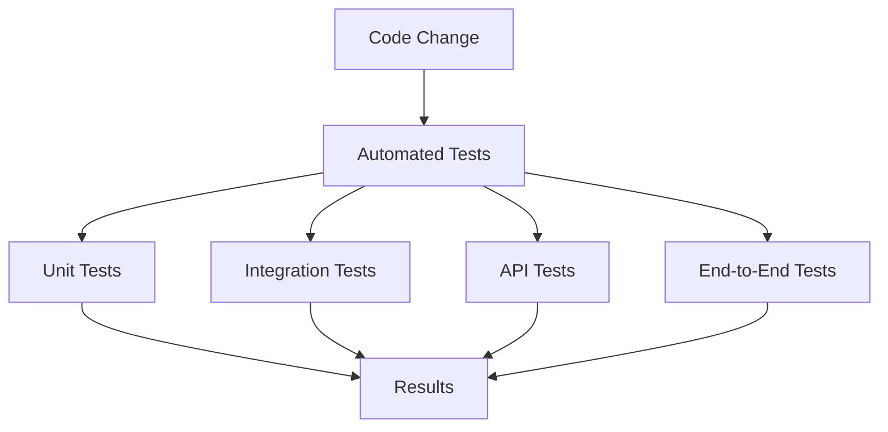

Testing is not only about finding bugs after development.

It also helps developers:

- Design clearer interfaces
- Refactor safely
- Document expected behavior
- Detect regressions
- Improve confidence during deployment
- Understand edge cases
- Verify security boundaries

---

# 1. What Is a Test?

A test is a repeatable check of expected behavior.

A simple test asks:

```text
Given this input,
when this operation runs,
then this result should occur.
```

This is often called the **Arrange, Act, Assert** pattern.

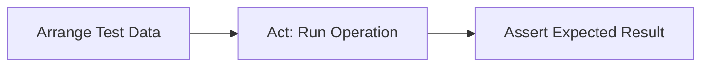

Example:

```javascript
const result = calculateTotal([
  { price: 10, quantity: 2 },
  { price: 5, quantity: 3 }
]);

expect(result).toBe(35);
```

Breakdown:

```text
Arrange:
  Provide product items.

Act:
  Call calculateTotal.

Assert:
  Result equals 35.
```

---

# 2. Why Testing Matters

Without tests, every code change may require manually checking many parts of the application.

Testing provides:

```text
Repeatability
Speed
Regression protection
Documentation
Confidence
```

Suppose you fix a login bug.

Without tests, you may manually check:

```text
Valid login
Invalid password
Unknown user
Expired session
Logout
Protected page
```

With tests, these cases can be rerun automatically.

---

# 3. Testing Is Not Proof of Perfection

Passing tests do not prove an application has no bugs.

Tests only prove that the tested scenarios behaved as expected.

A system can still fail because:

- Important cases were not tested
- Requirements were misunderstood
- Tests contain incorrect expectations
- Production differs from test environments
- External services behave differently
- Concurrency creates unexpected behavior
- Security flaws were not considered

Testing reduces risk; it does not eliminate uncertainty.

---

# 4. Test Pyramid

A common testing model is the test pyramid.

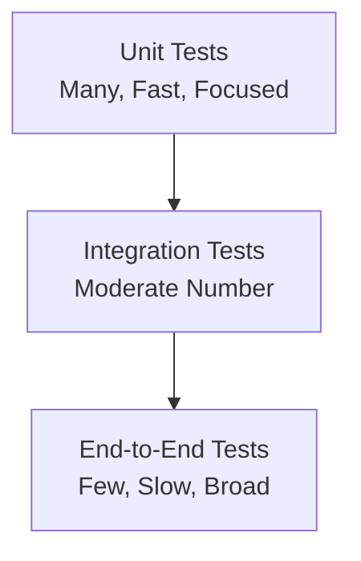

## Unit tests

Test small pieces of code in isolation.

## Integration tests

Test multiple components working together.

## End-to-end tests

Test complete user workflows.

The lower levels are generally:

```text
Faster
Cheaper
More numerous
More focused
```

The higher levels are generally:

```text
Slower
More expensive
More fragile
More realistic
```

---

# 5. Unit Tests

A unit test checks a small unit of behavior.

A unit might be:

- Function
- Class
- Validator
- Formatter
- Reducer
- Calculation
- Parser

Example function:

```javascript
function calculateTotal(items) {
  return items.reduce(
    (total, item) => total + item.price * item.quantity,
    0
  );
}
```

Test:

```javascript
test("calculates order total", () => {
  const items = [
    { price: 10, quantity: 2 },
    { price: 5, quantity: 3 }
  ];

  expect(calculateTotal(items)).toBe(35);
});
```

---

# 6. Good Unit Tests

A good unit test is generally:

```text
Small
Fast
Focused
Deterministic
Easy to understand
Independent
```

A unit test should not usually require:

- Real network requests
- Production database
- External payment provider
- Real email delivery
- Browser automation

Those belong in other testing layers.

---

# 7. Unit Test Cases

For a quantity validator:

```javascript
function validateQuantity(quantity) {
  if (!Number.isInteger(quantity)) {
    return "Quantity must be an integer.";
  }

  if (quantity <= 0) {
    return "Quantity must be greater than zero.";
  }

  return null;
}
```

Test cases:

```javascript
test("accepts positive integer", () => {
  expect(validateQuantity(2)).toBe(null);
});

test("rejects zero", () => {
  expect(validateQuantity(0)).toBe(
    "Quantity must be greater than zero."
  );
});

test("rejects negative values", () => {
  expect(validateQuantity(-1)).toBe(
    "Quantity must be greater than zero."
  );
});

test("rejects decimal values", () => {
  expect(validateQuantity(1.5)).toBe(
    "Quantity must be an integer."
  );
});

test("rejects strings", () => {
  expect(validateQuantity("2")).toBe(
    "Quantity must be an integer."
  );
});
```

---

# 8. Edge Cases

An edge case is a less common input or condition that may reveal a bug.

Examples:

```text
Empty array
Zero
Negative value
Very large value
Missing field
Null
Whitespace
Unicode text
Duplicate record
Boundary date
```

For `calculateTotal`, test:

```javascript
test("empty cart total is zero", () => {
  expect(calculateTotal([])).toBe(0);
});
```

Also consider:

```text
Negative price
Decimal quantity
Missing price
Very large quantity
```

---

# 9. Arrange, Act, Assert

Example:

```javascript
test("formats a product label", () => {
  // Arrange
  const product = {
    name: "Keyboard",
    price: 79.99
  };

  // Act
  const result = formatProductLabel(product);

  // Assert
  expect(result).toBe("Keyboard - $79.99");
});
```

This structure makes tests easier to read.

---

# 10. Assertions

An assertion checks an expected condition.

Common assertions include:

```javascript
expect(value).toBe(expected);
expect(value).toEqual(expectedObject);
expect(value).toBeTruthy();
expect(value).toBeFalsy();
expect(array).toContain(item);
expect(fn).toThrow();
```

Examples:

```javascript
expect(status).toBe("success");
expect(user.id).toBe(42);
expect(items).toHaveLength(3);
expect(response.status).toBe(201);
```

The exact syntax differs by test framework.

---

# 11. Testing Errors

Errors are part of expected application behavior.

```javascript
function parseQuantity(value) {
  const quantity = Number(value);

  if (!Number.isInteger(quantity) || quantity <= 0) {
    throw new Error("Invalid quantity");
  }

  return quantity;
}
```

Test:

```javascript
test("throws for invalid quantity", () => {
  expect(() => parseQuantity("abc"))
    .toThrow("Invalid quantity");
});
```

Test both:

```text
What happens when input is valid?
What happens when input is invalid?
```

---

# 12. Integration Tests

Integration tests check multiple components working together.

Examples:

```text
Backend route + validation + database
API + authentication middleware
Service + queue
Application + file storage
Frontend component + API mock
```

A database integration test might:

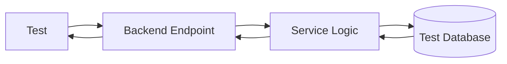

Integration tests are more realistic than unit tests but usually slower.

---

# 13. API Tests

An API test sends an HTTP request and checks the response.

Example:

```javascript
test("creates an order", async () => {
  const response = await request(app)
    .post("/api/orders")
    .send({
      items: [
        {
          productId: 123,
          quantity: 2
        }
      ]
    });

  expect(response.status).toBe(201);
  expect(response.body.status).toBe("pending");
});
```

Test:

```text
Status code
Response headers
Response body
Database changes
Authentication
Authorization
Validation
```

---

# 14. API Test Categories

## Successful requests

```text
Valid input
Valid credentials
Existing resources
Allowed permissions
```

## Invalid requests

```text
Malformed JSON
Missing field
Wrong type
Invalid range
Unsupported method
```

## Security requests

```text
No credentials
Invalid token
Expired token
Wrong user
Insufficient role
```

## State conflicts

```text
Duplicate record
Inventory unavailable
Concurrent update
Invalid status transition
```

## Dependency failures

```text
Database unavailable
Payment service timeout
Email service failure
Storage error
```

---

# 15. Integration Tests with a Database

Use a dedicated test database.

Do not run destructive tests against production.

A typical flow:

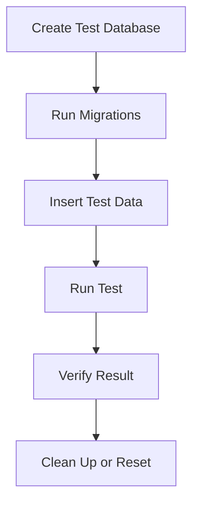

Test data should be:

```text
Predictable
Isolated
Synthetic
Repeatable
Safe to delete
```

---

# 16. Test Isolation

Tests should not depend on the order in which they run.

Bad:

```text
Test B assumes Test A created user 42.
```

Better:

```text
Test B creates its own user 42 or a unique test user.
```

Isolation prevents:

- Random failures
- Order-dependent behavior
- Data contamination
- Difficult debugging

---

# 17. Fixtures

A fixture is predefined test data.

Example:

```javascript
const productFixture = {
  id: 123,
  name: "Keyboard",
  price: 79.99,
  available: true
};
```

Fixtures are useful, but overly shared fixtures can create hidden dependencies.

Keep fixtures:

```text
Small
Relevant
Easy to understand
Safe to modify
```

---

# 18. Factories

A factory creates test data programmatically.

```javascript
function createProduct(overrides = {}) {
  return {
    id: 123,
    name: "Keyboard",
    price: 79.99,
    available: true,
    ...overrides
  };
}
```

Use:

```javascript
const unavailable = createProduct({
  available: false
});
```

Factories make tests flexible without duplicating large objects.

---

# 19. Mocks, Stubs, and Fakes

These terms describe test substitutes.

## Mock

A test double that verifies how it was called.

Example:

```text
Was sendEmail called once?
Was it called with the correct address?
```

## Stub

A substitute that returns predefined data.

```text
Payment provider returns approved.
```

## Fake

A working simplified implementation.

```text
In-memory database instead of real database.
```

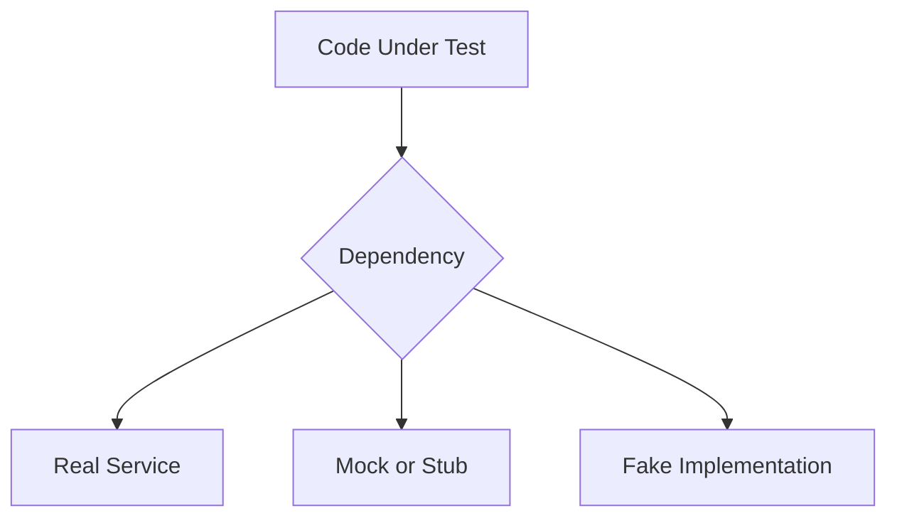

---

# 20. When to Mock

Mock external systems when:

- They are slow
- They cost money
- They are unreliable
- They require special credentials
- They are unavailable in local tests
- You need deterministic behavior
- You want to simulate failures

Examples:

```text
Payment provider
Email service
SMS provider
External weather API
Cloud storage
```

Do not mock everything.

If you mock too much, tests may pass while real integrations are broken.

---

# 21. Mocking a Payment Provider

Production code may call:

```javascript
await paymentProvider.charge({
  amount: 7999,
  currency: "USD"
});
```

A test can replace it:

```javascript
const paymentProvider = {
  charge: async () => ({
    status: "approved",
    transactionId: "test_tx_123"
  })
};
```

Test failure behavior too:

```javascript
const paymentProvider = {
  charge: async () => {
    throw new Error("Provider unavailable");
  }
};
```

The application should respond predictably.

---

# 22. Contract Tests

Contract tests verify that two systems agree on an API.

A contract may specify:

```text
GET /products
  returns 200
  Content-Type application/json
  body.items is an array
  each item has id and name
```

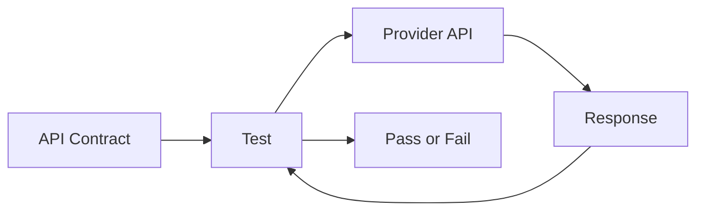

Contract tests are useful when:

- Frontend and backend are developed separately
- Multiple teams share an API
- Mobile clients depend on stable responses
- Services communicate across deployments

---

# 23. End-to-End Tests

End-to-end tests simulate a complete user journey.

Example:

```text
Open application
Log in
Search for product
Add product to cart
Open checkout
Submit order
Verify confirmation
```

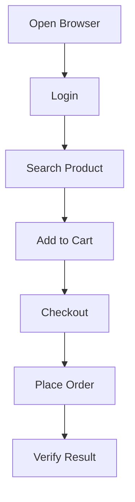

End-to-end tests are realistic but can be:

- Slow
- Fragile
- Expensive
- Sensitive to environment state
- Difficult to debug

Use them for important workflows rather than every tiny detail.

---

# 24. Smoke Tests

A smoke test is a quick check that the system is basically alive.

Examples:

```text
Homepage returns 200.
Health endpoint returns healthy.
Login page loads.
API returns a product.
Database connection works.
```

Run smoke tests:

- After deployment
- Before traffic is shifted
- During monitoring
- In staging
- In production health checks

---

# 25. Regression Tests

A regression test prevents a previously fixed bug from returning.

Suppose a bug occurred because:

```text
Expired sessions were treated as authenticated.
```

After fixing it, add a test:

```javascript
test("expired session is rejected", async () => {
  const response = await request(app)
    .get("/api/account")
    .set("Cookie", expiredCookie);

  expect(response.status).toBe(401);
});
```

A regression test preserves the lesson learned from the bug.

---

# 26. Testing Authentication

Test:

```text
Valid credentials
Invalid password
Unknown user
Missing credentials
Expired token
Malformed token
Revoked session
Logout
Password reset
MFA failure
```

Example:

```javascript
test("unauthenticated user cannot access account", async () => {
  const response = await request(app)
    .get("/api/account");

  expect(response.status).toBe(401);
});
```

---

# 27. Testing Authorization

Test resource ownership.

```javascript
test("user cannot access another user's order", async () => {
  const response = await request(app)
    .get("/api/orders/9002")
    .set("Authorization", "Bearer USER_A_TOKEN");

  expect([403, 404]).toContain(response.status);
});
```

Test both:

```text
Allowed access
Denied access
```

Authorization tests are among the most important security tests in a web application.

---

# 28. Testing Validation

Test invalid values:

```javascript
test("rejects negative quantity", async () => {
  const response = await request(app)
    .post("/api/orders")
    .send({
      items: [
        {
          productId: 123,
          quantity: -1
        }
      ]
    });

  expect(response.status).toBe(422);
});
```

Test:

```text
Missing fields
Wrong types
Empty values
Large values
Unknown fields
Malformed JSON
Invalid relationships
```

---

# 29. Testing Database Changes

After a database operation, verify the actual data.

Example:

```text
1. Send POST /orders.
2. Assert response is 201.
3. Query test database.
4. Confirm order exists.
5. Confirm inventory changed.
6. Confirm audit record exists.
```

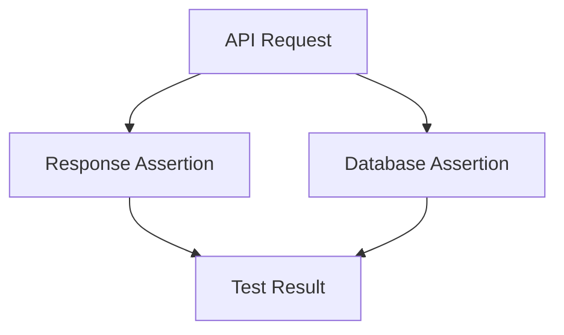

A successful response alone may not prove that the correct data was stored.

---

# 30. Testing Transactions

Test failure between steps.

Suppose order creation requires:

```text
Create order
Reserve inventory
Record payment
```

Simulate a payment failure.

Verify:

```text
Order is not incorrectly marked paid.
Inventory is restored or remains correct.
Partial records are handled safely.
```

Transactions and compensation logic should be tested explicitly.

---

# 31. Testing Asynchronous Jobs

For a background email:

```text
1. Trigger order creation.
2. Assert confirmation job was queued.
3. Process the worker.
4. Assert email provider was called.
5. Simulate provider failure.
6. Assert retry or dead-letter behavior.
```

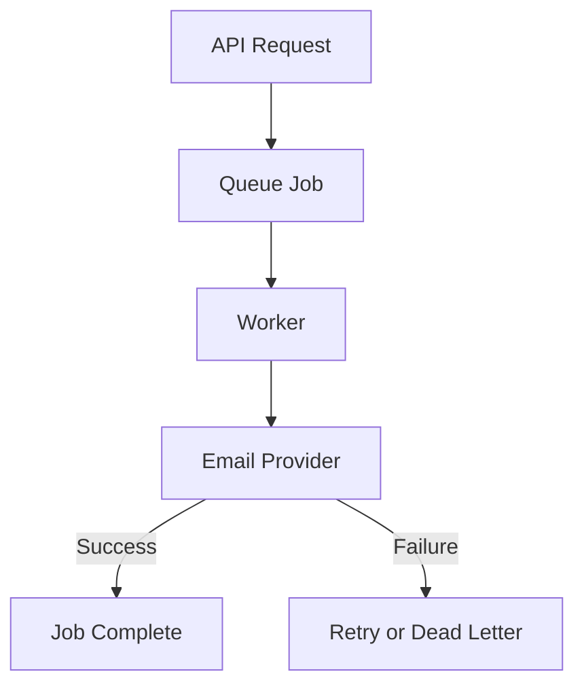

---

# 32. Testing Webhooks

Test:

```text
Valid signature
Invalid signature
Missing signature
Duplicate event
Unknown event
Malformed payload
Old timestamp
Out-of-order event
```

Webhook handlers should usually be idempotent.

A repeated event should not:

```text
Charge twice
Create two orders
Send duplicate notifications
Apply a state transition twice
```

---

# 33. Testing Time and Dates

Date-related tests can become unstable if they depend on the current clock.

Use a controlled clock where possible.

Test:

```text
Expiration boundary
Time-zone conversion
Daylight-saving transition
Date-only values
Month boundaries
Year boundaries
Leap years
```

Avoid tests that fail because the system clock moved by a second.

---

# 34. Testing File Uploads

Test:

```text
Valid file
Empty file
Too-large file
Wrong extension
Wrong content type
Corrupted file
Malicious file
Duplicate file
Unauthorized upload
```

Verify:

```text
File storage
Metadata
Access control
Response URL
Cleanup after failure
```

---

# 35. Testing Performance

Performance tests should measure:

```text
Throughput
Latency
P50
P95
P99
Error rate
Resource usage
Database load
Queue depth
```

Do not perform large load tests against production without explicit permission.

Use:

- Dedicated environments
- Synthetic data
- Test accounts
- Mocked external services
- Controlled traffic
- Cleanup procedures

---

# 36. Testing Under Failure

Failure tests simulate:

```text
Database unavailable
Payment timeout
Email failure
Network interruption
Expired credentials
Malformed external response
Full disk
Queue outage
Cache unavailable
```

The goal is to verify:

```text
Safe failure
Useful errors
Correct rollback
Bounded retries
No data corruption
No secret exposure
Recovery behavior
```

---

# 37. Test Determinism

A deterministic test produces the same result under the same conditions.

Avoid relying on:

- Random timing
- Real external APIs
- Shared mutable data
- Current time without control
- Network availability
- Test execution order
- Unstable selectors
- Production data

If randomness is needed, seed it or record the seed.

---

# 38. Flaky Tests

A flaky test sometimes passes and sometimes fails without a relevant code change.

Common causes:

- Race conditions
- Timing assumptions
- Shared test state
- Slow environments
- Uncontrolled network
- Asynchronous cleanup
- Random data collisions
- Browser animations
- Unstable selectors

Flaky tests are dangerous because teams may begin ignoring failures.

Investigate and fix them rather than accepting them as normal.

---

# 39. Test Selectors

For browser tests, prefer stable selectors.

Better:

```html
<button data-testid="submit-order">
  Submit order
</button>
```

Better still where possible:

```javascript
getByRole("button", { name: "Submit order" })
```

Avoid selectors based on:

```text
Generated class names
Deep CSS paths
DOM position
Unstable IDs
Visual layout
```

Accessibility-oriented selectors often produce more realistic tests.

---

# 40. Test Environments

A test environment should be:

```text
Isolated
Repeatable
Safe
Resettable
Observable
```

Avoid:

```text
Real customer data
Real payment charges
Real email delivery
Production credentials
Uncontrolled shared state
```

Use test doubles or sandbox providers for external systems.

---

# 41. Continuous Integration

CI runs tests automatically when code changes.

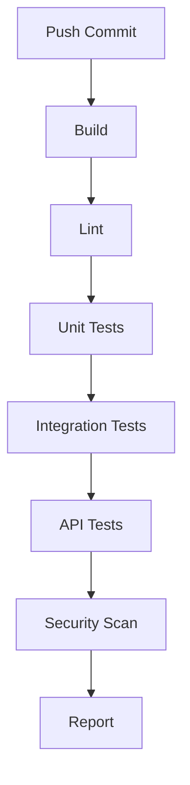

A CI pipeline should fail clearly when:

- Tests fail
- Build fails
- Types fail
- Security scan detects a problem
- Migration validation fails
- Formatting rules fail

---

# 42. Test Coverage

Coverage measures which code was executed by tests.

Types include:

```text
Line coverage
Branch coverage
Function coverage
Statement coverage
```

High coverage does not automatically mean high quality.

A test may execute a line without checking meaningful behavior.

Use coverage as a signal, not as the only quality metric.

---

# 43. What to Test First

Prioritize:

```text
Authentication
Authorization
Payments
Orders
Data deletion
Money calculations
Security boundaries
Core user workflows
Database migrations
External integrations
```

A small function with low business importance may need less testing than a short function that controls access to private data.

---

# 44. Testing Exercise 1 — Unit Test

Write:

```javascript
function isEligibleForDiscount(user, orderTotal) {
  return user.isMember && orderTotal >= 100;
}
```

Test:

```javascript
test("member with qualifying order gets discount", () => {
  expect(
    isEligibleForDiscount(
      { isMember: true },
      150
    )
  ).toBe(true);
});
```

Also test:

```text
Non-member
Order total exactly 100
Order total below 100
Missing membership field
```

---

# 45. Testing Exercise 2 — API Test Plan

For:

```http
POST /api/orders
```

Create tests for:

```text
Valid order → 201
Missing items → 422
Empty items → 422
Negative quantity → 422
Unauthenticated → 401
Unauthorized product → 403 or appropriate response
Out-of-stock item → 409
Payment unavailable → 503 or async response
Duplicate idempotency key → same original result
```

---

# 46. Testing Exercise 3 — End-to-End Workflow

Define a user workflow:

```text
1. Open product catalog.
2. Search for keyboard.
3. Open product.
4. Add it to cart.
5. Log in.
6. Submit order.
7. Verify confirmation.
```

For each step, record:

```text
Action
Expected screen
Expected network request
Expected status
Expected data change
```

---

# 47. Testing Checklist

```text
[ ] Core business functions have unit tests.
[ ] Input validation has tests.
[ ] Error paths have tests.
[ ] Authentication is tested.
[ ] Authorization is tested.
[ ] API endpoints are tested.
[ ] Database operations are tested.
[ ] Transactions are tested.
[ ] External services are mocked or sandboxed.
[ ] Webhooks are tested.
[ ] Background jobs are tested.
[ ] Important workflows have end-to-end tests.
[ ] Tests are isolated.
[ ] Tests are deterministic.
[ ] CI runs tests.
[ ] Failures are visible.
[ ] Regression tests are added for fixed bugs.
[ ] Secrets and production data are excluded.
```

---

# 48. Final Testing Mental Model

Testing exists at multiple layers:

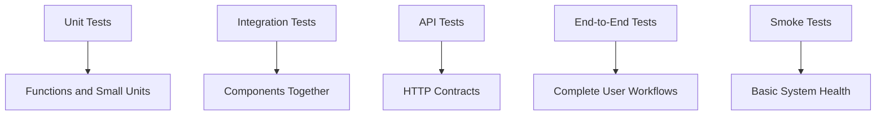

A good testing strategy does not attempt to test everything in one giant browser test.

Instead, it uses:

```text
Many fast unit tests
A useful number of integration and API tests
A smaller number of important end-to-end tests
Smoke tests for deployment verification
```

The most important lesson is:

> A test is valuable when it checks meaningful behavior, fails clearly when that behavior breaks, and gives the team confidence to change the system safely.
