# Foundation Primers

# Primer 11 — Linux and Server Basics for Web Learners  
## Filesystems, Users, Processes, Services, Networking, Logs, Permissions, and Remote Servers

---

# Primer Overview

Many web applications eventually run on Linux-based servers.

Even when you use a managed cloud platform, serverless provider, container platform, or hosting dashboard, Linux concepts often remain underneath the abstraction.

Understanding basic Linux and server behavior helps you answer questions such as:

- Where is the application running?
- Which process is listening on a port?
- Which user owns a file?
- Why can the application not read a configuration file?
- Why is the disk full?
- Why did a service stop?
- Where are the logs?
- How do I connect to a remote server?
- What is a reverse proxy?
- Why does a process work manually but fail as a service?
- How do environment variables reach the application?
- What happens when the server restarts?

A simplified server view is:

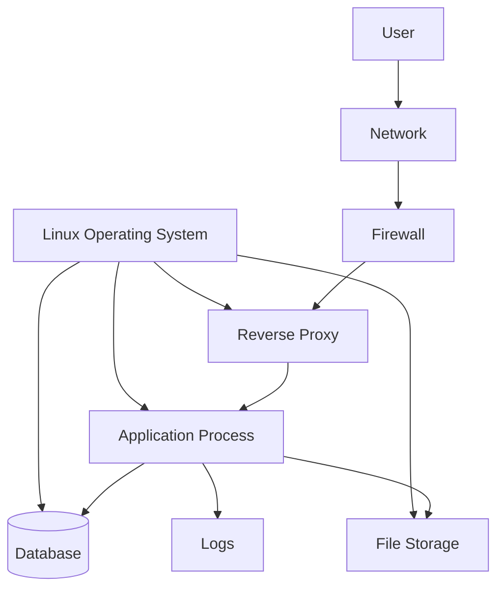

This primer introduces the fundamentals without assuming prior Linux experience.

You will learn:

- What Linux is
- How Linux filesystems are organized
- Users and groups
- Permissions
- Processes
- Services
- Ports
- System logs
- Environment variables
- SSH
- Reverse proxies
- Firewalls
- Disk and memory inspection
- Application deployment concepts
- Safe server administration habits

---

# 1. What Is Linux?

Linux is an operating-system kernel.

In everyday conversation, “Linux” often refers to a complete operating-system distribution built around the Linux kernel.

Examples of distributions include:

```text
Ubuntu
Debian
Fedora
Rocky Linux
AlmaLinux
Arch Linux
Amazon Linux
```

A Linux server commonly provides:

```text
Process management
Filesystem management
Networking
Users and permissions
Service management
Logging
Security controls
```

---

# 2. Linux Server Architecture

A Linux system can be viewed in layers:

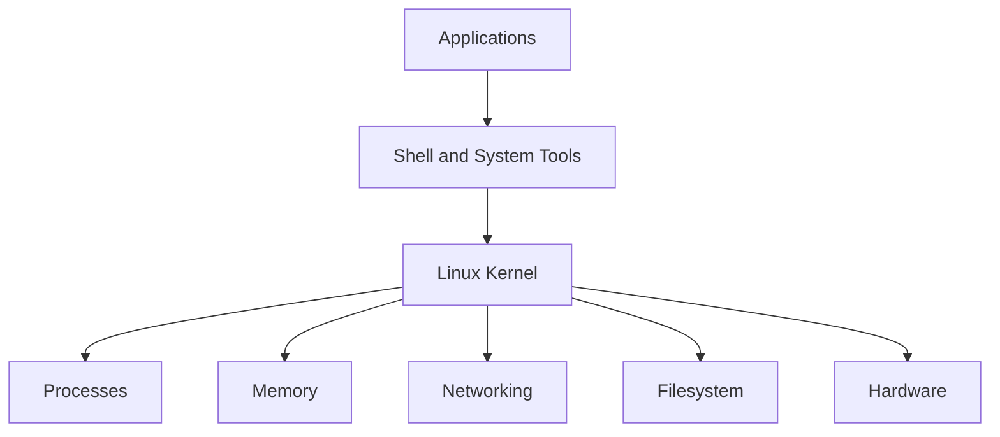

## Kernel

The core of the operating system.

It manages:

- CPU scheduling
- Memory
- Processes
- Devices
- Filesystems
- Networking

## Shell and tools

Provide commands used by administrators and developers.

## Applications

Examples:

- Web server
- Database
- API
- Worker
- Monitoring agent

---

# 3. The Linux Filesystem

Linux organizes files into one directory tree beginning at:

```text
/
```

This is called the root directory.

A simplified structure:

```text
/
├── bin
├── boot
├── dev
├── etc
├── home
├── opt
├── proc
├── root
├── run
├── srv
├── tmp
├── usr
└── var
```

Unlike Windows, Linux does not normally organize each disk as a separate drive letter such as `C:`.

Storage devices are mounted into this tree.

---

# 4. Common Linux Directories

## `/`

The filesystem root.

## `/home`

User home directories.

Example:

```text
/home/alex
```

## `/root`

The home directory of the administrative root user.

This is different from `/`.

## `/etc`

System and application configuration.

Examples:

```text
/etc/hosts
/etc/ssh/
/etc/nginx/
/etc/systemd/
```

## `/var`

Frequently changing data.

Examples:

```text
/var/log
/var/lib
/var/cache
```

## `/tmp`

Temporary files.

Do not assume files in `/tmp` persist permanently.

## `/usr`

Installed programs, libraries, and shared resources.

## `/opt`

Optional or separately installed software.

## `/srv`

Data served by system services in some conventions.

## `/proc`

Virtual filesystem exposing process and kernel information.

## `/dev`

Device files representing hardware and virtual devices.

---

# 5. Absolute and Relative Paths

Absolute path:

```text
/etc/nginx/nginx.conf
```

Relative path:

```text
config/nginx.conf
```

An absolute path begins at:

```text
/
```

A relative path is interpreted from the current directory.

Check current directory:

```bash
pwd
```

Change directory:

```bash
cd /var/log
```

Return to home:

```bash
cd ~
```

Return to parent:

```bash
cd ..
```

---

# 6. Users and Groups

Linux uses users and groups to control access.

A process runs as a user.

A file belongs to:

```text
Owner
Group
Other users
```

Example users on a web server:

```text
root
www-data
nginx
postgres
deploy
```

A web server should usually not run as the full administrative user.

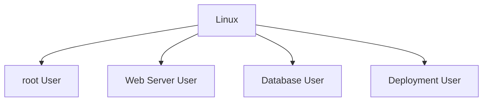

Each service should receive only the access it needs.

---

# 7. The Root User

The root user has extensive administrative privileges.

Root can usually:

- Read or modify most files
- Start and stop services
- Change permissions
- Install packages
- Change network configuration
- Delete system data

Because root has so much authority, mistakes can be severe.

A safer practice is:

```text
Use a normal user.
Use sudo only for specific administrative commands.
```

---

# 8. `sudo`

`sudo` runs a command with elevated privileges.

Example:

```bash
sudo systemctl restart nginx
```

The command runs with administrative authority.

Use `sudo` carefully.

Before running it, ask:

```text
What does this command do?
Which files will it affect?
Could it delete data?
Is the target correct?
```

Avoid using:

```bash
sudo
```

as a way to “make errors disappear.”

Permission errors often indicate that ownership or deployment design needs correction.

---

# 9. File Permissions

Linux file permissions commonly include:

```text
Read
Write
Execute
```

They apply to:

```text
Owner
Group
Others
```

Example listing:

```text
-rwxr-xr--
```

Breakdown:

```text
-       Regular file
rwx     Owner permissions
r-x     Group permissions
r--     Other-user permissions
```

For a directory, execute permission generally means the ability to enter or traverse it.

---

# 10. Numeric Permissions

Permissions can also be represented numerically:

```text
Read    = 4
Write   = 2
Execute = 1
```

Common values:

```text
7 = read + write + execute
6 = read + write
5 = read + execute
4 = read only
0 = no permissions
```

Example:

```bash
chmod 640 config.txt
```

Means:

```text
Owner: 6 = read and write
Group: 4 = read
Others: 0 = no access
```

Another example:

```bash
chmod 755 script.sh
```

Means:

```text
Owner: read, write, execute
Group: read, execute
Others: read, execute
```

Avoid using overly broad permissions such as:

```bash
chmod 777
```

This grants everyone read, write, and execute access and is usually unsafe.

---

# 11. `chown` and Ownership

Change file ownership:

```bash
sudo chown deploy:deploy app
```

Change ownership recursively:

```bash
sudo chown -R deploy:deploy /srv/my-app
```

Be careful with recursive ownership changes.

Changing ownership of system directories accidentally can break the operating system.

---

# 12. Application File Permissions

A typical application may need:

```text
Application source:
  Readable by application user

Configuration:
  Readable by application user, not everyone

Uploads:
  Writable by application user

Logs:
  Writable by logging process

Secrets:
  Restricted to the necessary user
```

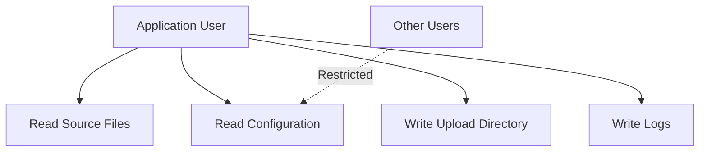

Do not make the entire application directory writable if only one upload directory needs write access.

---

# 13. Processes

A process is a running program.

Examples:

```text
nginx
node
python
postgres
redis-server
worker
```

Inspect processes:

```bash
ps aux
```

Find a process:

```bash
ps aux | grep nginx
```

A process usually has:

```text
Process ID
Owner
CPU usage
Memory usage
Command
Start time
```

---

# 14. Process IDs

Every running process receives a process ID, or PID.

Example:

```text
PID  COMMAND
1234 node server.js
```

Use a PID to inspect or stop a process:

```bash
kill 1234
```

A process ID may change when the application restarts.

Do not assume a PID remains permanent.

---

# 15. Process States

A process may be:

```text
Running
Sleeping
Waiting
Stopped
Zombie
Terminated
```

Most application processes spend time waiting for:

- Network data
- Database results
- File operations
- Timers
- User requests

High CPU usage may indicate:

- Infinite loop
- Expensive computation
- Traffic spike
- Inefficient code
- Attack or abuse
- Misconfiguration

---

# 16. Process Monitoring

Useful commands:

```bash
top
```

or:

```bash
htop
```

These show:

```text
CPU usage
Memory usage
Process list
Load average
```

Other tools:

```bash
free -h
uptime
vmstat
```

Use monitoring tools to identify resource pressure rather than guessing.

---

# 17. Services

A service is a long-running process managed by the operating system.

Examples:

```text
Web server
Database
Cache
Queue worker
Monitoring agent
SSH server
```

On many Linux distributions, services are managed using `systemd`.

Common commands:

```bash
systemctl status nginx
systemctl start nginx
systemctl stop nginx
systemctl restart nginx
systemctl enable nginx
```

---

# 18. Service Lifecycle

A service may be:

```text
Installed
Stopped
Starting
Running
Failed
Restarting
Disabled
Enabled at boot
```

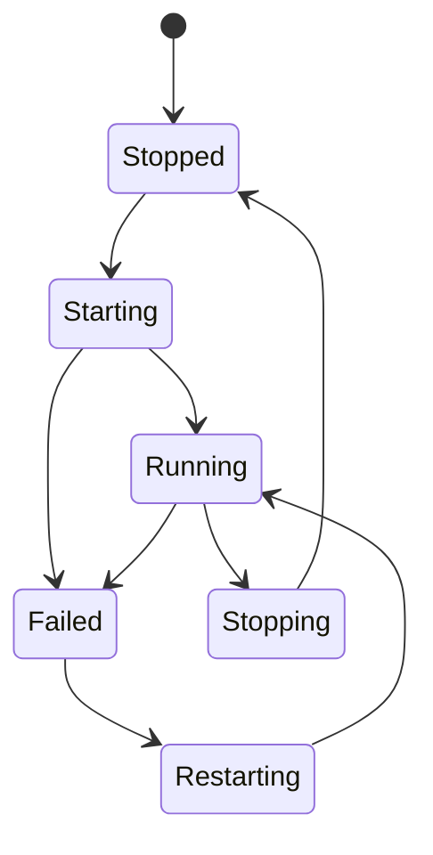

Check status first:

```bash
systemctl status my-app
```

Then inspect logs if it failed.

---

# 19. Service Configuration

A service definition may specify:

```text
Executable command
Working directory
User
Environment variables
Restart behavior
Dependencies
Network behavior
```

Conceptually:

```text
Application:
  /srv/my-app/server.js

User:
  appuser

Working directory:
  /srv/my-app

Environment:
  NODE_ENV=production
  PORT=4000
```

A service may work manually but fail under systemd because:

- The working directory differs
- `PATH` differs
- Environment variables are missing
- Permissions differ
- Relative paths resolve differently
- The service user lacks access

---

# 20. System Logs

Linux systems commonly use system logs.

On systemd-based systems:

```bash
journalctl
```

View logs for a service:

```bash
journalctl -u nginx
```

Follow logs:

```bash
journalctl -u my-app -f
```

Show recent logs:

```bash
journalctl -u my-app --since "10 minutes ago"
```

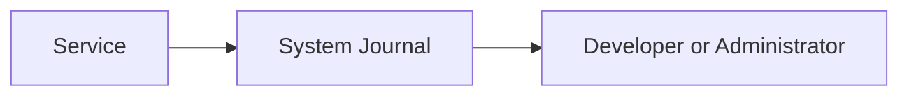

Application logs may also be written to:

```text
/var/log
```

---

# 21. Log Levels

Common log levels:

```text
DEBUG
INFO
WARN
ERROR
FATAL
```

Use appropriate levels.

Production systems should avoid:

- Logging secrets
- Logging full request bodies unnecessarily
- Logging sensitive personal data
- Excessive debug output
- Unstructured messages without context

Useful fields include:

```text
Timestamp
Request ID
Service
Method
Path
Status
Duration
Error code
```

---

# 22. Ports and Listening Services

A server may listen on:

```text
80    HTTP
443   HTTPS
22    SSH
3000  Development application
4000  Backend API
5432  PostgreSQL
```

Inspect listening ports:

```bash
ss -ltnp
```

Or:

```bash
sudo lsof -i -P -n
```

Example conceptually:

```text
0.0.0.0:443
127.0.0.1:4000
127.0.0.1:5432
```

Interpretation:

```text
443:
  Public HTTPS listener

4000:
  Backend accessible only locally

5432:
  Database accessible only locally
```

Binding internal services to localhost reduces public exposure.

---

# 23. Firewalls

A firewall controls which network traffic is allowed.

Rules may specify:

```text
Source
Destination
Port
Protocol
Direction
Network interface
```

A typical web server may allow:

```text
TCP 22   SSH, restricted by source
TCP 80   HTTP
TCP 443  HTTPS
```

It may block public access to:

```text
Database ports
Internal API ports
Cache ports
Administrative services
```

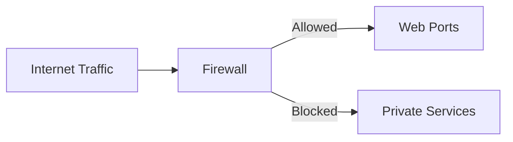

---

# 24. SSH

SSH stands for **Secure Shell**.

It allows remote command-line access to a server.

Basic command:

```bash
ssh username@example.com
```

With a specific key:

```bash
ssh -i ~/.ssh/my-server-key username@example.com
```

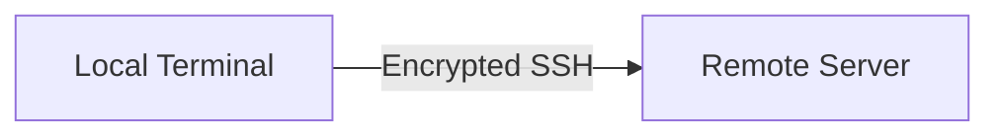

SSH can be used to:

- Inspect files
- View logs
- Restart services
- Run deployments
- Check processes
- Debug network behavior

Protect private SSH keys carefully.

---

# 25. SSH Keys

SSH key authentication commonly uses:

```text
Private key:
  Kept on your device

Public key:
  Stored on the server
```

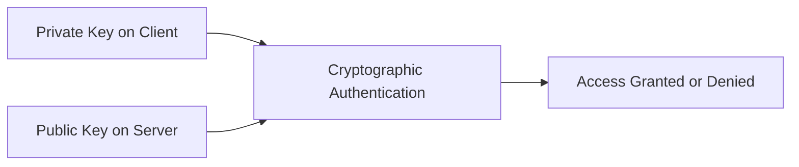

Never share the private key.

A private key should have restrictive permissions:

```bash
chmod 600 ~/.ssh/my-server-key
```

---

# 26. SSH Configuration

You can simplify connections with `~/.ssh/config`.

Example:

```text
Host my-server
  HostName example.com
  User deploy
  IdentityFile ~/.ssh/my-server-key
```

Then connect:

```bash
ssh my-server
```

This avoids repeatedly typing long commands.

Do not store passwords or sensitive credentials carelessly in configuration files.

---

# 27. Secure Copy

Copy a file to a remote server:

```bash
scp app.tar.gz deploy@example.com:/tmp/
```

Copy from the server:

```bash
scp deploy@example.com:/var/log/my-app.log .
```

For larger deployments, teams often use:

- rsync
- Container registries
- CI/CD systems
- Artifact storage
- Cloud deployment tools

---

# 28. Reverse Proxies

A reverse proxy receives public traffic and forwards it to application processes.


Common reverse proxies include:

```text
Nginx
Apache
Caddy
Traefik
Cloud load balancers
```

A reverse proxy may provide:

- HTTPS termination
- Routing
- Static file serving
- Compression
- Caching
- Rate limiting
- Load balancing
- Access logging

---

# 29. Why Use a Reverse Proxy?

Suppose your application listens on:

```text
127.0.0.1:4000
```

The reverse proxy listens publicly on:

```text
0.0.0.0:443
```

The proxy:

1. Accepts HTTPS.
2. Validates or terminates TLS.
3. Routes requests.
4. Forwards them to the application.
5. Returns the application response.

This keeps the application process private while exposing a controlled public entry point.

---

# 30. Static Files and Reverse Proxies

A reverse proxy can serve static assets directly:

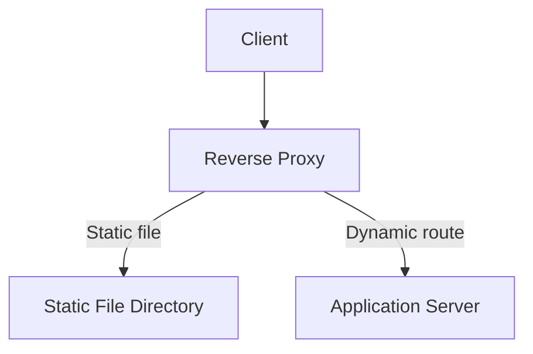

Example routing:

```text
/assets/app.js
  → Serve directly

/api/products
  → Forward to backend

/
  → Serve frontend application
```

This can reduce application-server workload.

---

# 31. HTTPS Termination

TLS may terminate at:

```text
CDN
Load balancer
Reverse proxy
Application server
```

Example:

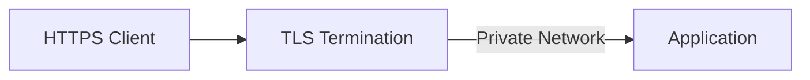

If TLS terminates at the proxy, configure the application to understand the original protocol through trusted proxy headers.

Misconfiguration can cause:

- Redirect loops
- Insecure cookies
- Incorrect absolute URLs
- Mixed-content errors

---

# 32. Application Servers

An application server runs backend code.

Examples:

```text
Node.js process
Python Gunicorn process
Java application
Go binary
.NET application
Ruby application
```

It may listen on an internal port:

```text
127.0.0.1:4000
```

The reverse proxy forwards requests there.

An application server should generally:

- Validate input
- Authenticate
- Authorize
- Apply business logic
- Access data
- Return responses
- Log meaningful events

---

# 33. Environment Variables in Services

A service may need environment variables:

```text
DATABASE_URL
PORT
NODE_ENV
API_SECRET
STORAGE_BUCKET
```

A process started through a service manager may not receive the same environment as your interactive shell.

This explains:

```text
Works when run manually
Fails when run as a service
```

Inspect the service configuration and environment.

Never print secrets while debugging.

---

# 34. Disk Usage

A full disk can cause:

```text
Database failure
Log failure
Application crash
Deployment failure
Temporary-file failure
```

Check disk usage:

```bash
df -h
```

Find large directories:

```bash
du -sh /*
```

Inspect a specific directory:

```bash
du -sh /var/log/*
```

Log rotation and retention are important.

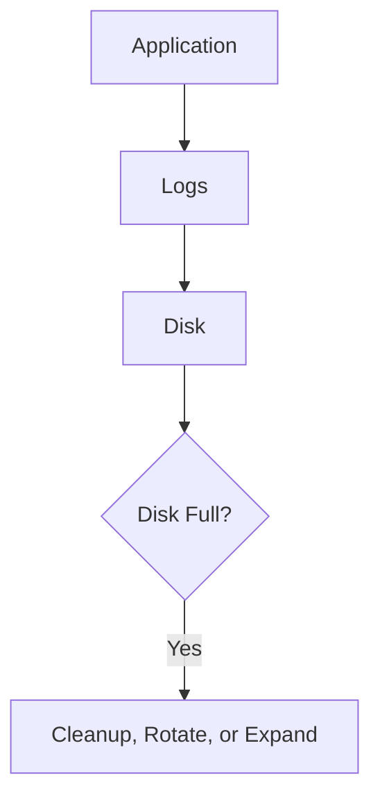

Do not delete files randomly from system directories. Identify what is safe to remove.

---

# 35. Memory Usage

Inspect memory:

```bash
free -h
```

Monitor processes:

```bash
top
```

High memory use may result from:

- Memory leak
- Large cache
- Too many workers
- Large request payloads
- Unbounded queue
- Database workload
- Traffic spike

A process killed by the operating system may leave evidence in system logs.

---

# 36. CPU Usage

High CPU may result from:

```text
Infinite loop
Expensive calculation
Traffic spike
Compression workload
Cryptographic work
Poor query processing
Malicious traffic
```

Use:

```bash
top
```

or:

```bash
htop
```

Identify:

```text
Which process is using CPU?
Is the usage sustained?
Did it begin after deployment?
Is traffic elevated?
```

---

# 37. File Descriptors

Operating systems limit the number of files and network connections a process can open.

A process may run out of file descriptors because of:

- Connection leaks
- Unclosed files
- Too many sockets
- Excessive concurrent requests
- Misconfigured limits

Symptoms may include:

```text
Too many open files
Connection failures
Unable to create logs
```

This is more advanced, but important for high-traffic systems.

---

# 38. Server Deployment Flow

A simplified deployment:

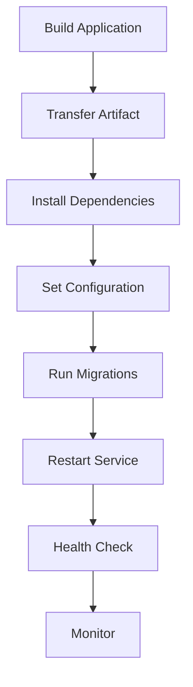

A safer deployment includes:

```text
Versioned artifacts
Automated tests
Health checks
Rollback
Migration planning
Monitoring
```

---

# 39. Server Troubleshooting Flow

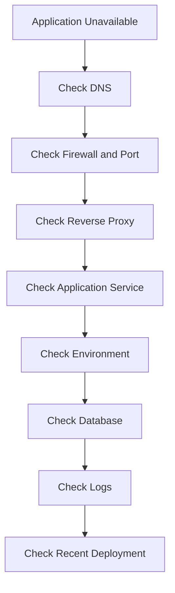

Commands may include:

```bash
systemctl status my-app
journalctl -u my-app --since "10 minutes ago"
ss -ltnp
curl -i http://127.0.0.1:4000/health
curl -i https://example.com/health
```

Compare internal and public requests:

```text
Internal health succeeds:
  Reverse proxy, firewall, DNS, or TLS problem.

Internal health fails:
  Application or dependency problem.
```

---

# 40. Primer Exercise 1 — Inspect a Local Service

Start a local server:

```bash
python -m http.server 8000
```

In another terminal:

```bash
ss -ltnp
```

or:

```bash
lsof -i :8000
```

Then request it:

```bash
curl -i http://127.0.0.1:8000
```

Identify:

```text
Process
Port
Address
HTTP response
```

Stop the process and observe the port disappear.

---

# 41. Primer Exercise 2 — Inspect Logs

Create a local log file:

```bash
echo "INFO server started" > app.log
echo "ERROR database unavailable" >> app.log
```

Read it:

```bash
cat app.log
```

Search errors:

```bash
grep -i error app.log
```

Follow a growing file:

```bash
tail -f app.log
```

In another terminal:

```bash
echo "WARN retrying connection" >> app.log
```

Observe the new line appear.

Stop with:

```text
Ctrl + C
```

---

# 42. Primer Exercise 3 — Test a Health Endpoint

Start a local HTTP server:

```bash
python -m http.server 8000
```

Request:

```bash
curl -i http://localhost:8000
```

In a real application, a health endpoint may be:

```text
GET /health
```

A useful health response:

```json
{
  "status": "healthy"
}
```

A readiness response may check dependencies:

```json
{
  "status": "ready",
  "database": "connected",
  "queue": "connected"
}
```

---

# 43. Primer Exercise 4 — Permission Concepts

Create a file:

```bash
echo "private notes" > private.txt
```

Inspect permissions:

```bash
ls -l private.txt
```

Change permissions in a controlled practice directory:

```bash
chmod 600 private.txt
```

Inspect again:

```bash
ls -l private.txt
```

The file should now be readable and writable only by the owner.

Do not experiment with permissions on critical system files.

---

# 44. Common Beginner Mistakes

## Mistake 1: Running everything as root

This hides permission problems and increases risk.

## Mistake 2: Using `chmod 777`

This grants excessive access.

## Mistake 3: Editing system files without backups

A small configuration error can prevent services from starting.

## Mistake 4: Exposing database ports publicly

Keep databases on private interfaces or networks where possible.

## Mistake 5: Assuming a process is running because files exist

A server must be started and listening.

## Mistake 6: Checking only the public URL

Test internal service health separately.

## Mistake 7: Ignoring logs

Logs often reveal the first meaningful failure.

## Mistake 8: Changing many server settings at once

Make one change, test, and record it.

## Mistake 9: Forgetting service environments

A service may not receive the same variables as your terminal.

## Mistake 10: Deleting logs without understanding retention

Logs may be needed for incident investigation.

---

# 45. Key Concepts to Remember

```text
Linux:
  Operating-system ecosystem commonly used for servers.

Kernel:
  Core of the operating system.

Filesystem:
  Organized tree of files and directories.

Root directory:
  Top of the filesystem tree, written as /.

Root user:
  Administrative user with extensive privileges.

Permission:
  Rule controlling file or resource access.

Process:
  Running program.

Service:
  Long-running process providing a capability.

PID:
  Process identifier.

Port:
  Network service identifier.

SSH:
  Secure remote command-line access.

Reverse proxy:
  Public intermediary forwarding requests to internal services.

Firewall:
  Controls allowed network traffic.

Journal:
  System-managed logs.

Health check:
  Tests whether a service is running.

Readiness check:
  Tests whether a service can accept traffic.
```

---

# 46. Final Linux and Server Mental Model

A production server often looks like:

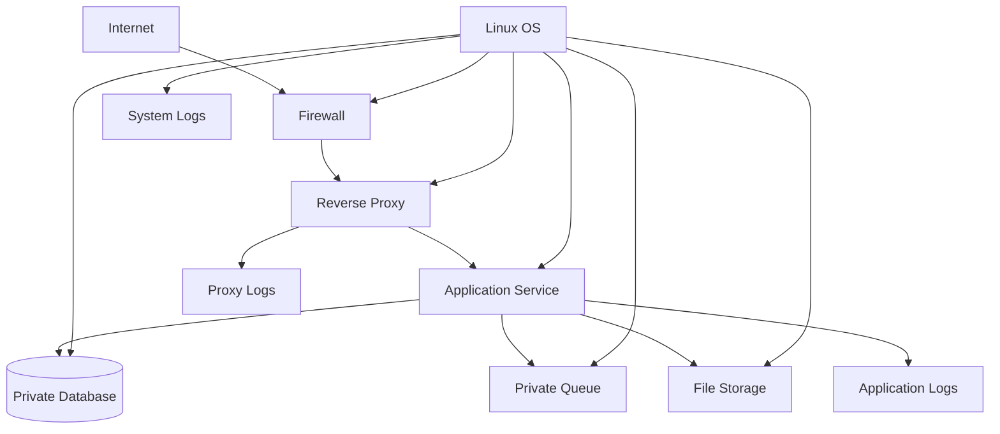

When troubleshooting:

```text
Check the process.
Check the port.
Check the service.
Check the permissions.
Check the configuration.
Check the reverse proxy.
Check the firewall.
Check the database.
Check the logs.
Check recent changes.
```

The most important lesson is:

> A server is a computer running processes with files, users, permissions, ports, network rules, configuration, and logs.

Understanding those fundamentals makes cloud platforms, containers, deployments, and production incidents much easier to reason about.
