# Foundation Primers

# Primer 12 — Cloud and Deployment Basics  
## Virtual Machines, Containers, Regions, Availability Zones, Serverless, CI/CD, and Hosting Web Applications

---

# Primer Overview

A web application is developed in one environment and then made available to users through another.

That process is called **deployment**.

A simple deployment might be:

```text
Developer computer
  ↓
Build application
  ↓
Upload files
  ↓
Start server
  ↓
Users access application
```

A modern production deployment may involve:

- Cloud providers
- Virtual machines
- Containers
- Managed databases
- Object storage
- CDNs
- Load balancers
- DNS
- Serverless functions
- CI/CD pipelines
- Secrets managers
- Monitoring systems
- Multiple regions
- Backup systems

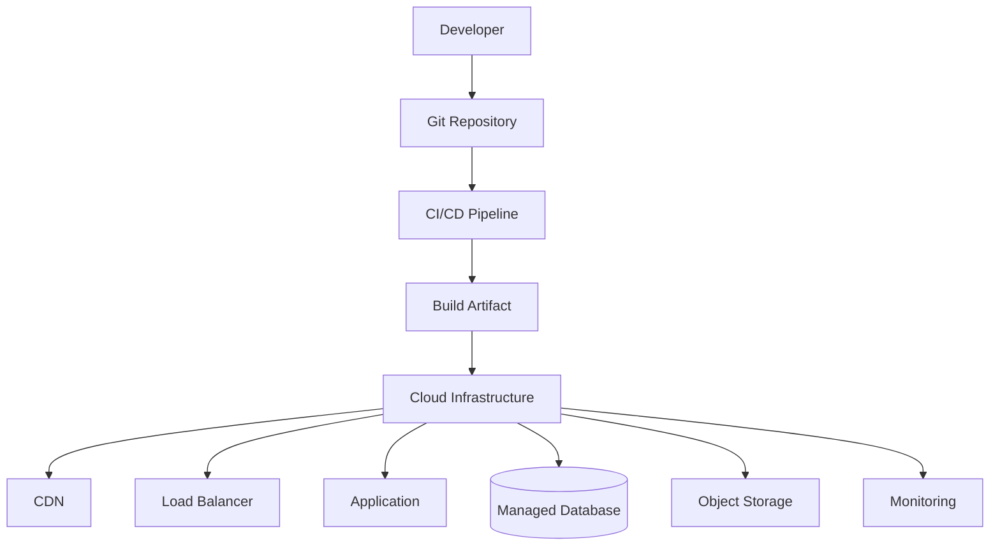

This primer introduces the vocabulary and architecture behind cloud deployment.

You will learn:

- What “the cloud” means
- Virtual machines
- Containers
- Images
- Registries
- Regions
- Availability zones
- Managed services
- Object storage
- Load balancers
- CDNs
- Serverless functions
- Infrastructure as code
- CI/CD
- Deployment strategies
- Secrets management
- Scaling
- Costs
- Backups
- Production environments
- Common deployment mistakes

---

# 1. What Does “The Cloud” Mean?

“The cloud” is not a mysterious place.

It generally means:

> Computing resources provided through remote data centers and accessed over a network.

Cloud providers operate facilities containing:

- Physical servers
- Storage systems
- Networking equipment
- Power systems
- Cooling
- Security systems
- Monitoring
- Backup infrastructure

You rent or use these resources through a service interface.

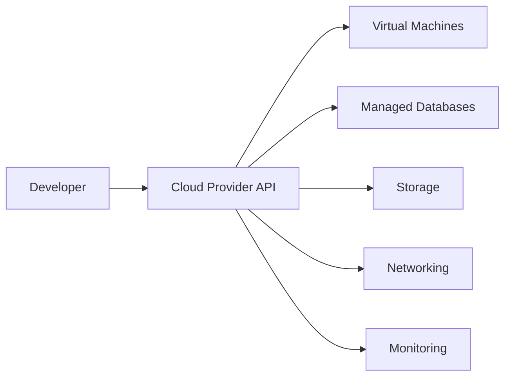

Cloud services may be:

- Self-managed
- Partially managed
- Fully managed

---

# 2. Traditional Server vs Cloud Service

## Traditional server

You may need to manage:

```text
Physical machine
Power
Cooling
Network connection
Hardware replacement
Operating system
Backups
Scaling
```

## Cloud server

The provider manages much of the physical infrastructure.

You may manage:

```text
Operating system
Application
Configuration
Security rules
Scaling settings
Backups
```

## Managed service

The provider manages even more.

Examples:

```text
Managed database
Managed object storage
Managed queue
Managed Kubernetes
Managed authentication
```

The more the provider manages, the less infrastructure work you perform directly, but you may have less control and more platform dependency.

---

# 3. Infrastructure Service Models

A common set of categories is:

```text
IaaS
PaaS
SaaS
FaaS
```

## IaaS — Infrastructure as a Service

You rent computing infrastructure.

Examples:

- Virtual machines
- Virtual networks
- Virtual disks

You usually manage the operating system and application.

## PaaS — Platform as a Service

You deploy an application to a managed platform.

The provider may manage:

- Operating system
- Runtime
- Scaling
- Deployment
- Health checks

## SaaS — Software as a Service

You use a complete application managed by someone else.

Examples:

- Email platform
- Project-management system
- Hosted analytics platform

## FaaS — Function as a Service

You deploy individual functions that execute in response to requests or events.

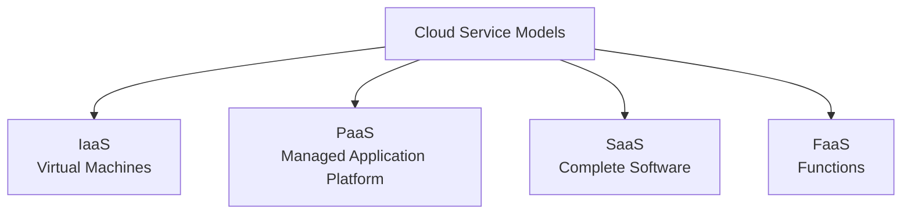

---

# 4. Virtual Machines

A virtual machine, or VM, is a software-defined computer running on physical infrastructure.

A physical host may run several VMs:

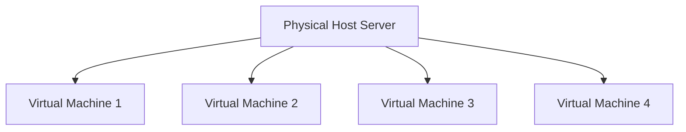

Each VM may have:

- Virtual CPU
- Virtual memory
- Virtual disk
- Virtual network interface
- Operating system
- Application processes

The hypervisor manages access to the physical hardware.

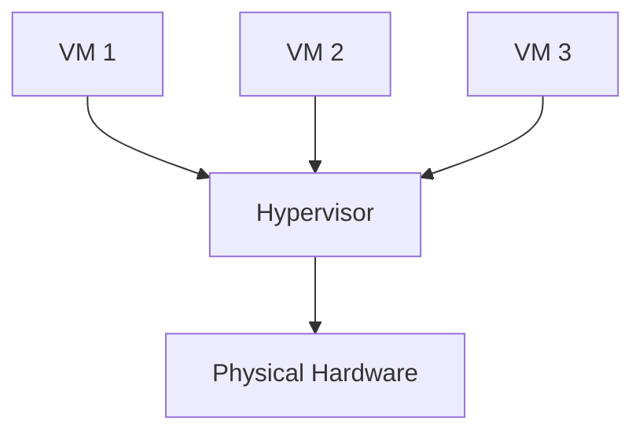

---

# 5. VM Advantages

Virtual machines provide:

- Isolation
- Flexible operating systems
- Predictable resource allocation
- Long-running processes
- Administrative control
- Compatibility with traditional server software

A VM may be suitable for:

- Backend application
- Database
- Worker process
- Internal service
- Legacy application
- Custom networking

---

# 6. VM Tradeoffs

VMs require management of:

```text
Operating system patches
Security updates
Disk usage
Processes
Users
SSH access
Firewall rules
Backups
Scaling
Monitoring
```

A VM is more flexible than a highly managed platform but requires more operational responsibility.

---

# 7. Containers

A container packages an application with its runtime dependencies.

A container commonly includes:

```text
Application code
Runtime
Libraries
Configuration defaults
Startup command
```

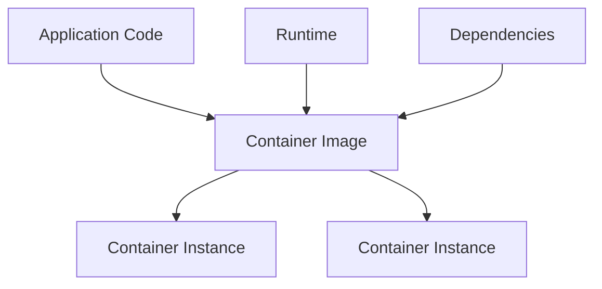

Containers share the host operating system kernel but isolate processes, filesystems, and networking to a degree.

---

# 8. Containers vs Virtual Machines

| Feature | Virtual Machine | Container |
|---|---|---|
| Includes full guest OS | Usually | No |
| Startup time | Longer | Usually shorter |
| Resource overhead | Higher | Lower |
| Isolation | Stronger boundary | Process-level isolation |
| Packaging | Full machine environment | Application and dependencies |
| Common use | Server environment | Application deployment |
| Management | More infrastructure | More application-focused |

Containers and VMs are not mutually exclusive.

A cloud platform may run containers inside virtual machines.

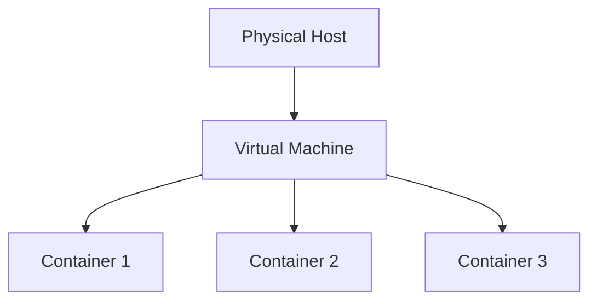

---

# 9. Container Images

A container image is a packaged, immutable template used to create containers.

It may contain:

```text
Base operating-system files
Runtime
Application
Dependencies
Startup command
```

A simplified Dockerfile:

```dockerfile
FROM node:22

WORKDIR /app

COPY package*.json ./
RUN npm ci

COPY . .

RUN npm run build

CMD ["npm", "start"]
```

This describes how to build an image.

---

# 10. Container Lifecycle

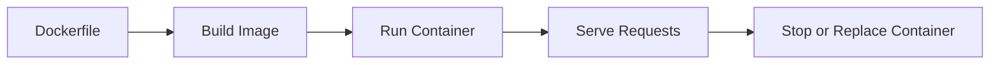

Commands may include:

```bash
docker build -t web-app .
docker run -p 3000:3000 web-app
docker ps
docker stop <container>
```

Exact commands vary by container tool.

---

# 11. Container Ports

A process inside a container may listen on:

```text
0.0.0.0:3000
```

The host may expose it through another port:

```bash
docker run -p 8080:3000 web-app
```

This means:

```text
Host port:      8080
Container port: 3000
```

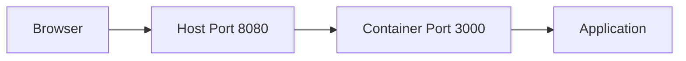

---

# 12. Container Environment Variables

Pass configuration at runtime:

```bash
docker run \
  -e PORT=3000 \
  -e DATABASE_URL=REDACTED \
  web-app
```

Do not bake production secrets into the image.

Bad:

```dockerfile
ENV DATABASE_PASSWORD=real-secret
```

Better:

```text
Build image without secrets.
Inject secrets at runtime through secure configuration.
```

---

# 13. Container Registries

A container registry stores container images.

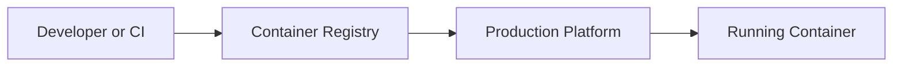

Workflow:

```text
Build image
  ↓
Tag image
  ↓
Push to registry
  ↓
Production pulls image
  ↓
Platform starts container
```

Use immutable or versioned tags where possible:

```text
web-app:1.4.0
web-app:commit-a1b2c3d
```

Avoid relying only on:

```text
latest
```

because it does not clearly identify which version is running.

---

# 14. Regions

A cloud region is a geographic area containing one or more data centers.

Examples conceptually:

```text
North America
Europe
Asia-Pacific
South America
```

Choose a region based on:

- User location
- Data residency
- Latency
- Cost
- Service availability
- Disaster-recovery needs
- Regulatory requirements

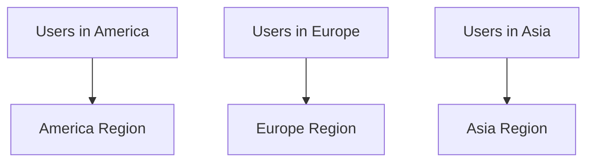

---

# 15. Availability Zones

A region may contain multiple isolated availability zones.

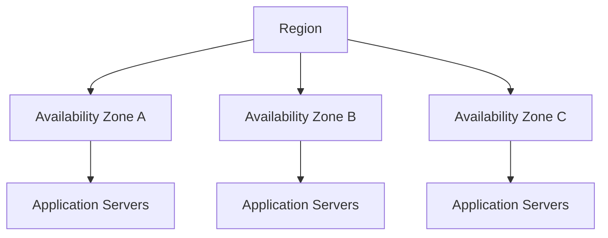

Availability zones are designed to reduce the impact of failures such as:

- Power problems
- Network failures
- Cooling failures
- Hardware failures
- Facility incidents

Deploying across zones improves resilience but adds cost and complexity.

---

# 16. Multi-Region Architecture

A multi-region system operates in more than one geographic region.

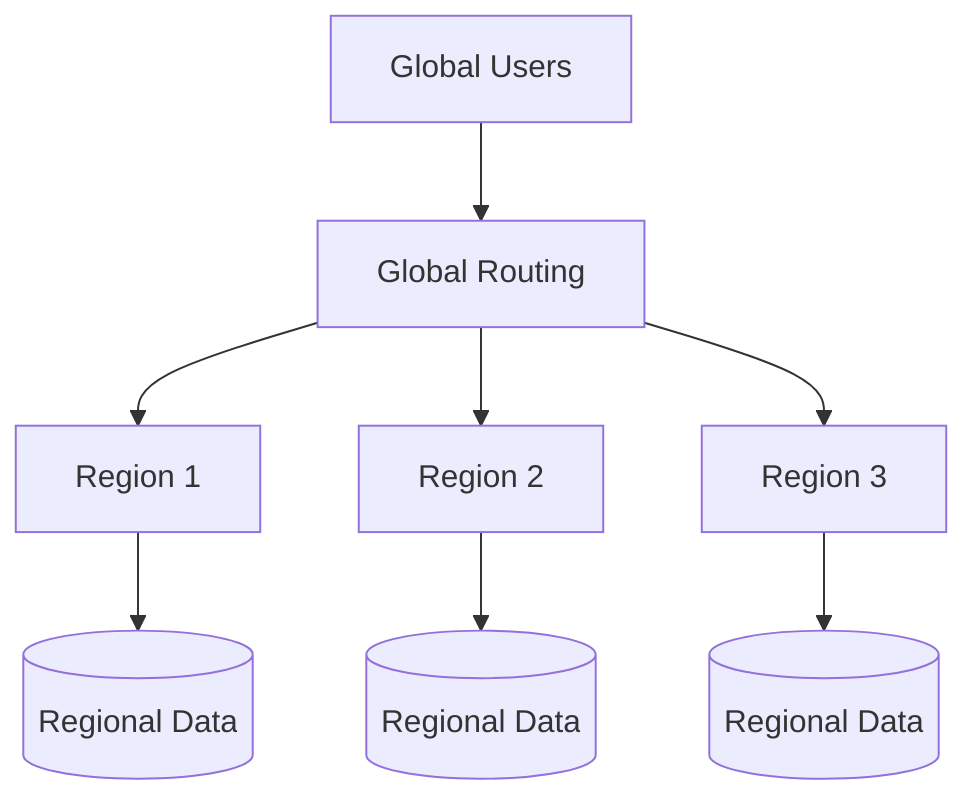

Potential benefits:

- Lower latency
- Regional failover
- Data locality
- Increased availability

Challenges:

- Data synchronization
- Conflict resolution
- More complex deployments
- Higher cost
- Cross-region network delay
- More difficult debugging

Do not deploy multi-region architecture merely because it sounds advanced.

---

# 17. Virtual Private Networks

Cloud providers commonly offer private networks.

A private cloud network may contain:

```text
Public subnets
Private subnets
Routing tables
Security groups
Network gateways
```

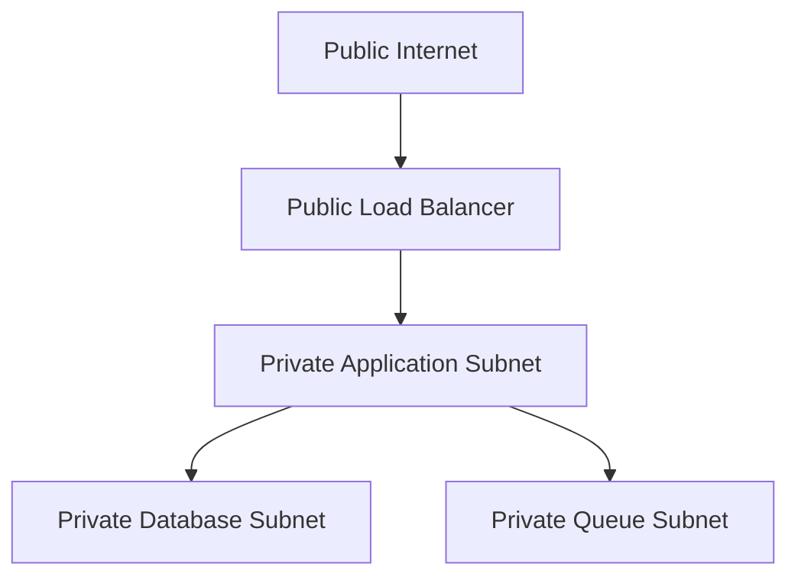

The database should often be placed in a private subnet rather than directly exposed to the Internet.

---

# 18. Security Groups and Firewalls

Cloud firewalls may control:

```text
Source IP
Destination
Port
Protocol
Network
Direction
```

Example policy:

```text
Internet → Load balancer: allow 443
Load balancer → Application: allow 4000
Application → Database: allow 5432
Internet → Database: deny
```

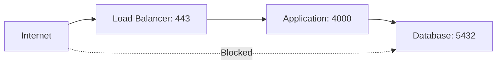

Use the narrowest rules practical.

---

# 19. Object Storage

Object storage is designed for files and large unstructured data.

Examples:

- Images
- Videos
- PDFs
- Backups
- Logs
- Build artifacts
- User uploads

An object-storage system commonly uses:

```text
Bucket
Key or object name
Metadata
Access policy
```

Conceptual object:

```text
Bucket:
  user-uploads

Key:
  users/42/profile/avatar.jpg
```

---

# 20. Object Storage vs Database

Use a database for:

```text
Users
Orders
Relationships
Permissions
Statuses
Metadata
```

Use object storage for:

```text
Images
Videos
Documents
Large files
Backups
```

The database may store metadata about a file:

```json
{
  "id": "file_123",
  "storageKey": "users/42/avatar.jpg",
  "contentType": "image/jpeg",
  "size": 245000
}
```

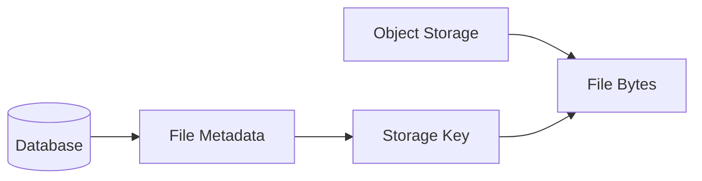

---

# 21. Presigned URLs

A presigned URL allows a client to upload or download an object without receiving permanent storage credentials.

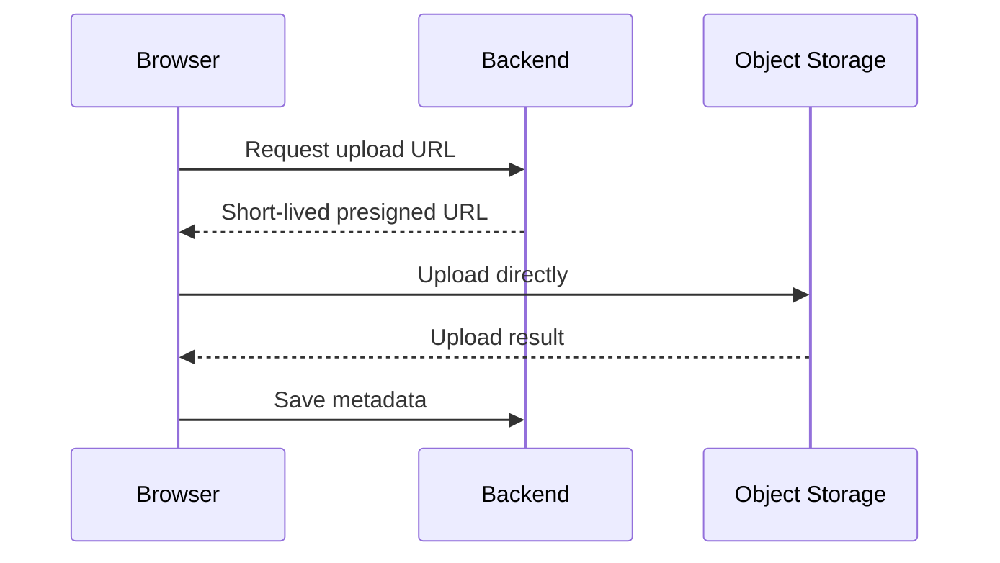

Benefits:

- Large files bypass application servers
- Temporary access
- Reduced backend bandwidth
- Better scalability

The backend should still validate:

- User permission
- File type
- File size
- Upload destination
- Metadata

---

# 22. Managed Databases

A managed database is operated partly by a cloud provider.

The provider may handle:

```text
Provisioning
Patching
Backups
Replication
Monitoring
Failover
Storage scaling
```

You still need to manage:

```text
Schema
Queries
Indexes
Credentials
Permissions
Data retention
Application behavior
```

Managed does not mean responsibility-free.

---

# 23. Managed Caches

A managed cache may provide:

- Redis
- Memcached
- Distributed key-value storage

Use cases:

```text
Session storage
Rate limiting
Frequently accessed data
Temporary state
Job coordination
```

Cache data should be treated differently from authoritative database data.

If the cache disappears, the application should have a recovery path where practical.

---

# 24. Serverless Functions

A serverless function runs in response to:

- HTTP request
- Queue message
- Scheduled event
- File upload
- Database event
- Webhook

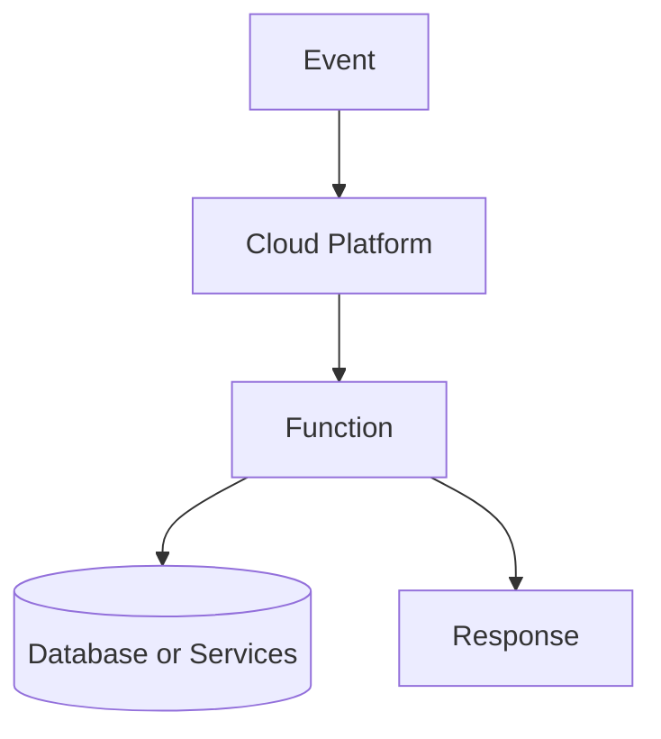

The provider manages the underlying server lifecycle.

---

# 25. Serverless Cold Starts

A function may not have a running instance ready when a request arrives.

The platform may need to:

```text
Start runtime
Load code
Initialize dependencies
Connect to services
Process request
```

This delay is called a cold start.

Cold starts can be affected by:

- Package size
- Runtime
- Initialization work
- Network configuration
- Dependency count
- Traffic pattern

Keep initialization lightweight where latency matters.

---

# 26. Serverless Limits

Serverless platforms may impose:

```text
Maximum execution time
Memory limit
Payload size
Concurrent invocation limits
Temporary storage limits
Connection behavior
```

They are a good fit for:

- Short API operations
- Webhooks
- Scheduled tasks
- Lightweight transformations
- Event handlers

They may be less suitable for:

- Long-running processes
- Persistent connections
- Large in-memory workloads
- Specialized operating-system requirements

---

# 27. CI/CD

CI/CD automates the path from source code to deployment.

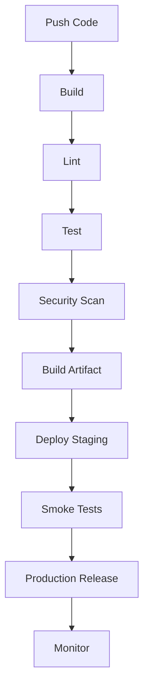

## Continuous Integration

Frequently integrate changes and run automated checks.

## Continuous Delivery

Keep changes ready to deploy.

## Continuous Deployment

Automatically deploy approved changes.

---

# 28. Build Artifacts

A build artifact is a versioned output of a build process.

Examples:

```text
JavaScript bundle
Docker image
Compiled binary
Static site directory
Deployment package
```

A deployment should use a known artifact rather than rebuilding unpredictably on the production server.

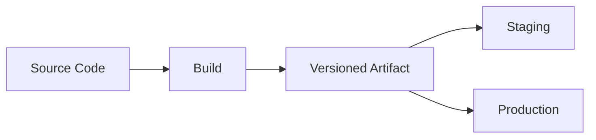

---

# 29. Infrastructure as Code

Infrastructure as Code, or IaC, defines infrastructure in files.

It may describe:

```text
Virtual networks
Servers
Databases
Buckets
Firewalls
Load balancers
DNS
Queues
```

Benefits:

- Repeatability
- Reviewability
- Version control
- Easier recovery
- Consistent environments

```mermaid
flowchart LR
    C[Infrastructure Code] --> P[Planning]
    P --> A[Apply Changes]
    A --> I[Cloud Infrastructure]
```

Common IaC tools include:

```text
Terraform
OpenTofu
Pulumi
Cloud-specific templates
Ansible
```

---

# 30. Configuration Drift

Configuration drift occurs when actual infrastructure differs from the documented or declared configuration.

Example:

```text
Infrastructure file says:
  Port 443 is allowed.

Someone manually changes the server:
  Port 8080 is also allowed.

The configuration file does not reflect reality.
```

IaC and change-management practices reduce drift.

---

# 31. Deployment Strategies

## All-at-once deployment

Replace the old version with the new version immediately.

Simple, but risky.

## Rolling deployment

Update instances gradually.

```mermaid
flowchart LR
    A[Version 1 All Servers] --> B[Update Server 1]
    B --> C[Update Server 2]
    C --> D[Update Server 3]
    D --> E[Version 2 All Servers]
```

## Blue-green deployment

Maintain two environments and switch traffic.

```mermaid
flowchart TD
    U[Users] --> R[Traffic Switch]
    R --> B[Blue Environment]
    R --> G[Green Environment]
```

## Canary deployment

Send a small percentage of traffic to the new version.

```mermaid
flowchart TD
    U[Users] --> R[Router]
    R --> OLD[Old Version<br/>95%]
    R --> NEW[New Version<br/>5%]
```

Monitor errors and latency before expanding the rollout.

---

# 32. Rollbacks

A rollback returns traffic or code to a previous known-good version.

A useful rollback plan identifies:

```text
Previous version
Deployment command
Database compatibility
Traffic switch
Verification steps
Owner
```

A code rollback may not reverse a database migration.

Design migrations to allow old and new application versions to coexist during deployment.

---

# 33. Load Balancers

A load balancer distributes requests across application instances.

```mermaid
flowchart LR
    C[Clients] --> LB[Load Balancer]
    LB --> A1[Application 1]
    LB --> A2[Application 2]
    LB --> A3[Application 3]
```

It may perform:

```text
Health checks
TLS termination
Routing
Session behavior
Traffic distribution
Failure removal
```

If one instance fails, the load balancer can stop routing traffic to it.

---

# 34. Autoscaling

Autoscaling adjusts capacity based on demand.

Possible signals:

```text
CPU usage
Memory
Request count
Queue depth
Latency
Concurrent requests
```

```mermaid
flowchart TD
    M[Metric] --> T{Threshold Reached?}
    T -->|Yes| S[Scale Out or In]
    T -->|No| K[Keep Capacity]
```

Scaling out:

```text
Add more instances.
```

Scaling in:

```text
Remove unnecessary instances.
```

Autoscaling needs safeguards against:

- Oscillation
- Cost spikes
- Slow startup
- Database bottlenecks
- Dependency limits

---

# 35. Horizontal vs Vertical Scaling

## Vertical scaling

Increase resources on one machine:

```text
More CPU
More memory
Larger disk
```

## Horizontal scaling

Add more machines or instances:

```text
Application 1
Application 2
Application 3
```

```mermaid
flowchart LR
    V[Vertical Scaling] --> VM[One Larger Machine]
    H[Horizontal Scaling] --> HM[Many Machines]
```

Horizontal scaling often requires:

- Shared session storage
- Load balancing
- Stateless requests
- Shared file storage
- Database strategy

---

# 36. CDN Deployment

A CDN can distribute static assets globally.

```mermaid
flowchart TD
    B[Build Static Assets] --> O[Origin Storage]
    O --> CDN[CDN Edge Locations]
    U1[User A] --> CDN
    U2[User B] --> CDN
    U3[User C] --> CDN
```

Typical deployment:

```text
Build frontend
  ↓
Upload files to object storage
  ↓
Connect CDN
  ↓
Configure custom domain
  ↓
Set cache headers
  ↓
Invalidate or version assets
```

---

# 37. DNS and Cloud Deployment

A production deployment often requires DNS records.

Examples:

```text
A record:
  Domain → IPv4 address

AAAA record:
  Domain → IPv6 address

CNAME:
  Hostname → another hostname
```

Example:

```text
www.example.com → CDN hostname
api.example.com → Load balancer hostname
```

```mermaid
flowchart LR
    D[Domain] --> DNS[DNS Record]
    DNS --> CDN[CDN or Load Balancer]
    CDN --> APP[Application]
```

---

# 38. Certificates and Custom Domains

When using a custom domain, configure:

```text
DNS record
Certificate
Certificate renewal
HTTPS listener
Redirect from HTTP
```

Certificate renewal should be automated or monitored.

An expired certificate can make a healthy application appear unavailable.

---

# 39. Cost Awareness

Cloud resources cost money.

Costs may come from:

```text
Compute time
Memory
Storage
Database size
Database operations
Network transfer
CDN transfer
Logs
Monitoring
Backups
Public IPs
External APIs
```

Monitor:

```text
Current spend
Budget
Unexpected usage
High-volume endpoints
Storage growth
Log volume
```

A small configuration mistake can create a large bill.

Examples:

- Infinite retry loop
- Public object storage downloads
- Unbounded logs
- Large database instance
- Uncontrolled load test
- Misconfigured autoscaling

---

# 40. Cloud Observability

Monitor cloud infrastructure:

```text
Instance health
CPU
Memory
Disk
Network
Load balancer errors
Database connections
Storage usage
Queue depth
Function invocations
Function duration
```

```mermaid
flowchart TD
    C[Cloud Components] --> M[Metrics]
    C --> L[Logs]
    C --> T[Traces]
    M --> D[Dashboard]
    L --> D
    T --> D
```

Application and infrastructure monitoring should be connected where possible.

---

# 41. Production Cloud Checklist

```text
[ ] Region selected deliberately.
[ ] Availability requirements documented.
[ ] Private and public network boundaries defined.
[ ] Database is not unnecessarily public.
[ ] Firewall rules are minimal.
[ ] Secrets use a secure management system.
[ ] Backups are automated.
[ ] Restore has been tested.
[ ] Health checks exist.
[ ] Load balancer behavior is understood.
[ ] Scaling limits are configured.
[ ] Costs are monitored.
[ ] Logs and metrics are collected.
[ ] Certificates renew automatically.
[ ] DNS is documented.
[ ] Rollback process exists.
[ ] Deployment artifacts are versioned.
[ ] Infrastructure changes are reviewed.
```

---

# 42. Primer Exercise 1 — Map a Deployment

Draw a deployment for a task-management application:

```text
Frontend
Backend API
Database
File uploads
Email notifications
```

Possible design:

```mermaid
flowchart TD
    U[Users] --> CDN[CDN]
    CDN --> FRONT[Frontend Static Assets]
    U --> LB[Load Balancer]
    LB --> API[Backend API]
    API --> DB[(Managed Database)]
    API --> STORAGE[Object Storage]
    API --> Q[Queue]
    Q --> WORKER[Email Worker]
    WORKER --> EMAIL[Email Provider]
```

Identify:

```text
Which components are public?
Which components are private?
Which components need backups?
Which components can fail independently?
Which components should scale?
```

---

# 43. Primer Exercise 2 — Containerize a Simple App

Create a simple application with a `Dockerfile`.

Conceptual file:

```dockerfile
FROM python:3.12-slim

WORKDIR /app

COPY . .

EXPOSE 8000

CMD ["python", "-m", "http.server", "8000"]
```

Build:

```bash
docker build -t simple-web .
```

Run:

```bash
docker run --rm -p 8000:8000 simple-web
```

Open:

```text
http://localhost:8000
```

This demonstrates:

```text
Image
Container
Port mapping
Application process
```

---

# 44. Primer Exercise 3 — Deployment Failure Planning

Imagine the new application version fails after deployment.

Answer:

```text
How do you detect the failure?
How do you stop traffic?
How do you return to the previous version?
What happens to database changes?
How do you verify recovery?
Who should be notified?
```

Create a rollback flow:

```mermaid
flowchart TD
    A[Elevated Errors] --> B[Confirm Deployment Correlation]
    B --> C[Stop or Pause Rollout]
    C --> D[Route Traffic to Previous Version]
    D --> E[Verify Health and Error Rate]
    E --> F[Investigate New Version]
```

---

# 45. Common Beginner Mistakes

## Mistake 1: Assuming cloud means no servers

Servers still exist. You simply manage them through abstractions.

## Mistake 2: Exposing databases publicly

Use private networks and restricted access.

## Mistake 3: Baking secrets into container images

Inject secrets at runtime.

## Mistake 4: Using `latest` as the only image tag

Use immutable version identifiers.

## Mistake 5: Deploying without health checks

Traffic may reach a broken instance.

## Mistake 6: Forgetting database compatibility during rolling deployments

Old and new versions may run simultaneously.

## Mistake 7: Ignoring cloud costs

Unbounded resources can create unexpected bills.

## Mistake 8: Assuming autoscaling solves every bottleneck

The database or external provider may still be the limiting component.

## Mistake 9: Running production with one unmonitored instance

A single instance is a single point of failure.

## Mistake 10: Treating deployment as file copying only

Deployment also includes configuration, networking, migrations, secrets, health, and rollback.

---

# 46. Key Concepts to Remember

```text
Cloud:
  Remote computing resources provided through network-accessible infrastructure.

Virtual machine:
  Software-defined computer running on physical hardware.

Container:
  Packaged application environment.

Container image:
  Immutable template used to create containers.

Registry:
  Storage location for container images.

Region:
  Geographic cloud area.

Availability zone:
  Isolated infrastructure location within a region.

Managed service:
  Provider-operated infrastructure component.

Object storage:
  Storage for files and unstructured data.

Load balancer:
  Distributes traffic across instances.

Autoscaling:
  Adjusts capacity based on demand.

Serverless:
  Managed function execution model.

CI/CD:
  Automated build, test, and deployment process.

Infrastructure as Code:
  Infrastructure defined in version-controlled files.

Blue-green deployment:
  Traffic switching between two environments.

Canary deployment:
  Gradual release to a small percentage of traffic.
```

---

# 47. Final Cloud and Deployment Mental Model

A production cloud deployment may look like:

```mermaid
flowchart TD
    D[Developer] --> G[Git Repository]
    G --> CI[CI/CD Pipeline]
    CI --> ART[Versioned Artifact]
    ART --> REG[Container Registry or Artifact Store]

    REG --> DEP[Deployment Platform]
    DEP --> APP[Application Instances]
    DEP --> WORK[Workers]

    U[Users] --> DNS[DNS]
    DNS --> CDN[CDN or Load Balancer]
    CDN --> APP

    APP --> DB[(Managed Database)]
    APP --> CACHE[(Managed Cache)]
    APP --> STORAGE[Object Storage]
    APP --> Q[Queue]

    APP --> OBS[Logs, Metrics, Traces]
    DB --> BACKUP[Backups]
```

The most important lesson is:

> Cloud deployment is the process of placing software into managed computing infrastructure while controlling networking, configuration, security, scaling, data, monitoring, and recovery.
