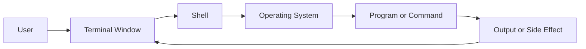
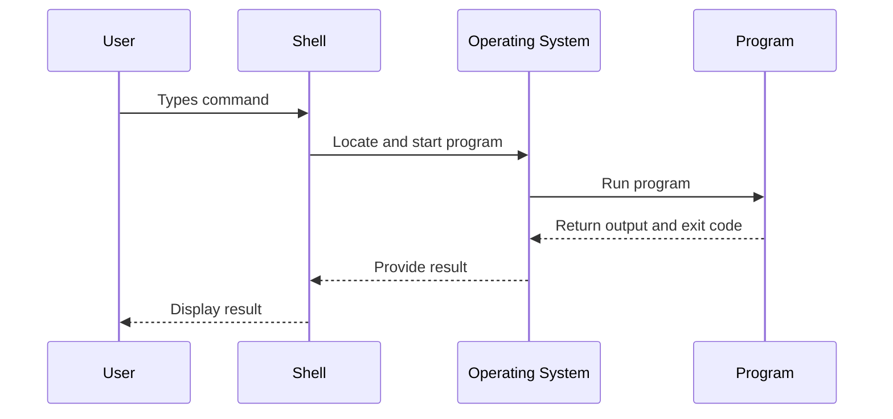
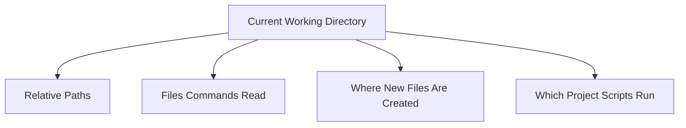
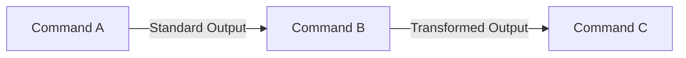
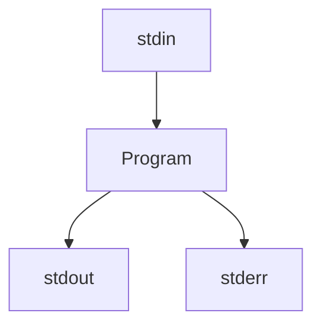
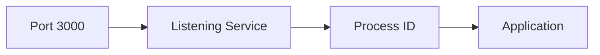
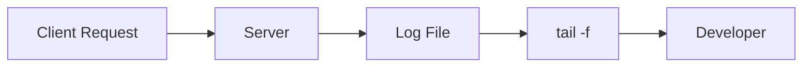
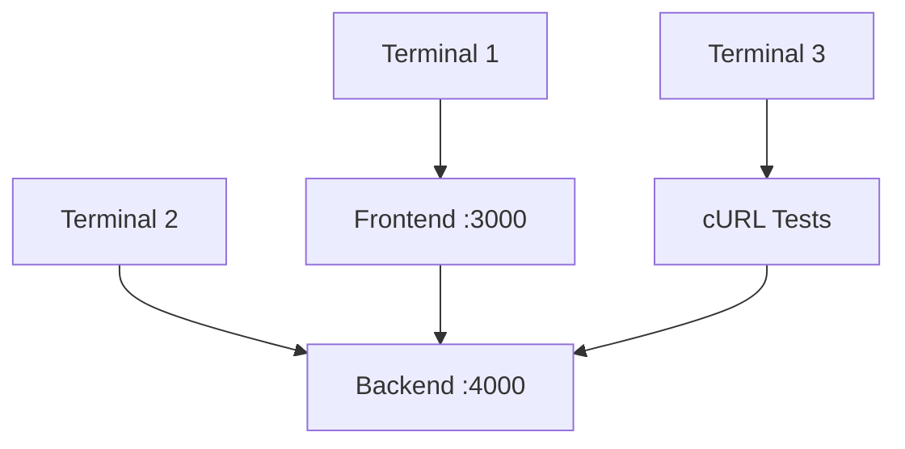
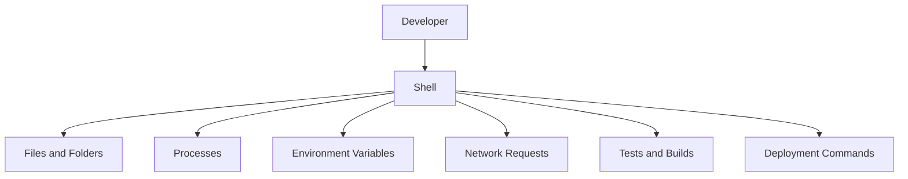

# Foundation Primers

# Primer 2 — Command-Line Fundamentals for Web Learners  
## Terminals, Shells, Paths, Files, Processes, Pipes, Environment Variables, and Basic Automation

---

# Primer Overview

The command line is one of the most useful tools in web development.

Although graphical interfaces are convenient, many web-development tasks are performed through commands:

- Starting a frontend development server
- Running a backend
- Installing packages
- Inspecting files
- Reading logs
- Testing APIs
- Checking ports
- Setting environment variables
- Running database migrations
- Executing tests
- Building production assets
- Automating repetitive tasks

This primer explains the command line from the beginning.

You will learn:

- What a terminal is
- What a shell is
- How commands are structured
- How to navigate directories
- How to create, copy, move, and delete files
- How to read files
- How to search text
- How to use pipes and redirection
- How exit codes work
- How to inspect processes
- How to use environment variables
- How to run commands safely
- How Unix-like shells differ from PowerShell
- How command-line skills connect to web development

The central model is:



---

# 1. What Is a Terminal?

A terminal is an application that provides a text-based interface to a computer.

Instead of clicking icons and menus, you type commands.

Examples include:

- Windows Terminal
- macOS Terminal
- GNOME Terminal
- iTerm
- Integrated terminals in code editors

A terminal window is not itself the command interpreter.

It provides a place where you can interact with a shell.

```text
Terminal = Window or interface
Shell    = Program that interprets commands
```

---

# 2. What Is a Shell?

A shell reads commands, interprets them, and asks the operating system to execute them.

Common shells include:

```text
Bash
Zsh
Fish
PowerShell
Command Prompt
```

Example command:

```bash
ls
```

The shell:

1. Reads `ls`.
2. Searches for the corresponding program.
3. Starts it.
4. Displays its output.



---

# 3. The Command Prompt

When a terminal is waiting for input, it displays a prompt.

Examples:

```text
$
>
PS C:\Users\Alex>
```

The prompt may show:

- Current username
- Computer name
- Current directory
- Active environment
- Shell type

Do not type the prompt symbol itself.

If you see:

```text
$ pwd
```

you type only:

```bash
pwd
```

---

# 4. Command Structure

A command commonly has this form:

```bash
command [options] [arguments]
```

Example:

```bash
ls -la project
```

Breakdown:

```text
Command:
  ls

Option:
  -la

Argument:
  project
```

Another example:

```bash
curl -I https://example.com
```

Breakdown:

```text
Command:
  curl

Option:
  -I

Argument:
  https://example.com
```

Long options are often easier to read:

```bash
curl --head https://example.com
```

---

# 5. Options and Flags

Options change how a command behaves.

Short option:

```bash
ls -l
```

Long option:

```bash
ls --long
```

Multiple short options may sometimes be combined:

```bash
ls -la
```

This may mean:

```text
-l = long listing
-a = include hidden files
```

Some options require values:

```bash
curl --max-time 10 https://example.com
```

Here:

```text
--max-time = option
10          = option value
```

---

# 6. Arguments

Arguments provide data to a command.

Examples:

```bash
cd project
```

```text
project = directory argument
```

```bash
cat notes.txt
```

```text
notes.txt = file argument
```

```bash
mkdir frontend backend
```

```text
frontend and backend = directory arguments
```

A command may accept multiple arguments.

---

# 7. Getting Help

Most command-line tools provide help.

Examples:

```bash
command --help
```

```bash
curl --help
```

```bash
git --help
```

Some systems support:

```bash
man curl
```

This opens a manual page.

Other commands may use:

```bash
curl -h
```

or:

```bash
help command
```

If you do not understand a command, inspect its documentation before running destructive options.

---

# 8. Your Current Working Directory

The current working directory is the directory where your shell is currently operating.

On Unix-like systems:

```bash
pwd
```

`pwd` means:

```text
Print Working Directory
```

Example output:

```text
/home/alex/projects
```

PowerShell:

```powershell
Get-Location
```

The current directory affects:

- Which files commands find
- Where new files are created
- Which project configuration is loaded
- Which scripts run
- How relative paths are interpreted



---

# 9. Listing Files

On Unix-like systems:

```bash
ls
```

List detailed information:

```bash
ls -l
```

Include hidden files:

```bash
ls -la
```

PowerShell:

```powershell
Get-ChildItem
```

or:

```powershell
dir
```

Files beginning with `.` are often hidden on Unix-like systems.

Examples:

```text
.git
.env
.config
```

Hidden does not mean secure.

A hidden `.env` file may still contain sensitive credentials.

---

# 10. Understanding File Listings

A detailed listing may look like:

```text
-rw-r--r--  1 alex staff  1200 Jul 22 12:00 README.md
drwxr-xr-x  5 alex staff   160 Jul 22 12:01 src
```

Important information may include:

```text
Type
Permissions
Owner
Group
Size
Modification time
Name
```

A leading:

```text
-
```

often indicates a regular file.

A leading:

```text
d
```

often indicates a directory.

---

# 11. Changing Directories

Use:

```bash
cd project
```

`cd` means:

```text
Change Directory
```

Move into a nested directory:

```bash
cd project/frontend
```

Move to the parent:

```bash
cd ..
```

Move to your home directory:

```bash
cd ~
```

Return to the previous directory:

```bash
cd -
```

In PowerShell:

```powershell
Set-Location project
```

The shorter `cd` alias usually also works.

---

# 12. Relative Paths

Suppose your current directory is:

```text
/home/alex/web-learning
```

You can enter:

```bash
cd frontend
```

to reach:

```text
/home/alex/web-learning/frontend
```

You can return using:

```bash
cd ..
```

Relative paths are interpreted from the current directory.

```mermaid
flowchart LR
    A[/home/alex/web-learning] --> B[frontend]
    A --> C[backend]
    A --> D[docs]
```

---

# 13. Absolute Paths

An absolute path begins at the filesystem root or drive.

Unix-like example:

```text
/home/alex/web-learning/frontend
```

Windows example:

```text
C:\Users\Alex\web-learning\frontend
```

Absolute paths are unambiguous but may not work on another computer.

Relative paths are more portable inside a project.

---

# 14. Special Path Symbols

Common symbols:

```text
.   Current directory
..  Parent directory
~   Home directory
/   Root or path separator on Unix-like systems
```

Examples:

```bash
ls .
ls ..
ls ~/projects
```

If you are in:

```text
/home/alex/web-learning/frontend
```

then:

```text
..
```

means:

```text
/home/alex/web-learning
```

---

# 15. Creating Directories

Create one directory:

```bash
mkdir project
```

Create nested directories:

```bash
mkdir -p project/frontend/src
```

The `-p` option creates missing parent directories.

PowerShell:

```powershell
New-Item -ItemType Directory -Path project/frontend/src
```

or:

```powershell
mkdir project/frontend/src
```

---

# 16. Creating Files

On Unix-like systems:

```bash
touch README.md
```

This creates an empty file if it does not exist.

You can create several files:

```bash
touch index.html styles.css app.js
```

PowerShell:

```powershell
New-Item index.html
New-Item styles.css
New-Item app.js
```

Some shells and operating systems handle `touch` differently.

---

# 17. Writing Text to Files

Use `echo` with redirection:

```bash
echo "Hello" > greeting.txt
```

This creates or replaces the file.

Append instead:

```bash
echo "Another line" >> greeting.txt
```

Important:

```text
>  Replaces the file
>> Appends to the file
```

Be careful with `>` because it can erase existing content.

---

# 18. Reading Files

Display a small file:

```bash
cat README.md
```

Display a file page by page:

```bash
less README.md
```

Show the beginning:

```bash
head README.md
```

Show the end:

```bash
tail README.md
```

Follow a growing log:

```bash
tail -f server.log
```

Stop a running `tail -f` with:

```text
Ctrl + C
```

---

# 19. Viewing Logs

Logs are commonly inspected with:

```bash
tail -f server.log
```

Search for errors:

```bash
grep "error" server.log
```

Ignore case:

```bash
grep -i "error" server.log
```

Show matching lines with line numbers:

```bash
grep -n "error" server.log
```

Combine tools:

```bash
tail -f server.log | grep -i "error"
```

PowerShell equivalent:

```powershell
Get-Content server.log -Wait | Select-String -Pattern "error"
```

---

# 20. Copying Files and Directories

Copy a file:

```bash
cp source.txt destination.txt
```

Copy into a directory:

```bash
cp app.js src/
```

Copy a directory recursively:

```bash
cp -r frontend backup-frontend
```

PowerShell:

```powershell
Copy-Item source.txt destination.txt
Copy-Item frontend backup-frontend -Recurse
```

Check the destination before overwriting important files.

---

# 21. Moving and Renaming

Move a file:

```bash
mv old-name.txt new-name.txt
```

This also renames the file.

Move a file into a directory:

```bash
mv app.js src/
```

PowerShell:

```powershell
Move-Item old-name.txt new-name.txt
```

Moving can overwrite an existing destination depending on the system and options.

---

# 22. Deleting Files

Delete a file:

```bash
rm notes.txt
```

PowerShell:

```powershell
Remove-Item notes.txt
```

Delete an empty directory:

```bash
rmdir empty-folder
```

Delete a directory recursively:

```bash
rm -r old-project
```

PowerShell:

```powershell
Remove-Item old-project -Recurse
```

---

# 23. The Danger of Recursive Deletion

Commands such as:

```bash
rm -rf
```

can forcefully delete files and directories recursively.

This can cause irreversible data loss.

Before using destructive commands:

```text
[ ] Confirm the current directory.
[ ] Inspect the target path.
[ ] Check spelling.
[ ] Avoid broad wildcards.
[ ] Prefer backups.
[ ] Use a safer interactive option if available.
```

Never run a destructive command copied from an unknown source without understanding it.

---

# 24. Wildcards

Wildcards match multiple files.

Example:

```bash
ls *.js
```

This lists files ending in `.js`.

Other patterns:

```bash
*.log
src/*
test-?.txt
```

The exact wildcard rules vary by shell.

Be careful:

```bash
rm *.log
```

may delete every matching log file in the current directory.

---

# 25. File Search

Find files by name:

```bash
find . -name "*.js"
```

Find directories:

```bash
find . -type d
```

Find files modified recently:

```bash
find . -type f -mtime -1
```

PowerShell:

```powershell
Get-ChildItem -Recurse -Filter *.js
```

Search content with `grep`:

```bash
grep -R "TODO" .
```

Many projects use faster alternatives such as:

```bash
rg "TODO"
```

if ripgrep is installed.

---

# 26. Text Search

Search one file:

```bash
grep "database" config.txt
```

Search recursively:

```bash
grep -R "database" .
```

Include line numbers:

```bash
grep -Rn "database" .
```

Ignore case:

```bash
grep -Rni "database" .
```

Search multiple patterns:

```bash
grep -E "error|warning|failed" server.log
```

PowerShell:

```powershell
Select-String -Path server.log -Pattern "error"
```

---

# 27. Pipes

A pipe sends one command’s output into another.

```bash
ls -la | less
```

```bash
ps aux | grep node
```

```bash
curl -s https://api.example.com/products | jq '.items'
```



Pipes allow simple commands to work together.

---

# 28. Standard Input, Output, and Error

Programs commonly use three streams:

```text
stdin   Standard input
stdout  Standard output
stderr  Standard error
```

A program may:

- Read input from stdin
- Write normal output to stdout
- Write errors to stderr



This distinction matters when redirecting output.

---

# 29. Redirection

Save standard output:

```bash
command > output.txt
```

Append standard output:

```bash
command >> output.txt
```

Save standard error:

```bash
command 2> error.txt
```

Save both:

```bash
command > output.txt 2>&1
```

On many Unix-like shells, this also works:

```bash
command &> output.txt
```

The exact syntax varies by shell.

---

# 30. Exit Codes

Commands usually return an exit code.

Convention:

```text
0       Success
Nonzero Failure
```

Example:

```bash
curl -fsS https://example.com
echo $?
```

A script can branch based on the result:

```bash
if curl -fsS https://example.com/health > /dev/null; then
  echo "Healthy"
else
  echo "Unavailable"
fi
```

PowerShell uses a different mechanism, commonly:

```powershell
$LASTEXITCODE
```

---

# 31. Command Chaining

Run a second command only if the first succeeds:

```bash
command1 && command2
```

Example:

```bash
mkdir project && cd project
```

Run a second command regardless of the first result:

```bash
command1 ; command2
```

Run a fallback if the first fails:

```bash
command1 || echo "Command failed"
```

```mermaid
flowchart TD
    A[Command 1] --> B{Succeeded?}
    B -->|Yes| C[Command 2 with &&]
    B -->|No| D[Fallback with ||]
```

Use chaining carefully when commands have side effects.

---

# 32. Processes and Background Commands

Start a command in the background on many Unix-like shells:

```bash
npm run dev &
```

The shell may return immediately while the process continues.

List jobs:

```bash
jobs
```

Bring a job to the foreground:

```bash
fg
```

A simpler development workflow is often to open another terminal rather than backgrounding important services.

---

# 33. Stopping Processes

A running foreground process can often be stopped with:

```text
Ctrl + C
```

This sends an interrupt signal.

Examples:

```text
Stop development server
Stop log-following command
Stop a long-running script
```

For a process that does not respond, find its process ID and terminate it carefully.

---

# 34. Process Inspection

List processes:

```bash
ps aux
```

Find Node processes:

```bash
ps aux | grep node
```

Find Python processes:

```bash
ps aux | grep python
```

On Windows PowerShell:

```powershell
Get-Process
```

Find a specific process:

```powershell
Get-Process node
```

---

# 35. Ports and Listening Services

Find what is using port `3000`:

```bash
lsof -i :3000
```

Check listening TCP ports:

```bash
ss -ltnp
```

Alternative:

```bash
netstat -ltnp
```

Windows:

```powershell
netstat -ano
```

Then map the process ID to a process:

```powershell
Get-Process -Id 1234
```



---

# 36. Environment Variables

Environment variables provide named values to processes.

Examples:

```text
PORT=3000
NODE_ENV=development
API_BASE_URL=http://localhost:4000
DATABASE_URL=...
```

Unix-like shell:

```bash
export PORT=3000
echo "$PORT"
```

PowerShell:

```powershell
$env:PORT = "3000"
Write-Output $env:PORT
```

Run one command with a variable:

```bash
PORT=3000 npm run dev
```

---

# 37. Environment Variable Scope

An environment variable usually belongs to:

- The current shell
- Child processes started by that shell
- The current command
- The current terminal session

If you set:

```bash
export API_URL=http://localhost:4000
```

a new terminal may not automatically receive it.

A running process usually needs to restart to read updated values.

---

# 38. `.env` Files

Many projects use:

```text
.env
.env.local
.env.development
.env.production
```

Example:

```text
PORT=3000
API_BASE_URL=http://localhost:4000
DATABASE_URL=postgres://localhost/app
```

A `.env` file is usually read by application tooling, not by the shell automatically.

Treat it carefully:

```text
[ ] Do not commit secrets.
[ ] Add private files to .gitignore.
[ ] Document required variables in .env.example.
[ ] Restart processes after changes.
[ ] Know which variables are exposed to the browser.
```

---

# 39. Working with JSON and APIs

The command line is especially useful for API testing.

Basic request:

```bash
curl https://api.example.com/products
```

Request headers:

```bash
curl \
  -H "Accept: application/json" \
  https://api.example.com/products
```

POST JSON:

```bash
curl \
  -X POST \
  -H "Content-Type: application/json" \
  -d '{"name":"Keyboard"}' \
  https://api.example.com/products
```

Pretty-print using `jq`:

```bash
curl -s https://api.example.com/products | jq
```

---

# 40. Reading Logs in Real Time

A backend may write logs to a file:

```bash
tail -f server.log
```

Filter errors:

```bash
tail -f server.log | grep -i error
```

Filter a request ID:

```bash
grep "req_abc123" server.log
```

This is especially useful when reproducing an API request.



---

# 41. Command-Line Web Development Workflow

A typical workflow may look like:

```bash
cd project
git status
npm install
npm run dev
```

In another terminal:

```bash
curl http://localhost:3000
```

For the backend:

```bash
cd backend
npm run dev
```

For tests:

```bash
npm test
```

For production build:

```bash
npm run build
```

The exact commands depend on the project.

---

# 42. Package Scripts

A project may define scripts in a configuration file:

```json
{
  "scripts": {
    "dev": "vite",
    "build": "vite build",
    "test": "vitest",
    "lint": "eslint ."
  }
}
```

Run them using:

```bash
npm run dev
npm run build
npm test
npm run lint
```

Scripts provide consistent commands for the team.

---

# 43. Command History

Shells commonly remember previous commands.

You may use:

```text
Up arrow
Down arrow
```

Search history on many Unix-like shells:

```text
Ctrl + R
```

History is convenient but can expose secrets.

Avoid placing passwords directly in commands.

Bad:

```bash
curl -u alex:real-password https://example.com
```

Prefer a secure prompt or protected environment mechanism.

---

# 44. Quoting and Spaces

Shells interpret spaces as argument separators.

This command:

```bash
cat my file.txt
```

is interpreted as two arguments:

```text
my
file.txt
```

Quote the filename:

```bash
cat "my file.txt"
```

Or escape the space:

```bash
cat my\ file.txt
```

Quotes are also important for URLs containing:

```text
&
?
$
*
```

---

# 45. Single and Double Quotes

On many Unix-like shells:

## Single quotes

Prevent variable expansion:

```bash
echo '$HOME'
```

Outputs:

```text
$HOME
```

## Double quotes

Allow variable expansion:

```bash
echo "$HOME"
```

Outputs the home directory.

JSON often uses double quotes internally, so this is common:

```bash
curl -d '{"name":"Alex"}' URL
```

The outer single quotes protect the JSON double quotes.

---

# 46. Wildcards and Shell Expansion

The shell may expand wildcards before running a command.

Example:

```bash
ls *.js
```

The shell replaces `*.js` with matching filenames.

This is useful:

```bash
rm build/*.js
```

but potentially dangerous if the pattern matches more files than expected.

Inspect before deleting:

```bash
ls build/*.js
```

---

# 47. Command Substitution

Some shells allow one command’s output to become another command’s input or argument.

Example:

```bash
echo "Current directory: $(pwd)"
```

Another example:

```bash
git branch --show-current
```

Use command substitution carefully when output contains spaces or special characters.

---

# 48. Aliases

An alias creates a shortcut.

Example:

```bash
alias ll='ls -la'
```

Then:

```bash
ll
```

runs:

```bash
ls -la
```

Aliases improve convenience but can hide behavior.

When following documentation or debugging, use the full command if you are unsure what an alias does.

---

# 49. Scripts

A shell script is a file containing commands.

Example:

```bash
#!/usr/bin/env bash

set -euo pipefail

echo "Starting checks"

npm run lint
npm test
npm run build

echo "Checks completed"
```

Make it executable on Unix-like systems:

```bash
chmod +x check.sh
```

Run it:

```bash
./check.sh
```

Scripts make workflows:

- Repeatable
- Reviewable
- Automatable
- Easier to run in CI

---

# 50. Safe Shell Scripting

Good practices:

```bash
set -euo pipefail
```

Use quotes around variables:

```bash
rm "$file"
```

Validate required values:

```bash
: "${API_URL:?API_URL is required}"
```

Avoid untrusted input in shell commands.

Do not construct shell commands from raw user input.

---

# 51. Command Injection

Command injection occurs when untrusted input is inserted into a shell command.

Dangerous conceptual example:

```text
shell("convert " + userFilename)
```

If the filename contains shell syntax, it may execute unintended commands.

Safer approaches:

- Avoid shell invocation when possible.
- Use library APIs.
- Pass arguments as structured arrays.
- Validate allowed values.
- Avoid executing user-controlled strings.

---

# 52. Shell Differences

Commands differ between environments.

## Unix-like shells

```bash
pwd
ls
cat
grep
export
```

## PowerShell

```powershell
Get-Location
Get-ChildItem
Get-Content
Select-String
$env:NAME = "value"
```

Some commands are aliases, but behavior can differ.

For portable project documentation:

- State which shell is being used.
- Provide alternatives when useful.
- Avoid overly complex shell-specific syntax.
- Prefer project scripts for repeatable tasks.

---

# 53. Local Web Development Example

Suppose a project contains:

```text
web-app/
├── frontend/
├── backend/
└── database/
```

Start frontend:

```bash
cd web-app/frontend
npm install
npm run dev
```

Start backend in another terminal:

```bash
cd web-app/backend
npm install
npm run dev
```

Test backend:

```bash
curl -i http://localhost:4000/health
```

Test API:

```bash
curl \
  -H "Accept: application/json" \
  http://localhost:4000/api/products
```



---

# 54. Primer Exercises

## Exercise 1: Navigate

```bash
mkdir command-line-practice
cd command-line-practice
pwd
```

Create directories:

```bash
mkdir frontend backend docs
ls
```

---

## Exercise 2: Create and read files

```bash
echo "Frontend notes" > frontend/README.md
echo "Backend notes" > backend/README.md
cat frontend/README.md
cat backend/README.md
```

---

## Exercise 3: Search

```bash
grep -R "notes" .
```

---

## Exercise 4: Copy and move

```bash
cp frontend/README.md docs/frontend-notes.md
mv backend/README.md docs/backend-notes.md
find .
```

---

## Exercise 5: Environment variables

Unix-like shell:

```bash
export APP_NAME="Web Learning"
echo "$APP_NAME"
```

PowerShell:

```powershell
$env:APP_NAME = "Web Learning"
Write-Output $env:APP_NAME
```

---

## Exercise 6: Run a local server

From a directory containing files:

```bash
python -m http.server 8000
```

In another terminal:

```bash
curl -i http://localhost:8000
```

Stop the server:

```text
Ctrl + C
```

---

# 55. A Useful Beginner Command Reference

| Goal | Unix-like command | PowerShell equivalent |
|---|---|---|
| Current directory | `pwd` | `Get-Location` |
| List files | `ls` | `Get-ChildItem` |
| Change directory | `cd` | `Set-Location` |
| Create directory | `mkdir` | `New-Item -ItemType Directory` |
| Copy | `cp` | `Copy-Item` |
| Move | `mv` | `Move-Item` |
| Delete | `rm` | `Remove-Item` |
| Read file | `cat` | `Get-Content` |
| Search text | `grep` | `Select-String` |
| Find files | `find` | `Get-ChildItem -Recurse` |
| Clear screen | `clear` | `Clear-Host` |
| Environment variable | `export NAME=value` | `$env:NAME = "value"` |

Some PowerShell installations provide aliases for commands such as `ls`, `cat`, and `rm`, but the behavior is not always identical.

---

# 56. Command-Line Safety Checklist

Before running a command:

```text
[ ] Do I understand what it does?
[ ] Am I in the correct directory?
[ ] Does it modify or delete data?
[ ] Does it contain a wildcard?
[ ] Does it use elevated privileges?
[ ] Does it contain secrets?
[ ] Does it contact production?
[ ] Could it create duplicate records?
[ ] Could it expose private output?
[ ] Can I test it safely first?
```

Be especially cautious with:

```text
rm
rm -rf
sudo
chmod
chown
DROP DATABASE
DELETE
curl POST
curl DELETE
scripts copied from unknown sources
```

---

# 57. Key Concepts to Remember

```text
Terminal:
  Application providing a text interface.

Shell:
  Program interpreting commands.

Command:
  Instruction sent to the shell.

Option:
  Modifier changing command behavior.

Argument:
  Data supplied to a command.

Current directory:
  Location from which relative paths are interpreted.

Pipe:
  Connects one command’s output to another command’s input.

Redirection:
  Sends output to or from a file.

Exit code:
  Numeric indication of success or failure.

Process:
  Running program.

Environment variable:
  Named configuration value.

Port:
  Network service identifier.

Script:
  File containing repeatable commands.
```

---

# 58. Final Command-Line Mental Model

The command line connects you directly to the processes and resources that make web development work.



A typical web-development command-line workflow is:

```text
Navigate to project
  ↓
Inspect files
  ↓
Install dependencies
  ↓
Set configuration
  ↓
Start processes
  ↓
Check ports
  ↓
Send test requests
  ↓
Read logs
  ↓
Run tests
  ↓
Build and deploy
```

The most important lesson is:

> The command line is not magic. It is a structured way to interact with files, processes, environment configuration, and network services.
