# Foundation Primers

# Primer 3 — Programming Fundamentals for Web Learners  
## Values, Variables, Data Structures, Functions, Control Flow, Errors, and Asynchronous Work

---

# Primer Overview

Web applications are programs.

They contain instructions that:

- Read input
- Make decisions
- Transform data
- Call other systems
- Store results
- Handle errors
- Update interfaces
- Respond to users

You do not need to master an entire programming language before understanding web architecture. However, a small set of programming concepts appears repeatedly throughout frontend, backend, API, and database work.

This primer introduces those concepts using JavaScript-like examples.

You will learn:

- Values and types
- Variables
- Constants
- Operators
- Strings
- Numbers
- Booleans
- Arrays
- Objects
- Functions
- Parameters and return values
- Conditions
- Loops
- Scope
- Mutation and immutability
- Errors
- Exceptions
- Asynchronous operations
- Promises
- `async` and `await`
- Data transformation
- Basic debugging
- How programming concepts map to web applications

The central model is:

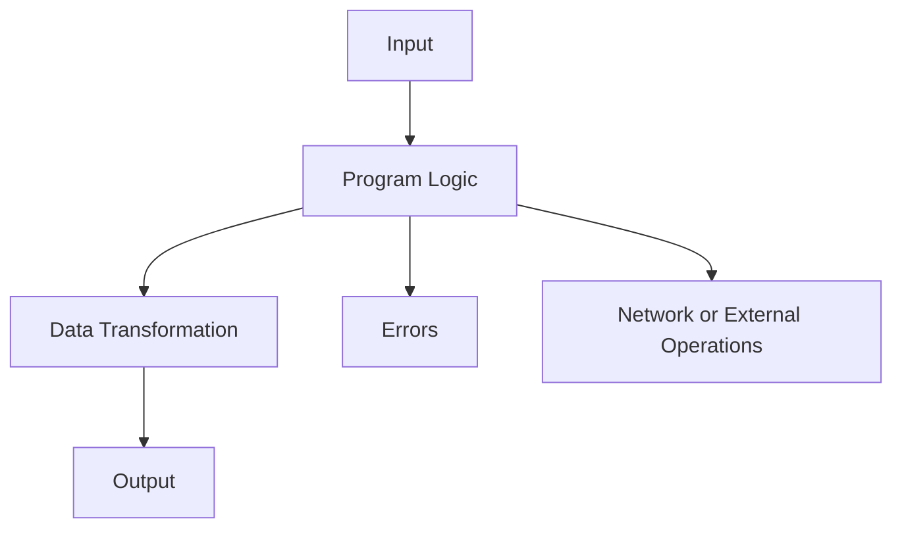

---

# 1. What Is a Program?

A program is a sequence of instructions that tells a computer what to do.

A simple program might:

```text
1. Ask for a name.
2. Store the name.
3. Create a greeting.
4. Display the greeting.
```

In code:

```javascript
const name = "Alex";
const greeting = `Hello, ${name}!`;

console.log(greeting);
```

Output:

```text
Hello, Alex!
```

A web application follows the same general pattern, but its inputs and outputs are more complex.

```text
Input:
  User click, form data, HTTP request

Processing:
  Validation, authentication, business logic

Output:
  UI update, HTTP response, database change
```

---

# 2. Values

A value is a piece of data.

Examples:

```javascript
"Alex"
42
true
null
["keyboard", "mouse"]
{ name: "Alex" }
```

Values can represent:

- Text
- Numbers
- Yes/no state
- Collections
- Structured records
- Missing information

---

# 3. Types

A type describes what kind of value something is.

Common JavaScript types include:

```text
String
Number
Boolean
Object
Array
Null
Undefined
```

Examples:

```javascript
"hello"       // String
42            // Number
true          // Boolean
null          // Null
undefined     // Undefined
[1, 2, 3]     // Array
{ id: 1 }     // Object
```

Types matter because operations behave differently depending on the data.

```javascript
"5" + "2"  // "52"
5 + 2      // 7
```

The first operation joins strings.

The second adds numbers.

---

# 4. Variables

A variable is a named reference to a value.

```javascript
let count = 0;
count = count + 1;
```

The variable `count` changes from:

```text
0 → 1
```

Variables allow programs to remember information during execution.

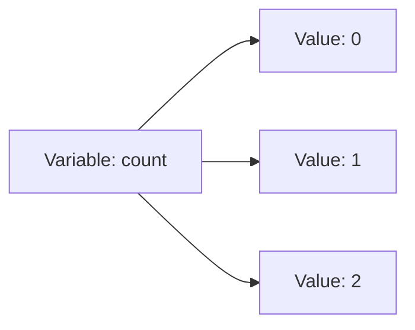

The variable name remains the same while its value may change.

---

# 5. `let`, `const`, and `var`

## `let`

Use `let` when a variable will be reassigned.

```javascript
let status = "loading";
status = "success";
```

## `const`

Use `const` when the variable binding should not be reassigned.

```javascript
const userId = 42;
```

This does not mean every nested value is deeply immutable.

```javascript
const user = {
  name: "Alex"
};

user.name = "Morgan"; // Usually allowed
```

The `user` variable still points to the same object.

## `var`

`var` is an older declaration style with different scope behavior. Modern JavaScript usually prefers `let` and `const`.

---

# 6. Naming Variables

Good names explain what values represent.

Poor:

```javascript
const x = 42;
```

Better:

```javascript
const userId = 42;
```

Poor:

```javascript
const d = 79.99;
```

Better:

```javascript
const productPrice = 79.99;
```

Useful names reduce the amount of explanation needed elsewhere.

Common naming styles:

```javascript
userId
productPrice
isLoading
hasPermission
createdAt
```

Boolean variables often begin with:

```text
is
has
can
should
```

---

# 7. Strings

A string is text.

Examples:

```javascript
const name = "Alex";
const message = 'Hello';
const path = `/products/123`;
```

Template literals use backticks:

```javascript
const userId = 42;
const url = `/api/users/${userId}`;
```

Result:

```text
/api/users/42
```

Strings are used for:

- User input
- URLs
- Messages
- Labels
- Identifiers
- JSON text
- File paths

---

# 8. String Operations

```javascript
const name = "Alex";

name.length;              // 4
name.toUpperCase();       // "ALEX"
name.toLowerCase();       // "alex"
name.includes("Al");      // true
name.startsWith("A");     // true
```

Combine strings:

```javascript
const first = "Alex";
const last = "Morgan";

const fullName = first + " " + last;
```

Or:

```javascript
const fullName = `${first} ${last}`;
```

---

# 9. Trimming and Normalizing Input

User input may contain extra spaces or inconsistent capitalization.

```javascript
const rawEmail = "  Alex@Example.com ";
const email = rawEmail.trim().toLowerCase();
```

Result:

```text
alex@example.com
```

Client-side normalization improves user experience, but the backend should apply its own validation and normalization rules.

---

# 10. Numbers

Numbers represent numeric values.

```javascript
const quantity = 2;
const price = 79.99;
const total = quantity * price;
```

Numbers are used for:

- Quantities
- Prices
- Counts
- Identifiers
- Pagination
- Timestamps
- Coordinates

Be careful with decimal arithmetic, especially for money.

```javascript
0.1 + 0.2
```

may not produce exactly:

```text
0.3
```

For financial systems, use integer minor units or decimal-safe libraries.

```javascript
const priceInCents = 7999;
```

---

# 11. Booleans

A boolean has one of two values:

```javascript
true
false
```

Examples:

```javascript
const isAuthenticated = true;
const hasPermission = false;
const isLoading = true;
```

Booleans are commonly used in conditions.

```javascript
if (isAuthenticated) {
  showAccount();
}
```

---

# 12. Null and Undefined

## `null`

Usually represents an intentional absence of a value.

```javascript
const selectedProduct = null;
```

This may mean:

```text
No product is currently selected.
```

## `undefined`

Usually means a value has not been assigned or does not exist.

```javascript
let result;
console.log(result); // undefined
```

An object property may also be missing:

```javascript
const user = {};
user.name; // undefined
```

Design API contracts carefully so clients understand the difference between:

```text
Missing field
null
Empty string
Empty array
```

---

# 13. Arrays

An array is an ordered collection.

```javascript
const products = [
  "Keyboard",
  "Mouse",
  "Monitor"
];
```

Access elements by index:

```javascript
products[0]; // "Keyboard"
products[1]; // "Mouse"
```

Indexes usually begin at zero.

```text
Index 0 = first item
Index 1 = second item
Index 2 = third item
```

Arrays are commonly used for:

- Product lists
- Search results
- Navigation items
- Messages
- Validation errors
- API collections

---

# 14. Array Operations

```javascript
const numbers = [1, 2, 3];

numbers.length;       // 3
numbers.includes(2);  // true
numbers.join(", ");   // "1, 2, 3"
```

Add an item:

```javascript
numbers.push(4);
```

Remove the last item:

```javascript
numbers.pop();
```

Modern application code often prefers non-mutating methods:

```javascript
const updated = [...numbers, 4];
```

---

# 15. Mapping Arrays

`map` transforms every item.

```javascript
const prices = [10, 20, 30];

const doubled = prices.map((price) => price * 2);
```

Result:

```javascript
[20, 40, 60]
```

API example:

```javascript
const products = [
  { name: "Keyboard", price: 79.99 },
  { name: "Mouse", price: 29.99 }
];

const names = products.map((product) => product.name);
```

Result:

```javascript
["Keyboard", "Mouse"]
```

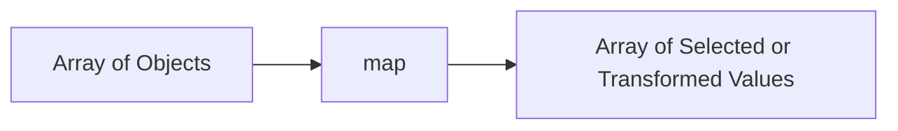

---

# 16. Filtering Arrays

`filter` returns only items that satisfy a condition.

```javascript
const products = [
  { name: "Keyboard", available: true },
  { name: "Mouse", available: false },
  { name: "Monitor", available: true }
];

const availableProducts = products.filter(
  (product) => product.available
);
```

Result:

```javascript
[
  { name: "Keyboard", available: true },
  { name: "Monitor", available: true }
]
```

Filtering is common for:

- Search results
- Permissions
- Status lists
- Categories
- Feature flags

---

# 17. Finding an Item

Use `find` to retrieve the first matching item.

```javascript
const products = [
  { id: 101, name: "Keyboard" },
  { id: 102, name: "Mouse" }
];

const product = products.find(
  (item) => item.id === 102
);
```

Result:

```javascript
{ id: 102, name: "Mouse" }
```

If no item matches:

```javascript
undefined
```

Handle that possibility.

---

# 18. Reducing Arrays

`reduce` combines array values into one result.

Calculate a total:

```javascript
const prices = [10, 20, 30];

const total = prices.reduce(
  (sum, price) => sum + price,
  0
);
```

Result:

```text
60
```

Order example:

```javascript
const items = [
  { price: 10, quantity: 2 },
  { price: 5, quantity: 3 }
];

const total = items.reduce(
  (sum, item) => sum + item.price * item.quantity,
  0
);
```

Remember that the server should calculate authoritative totals for important operations.

---

# 19. Objects

An object groups related values using named properties.

```javascript
const user = {
  id: 42,
  name: "Alex",
  email: "alex@example.com",
  isActive: true
};
```

Access properties:

```javascript
user.name;
user["email"];
```

Objects represent:

- Users
- Products
- Orders
- API responses
- Configuration
- Application state

---

# 20. Nested Objects

Objects can contain other objects and arrays.

```javascript
const order = {
  id: 9001,
  status: "pending",
  customer: {
    id: 42,
    name: "Alex"
  },
  items: [
    {
      productId: 123,
      quantity: 2
    }
  ]
};
```

This resembles JSON received from an API.

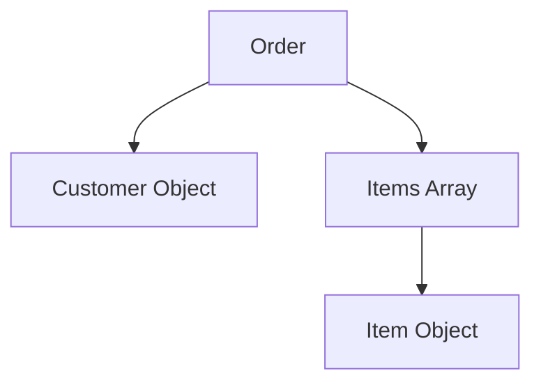

---

# 21. Destructuring

Destructuring extracts values from objects or arrays.

```javascript
const user = {
  id: 42,
  name: "Alex"
};

const { id, name } = user;
```

Array destructuring:

```javascript
const coordinates = [10, 20];
const [x, y] = coordinates;
```

Destructuring can make code clearer, but avoid extracting many values without meaningful names.

---

# 22. Spread Syntax

Spread syntax copies or combines values.

Object example:

```javascript
const user = {
  id: 42,
  name: "Alex"
};

const updatedUser = {
  ...user,
  name: "Morgan"
};
```

The original object remains unchanged.

Array example:

```javascript
const first = [1, 2];
const second = [3, 4];

const combined = [...first, ...second];
```

Result:

```javascript
[1, 2, 3, 4]
```

Spread syntax is common in frontend state updates.

---

# 23. Operators

Common arithmetic operators:

```javascript
+   Addition
-   Subtraction
*   Multiplication
/   Division
%   Remainder
```

Comparison operators:

```javascript
===  Strict equality
!==  Strict inequality
>    Greater than
<    Less than
>=   Greater than or equal
<=   Less than or equal
```

Logical operators:

```javascript
&&   And
||   Or
!    Not
```

Prefer strict equality:

```javascript
value === 5
```

rather than loose equality:

```javascript
value == 5
```

Strict comparison avoids unexpected type conversion.

---

# 24. Conditions

Conditions allow programs to choose different paths.

```javascript
const isAuthenticated = true;

if (isAuthenticated) {
  console.log("Show account");
} else {
  console.log("Show login");
}
```

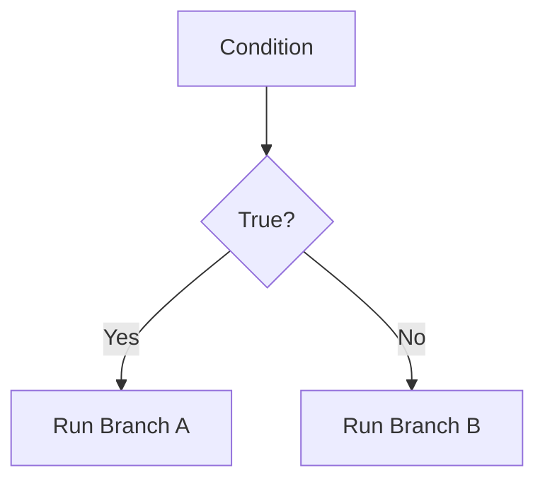

Conditions appear everywhere in web applications:

- Authentication
- Loading states
- Permissions
- Validation
- Error handling
- Feature flags
- Routing

---

# 25. Multiple Conditions

```javascript
if (status === "loading") {
  showSpinner();
} else if (status === "success") {
  showData();
} else if (status === "error") {
  showError();
} else {
  showIdleState();
}
```

A state model is often clearer than many unrelated boolean variables.

```javascript
const state = {
  status: "loading",
  data: null,
  error: null
};
```

---

# 26. Truthy and Falsy Values

JavaScript treats some values as false in conditions.

Common falsy values:

```text
false
0
""
null
undefined
NaN
```

Example:

```javascript
const name = "";

if (!name) {
  console.log("Name is missing");
}
```

Be careful because these may have different meanings:

```text
0
""
null
undefined
```

For API validation, explicit checks are often clearer.

---

# 27. Loops

A loop repeats work.

Traditional `for` loop:

```javascript
for (let i = 0; i < 3; i++) {
  console.log(i);
}
```

`for...of`:

```javascript
for (const product of products) {
  console.log(product.name);
}
```

Loops are useful for:

- Processing items
- Generating output
- Validating collections
- Retrying controlled operations
- Traversing data

---

# 28. Functions

A function is a reusable block of behavior.

```javascript
function greet(name) {
  return `Hello, ${name}!`;
}

const message = greet("Alex");
```

A function can:

- Receive inputs
- Perform work
- Return a result
- Produce side effects

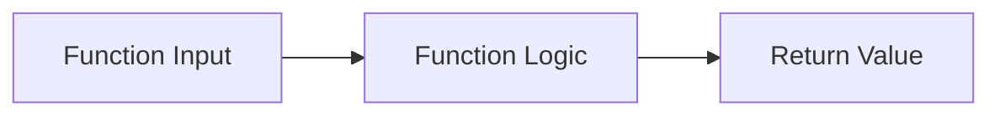

---

# 29. Function Parameters

Parameters are named inputs.

```javascript
function calculateTotal(price, quantity) {
  return price * quantity;
}

calculateTotal(79.99, 2);
```

The function receives:

```text
price = 79.99
quantity = 2
```

Validate important function inputs where appropriate.

---

# 30. Return Values

A function may return a value:

```javascript
function double(value) {
  return value * 2;
}
```

If no `return` is used, the result is usually:

```javascript
undefined
```

Functions may return:

- String
- Number
- Boolean
- Object
- Array
- Promise
- `null`

---

# 31. Arrow Functions

Arrow function:

```javascript
const double = (value) => value * 2;
```

Multiple statements:

```javascript
const calculateTotal = (price, quantity) => {
  const subtotal = price * quantity;
  return subtotal;
};
```

Arrow functions are common in array methods:

```javascript
products.map((product) => product.name);
```

---

# 32. Pure Functions

A pure function:

- Produces the same output for the same input.
- Does not modify external state.
- Does not perform unexpected side effects.

Example:

```javascript
function addTax(price, taxRate) {
  return price * (1 + taxRate);
}
```

Pure functions are easier to:

- Test
- Understand
- Reuse
- Debug

---

# 33. Side Effects

A side effect changes something outside the function’s local calculation.

Examples:

- Writing to a database
- Sending an HTTP request
- Updating the DOM
- Logging
- Changing global state
- Writing a file

```javascript
function saveUser(user) {
  return fetch("/api/users", {
    method: "POST",
    body: JSON.stringify(user)
  });
}
```

This function performs network I/O, so it has a side effect.

Separate pure transformation logic from side effects when practical.

---

# 34. Scope

Scope determines where a variable can be accessed.

```javascript
function example() {
  const message = "Hello";
  console.log(message);
}

example();

// message is not available here
```

Block scope:

```javascript
if (true) {
  const value = 42;
}

// value is not available here
```

Clear scope reduces accidental interference between parts of a program.

---

# 35. Closures

A closure occurs when a function remembers variables from the scope where it was created.

```javascript
function createCounter() {
  let count = 0;

  return function () {
    count += 1;
    return count;
  };
}

const counter = createCounter();

counter(); // 1
counter(); // 2
```

Closures appear in:

- Event handlers
- Callbacks
- Middleware
- Factory functions
- Frontend state management

---

# 36. Mutation

Mutation means changing an existing value.

```javascript
const user = {
  name: "Alex"
};

user.name = "Morgan";
```

Mutation can be valid, but it can make state changes harder to track.

In frontend state management, immutable updates are often preferred:

```javascript
const updatedUser = {
  ...user,
  name: "Morgan"
};
```

The original object remains unchanged.

---

# 37. Immutability

Immutability means treating values as unchanged after creation.

```javascript
const original = [1, 2, 3];
const updated = [...original, 4];
```

Benefits:

- Easier change detection
- Fewer hidden side effects
- Simpler debugging
- Safer state management
- Better predictability

Immutability does not mean data can never change. It means changes create new values rather than modifying old ones directly.

---

# 38. Modules

Modules divide code into files with explicit imports and exports.

`math.js`:

```javascript
export function add(a, b) {
  return a + b;
}
```

`app.js`:

```javascript
import { add } from "./math.js";

console.log(add(2, 3));
```

Modules help organize:

- Components
- Utilities
- API clients
- Validation
- Business logic
- Configuration

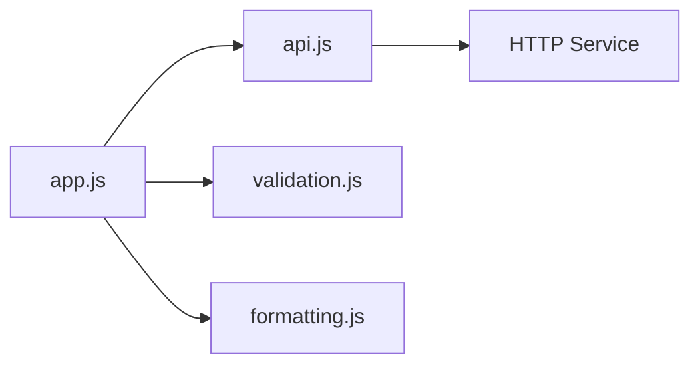

---

# 39. Errors

Errors occur when a program cannot complete an operation as expected.

Examples:

- Invalid input
- Missing file
- Network failure
- Database unavailable
- Permission denied
- Unexpected response
- Programming mistake

An error is not necessarily a bug. Some errors are expected environmental conditions.

---

# 40. Throwing Errors

JavaScript can throw an error:

```javascript
function divide(a, b) {
  if (b === 0) {
    throw new Error("Cannot divide by zero");
  }

  return a / b;
}
```

The caller should handle the possibility.

---

# 41. Try and Catch

```javascript
try {
  const result = divide(10, 0);
  console.log(result);
} catch (error) {
  console.error("Operation failed:", error.message);
}
```

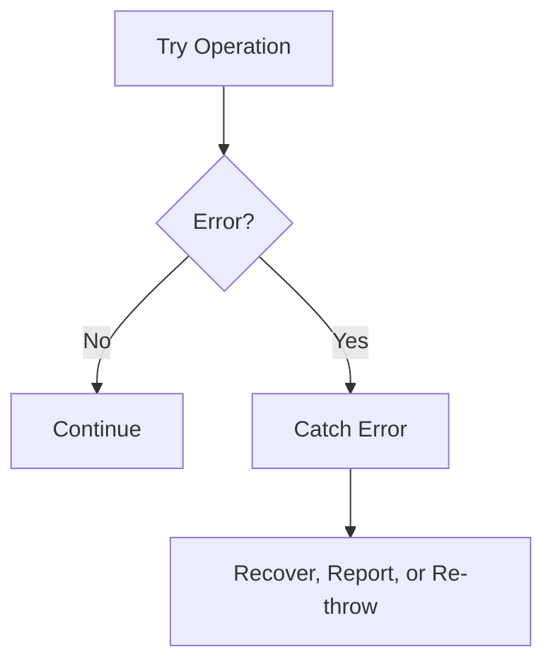

Do not silently catch errors without recording or handling them.

Bad:

```javascript
try {
  doSomething();
} catch {
  // Ignore everything
}
```

---

# 42. Error Categories

A useful classification:

## Validation error

Input is unacceptable.

```text
Quantity must be greater than zero.
```

## Authentication error

The caller is not properly identified.

```text
Session expired.
```

## Authorization error

The caller lacks permission.

```text
You cannot edit this resource.
```

## Network error

Communication failed.

```text
Unable to reach the server.
```

## Dependency error

Another service failed.

```text
Payment provider unavailable.
```

## Programming error

The code behaved unexpectedly.

```text
Cannot read property of undefined.
```

---

# 43. Asynchronous Work

Some operations take time:

- Network requests
- Database queries
- File reads
- Timers
- User interactions
- External API calls

Programs should not always freeze while waiting.

Asynchronous programming allows work to begin and complete later.

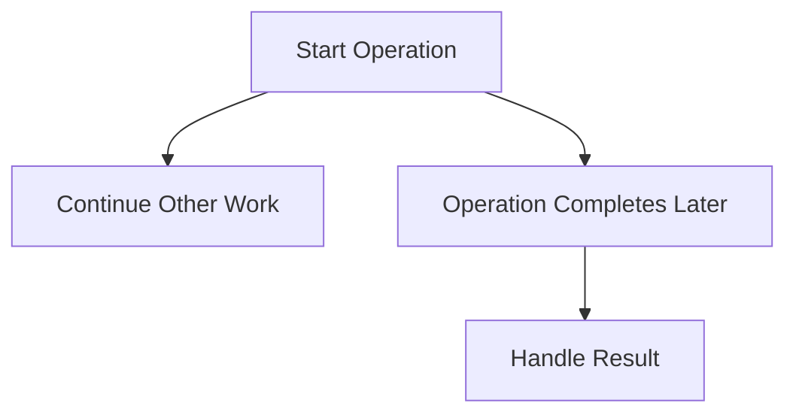

---

# 44. Callbacks

A callback is a function passed to another function to be called later.

```javascript
setTimeout(() => {
  console.log("Finished waiting");
}, 1000);
```

The arrow function runs after the timer completes.

Callbacks are useful, but deeply nested callbacks can become difficult to read.

---

# 45. Promises

A Promise represents a future result.

A Promise may be:

```text
Pending
Fulfilled
Rejected
```

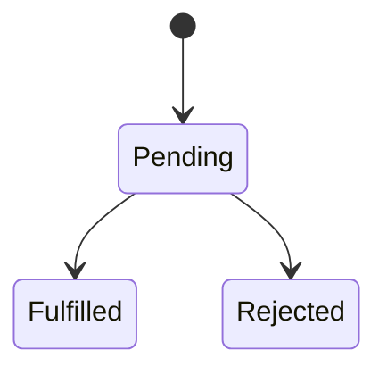

Example:

```javascript
fetch("/api/products")
  .then((response) => response.json())
  .then((data) => {
    console.log(data);
  })
  .catch((error) => {
    console.error(error);
  });
```

---

# 46. `async` and `await`

`async` and `await` provide a clearer way to work with Promises.

```javascript
async function loadProducts() {
  const response = await fetch("/api/products");
  const data = await response.json();

  return data;
}
```

Handle errors:

```javascript
async function loadProducts() {
  try {
    const response = await fetch("/api/products");

    if (!response.ok) {
      throw new Error(`HTTP error: ${response.status}`);
    }

    return await response.json();
  } catch (error) {
    console.error("Could not load products:", error);
    throw error;
  }
}
```

---

# 47. Important `fetch` Behavior

`fetch` usually rejects for network-level failures, but not automatically for every HTTP error.

This response may resolve normally:

```http
HTTP/1.1 404 Not Found
```

Therefore inspect:

```javascript
const response = await fetch("/api/products/999");

if (!response.ok) {
  throw new Error(`Request failed: ${response.status}`);
}
```

This distinction is essential in web applications.

---

# 48. Sequential vs Parallel Async Work

Sequential:

```javascript
const user = await loadUser();
const orders = await loadOrders();
```

The second request waits for the first.

Parallel:

```javascript
const [user, orders] = await Promise.all([
  loadUser(),
  loadOrders()
]);
```

Both begin at approximately the same time.

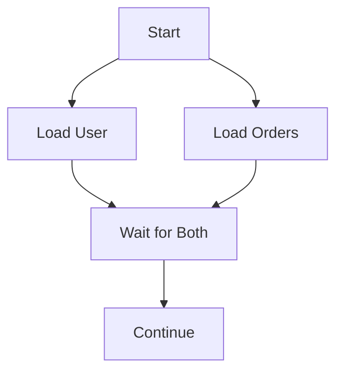

Use parallel execution only when operations do not depend on one another.

---

# 49. Request Cancellation

A user may navigate away while a request is still running.

Use cancellation mechanisms such as `AbortController`:

```javascript
const controller = new AbortController();

fetch("/api/products", {
  signal: controller.signal
});

controller.abort();
```

Cancellation can reduce:

- Unnecessary work
- Race conditions
- Stale response updates
- Bandwidth usage

---

# 50. Race Conditions in Async Code

Suppose a user searches:

```text
k
ke
key
keyb
```

Requests may complete out of order.

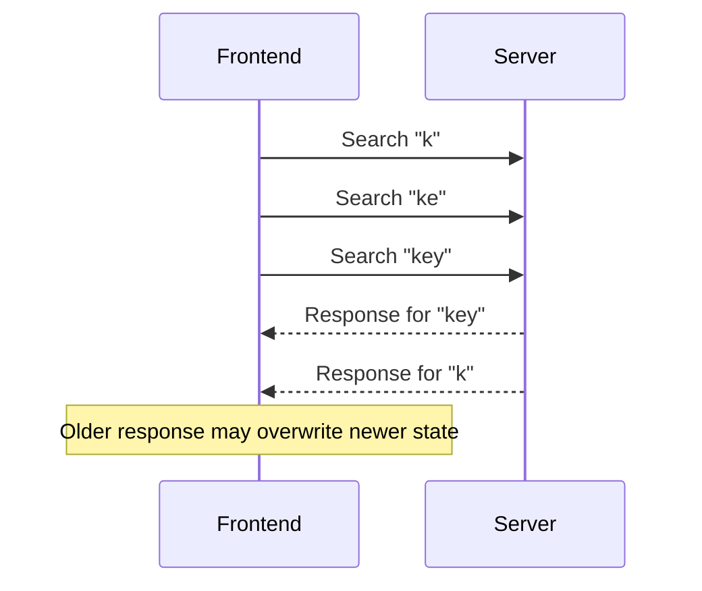

Solutions include:

- Debouncing
- Cancellation
- Request IDs
- Ignoring stale responses
- Server-side search sequencing

---

# 51. Data Transformation

Programs often transform data between formats.

Example API response:

```json
{
  "items": [
    {
      "name": "Keyboard",
      "price": 79.99
    }
  ]
}
```

Transform for display:

```javascript
const labels = data.items.map(
  (item) => `${item.name}: $${item.price}`
);
```

Result:

```javascript
["Keyboard: $79.99"]
```

Separate:

```text
Raw API data
from
Display formatting
```

This makes code easier to change.

---

# 52. Validation Function Example

```javascript
function validateOrder(order) {
  const errors = {};

  if (!Array.isArray(order.items)) {
    errors.items = "Items must be an array.";
  }

  if (order.items?.length === 0) {
    errors.items = "At least one item is required.";
  }

  return errors;
}
```

Frontend validation can improve feedback.

The backend must repeat validation independently.

---

# 53. Small State Machine Example

A request often moves through states:

```text
idle
loading
success
error
```

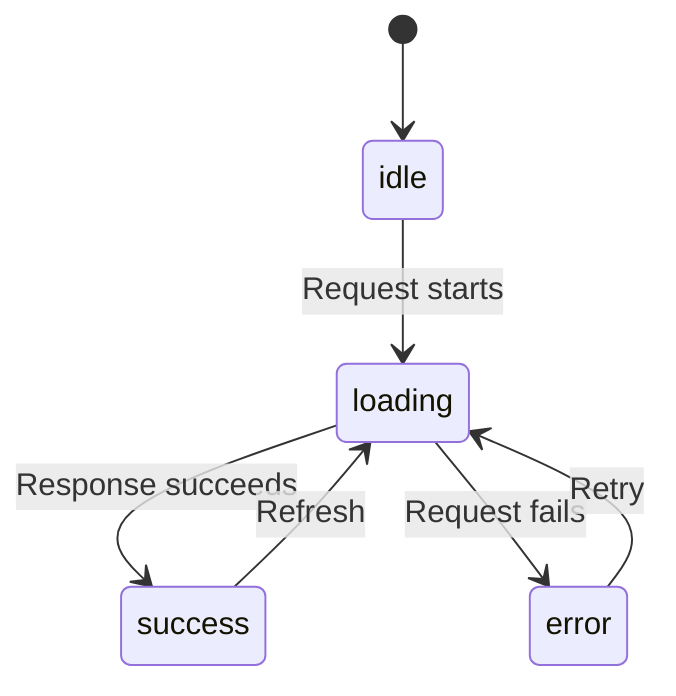

Representing this explicitly is often clearer than many booleans:

```javascript
const state = {
  status: "loading",
  data: null,
  error: null
};
```

---

# 54. Debugging Programs

Use:

```javascript
console.log(value);
console.error(error);
```

Better debugging includes:

- Clear variable names
- Small functions
- Breakpoints
- Input validation
- Structured errors
- Reproducible examples
- Tests

A useful debugging sequence:

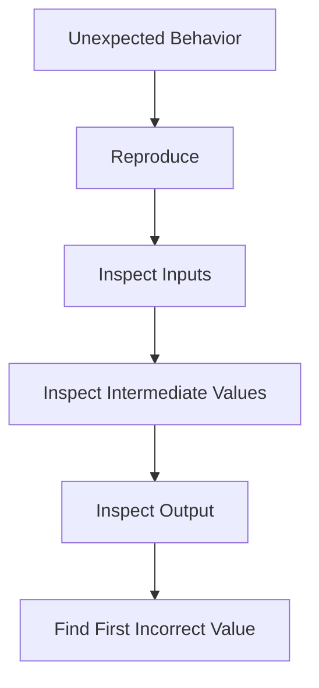

The first incorrect value is often closer to the real cause than the final error.

---

# 55. Programming Concepts in a Web Request

A backend endpoint uses many fundamentals:

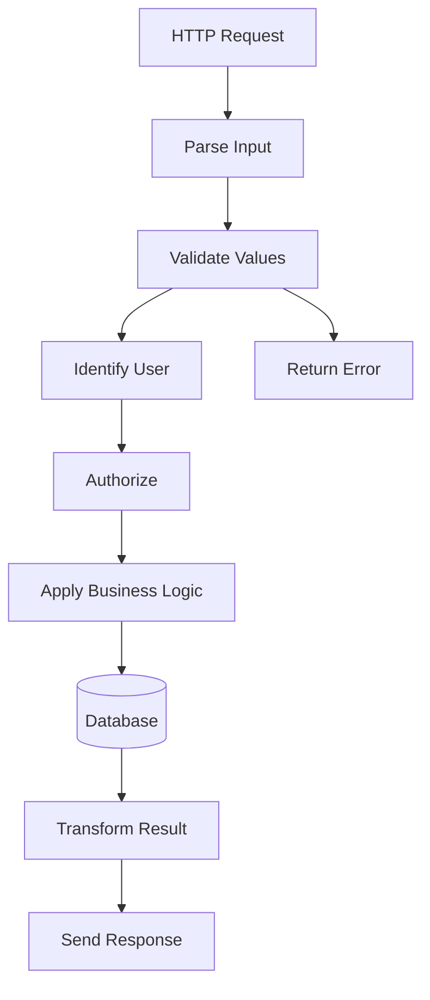

This involves:

```text
Variables
Objects
Arrays
Functions
Conditions
Errors
Async operations
Data transformation
```

---

# 56. Programming Exercise 1 — Product Total

Write a function:

```javascript
function calculateTotal(items) {
  // return total
}
```

Input:

```javascript
const items = [
  { price: 10, quantity: 2 },
  { price: 5, quantity: 3 }
];
```

Expected result:

```text
35
```

Possible solution:

```javascript
function calculateTotal(items) {
  return items.reduce(
    (total, item) => total + item.price * item.quantity,
    0
  );
}
```

---

# 57. Programming Exercise 2 — Filter Products

Input:

```javascript
const products = [
  { name: "Keyboard", available: true },
  { name: "Mouse", available: false },
  { name: "Monitor", available: true }
];
```

Create an array containing only available products:

```javascript
const available = products.filter(
  (product) => product.available
);
```

---

# 58. Programming Exercise 3 — Validate Quantity

```javascript
function validateQuantity(quantity) {
  if (!Number.isInteger(quantity)) {
    return "Quantity must be an integer.";
  }

  if (quantity <= 0) {
    return "Quantity must be greater than zero.";
  }

  return null;
}
```

Test:

```javascript
validateQuantity(2);    // null
validateQuantity(0);    // error
validateQuantity("2");  // error
```

---

# 59. Programming Exercise 4 — Load Data

```javascript
async function loadProduct(id) {
  const response = await fetch(`/api/products/${id}`);

  if (!response.ok) {
    throw new Error(`Failed with status ${response.status}`);
  }

  return await response.json();
}
```

Questions:

```text
What happens if the network fails?
What happens if the server returns 404?
What happens if the response is not valid JSON?
What should the interface display while waiting?
```

---

# 60. Programming Exercise 5 — Request State

Create state for:

```text
Idle
Loading
Success
Error
```

Possible model:

```javascript
const state = {
  status: "idle",
  data: null,
  error: null
};
```

Then update it:

```javascript
state.status = "loading";
```

In a real frontend, use the framework’s state-management approach rather than mutating shared state carelessly.

---

# 61. Key Concepts to Remember

```text
Value:
  A piece of data.

Type:
  The kind of data.

Variable:
  A named reference to a value.

Array:
  Ordered collection.

Object:
  Named properties grouped together.

Function:
  Reusable behavior.

Parameter:
  Function input.

Return value:
  Function output.

Condition:
  Decision logic.

Loop:
  Repeated work.

Scope:
  Where a variable is accessible.

Mutation:
  Changing an existing value.

Pure function:
  Same input produces same output without external side effects.

Promise:
  Future result of asynchronous work.

Exception:
  An error that interrupts normal execution.
```

---

# 62. Final Programming Mental Model

Programming is the process of turning inputs into outputs through controlled logic.

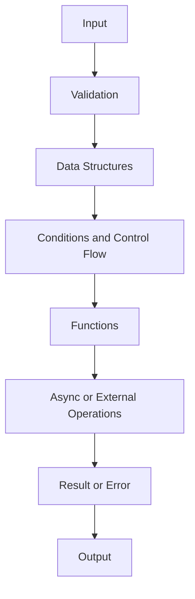

In web development:

```text
User input
  ↓
Frontend code
  ↓
HTTP request
  ↓
Backend function
  ↓
Validation
  ↓
Business logic
  ↓
Database or external service
  ↓
Response
  ↓
Frontend state update
```

The most important lesson is:

> Web applications are programs that continuously transform input into output while communicating with external systems and handling failure.
