# Foundation Primers

# Primer 4 — HTML, CSS, and JavaScript Basics  
## Structure, Presentation, Behavior, the DOM, Events, Forms, and Browser Interaction

---

# Primer Overview

Web applications are commonly built from three foundational technologies:

```text
HTML       Structure and meaning
CSS        Presentation and layout
JavaScript Behavior and interaction
```

A useful analogy is a building:

```text
HTML       = Structure and rooms
CSS        = Appearance, layout, and decoration
JavaScript = Controls, reactions, and behavior
```

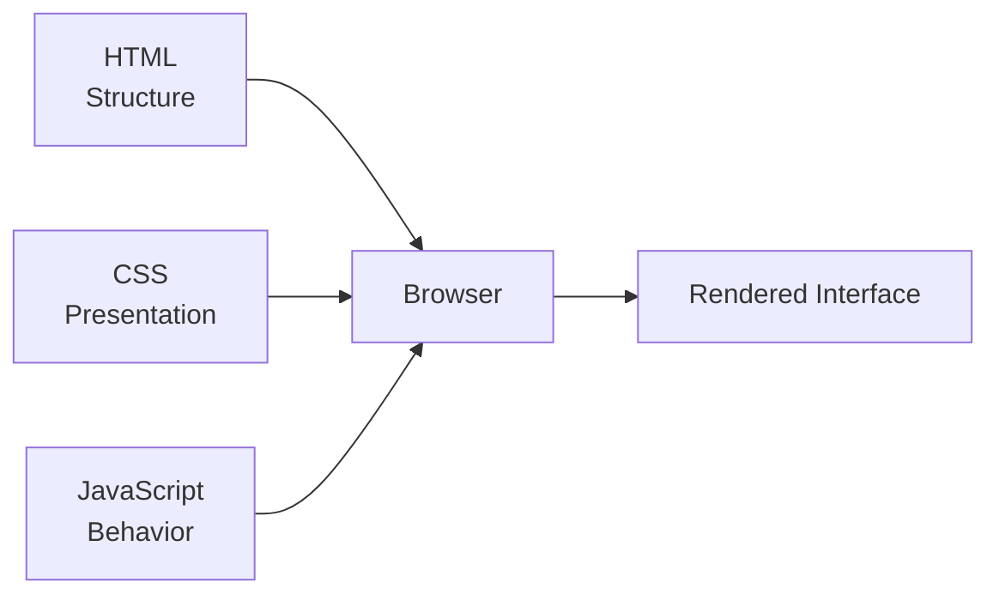

These technologies work together, but they are not the same thing.

This primer explains:

- HTML documents
- Elements and attributes
- Semantic HTML
- Links, images, forms, and buttons
- CSS selectors
- The cascade
- The box model
- Layout with Flexbox and Grid
- Responsive design
- JavaScript in the browser
- The DOM
- Events
- Forms
- Client-side validation
- `fetch`
- Loading and error states
- Browser storage
- Accessibility basics
- How these ideas connect to web architecture

---

# 1. What Happens When a Browser Loads a Page?

A browser receives resources and turns them into an interface.

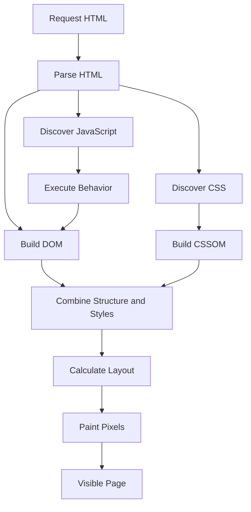

The browser:

1. Downloads HTML.
2. Parses the HTML.
3. Builds the DOM.
4. Downloads CSS.
5. Calculates styles and layout.
6. Downloads and executes JavaScript.
7. Responds to user interaction.
8. Updates the page when state changes.

---

# 2. Basic HTML Document

A basic HTML document looks like this:

```html
<!doctype html>
<html lang="en">
  <head>
    <meta charset="UTF-8" />
    <meta name="viewport" content="width=device-width, initial-scale=1.0" />
    <title>Product Catalog</title>
  </head>

  <body>
    <h1>Product Catalog</h1>
    <p>Browse available products.</p>
  </body>
</html>
```

Important parts:

```text
<!doctype html>
  Declares modern HTML.

<html>
  Root element.

<head>
  Metadata and resource references.

<body>
  Visible document content.

<title>
  Browser tab title.

<meta charset>
  Character encoding.

<meta viewport>
  Mobile layout behavior.
```

---

# 3. HTML Elements

HTML uses elements to describe content.

Examples:

```html
<h1>Page heading</h1>
<p>A paragraph.</p>
<a href="/products">View products</a>
<button>Add to cart</button>
```

An element generally consists of:

```text
Opening tag
Content
Closing tag
```

Example:

```html
<p>Hello</p>
```

```text
Opening tag: <p>
Content:     Hello
Closing tag: </p>
```

Some elements are void elements and do not have closing tags:

```html

<input type="email" />
<meta charset="UTF-8" />
```

---

# 4. HTML Attributes

Attributes provide additional information about elements.

Example:

```html
<a href="/products" class="nav-link">
  Products
</a>
```

Attributes:

```text
href  = Destination
class = CSS or JavaScript hook
```

Image example:

```html

```

Attributes can describe:

- Destination
- Identity
- Styling hooks
- Accessibility information
- Input behavior
- Data values
- Dimensions

---

# 5. Semantic HTML

Semantic HTML uses elements according to their meaning.

Prefer:

```html
<nav>
  <a href="/products">Products</a>
</nav>

<main>
  <article>
    <h1>Keyboard</h1>
  </article>
</main>
```

over using generic containers for everything:

```html
<div class="nav">
  <div class="link">Products</div>
</div>
```

Common semantic elements:

```html
<header>
<nav>
<main>
<section>
<article>
<aside>
<footer>
<form>
<button>
```

Semantic HTML improves:

- Accessibility
- Search understanding
- Maintainability
- Keyboard behavior
- Document structure

---

# 6. Headings

Use headings to describe document hierarchy.

```html
<h1>Product Catalog</h1>

<h2>Keyboards</h2>
<h3>Mechanical Keyboards</h3>
```

A page should generally have one primary `h1`, followed by logically nested headings.

Do not choose heading tags only because of their visual size. Use CSS for appearance.

---

# 7. Links and Navigation

A link navigates to another location.

```html
<a href="/products">Products</a>
```

External link:

```html
<a href="https://example.com">
  Visit example.com
</a>
```

Links should generally be used for navigation.

```text
Link = Go somewhere
Button = Perform an action
```

A button that opens a dialog should be:

```html
<button type="button">Open dialog</button>
```

not a fake link:

```html
<div onclick="openDialog()">Open dialog</div>
```

---

# 8. Buttons

Use buttons for actions:

```html
<button type="button">Add to cart</button>
```

Inside a form, specify the type deliberately:

```html
<button type="submit">Submit</button>
<button type="button">Cancel</button>
```

If no type is specified, a button inside a form may default to submit behavior.

That can cause unexpected page reloads.

---

# 9. Images

Use `alt` text:

```html

```

For decorative images:

```html

```

The `alt` value should communicate the image’s purpose, not repeat unnecessary details.

Images should usually include dimensions:

```html

```

This helps prevent layout shifts.

---

# 10. Forms

A form collects user input.

```html
<form>
  <label for="email">Email address</label>
  <input id="email" name="email" type="email" />

  <button type="submit">Sign up</button>
</form>
```

Important form concepts:

```text
form       = Group of controls
label      = Explains a control
input      = Collects a value
name       = Field name submitted to a server
type       = Expected input behavior
button     = Submits or controls the form
```

---

# 11. Input Types

Common input types:

```html
<input type="text" />
<input type="email" />
<input type="password" />
<input type="number" />
<input type="date" />
<input type="checkbox" />
<input type="radio" />
<input type="file" />
```

The type helps the browser provide:

- Appropriate controls
- Validation
- Mobile keyboards
- Accessibility information
- Input behavior

Client-side input types do not replace backend validation.

---

# 12. Labels

Every form control should have a clear label.

Explicit relationship:

```html
<label for="email">Email address</label>
<input id="email" name="email" type="email" />
```

Or wrapping relationship:

```html
<label>
  Email address
  <input name="email" type="email" />
</label>
```

Labels improve:

- Accessibility
- Click targets
- Form clarity
- Screen-reader behavior

---

# 13. CSS Basics

CSS controls presentation.

```css
body {
  font-family: sans-serif;
  color: #222;
}

button {
  background: #2563eb;
  color: white;
  padding: 0.75rem 1rem;
}
```

CSS rules contain:

```text
Selector
Declaration block
Property
Value
```

Example:

```css
button {
  color: white;
}
```

```text
Selector:  button
Property:  color
Value:     white
```

---

# 14. CSS Selectors

Element selector:

```css
p {
  line-height: 1.5;
}
```

Class selector:

```css
.card {
  border: 1px solid #ddd;
}
```

ID selector:

```css
#main-title {
  color: navy;
}
```

Descendant selector:

```css
.card h2 {
  font-size: 1.25rem;
}
```

Attribute selector:

```css
input[type="email"] {
  border-color: blue;
}
```

Classes are usually more reusable than IDs for styling.

---

# 15. The Cascade

The cascade determines which CSS rules apply when multiple rules target the same element.

Factors include:

- Importance
- Specificity
- Source order
- Inheritance

Example:

```css
button {
  color: black;
}

.primary {
  color: white;
}
```

```html
<button class="primary">Buy</button>
```

The class rule generally has greater specificity.

In Developer Tools, crossed-out CSS rules show which declarations were overridden.

---

# 16. The Box Model

Every visible element is treated as a box.

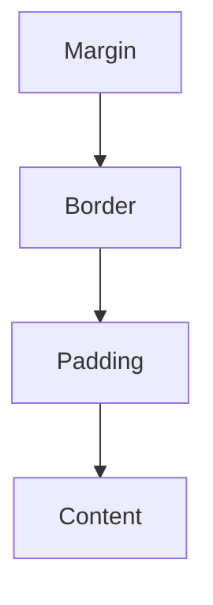

The parts are:

```text
Content
Padding
Border
Margin
```

Example:

```css
.card {
  width: 300px;
  padding: 20px;
  border: 1px solid #ccc;
  margin: 16px;
}
```

The final visible size may be larger than `width` depending on `box-sizing`.

---

# 17. `box-sizing`

Many applications use:

```css
* {
  box-sizing: border-box;
}
```

With `border-box`, the declared width includes:

```text
Content
Padding
Border
```

Without it, padding and border may be added outside the declared width.

This often makes layout calculations easier.

---

# 18. Display Types

Common display values:

```css
display: block;
display: inline;
display: inline-block;
display: flex;
display: grid;
display: none;
```

## Block

Starts on a new line and usually takes available width.

## Inline

Flows within text.

## Flex

Arranges items along one main axis.

## Grid

Arranges items across rows and columns.

## None

Removes the element from layout.

---

# 19. Flexbox

Flexbox is useful for one-dimensional layouts.

```css
.nav {
  display: flex;
  justify-content: space-between;
  align-items: center;
  gap: 1rem;
}
```

Important properties:

```text
display: flex
flex-direction
justify-content
align-items
gap
flex-wrap
flex-grow
flex-shrink
```

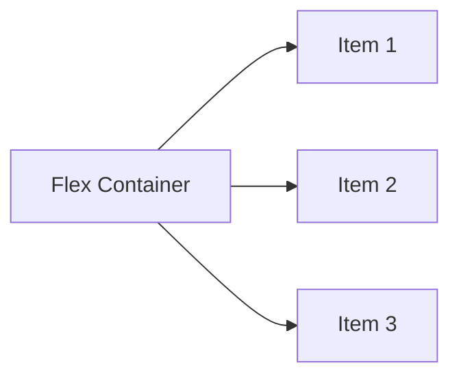

Flexbox is useful for:

- Navigation bars
- Button groups
- Horizontal cards
- Centering
- Toolbars
- Small layout groups

---

# 20. CSS Grid

Grid is useful for two-dimensional layouts.

```css
.products {
  display: grid;
  grid-template-columns: repeat(3, 1fr);
  gap: 1rem;
}
```

Grid is useful for:

- Product catalogs
- Dashboards
- Forms
- Page layouts
- Card collections

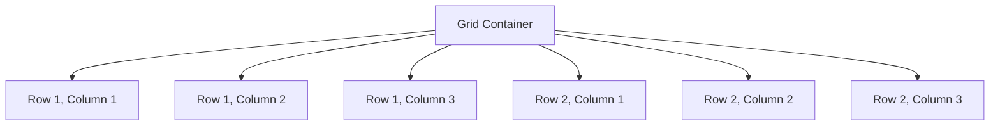

---

# 21. Responsive Design

Responsive design allows an interface to adapt to different screen sizes.

```css
.products {
  display: grid;
  grid-template-columns: 1fr;
}

@media (min-width: 700px) {
  .products {
    grid-template-columns: repeat(2, 1fr);
  }
}

@media (min-width: 1000px) {
  .products {
    grid-template-columns: repeat(4, 1fr);
  }
}
```

Test:

- Narrow mobile width
- Wide mobile width
- Tablet width
- Desktop width
- Large desktop width
- Landscape orientation
- Zoomed text

---

# 22. CSS Units

Common units:

```text
px
%
rem
em
vw
vh
fr
```

Examples:

```css
padding: 1rem;
width: 100%;
font-size: 1.25rem;
height: 100vh;
```

General ideas:

```text
px  = Fixed pixel unit
%   = Relative to a containing context
rem = Relative to root font size
em  = Relative to current font size
vw  = Viewport width
vh  = Viewport height
fr  = Grid fraction
```

---

# 23. JavaScript in the Browser

JavaScript can be included in HTML:

```html
<script src="/app.js"></script>
```

Or written inline:

```html
<script>
  console.log("Page loaded");
</script>
```

Prefer separate files for larger applications.

JavaScript can:

- Inspect the DOM
- Respond to events
- Validate input
- Send HTTP requests
- Update interface state
- Store data
- Display errors

---

# 24. The DOM

The browser converts HTML into a tree-like DOM.

HTML:

```html
<main>
  <h1>Products</h1>
  <button>Add</button>
</main>
```

DOM:

```text
Document
└── main
    ├── h1
    │   └── "Products"
    └── button
        └── "Add"
```

JavaScript can access the DOM:

```javascript
const heading = document.querySelector("h1");
heading.textContent = "Product Catalog";
```

---

# 25. Selecting Elements

```javascript
document.querySelector("h1");
document.querySelector(".card");
document.querySelector("#email");
document.querySelectorAll("button");
```

`querySelector` returns the first match.

`querySelectorAll` returns a collection of matches.

Use meaningful selectors and avoid depending on fragile generated class names.

---

# 26. Changing Classes and Styles

```javascript
const menu = document.querySelector(".menu");

menu.classList.add("open");
menu.classList.remove("hidden");
menu.classList.toggle("active");
```

Prefer changing classes rather than setting many inline styles directly.

CSS should generally control presentation, while JavaScript controls state.

---

# 27. Events

An event represents something that happened.

Examples:

```text
click
submit
input
change
keydown
focus
blur
load
scroll
resize
```

Add an event listener:

```javascript
const button = document.querySelector("button");

button.addEventListener("click", () => {
  console.log("Clicked");
});
```

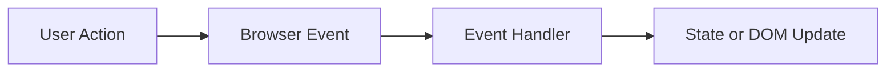

---

# 28. Event Objects

Event handlers receive an event object.

```javascript
button.addEventListener("click", (event) => {
  console.log(event.target);
});
```

For forms:

```javascript
form.addEventListener("submit", (event) => {
  event.preventDefault();
});
```

`preventDefault()` stops the browser’s default behavior, such as navigating or submitting a form traditionally.

---

# 29. Event Bubbling

Events often move from the original target upward through ancestors.

```html
<div class="card">
  <button>Buy</button>
</div>
```

A click on the button may also reach the card.

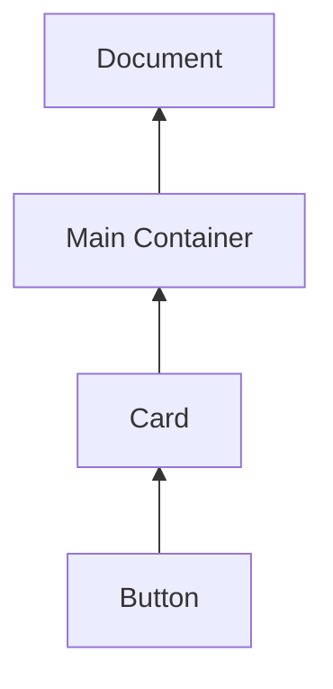

This is called event bubbling.

You can inspect:

```javascript
event.target
event.currentTarget
```

They may differ:

```text
target          = Original clicked element
currentTarget   = Element whose handler is running
```

---

# 30. Event Delegation

Instead of adding a listener to every button, listen on a parent.

```javascript
document.querySelector(".products")
  .addEventListener("click", (event) => {
    const button = event.target.closest("[data-product-id]");

    if (!button) return;

    const productId = button.dataset.productId;
    console.log(productId);
  });
```

Event delegation is useful for:

- Dynamic lists
- Tables
- Repeated controls
- Elements created after initial page load

---

# 31. Forms and Submission

```javascript
const form = document.querySelector("form");

form.addEventListener("submit", (event) => {
  event.preventDefault();

  const formData = new FormData(form);
  const email = formData.get("email");

  console.log(email);
});
```

Form submission flow:

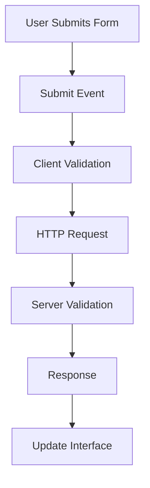

The server must validate independently.

---

# 32. Client-Side Validation

```javascript
const emailInput = document.querySelector("#email");

if (!emailInput.value.includes("@")) {
  emailInput.setCustomValidity("Enter a valid email.");
} else {
  emailInput.setCustomValidity("");
}
```

Client validation improves feedback but is not a security control.

A malicious client can send:

```json
{
  "email": "not-an-email"
}
```

directly to the backend.

---

# 33. Fetching API Data

```javascript
async function loadProducts() {
  const response = await fetch("/api/products");

  if (!response.ok) {
    throw new Error(`Request failed: ${response.status}`);
  }

  return await response.json();
}
```

Use the result:

```javascript
loadProducts()
  .then((products) => {
    console.log(products);
  })
  .catch((error) => {
    console.error(error);
  });
```

---

# 34. Sending JSON

```javascript
async function createOrder(order) {
  const response = await fetch("/api/orders", {
    method: "POST",
    headers: {
      "Content-Type": "application/json",
      "Accept": "application/json"
    },
    body: JSON.stringify(order)
  });

  if (!response.ok) {
    throw new Error(`Order failed: ${response.status}`);
  }

  return await response.json();
}
```

The request contains:

```text
Method:
  POST

Headers:
  Content-Type: application/json

Body:
  Serialized JSON
```

---

# 35. Loading, Success, Empty, and Error States

A robust frontend represents request states explicitly.

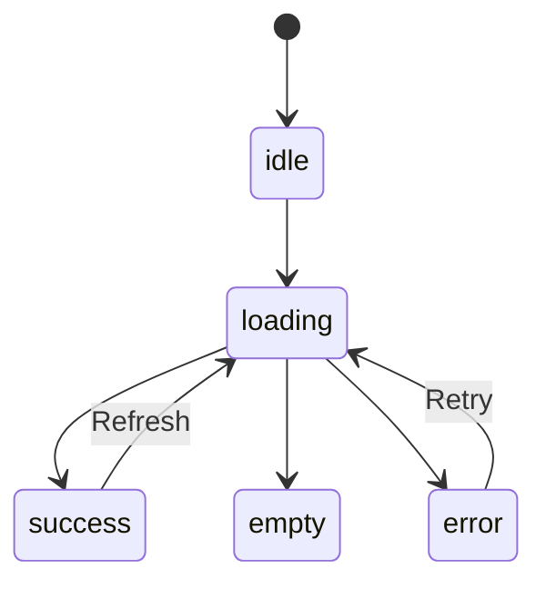

Possible interface states:

```text
Idle:
  No request yet

Loading:
  Fetching data

Success:
  Data available

Empty:
  Request succeeded but no records exist

Error:
  Request failed
```

Do not show a blank screen for all states.

---

# 36. Browser Storage

Common browser storage mechanisms:

```text
Cookies
localStorage
sessionStorage
IndexedDB
Cache Storage
```

Example:

```javascript
localStorage.setItem("theme", "dark");
const theme = localStorage.getItem("theme");
```

Do not store highly sensitive secrets casually in local storage because JavaScript can generally access it.

---

# 37. Accessibility Basics

Accessible HTML benefits everyone.

Checklist:

```text
[ ] Use semantic elements.
[ ] Label form controls.
[ ] Provide alt text for meaningful images.
[ ] Support keyboard navigation.
[ ] Show visible focus.
[ ] Use sufficient color contrast.
[ ] Use headings logically.
[ ] Associate errors with fields.
[ ] Do not rely on color alone.
[ ] Use buttons for actions and links for navigation.
```

Example accessible error:

```html
<label for="email">Email</label>
<input
  id="email"
  name="email"
  aria-describedby="email-error"
/>
<p id="email-error">
  Enter a valid email address.
</p>
```

---

# 38. Progressive Enhancement

Progressive enhancement means starting with useful basic HTML, then adding CSS and JavaScript enhancements.

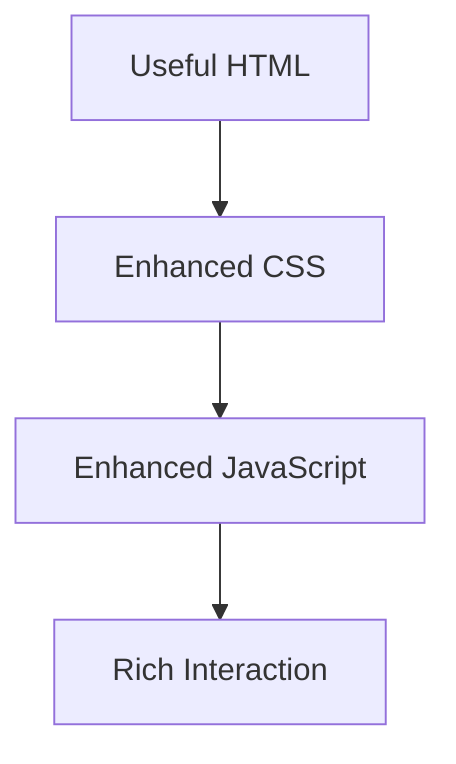

For example:

```html
<form action="/search" method="get">
  <label for="q">Search</label>
  <input id="q" name="q" />
  <button type="submit">Search</button>
</form>
```

JavaScript may enhance the experience with live suggestions, but the basic form still has a meaningful fallback.

---

# 39. Primer Exercise 1 — Build a Product Card

HTML:

```html
<article class="product-card">
  <h2>Mechanical Keyboard</h2>
  <p class="price">$79.99</p>
  <button type="button" data-product-id="123">
    Add to cart
  </button>
</article>
```

CSS:

```css
.product-card {
  border: 1px solid #ddd;
  padding: 1rem;
  border-radius: 0.5rem;
}

.price {
  font-weight: bold;
}
```

JavaScript:

```javascript
const button = document.querySelector("[data-product-id]");

button.addEventListener("click", () => {
  const productId = button.dataset.productId;
  console.log(`Adding product ${productId}`);
});
```

---

# 40. Primer Exercise 2 — Build a Form

```html
<form id="signup-form">
  <label for="email">Email address</label>
  <input id="email" name="email" type="email" required />

  <button type="submit">Sign up</button>

  <p id="message" aria-live="polite"></p>
</form>
```

JavaScript:

```javascript
const form = document.querySelector("#signup-form");
const message = document.querySelector("#message");

form.addEventListener("submit", (event) => {
  event.preventDefault();

  const formData = new FormData(form);
  const email = formData.get("email");

  message.textContent = `Submitted: ${email}`;
});
```

---

# 41. Primer Exercise 3 — Fetch and Render Products

HTML:

```html
<section>
  <h1>Products</h1>
  <p id="status">Loading...</p>
  <ul id="products"></ul>
</section>
```

JavaScript:

```javascript
async function loadProducts() {
  const status = document.querySelector("#status");
  const list = document.querySelector("#products");

  try {
    const response = await fetch("/api/products");

    if (!response.ok) {
      throw new Error(`Request failed: ${response.status}`);
    }

    const data = await response.json();

    list.innerHTML = "";

    for (const product of data.items) {
      const item = document.createElement("li");
      item.textContent = `${product.name} - $${product.price}`;
      list.appendChild(item);
    }

    status.textContent = "";
  } catch (error) {
    status.textContent = "Unable to load products.";
    console.error(error);
  }
}

loadProducts();
```

Using `textContent` instead of inserting untrusted data through `innerHTML` is safer.

---

# 42. Common Beginner Mistakes

## Mistake 1: Using `div` for every element

Use semantic HTML where possible.

## Mistake 2: Using links for actions

Use buttons for actions.

## Mistake 3: Forgetting `preventDefault`

Forms may reload or navigate unexpectedly.

## Mistake 4: Assuming client validation is security

The backend must validate.

## Mistake 5: Parsing every response as JSON

A `204`, HTML error page, or binary response may not be JSON.

## Mistake 6: Ignoring loading and error states

Users need feedback while work is happening.

## Mistake 7: Using `innerHTML` with untrusted content

Prefer safe text insertion or sanitization.

## Mistake 8: Forgetting image dimensions

This can cause layout shifts.

## Mistake 9: Styling based only on visual appearance

Structure and accessibility matter too.

---

# 43. Key Concepts to Remember

```text
HTML:
  Structure and meaning.

CSS:
  Presentation and layout.

JavaScript:
  Behavior and interaction.

DOM:
  Browser’s in-memory representation of HTML.

Element:
  A structured HTML node.

Attribute:
  Additional information attached to an element.

Selector:
  A CSS pattern used to target elements.

Event:
  Something that happened in the browser.

Handler:
  Code that responds to an event.

Form:
  A collection of user-input controls.

Fetch:
  Browser API for network requests.

State:
  Information describing the current interface or application condition.

Responsive design:
  Layout that adapts to different screen sizes.

Accessibility:
  Designing interfaces usable by people with varied abilities and technologies.
```

---

# 44. Final Web Frontend Mental Model

The browser combines structure, style, and behavior:

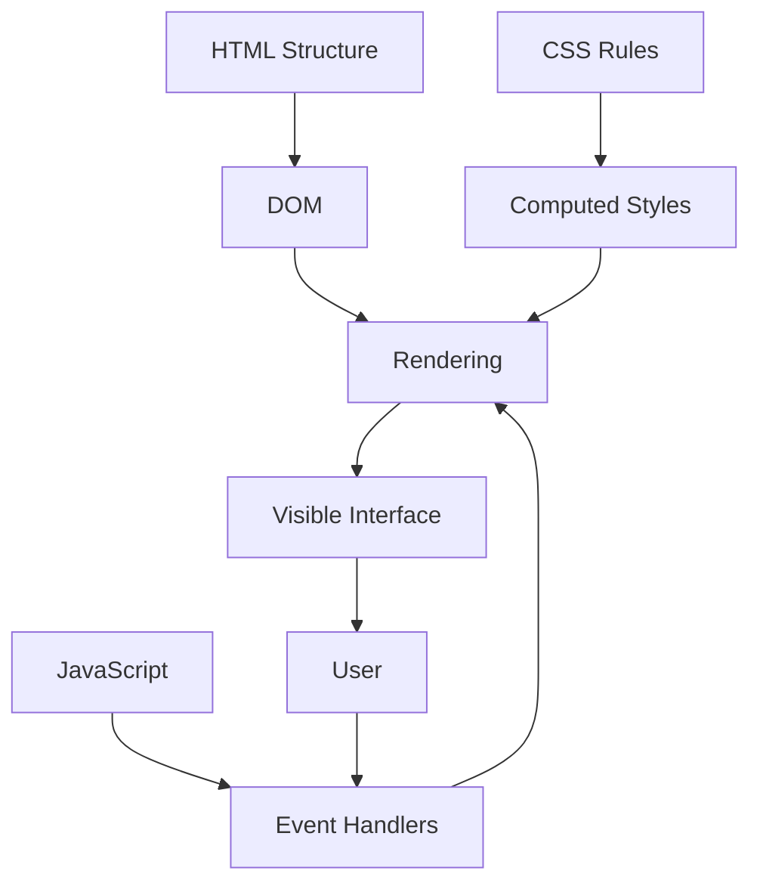

A typical interaction is:

```text
User clicks button
  ↓
Browser creates event
  ↓
JavaScript handler runs
  ↓
Frontend validates input
  ↓
Frontend sends HTTP request
  ↓
Backend responds
  ↓
JavaScript parses response
  ↓
Frontend updates state
  ↓
DOM changes
  ↓
Browser renders new interface
```

The most important lesson is:

> HTML gives the browser structure, CSS gives it presentation, and JavaScript gives it behavior.
