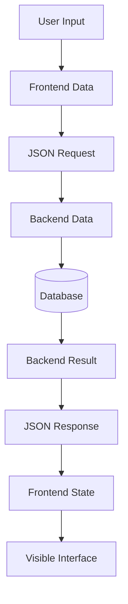
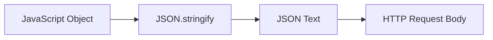
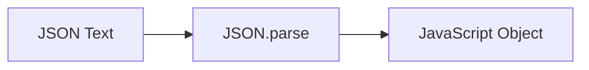
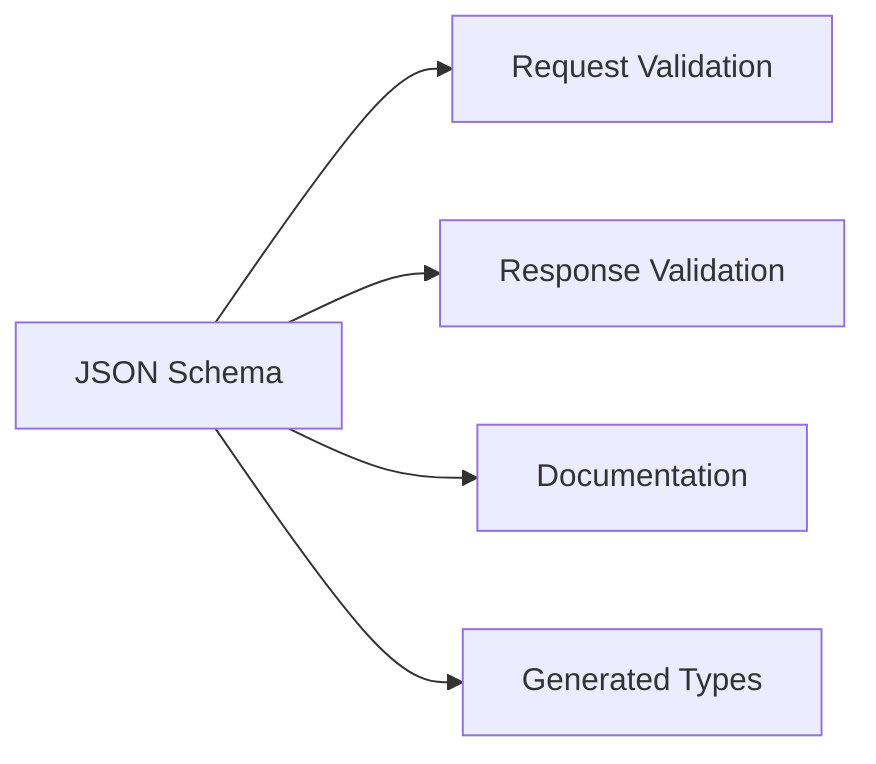
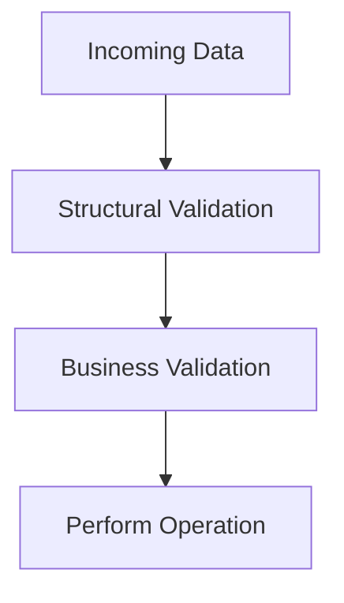
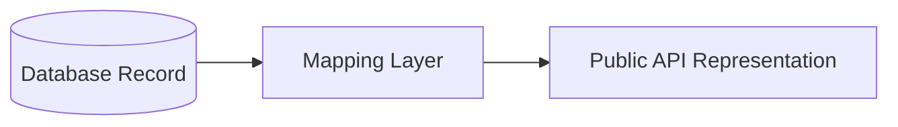
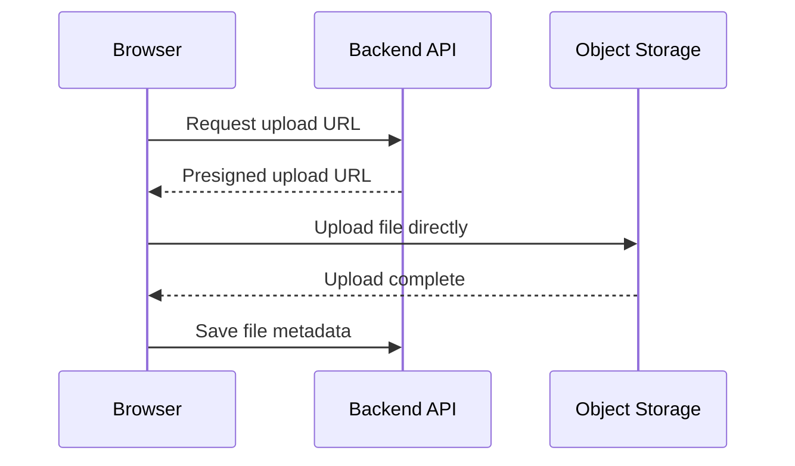
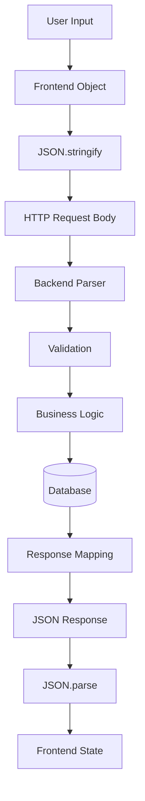

# Foundation Primers

# Primer 5 — Data and JSON Fundamentals for Web Learners  
## Objects, Arrays, Serialization, Schemas, Validation, Dates, Money, and API Data

---

# Primer Overview

Web applications constantly move data between systems.

Examples:

- A browser sends form data to a backend.
- An API returns product information.
- A backend stores user records in a database.
- A payment provider sends a webhook.
- A queue carries background jobs.
- A mobile application requests account data.

All of these interactions require data to be represented in a form that different systems can understand.

A JavaScript object in memory cannot travel directly across the Internet. It must be converted into text or bytes.

This process is called **serialization**.


The most common text format used by web APIs is **JSON**.

This primer explains:

- What data is
- Values and types
- Objects and arrays
- JSON syntax
- Serialization
- Deserialization
- JSON versus JavaScript objects
- Nested data
- Missing, `null`, and empty values
- Dates and times
- Money and decimal values
- Identifiers
- Enums
- Schemas
- Validation
- API request and response design
- Common data mistakes
- Practical exercises

---

# 1. What Is Data?

Data is information represented in a form that software can store, process, or transfer.

Examples:

```text
User name:
Alex

Product price:
79.99

Order status:
pending

Account active:
true

Product tags:
["office", "mechanical"]
```

A web application transforms data repeatedly:

```text
User input
  ↓
Browser data structure
  ↓
JSON request
  ↓
Backend object
  ↓
Database record
  ↓
JSON response
  ↓
Frontend state
  ↓
Visible interface
```



---

# 2. Structured and Unstructured Data

## Unstructured data

Unstructured data does not follow a clearly defined arrangement.

Examples:

```text
A paragraph
An image
An audio file
A video
```

## Structured data

Structured data follows an identifiable arrangement.

Example:

```json
{
  "id": 123,
  "name": "Keyboard",
  "price": 79.99
}
```

Structured data is easier for programs to:

- Validate
- Search
- Transform
- Store
- Compare
- Transfer

---

# 3. Primitive Data Values

Common primitive values include:

```javascript
"Keyboard"  // string
79.99        // number
true         // boolean
false        // boolean
null         // intentional absence
undefined    // missing or unassigned in JavaScript
```

JSON supports:

```text
String
Number
Boolean
Object
Array
null
```

JSON does not have a separate native type for:

- Date
- Time
- Decimal
- Set
- Map
- Function
- Undefined
- Binary data

These must be represented using supported JSON values or another serialization format.

---

# 4. JSON

JSON stands for:

```text
JavaScript Object Notation
```

It is a text format used to represent structured data.

Despite its name, JSON is language-independent.

It is supported by:

- JavaScript
- Python
- Java
- Go
- C#
- PHP
- Ruby
- Rust
- Swift
- Kotlin
- Many databases and tools

Example:

```json
{
  "id": 123,
  "name": "Mechanical Keyboard",
  "price": 79.99,
  "available": true
}
```

---

# 5. JSON Objects

A JSON object is surrounded by curly braces:

```json
{
  "name": "Alex",
  "age": 30
}
```

An object contains key-value pairs.

```text
Key       Value
name      "Alex"
age       30
```

Keys must be strings enclosed in double quotes.

Valid:

```json
{
  "name": "Alex"
}
```

Invalid:

```json
{
  name: "Alex"
}
```

---

# 6. JSON Arrays

A JSON array is surrounded by square brackets:

```json
[
  "keyboard",
  "mouse",
  "monitor"
]
```

Arrays contain ordered values.

An array can contain objects:

```json
[
  {
    "id": 1,
    "name": "Keyboard"
  },
  {
    "id": 2,
    "name": "Mouse"
  }
]
```

API collection responses often use arrays.

---

# 7. JSON Syntax Rules

JSON requires:

```text
Double quotes for keys
Double quotes for strings
Commas between items
No trailing comma after the final item
Curly braces for objects
Square brackets for arrays
```

Valid:

```json
{
  "id": 123,
  "name": "Keyboard",
  "tags": ["office", "mechanical"]
}
```

Invalid:

```json
{
  "id": 123,
  "name": "Keyboard",
}
```

The trailing comma is invalid in standard JSON.

---

# 8. JSON Versus JavaScript Objects

These look similar:

JavaScript object:

```javascript
const product = {
  id: 123,
  name: "Keyboard"
};
```

JSON:

```json
{
  "id": 123,
  "name": "Keyboard"
}
```

Important differences:

| JavaScript object | JSON |
|---|---|
| Exists in program memory | Exists as text |
| Keys may be unquoted in some cases | Keys must use double quotes |
| Can contain functions | Cannot contain functions |
| Can contain `undefined` | Cannot represent `undefined` directly |
| Can contain `Date` objects | Dates become strings |
| Can contain custom classes | Only JSON-supported values |
| Can have comments in source contexts | Standard JSON has no comments |

JSON is a transfer format. A JavaScript object is an in-memory program value.

---

# 9. Serialization

Serialization converts an in-memory value into JSON text.

JavaScript:

```javascript
const product = {
  id: 123,
  name: "Keyboard",
  price: 79.99
};

const json = JSON.stringify(product);
```

Result:

```text
{"id":123,"name":"Keyboard","price":79.99}
```

This text can be:

- Sent over HTTP
- Saved to a file
- Stored in a cache
- Placed in a message queue



---

# 10. Deserialization

Deserialization converts JSON text back into an in-memory value.

```javascript
const json = '{"id":123,"name":"Keyboard"}';

const product = JSON.parse(json);

console.log(product.name);
```

Result:

```text
Keyboard
```

The process is:



---

# 11. JSON in HTTP APIs

A typical JSON request:

```http
POST /api/products HTTP/1.1
Content-Type: application/json
Accept: application/json

{
  "name": "Keyboard",
  "price": 79.99
}
```

The `Content-Type` header tells the server:

```text
Interpret the body as JSON.
```

A JSON response:

```http
HTTP/1.1 201 Created
Content-Type: application/json

{
  "id": 123,
  "name": "Keyboard",
  "price": 79.99
}
```

The response header tells the client:

```text
The body contains JSON.
```

---

# 12. Nested JSON Objects

Objects can contain other objects.

```json
{
  "id": 9001,
  "customer": {
    "id": 42,
    "name": "Alex",
    "address": {
      "city": "Toronto",
      "country": "Canada"
    }
  }
}
```

Access in JavaScript:

```javascript
order.customer.name;
order.customer.address.city;
```

Deep nesting can accurately represent relationships, but excessively deep responses may become difficult to use and expensive to generate.

---

# 13. Arrays of Objects

A common API response:

```json
{
  "items": [
    {
      "id": 123,
      "name": "Keyboard",
      "price": 79.99
    },
    {
      "id": 456,
      "name": "Mouse",
      "price": 29.99
    }
  ]
}
```

Process in JavaScript:

```javascript
for (const product of response.items) {
  console.log(product.name);
}
```

Or:

```javascript
const names = response.items.map(
  (product) => product.name
);
```

---

# 14. Collection Response Design

An API may return a bare array:

```json
[
  {
    "id": 123,
    "name": "Keyboard"
  }
]
```

Or a wrapped collection:

```json
{
  "items": [
    {
      "id": 123,
      "name": "Keyboard"
    }
  ],
  "page": 1,
  "limit": 20,
  "total": 100
}
```

A wrapped response is often more extensible because metadata can be added without changing the top-level type.

Possible metadata:

```text
Page number
Page size
Total count
Next cursor
Previous cursor
Applied filters
```

---

# 15. `null`, Missing, and Empty Values

These forms are different:

```json
{}
```

```json
{
  "description": null
}
```

```json
{
  "description": ""
}
```

```json
{
  "tags": []
}
```

Possible meanings:

```text
Missing field:
  Not provided or not applicable.

null:
  Explicitly empty, unknown, or unavailable.

Empty string:
  A string exists but contains no characters.

Empty array:
  A collection exists but has no items.
```

The API contract should define these meanings.

---

# 16. Optional Fields

An optional field may be omitted:

```json
{
  "id": 123,
  "name": "Keyboard"
}
```

or included:

```json
{
  "id": 123,
  "name": "Keyboard",
  "description": "Mechanical keyboard"
}
```

Clients should not assume optional fields always exist.

Safe JavaScript access:

```javascript
const description = product.description ?? "No description";
```

For nested data:

```javascript
const city = user.address?.city ?? "Unknown";
```

---

# 17. Required Fields

A required field must be present.

Example product contract:

```text
id:
  Required integer

name:
  Required string

price:
  Required numeric value

description:
  Optional string
```

A missing required field should produce a validation error rather than an unpredictable runtime failure.

---

# 18. Dates and Times

JSON does not have a native date type.

Applications commonly send dates as strings.

A common format is ISO 8601:

```json
{
  "createdAt": "2026-07-22T12:30:00Z"
}
```

The `Z` indicates UTC.

Another representation:

```json
{
  "createdAt": "2026-07-22T08:30:00-04:00"
}
```

This includes a time-zone offset.

---

# 19. Date and Time Rules

An API should define:

```text
Whether values are UTC
Whether offsets are included
Whether milliseconds are included
Whether date-only values are allowed
How invalid dates are handled
```

Good:

```text
2026-07-22T12:30:00Z
```

Ambiguous:

```text
07/22/2026
```

The second format could be interpreted differently depending on locale.

---

# 20. Date-Only Values

A date without a time may represent:

```json
{
  "birthDate": "1990-05-15"
}
```

This is different from a timestamp.

A date-only value usually means:

```text
A calendar date
```

not:

```text
A precise moment in time
```

Do not automatically convert date-only values to UTC timestamps without considering the domain.

---

# 21. Timestamps and Time Zones

A timestamp describes a moment.

A time zone describes how that moment appears to people in a region.

Example:

```text
UTC:
2026-07-22T12:00:00Z

New York:
2026-07-22T08:00:00-04:00
```

They may represent the same moment.

Store and transfer precise timestamps consistently, then format them for the user’s locale at the presentation layer.

---

# 22. Money

Money requires special care.

A simple JSON value:

```json
{
  "price": 79.99
}
```

may be ambiguous:

```text
What currency?
What rounding rules?
Is this an exact decimal?
```

A clearer design:

```json
{
  "amount": 7999,
  "currency": "USD"
}
```

This means:

```text
7999 minor units = $79.99 USD
```

Another design:

```json
{
  "amount": "79.99",
  "currency": "USD"
}
```

The API contract should define exact behavior.

---

# 23. Floating-Point Concerns

Many programming languages represent decimal numbers using binary floating-point.

This can produce surprising results:

```javascript
0.1 + 0.2
```

may produce a value close to, but not exactly:

```text
0.3
```

For financial operations:

```text
Use integer minor units
or
Use a decimal arithmetic library
```

Do not rely on frontend calculations for final payment totals.

The backend should calculate or verify authoritative values.

---

# 24. Identifiers

Identifiers distinguish resources.

Examples:

```json
{
  "id": 123
}
```

or:

```json
{
  "id": "550e8400-e29b-41d4-a716-446655440000"
}
```

Identifiers may be:

- Sequential numbers
- UUIDs
- Slugs
- Opaque strings
- Composite values

An identifier should not be treated as proof of authorization.

```text
Knowing order 9001 exists
does not mean the caller may view it.
```

---

# 25. Enums

An enum represents a controlled set of values.

Example:

```json
{
  "status": "pending"
}
```

Allowed values might be:

```text
pending
paid
shipped
delivered
cancelled
```

Enums should be documented.

Clients should handle unknown future values safely rather than crashing.

```javascript
switch (order.status) {
  case "pending":
    showPending();
    break;
  case "shipped":
    showShipped();
    break;
  default:
    showUnknownStatus();
}
```

---

# 26. Boolean Values

Booleans should represent clear yes/no concepts.

```json
{
  "available": true,
  "featured": false
}
```

Avoid ambiguous booleans such as:

```json
{
  "active": false
}
```

Does false mean:

```text
Disabled?
Suspended?
Deleted?
Unverified?
Paused?
```

If the state has more than two meaningful values, use an enum.

---

# 27. JSON Schema

JSON Schema describes the expected shape of JSON data.

Example:

```json
{
  "type": "object",
  "required": ["id", "name", "price"],
  "properties": {
    "id": {
      "type": "integer"
    },
    "name": {
      "type": "string",
      "minLength": 1
    },
    "price": {
      "type": "number",
      "minimum": 0
    }
  }
}
```

A schema can be used to:

- Validate requests
- Validate responses
- Generate documentation
- Generate client types
- Test API contracts



---

# 28. Structural vs Business Validation

## Structural validation

Checks the shape and basic types.

```text
price is a number
quantity is an integer
email is a string
```

## Business validation

Checks domain rules.

```text
Price must be greater than zero.
Quantity cannot exceed inventory.
User cannot cancel a shipped order.
Discount applies only to eligible products.
```



Both layers are necessary.

---

# 29. Request and Response Models

A request model describes what clients may send.

```json
{
  "productId": 123,
  "quantity": 2
}
```

A response model describes what the server returns.

```json
{
  "id": 9001,
  "status": "pending",
  "total": {
    "amount": 15998,
    "currency": "USD"
  }
}
```

Do not automatically expose database records directly.

The API model should be designed for:

- Security
- Clarity
- Stability
- Client needs
- Domain meaning

---

# 30. Database Records vs API Responses

A database record might contain:

```text
id
email
password_hash
internal_notes
created_at
deleted_at
```

The public API should not return all of these fields.

Public response:

```json
{
  "id": 42,
  "email": "alex@example.com",
  "createdAt": "2026-07-22T12:00:00Z"
}
```

Sensitive fields remain internal.



---

# 31. Data Transformation

Backend code often transforms internal data into an API response.

Example:

```javascript
const response = {
  id: user.id,
  displayName: user.name,
  createdAt: user.created_at
};
```

This allows the backend to change internal storage without immediately changing the public API.

---

# 32. Versioning Data Shapes

An API may evolve from:

```json
{
  "price": 79.99
}
```

to:

```json
{
  "price": {
    "amount": 7999,
    "currency": "USD"
  }
}
```

This is a breaking change for clients expecting a number.

Safer approaches:

- Add a new field
- Introduce a new API version
- Deprecate the old field gradually
- Support both temporarily
- Communicate migration timelines

---

# 33. Error Data

A consistent error structure helps clients.

Example:

```json
{
  "error": {
    "code": "VALIDATION_FAILED",
    "message": "One or more fields are invalid.",
    "fields": {
      "email": "Enter a valid email address.",
      "quantity": "Quantity must be greater than zero."
    },
    "requestId": "req_abc123"
  }
}
```

Error data should be:

```text
Useful
Consistent
Safe
Machine-readable
Human-readable
```

Do not expose internal stack traces or database details.

---

# 34. Pagination Data

A collection response might include:

```json
{
  "items": [
    {
      "id": 123,
      "name": "Keyboard"
    }
  ],
  "page": 1,
  "limit": 20,
  "total": 100,
  "totalPages": 5
}
```

Cursor version:

```json
{
  "items": [],
  "nextCursor": "cursor_abc123",
  "hasMore": true
}
```

The contract should define:

```text
Default limit
Maximum limit
Empty collection behavior
Sorting behavior
Cursor expiration
Total count availability
```

---

# 35. Links and Relationships

An API may represent relationships with IDs:

```json
{
  "id": 9001,
  "userId": 42
}
```

Or links:

```json
{
  "id": 9001,
  "links": {
    "self": "/orders/9001",
    "user": "/users/42"
  }
}
```

Or embedded objects:

```json
{
  "id": 9001,
  "user": {
    "id": 42,
    "name": "Alex"
  }
}
```

Each approach trades off:

```text
Payload size
Number of requests
Coupling
Caching
Freshness
Authorization complexity
```

---

# 36. Binary Data and JSON

JSON is not efficient for raw binary data.

Avoid putting large binary files directly into JSON as base64 unless there is a specific reason.

Base64 increases size by approximately one-third.

Better approaches:

```text
Multipart form data
Direct object-storage upload
Presigned URL
Separate file endpoint
```

Example flow:



---

# 37. JSON and Security

JSON itself is not inherently secure or insecure.

Security depends on:

- How it is parsed
- How values are validated
- Where values are inserted
- Whether secrets are included
- How authorization is enforced
- Whether untrusted data is rendered safely

Potential problems include:

```text
Unexpected fields
Oversized nested objects
Prototype pollution in some contexts
Sensitive data exposure
Unsafe HTML insertion
Authorization bypass
```

Validate and minimize data.

---

# 38. JSON Limits

JSON does not directly represent:

```text
Functions
Undefined
Binary data
Custom classes
Reliable decimal types
Native dates
```

It also does not guarantee:

```text
Property ordering
Unknown-field behavior
Numeric precision across languages
```

Define conventions in the API contract.

---

# 39. Data Compatibility

When multiple clients consume an API, changes must be managed carefully.

Potentially breaking changes:

```text
Remove a field
Rename a field
Change a field type
Change null behavior
Change enum values
Change date format
Change pagination
Change error structure
```

Usually safer changes:

```text
Add optional response field
Add a new endpoint
Add optional request field
Add a new enum value if clients handle unknown values
```

Compatibility should be tested automatically.

---

# 40. Primer Exercise 1 — Serialize an Object

```javascript
const order = {
  id: 9001,
  status: "pending",
  items: [
    {
      productId: 123,
      quantity: 2
    }
  ]
};

const json = JSON.stringify(order);

console.log(json);
```

Then deserialize:

```javascript
const parsed = JSON.parse(json);

console.log(parsed.items[0].quantity);
```

---

# 41. Primer Exercise 2 — Design a Product Schema

Create a product representation with:

```text
ID
Name
Price
Currency
Availability
Tags
Created timestamp
```

One possible answer:

```json
{
  "id": 123,
  "name": "Mechanical Keyboard",
  "price": {
    "amount": 7999,
    "currency": "USD"
  },
  "available": true,
  "tags": ["office", "mechanical"],
  "createdAt": "2026-07-22T12:00:00Z"
}
```

Ask:

```text
Which fields are required?
Which may be null?
What does unavailable mean?
What currency format is used?
What time zone is used?
```

---

# 42. Primer Exercise 3 — Validate an Order

Input:

```javascript
const order = {
  items: [
    {
      productId: 123,
      quantity: 2
    }
  ]
};
```

Write a function that checks:

```text
items is an array
items is not empty
productId is an integer
quantity is a positive integer
```

Possible solution:

```javascript
function validateOrder(order) {
  const errors = [];

  if (!Array.isArray(order.items)) {
    errors.push("items must be an array");
    return errors;
  }

  if (order.items.length === 0) {
    errors.push("items must not be empty");
  }

  for (const item of order.items) {
    if (!Number.isInteger(item.productId)) {
      errors.push("productId must be an integer");
    }

    if (!Number.isInteger(item.quantity) || item.quantity <= 0) {
      errors.push("quantity must be a positive integer");
    }
  }

  return errors;
}
```

---

# 43. Primer Exercise 4 — Handle Optional Fields

```javascript
const user = {
  id: 42,
  name: "Alex"
};
```

Read an optional description:

```javascript
const description = user.description ?? "No description";
```

Read nested optional data:

```javascript
const city = user.address?.city ?? "Unknown";
```

This prevents errors when fields are absent.

---

# 44. Primer Exercise 5 — API Response States

Given:

```javascript
const response = {
  items: [],
  page: 1,
  total: 0
};
```

Decide what the frontend should display:

```text
Request succeeded.
There are no matching products.
```

This is different from:

```text
Request failed.
```

An empty successful collection is not automatically an error.

---

# 45. Common Data Mistakes

## Mistake 1: Treating JSON as a JavaScript object

JSON is text. Parse it before treating it as an object.

## Mistake 2: Forgetting `Content-Type`

If sending JSON, include:

```http
Content-Type: application/json
```

## Mistake 3: Assuming fields always exist

Optional fields may be missing or `null`.

## Mistake 4: Sending dates in ambiguous formats

Prefer documented ISO-style timestamps.

## Mistake 5: Using floating-point values for money

Use integer minor units or decimal-safe handling.

## Mistake 6: Exposing database records directly

Map internal records to safe API responses.

## Mistake 7: Returning unlimited arrays

Paginate large collections.

## Mistake 8: Using `null` inconsistently

Define what missing, `null`, and empty values mean.

## Mistake 9: Trusting client-calculated totals

The backend should calculate authoritative prices and totals.

## Mistake 10: Ignoring unknown enum values

Clients should handle future states gracefully.

---

# 46. Key Concepts to Remember

```text
Data:
  Information represented for storage, processing, or transfer.

Structured data:
  Data with an identifiable shape.

JSON:
  Text format for structured data.

Object:
  Collection of named key-value pairs.

Array:
  Ordered collection of values.

Serialization:
  Converting an in-memory value to transferable text or bytes.

Deserialization:
  Converting text or bytes back into an in-memory value.

Schema:
  Description of allowed data shape.

Validation:
  Checking whether data is acceptable.

Representation:
  Format used to communicate a resource.

Enum:
  Controlled set of allowed values.

Null:
  Intentional absence or unknown value.

Optional field:
  A field that may be omitted.

Pagination:
  Dividing large collections into smaller responses.
```

---

# 47. Final Data Mental Model

Web applications move data through several representations:



The most important lesson is:

> Data must have a clear shape, a clear meaning, and a clearly defined transformation path as it moves between systems.

That completes **Primer 5 — Data and JSON Fundamentals for Web Learners**.
