# Foundation Primers

# Primer 6 — Git and Project Workflow  
## Repositories, Commits, Branches, Merges, Pull Requests, Collaboration, and Safe Change Management

---

# Primer Overview

Web applications are rarely built by writing code once and never changing it.

Real projects evolve through:

- New features
- Bug fixes
- Refactoring
- Dependency updates
- Security patches
- Configuration changes
- Database migrations
- Documentation improvements
- Deployment changes

As projects evolve, developers need a reliable way to:

- Record changes
- Review changes
- Undo mistakes
- Work on multiple features
- Collaborate with others
- Compare versions
- Track who changed what
- Connect code changes to deployments

**Git** is a version-control system that provides these capabilities.

This primer explains:

- What version control is
- What Git is
- What repositories are
- Working directories
- The staging area
- Commits
- Branches
- Merging
- Rebasing
- Remote repositories
- Pulling and pushing
- Pull requests
- Conflicts
- `.gitignore`
- Tags and releases
- Reverting and restoring
- Basic collaboration workflows
- How Git connects to web development and deployment

The central model is:

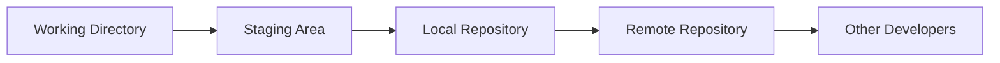

---

# 1. Why Version Control Exists

Without version control, developers often create files like:

```text
app-final.js
app-final-2.js
app-final-new.js
app-final-new-real.js
app-final-working.js
```

This quickly becomes confusing.

Version control stores a history of changes in a structured way.

It allows you to answer:

```text
What changed?
Who changed it?
When did it change?
Why did it change?
What did the file look like before?
Can we restore the previous version?
Which change introduced the bug?
```

---

# 2. What Is Git?

Git is a distributed version-control system.

It tracks changes to files and stores a history of those changes.

Git can be used for:

- Source code
- Configuration
- Documentation
- Scripts
- Infrastructure files
- Database migrations
- Test files

Git does not automatically host your project online.

It is the version-control system.

Services such as GitHub, GitLab, and Bitbucket can host Git repositories and provide collaboration features.

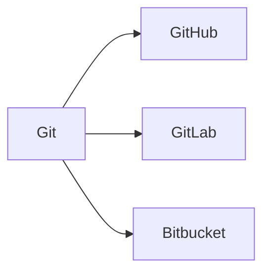

---

# 3. Version Control Concepts

A version-control system records snapshots or changes over time.

Conceptually:

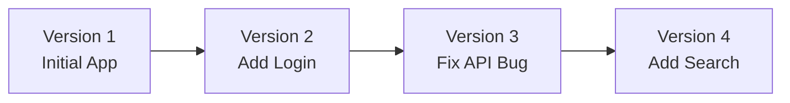

Each version can contain:

- Source files
- Configuration examples
- Documentation
- Tests
- Build scripts

Git allows you to move through this history and compare versions.

---

# 4. Distributed Version Control

Git is distributed because each developer can have a complete repository history locally.

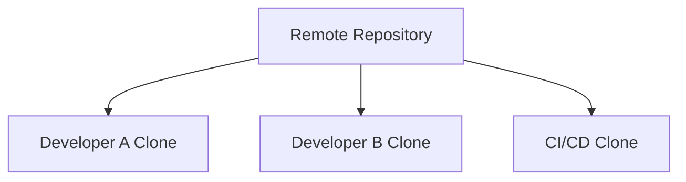

Each local repository can usually:

- View history
- Create commits
- Create branches
- Compare changes
- Work offline
- Inspect previous versions

A remote repository is useful for sharing, backup, review, and automation, but Git itself is not dependent on a network connection for every operation.

---

# 5. Installing and Checking Git

Check whether Git is installed:

```bash
git --version
```

Example:

```text
git version 2.x.x
```

Configure your identity:

```bash
git config --global user.name "Alex Morgan"
git config --global user.email "alex@example.com"
```

View configuration:

```bash
git config --list
```

Git uses this identity to record who created commits.

This identity is not automatically a security credential.

---

# 6. A Git Repository

A Git repository is a project directory containing Git’s version-history data.

To create one:

```bash
mkdir web-project
cd web-project
git init
```

Git creates a hidden directory:

```text
.git/
```

This directory contains repository metadata and history.

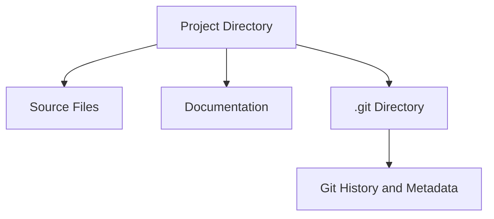

Do not manually edit files inside `.git` unless you fully understand Git internals.

---

# 7. The Working Directory

The working directory contains the files you are currently editing.

Example:

```text
web-project/
├── src/
├── public/
├── package.json
└── README.md
```

When you modify a file, Git notices that the working directory differs from the last committed version.

Check the state:

```bash
git status
```

Example output:

```text
On branch main
Changes not staged for commit:
  modified:   src/app.js
```

---

# 8. The Staging Area

The staging area is a preparation area for the next commit.

You choose which changes should be included.

```bash
git add src/app.js
```

Now the file is staged.

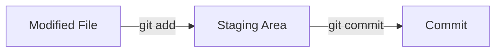

The staging area allows you to create a focused commit even when several files have changed.

---

# 9. Commits

A commit is a recorded snapshot of staged changes.

Create one:

```bash
git commit -m "Add product search"
```

A good commit message briefly explains what changed.

Examples:

```text
Add product search
Fix expired session handling
Validate order quantity
Add loading state to dashboard
Update database migration
```

A commit should ideally represent one logical change.

---

# 10. The Basic Git Cycle

The most common workflow is:

```bash
git status
git add <files>
git commit -m "Describe the change"
```

Visual model:

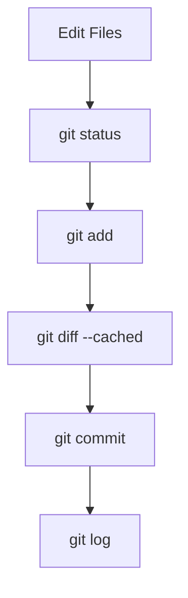

Before committing, inspect what you are about to record.

---

# 11. `git status`

Run:

```bash
git status
```

It tells you:

- Current branch
- Modified files
- Staged files
- Untracked files
- Conflicts
- Repository state

Example:

```text
On branch main

Changes to be committed:
  modified: src/api.js

Changes not staged for commit:
  modified: src/styles.css

Untracked files:
  notes.md
```

This means:

```text
src/api.js:
  Staged

src/styles.css:
  Modified but not staged

notes.md:
  New and untracked
```

---

# 12. `git diff`

View unstaged changes:

```bash
git diff
```

This shows differences between:

```text
Working directory
and
Staged or committed version
```

Example conceptual output:

```diff
- const limit = 10;
+ const limit = 20;
```

Use it before staging to review changes.

---

# 13. `git diff --cached`

View staged changes:

```bash
git diff --cached
```

This shows what will be included in the next commit.

A safe workflow:

```bash
git add src/app.js
git diff --cached
git commit -m "Update app behavior"
```

Reviewing staged changes helps prevent accidental commits.

---

# 14. `git add`

Stage one file:

```bash
git add src/app.js
```

Stage several files:

```bash
git add src/app.js src/styles.css
```

Stage a directory:

```bash
git add src/
```

Stage all changes in the current project:

```bash
git add .
```

Be cautious with:

```bash
git add .
```

It may stage:

- Temporary files
- Debug output
- Local configuration
- Generated files
- Secrets
- Large files

Review `git status` afterward.

---

# 15. Unstaging a File

If you staged a file accidentally:

```bash
git restore --staged src/app.js
```

This removes it from the staging area but keeps your working-directory changes.

Older Git syntax:

```bash
git reset HEAD src/app.js
```

The newer `git restore` form is usually clearer for beginners.

---

# 16. Discarding Local Changes

To restore a tracked file to its last committed version:

```bash
git restore src/app.js
```

This discards uncommitted changes to that file.

Be careful:

```text
This can permanently remove work.
```

Before discarding, consider:

```bash
git diff
```

or save the work in a temporary commit or stash.

---

# 17. Untracked Files

An untracked file is not yet part of Git history.

Example:

```text
Untracked files:
  .env
  notes.txt
```

Decide whether to:

```text
Add it:
  git add notes.txt

Ignore it:
  Add a pattern to .gitignore

Delete it:
  Remove the file manually
```

Never automatically commit every untracked file.

---

# 18. `.gitignore`

`.gitignore` tells Git which files should not be tracked.

Example:

```gitignore
node_modules/
.env
.env.local
dist/
build/
coverage/
*.log
.DS_Store
```

Common ignored items:

- Dependencies
- Secrets
- Local environment files
- Build output
- Logs
- Operating-system metadata
- Editor settings
- Temporary files

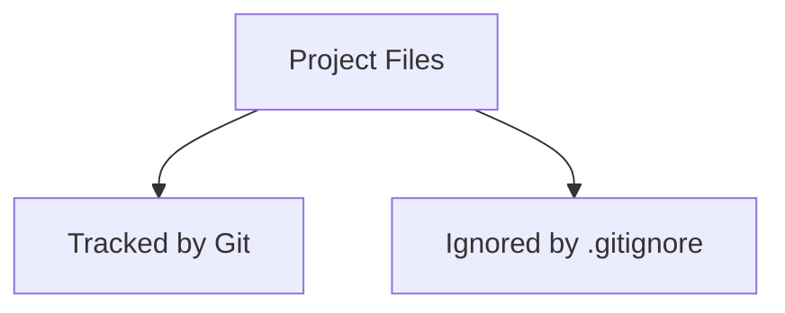

---

# 19. Why Ignore `node_modules`?

Dependency directories can contain:

- Thousands of files
- Platform-specific binaries
- Generated metadata
- Large amounts of data

Usually commit:

```text
package.json
package-lock.json
```

but ignore:

```text
node_modules/
```

Other ecosystems use similar patterns:

```text
.venv/
target/
vendor/
bin/
dist/
```

The exact rule depends on the language and project.

---

# 20. Why Ignore `.env`?

A `.env` file may contain:

```text
DATABASE_URL
API_KEY
PAYMENT_SECRET
JWT_SECRET
```

Committing it can expose credentials.

Instead, commit a safe template:

```text
.env.example
```

Example:

```text
PORT=3000
DATABASE_URL=
API_BASE_URL=
```

---

# 21. Important Secret Warning

Adding a secret to `.gitignore` does not remove it if it has already been committed.

If a secret was committed:

```text
1. Rotate or revoke the secret immediately.
2. Remove it from the working tree.
3. Remove it from history if necessary.
4. Check logs and backups.
5. Review how the exposure happened.
```

Git history may preserve old values even after the current file is changed.

---

# 22. Viewing Commit History

View commits:

```bash
git log
```

Compact format:

```bash
git log --oneline
```

Graph view:

```bash
git log --oneline --graph --decorate --all
```

Example:

```text
a1b2c3d Add product search
e4f5g6h Fix login redirect
i7j8k9l Initial project
```

Each commit has an identifier, often displayed in shortened form.

---

# 23. Inspecting a Commit

Show a commit:

```bash
git show a1b2c3d
```

Show only the summary:

```bash
git show --stat a1b2c3d
```

Inspect a file at a commit:

```bash
git show a1b2c3d:src/app.js
```

This helps answer:

```text
What did this commit change?
```

---

# 24. Comparing Commits

Compare two commits:

```bash
git diff commitA commitB
```

Compare current files with the previous commit:

```bash
git diff HEAD~1
```

Compare a specific file:

```bash
git diff HEAD~1 -- src/app.js
```

This is useful when investigating regressions.

---

# 25. Finding When a Change Happened

View changes to one file:

```bash
git log -- src/app.js
```

Show line-level history:

```bash
git blame src/app.js
```

`git blame` shows which commit last changed each line.

Use it to understand history, not to assign personal blame.

The better question is:

```text
Why was this line changed?
```

Inspect the corresponding commit and message.

---

# 26. Branches

A branch is a movable pointer to a line of commits.

Branches allow you to work on changes independently.

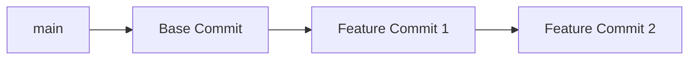

Create a branch:

```bash
git branch feature/search
```

Switch to it:

```bash
git switch feature/search
```

Create and switch in one command:

```bash
git switch -c feature/search
```

---

# 27. Why Use Branches?

Branches help isolate:

- Features
- Bug fixes
- Experiments
- Refactoring
- Dependency updates
- Documentation changes

Without branches, unrelated work may become mixed together.

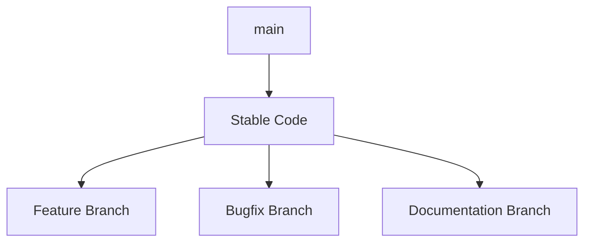

---

# 28. The Main Branch

Many repositories use:

```text
main
```

as the primary branch.

Some older projects use:

```text
master
```

The main branch often represents:

```text
Stable or releasable code
```

Teams may impose protections such as:

- Required reviews
- Passing tests
- No direct pushes
- Status checks
- Deployment approval

---

# 29. Feature Branch Workflow

A common workflow:

```bash
git switch main
git pull
git switch -c feature/product-search
```

Make changes:

```bash
git add .
git commit -m "Add product search"
```

Push the branch:

```bash
git push -u origin feature/product-search
```

Open a pull request.

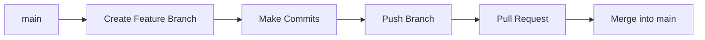

---

# 30. Branch Naming

Use descriptive names:

```text
feature/product-search
feature/user-profile
fix/login-redirect
fix/order-total
chore/update-dependencies
docs/api-guide
refactor/auth-service
```

A branch name should communicate the purpose of the work.

---

# 31. Remotes

A remote is a repository stored elsewhere.

Common remote names:

```text
origin
upstream
```

View remotes:

```bash
git remote -v
```

Example:

```text
origin  git@github.com:example/web-project.git
```

A remote may be hosted on:

- GitHub
- GitLab
- Bitbucket
- Internal company servers
- Another computer

---

# 32. Cloning a Repository

Clone a remote repository:

```bash
git clone https://github.com/example/web-project.git
```

This creates a local directory containing:

- Project files
- Git history
- Remote configuration

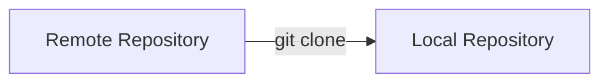

Enter the project:

```bash
cd web-project
```

---

# 33. Fetching Remote Changes

Fetch remote history:

```bash
git fetch origin
```

This downloads information without changing your current working files.

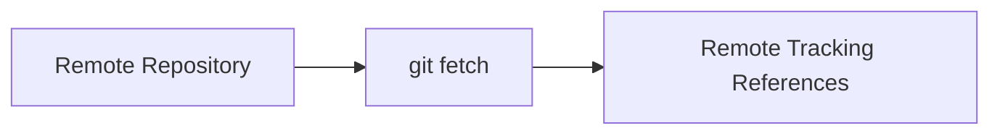

Fetching is useful before deciding how to integrate changes.

---

# 34. Pulling Changes

`git pull` usually means:

```text
Fetch remote changes
then integrate them into the current branch
```

```bash
git pull
```

A more explicit process:

```bash
git fetch
git merge
```

Pulling can produce conflicts if your local changes and remote changes overlap.

Before pulling, check:

```bash
git status
```

---

# 35. Pushing Changes

Push local commits to a remote:

```bash
git push
```

For a new branch:

```bash
git push -u origin feature/product-search
```

The `-u` option sets the upstream relationship so future pushes can use:

```bash
git push
```

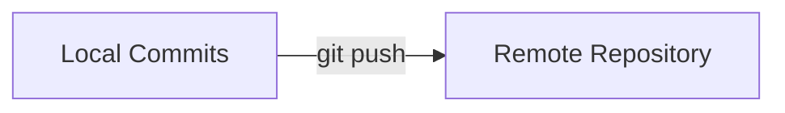

---

# 36. Pull Requests

A pull request is a proposal to merge changes from one branch into another.

A pull request commonly includes:

- Description
- Changed files
- Code review
- Automated test results
- Security checks
- Deployment preview
- Discussion
- Approval

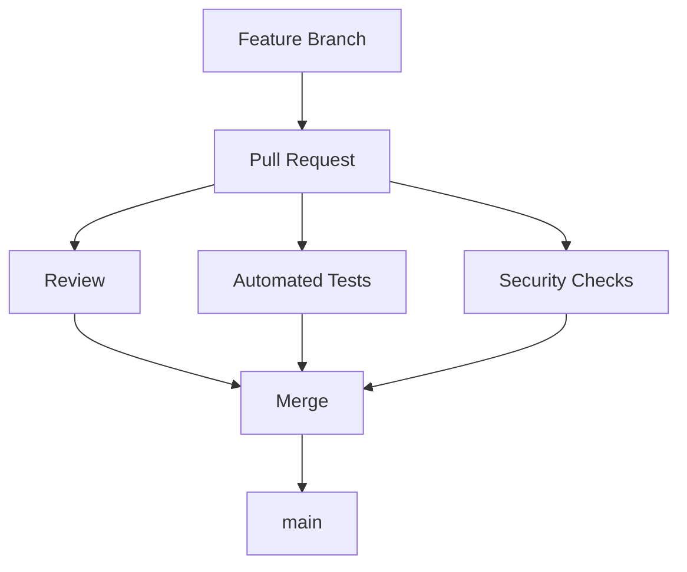

Pull requests are collaboration and quality-control tools.

---

# 37. Good Pull Request Descriptions

Include:

```text
What changed?
Why was it needed?
How was it tested?
Are there migration steps?
Are there known limitations?
Are screenshots or examples useful?
```

Example:

```text
What changed:
  Added product search endpoint and frontend search form.

Why:
  Users can now filter products by name.

Testing:
  Added API tests for empty and matching searches.
  Tested manually on mobile and desktop.

Notes:
  Search is limited to 20 results per page.
```

---

# 38. Merge Conflicts

A conflict occurs when Git cannot automatically combine changes.

Example:

```text
Developer A changes the same lines as Developer B.
```

Git marks the file:

```text
<<<<<<< HEAD
Your version
=======
Other version
>>>>>>> feature-branch
```

You must:

1. Open the file.
2. Decide which content is correct.
3. Remove conflict markers.
4. Test the result.
5. Stage the resolved file.
6. Complete the merge.

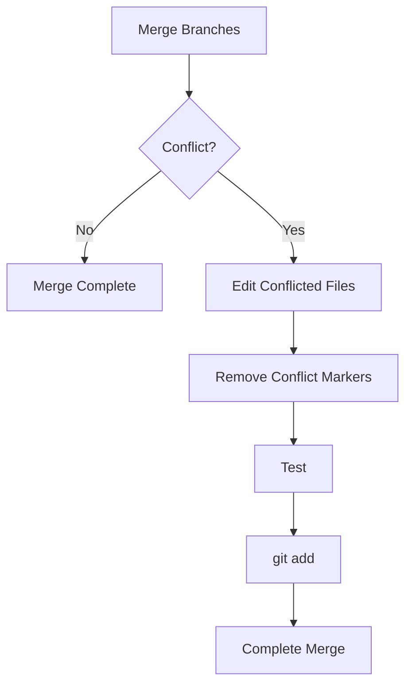

---

# 39. Conflict Resolution Example

Conflict:

```text
<<<<<<< HEAD
const limit = 20;
=======
const limit = 50;
>>>>>>> feature/search
```

Decide based on requirements:

```javascript
const limit = 20;
```

Then remove the markers.

Check:

```bash
git diff
```

Stage:

```bash
git add src/search.js
```

Continue the merge or rebase according to Git’s instructions.

---

# 40. Testing After Conflict Resolution

Never assume a conflict resolution is correct merely because Git accepts it.

Run:

```bash
npm test
npm run lint
npm run build
```

Also test the affected workflow manually.

Conflicts can create:

- Syntax errors
- Logic errors
- Lost features
- Incorrect configuration
- Broken migrations
- Incompatible API behavior

---

# 41. Merge vs Rebase

## Merge

A merge combines histories and creates a merge commit when necessary.

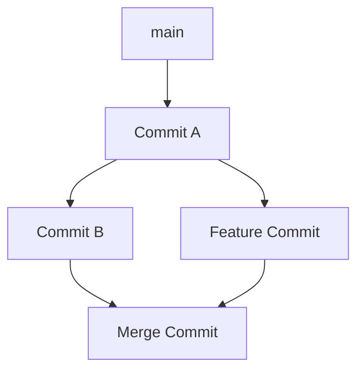

## Rebase

A rebase moves your commits on top of a newer base.

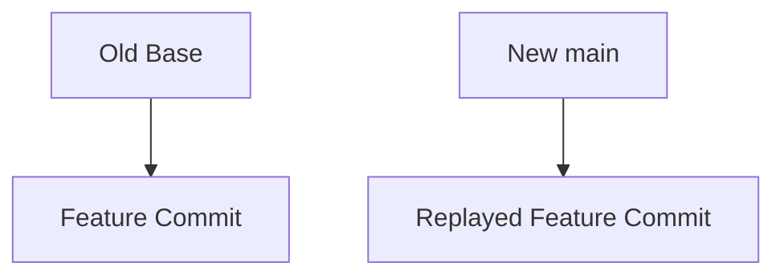

Rebase creates a cleaner linear history but rewrites commit identity.

---

# 42. When to Avoid Rebasing Public Branches

Do not casually rebase branches that others are already using.

Rewriting shared history can require force-pushing and create confusion.

A general beginner rule:

```text
Rebase your private feature branch carefully.
Avoid rewriting shared or protected branches.
```

---

# 43. Stashing Work

Sometimes you have uncommitted changes but need to switch branches.

Store them temporarily:

```bash
git stash
```

View stashes:

```bash
git stash list
```

Restore the latest stash:

```bash
git stash pop
```

A stash is temporary storage, not a permanent backup.

For important work, a temporary commit may be safer.

---

# 44. Tags

A tag marks a specific commit.

Common uses:

```text
v1.0.0
v2.3.1
release-2026-07
```

Create a tag:

```bash
git tag v1.0.0
```

List tags:

```bash
git tag
```

Push a tag:

```bash
git push origin v1.0.0
```

Tags are useful for:

- Releases
- Deployment versions
- Rollbacks
- Reproducible builds
- Changelogs

---

# 45. Releases

A release usually combines:

```text
Version tag
Build artifact
Release notes
Migration instructions
Known issues
Deployment metadata
```

Example:

```text
v1.4.0
  Added product search
  Fixed session expiration
  Added database index
```

A release should be traceable back to exact source code.

---

# 46. Reverting a Commit

To create a new commit that undoes an earlier commit:

```bash
git revert <commit>
```

This preserves history.

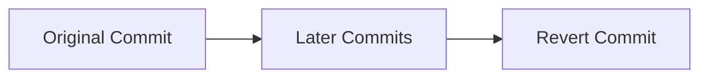

This is generally safer for shared branches than rewriting history.

---

# 47. Resetting

`git reset` moves branch references and can change staging or working files depending on options.

Common forms:

```bash
git reset --soft HEAD~1
git reset --mixed HEAD~1
git reset --hard HEAD~1
```

The `--hard` option can discard uncommitted changes.

Use reset carefully.

A beginner-friendly rule:

```text
Use git revert for shared history.
Use reset only when you understand exactly what it will change.
```

---

# 48. Restoring Files

Restore a file from the last commit:

```bash
git restore src/app.js
```

Restore a file from another branch or commit:

```bash
git restore --source main src/app.js
```

Inspect first:

```bash
git diff
```

Restoring can discard work.

---

# 49. Git Status During Conflicts

During a conflict:

```bash
git status
```

Git tells you:

- Which files are conflicted
- Whether you are merging or rebasing
- What commands are expected next

Read the status output carefully.

---

# 50. Aborting a Merge

If a merge becomes confusing:

```bash
git merge --abort
```

This attempts to return to the state before the merge.

For a rebase:

```bash
git rebase --abort
```

Use these before committing a flawed resolution.

---

# 51. Commit Best Practices

A good commit is:

```text
Focused
Small enough to understand
Described clearly
Tested
Related to one logical change
```

Good:

```text
Validate order quantities
Add loading state to product list
Fix session cookie path
```

Less useful:

```text
Changes
Fix stuff
Updates
Work
Final
```

A commit message should help your future self understand the change.

---

# 52. Commit Size

Avoid one giant commit containing:

```text
New feature
Unrelated refactoring
Formatting changes
Dependency upgrades
Database migration
Documentation rewrite
```

Separate them when practical.

Small commits are easier to:

- Review
- Revert
- Test
- Cherry-pick
- Understand
- Troubleshoot

---

# 53. Formatting and Git Diffs

Automatic formatting can create noisy diffs.

For example, changing line endings or formatting an entire directory may make it difficult to see the meaningful change.

Before committing:

```bash
git diff --stat
git diff
```

Separate formatting-only changes from functional changes when possible.

---

# 54. Line Endings

Different operating systems may use different line-ending conventions.

This can cause an entire file to appear changed even when only line endings changed.

Git can normalize line endings through configuration and attributes.

Check project conventions and avoid manually changing line endings unnecessarily.

---

# 55. Git and Generated Files

Some files are generated from source:

```text
dist/
build/
coverage/
generated/
```

Decide whether generated files should be committed.

Consider:

```text
Is the output reproducible?
Is it required for deployment?
Is it large?
Is it reviewed?
Is it generated in CI?
```

There is no universal rule. Follow the project’s convention.

---

# 56. Git and Database Migrations

Database migrations should generally be committed to version control.

Example:

```text
migrations/
├── 001_create_users.sql
├── 002_create_products.sql
└── 003_add_order_status.sql
```

This makes schema changes:

- Reviewable
- Repeatable
- Deployable
- Traceable
- Reproducible

Never rely only on manually changing a production database without recording the change.

---

# 57. Git and Environment Configuration

Commit safe configuration templates:

```text
.env.example
config.example.json
```

Do not commit:

```text
.env
config.production.json
private-key.pem
```

Document required values:

```text
DATABASE_URL:
  Connection string for the application database.

API_KEY:
  Secret key for the external service.
```

---

# 58. Git Hooks

Git hooks run scripts during Git operations.

Examples:

- Before commit
- After commit
- Before push

They may run:

```text
Formatting
Linting
Tests
Secret scans
Commit-message checks
```

Hooks improve consistency but should not replace CI checks.

A developer can skip local hooks, so important validation belongs in the shared pipeline too.

---

# 59. Continuous Integration

A CI system checks changes automatically.

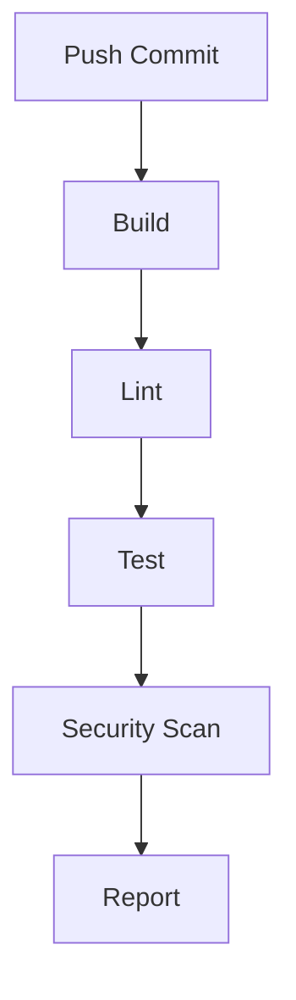

CI can catch:

- Syntax errors
- Test failures
- Type errors
- Formatting issues
- Vulnerable dependencies
- Broken builds
- Invalid migrations

---

# 60. Branch Protection

A protected main branch may require:

```text
Pull request
Code review
Passing tests
Security checks
No unresolved conflicts
```

This prevents one accidental command from directly damaging the stable branch.

---

# 61. Forks and Upstream Repositories

A fork is a separate copy of a remote repository under another account or organization.

Common open-source workflow:

```mermaid
flowchart LR
    U[Upstream Repository] --> F[Developer Fork]
    F --> C[Local Clone]
    C --> B[Feature Branch]
    B --> PR[Pull Request to Upstream]
```

Remotes may be named:

```text
origin   Your fork
upstream Original project
```

---

# 62. Git Worktrees

Git worktrees allow multiple working directories connected to one repository.

Useful when you want:

```text
Main branch open in one directory
Feature branch open in another
Hotfix branch open in a third
```

This is more advanced but can reduce constant branch switching.

---

# 63. Git Bisect

`git bisect` helps find which commit introduced a bug.

The process:

```mermaid
flowchart TD
    A[Known Good Commit] --> B[Known Bad Commit]
    B --> C[Git Tests Middle Commit]
    C --> D{Good or Bad?}
    D --> E[Git Narrows Range]
    E --> C
    D --> F[Identify First Bad Commit]
```

Basic workflow:

```bash
git bisect start
git bisect bad
git bisect good <known-good-commit>
```

Git checks out a midpoint.

Test it:

```bash
npm test
```

Then tell Git:

```bash
git bisect good
```

or:

```bash
git bisect bad
```

When finished:

```bash
git bisect reset
```

---

# 64. Collaboration Workflow

A common team workflow:

```text
1. Pull the latest main branch.
2. Create a feature branch.
3. Make a focused change.
4. Run tests locally.
5. Commit with a clear message.
6. Push the branch.
7. Open a pull request.
8. Address review feedback.
9. Wait for CI checks.
10. Merge.
11. Delete the feature branch.
```

```mermaid
flowchart TD
    A[Update main] --> B[Create Branch]
    B --> C[Implement Change]
    C --> D[Run Tests]
    D --> E[Commit]
    E --> F[Push]
    F --> G[Pull Request]
    G --> H[Review and CI]
    H --> I[Merge]
    I --> J[Deploy]
```

---

# 65. Git and Deployment

A deployment should be traceable to:

```text
Commit
Branch
Tag
Build artifact
Configuration version
Database migration state
```

```mermaid
flowchart LR
    C[Git Commit] --> B[Build Artifact]
    B --> S[Staging]
    S --> P[Production]
    P --> M[Monitor]
```

If a production problem occurs, you should be able to answer:

```text
Which commit is running?
Which dependencies were included?
Which database migrations ran?
Who deployed it?
When was it deployed?
How do we roll it back?
```

---

# 66. Primer Exercise 1 — Create a Repository

```bash
mkdir git-practice
cd git-practice
git init
```

Create a file:

```bash
echo "# Git Practice" > README.md
```

Check status:

```bash
git status
```

Stage and commit:

```bash
git add README.md
git commit -m "Add project README"
```

View history:

```bash
git log --oneline
```

---

# 67. Primer Exercise 2 — Modify and Compare

Edit `README.md`:

```bash
echo "Learning Git basics." >> README.md
```

Check changes:

```bash
git diff
```

Stage:

```bash
git add README.md
```

Inspect staged changes:

```bash
git diff --cached
```

Commit:

```bash
git commit -m "Add Git learning note"
```

---

# 68. Primer Exercise 3 — Create a Branch

```bash
git switch -c feature/add-notes
```

Create a file:

```bash
echo "Branch notes" > notes.md
```

Commit:

```bash
git add notes.md
git commit -m "Add branch notes"
```

View branches:

```bash
git branch
```

Switch back:

```bash
git switch main
```

Notice that `notes.md` may not exist on `main` until the branch is merged.

---

# 69. Primer Exercise 4 — Merge a Branch

Return to the main branch:

```bash
git switch main
```

Merge the feature:

```bash
git merge feature/add-notes
```

View history:

```bash
git log --oneline --graph --all
```

Delete the merged branch:

```bash
git branch -d feature/add-notes
```

---

# 70. Primer Exercise 5 — Create a Conflict

On `main`, edit a line:

```text
Version from main
```

Commit it.

Create a branch and change the same line:

```text
Version from feature
```

Commit it.

Switch to `main` and make a different change to the same line.

Then merge:

```bash
git merge feature/conflict-practice
```

Git may report a conflict.

Resolve:

1. Open the file.
2. Choose the correct content.
3. Remove markers.
4. Run tests or inspect the file.
5. Stage it.
6. Complete the merge.

---

# 71. Primer Exercise 6 — Create a `.gitignore`

Create:

```gitignore
.env
*.log
node_modules/
dist/
```

Create files:

```bash
touch .env debug.log
mkdir -p node_modules dist
```

Check status:

```bash
git status
```

Ignored files should not appear as ordinary untracked files.

---

# 72. Common Beginner Mistakes

## Mistake 1: Committing secrets

Check staged changes before committing.

## Mistake 2: Using `git add .` without reviewing status

Temporary or sensitive files may be staged.

## Mistake 3: Making huge mixed commits

Small focused commits are easier to understand and revert.

## Mistake 4: Working directly on main

Use a feature branch for meaningful changes.

## Mistake 5: Pulling with uncommitted work

This can create confusion or conflicts. Commit or stash first.

## Mistake 6: Force-pushing shared branches

This can erase or rewrite other people’s history.

## Mistake 7: Treating Git as a backup system

Git is version control, not a complete backup strategy. Remote repositories, backups, and protected storage still matter.

## Mistake 8: Ignoring database migrations

Schema changes should be versioned alongside code.

## Mistake 9: Reverting a secret without rotating it

If a secret was committed, assume it may be exposed.

## Mistake 10: Resolving conflicts without testing

A syntactically valid merge may still be logically wrong.

---

# 73. Key Concepts to Remember

```text
Repository:
  Project plus version history.

Working directory:
  Files currently being edited.

Staging area:
  Changes selected for the next commit.

Commit:
  Recorded snapshot of staged changes.

Branch:
  Independent line of development.

Remote:
  Repository stored elsewhere.

Clone:
  Copy a repository locally.

Fetch:
  Download remote history without integrating it.

Pull:
  Fetch and integrate remote changes.

Push:
  Upload local commits.

Merge:
  Combine branches.

Rebase:
  Replay commits on a different base.

Conflict:
  Git cannot automatically combine changes.

Tag:
  Named marker for a specific commit.

Pull request:
  Proposal to review and merge changes.

`.gitignore`:
  Patterns for files Git should not track.
```

---

# 74. Final Git Mental Model

Git tracks the movement of work from editing to collaboration:

```mermaid
flowchart TD
    A[Edit Files] --> B[Inspect Changes]
    B --> C[Stage Selected Files]
    C --> D[Review Staged Diff]
    D --> E[Create Commit]
    E --> F[Create or Update Branch]
    F --> G[Push to Remote]
    G --> H[Pull Request and Review]
    H --> I[Merge]
    I --> J[Build and Deploy]
```

The most important habits are:

```text
Check status frequently.
Review diffs before committing.
Write clear commit messages.
Keep commits focused.
Use branches for changes.
Never commit secrets.
Pull and push deliberately.
Resolve conflicts carefully.
Run tests after merges.
Keep production deployments traceable to commits.
```

The central lesson is:

> Git provides a structured history of how a project changes, allowing developers to experiment, collaborate, review, recover, and deploy with greater confidence.
