# Foundation Primers

# Primer 7 — Basic Databases and SQL for Web Learners  
## Tables, Records, Relationships, Queries, Indexes, Transactions, and Backend Data Access

---

# Primer Overview

Most useful web applications need to remember information.

Examples:

- User accounts
- Products
- Orders
- Messages
- Appointments
- Payments
- Inventory
- Articles
- Permissions
- File metadata

A database provides a structured way to store, retrieve, update, and protect that information.

A typical web application uses this flow:

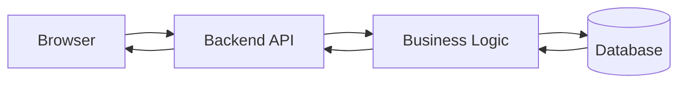

The browser generally should not connect directly to a private database.

Instead:

```text
Browser
  ↓
Backend
  ↓
Database
```

The backend:

- Authenticates the caller
- Checks permissions
- Validates input
- Applies business rules
- Executes safe queries
- Formats responses

This primer introduces relational databases and SQL, while also briefly explaining how they relate to other database models.

You will learn:

- What databases are
- Tables, rows, and columns
- Primary keys
- Foreign keys
- Relationships
- SQL basics
- `SELECT`
- `INSERT`
- `UPDATE`
- `DELETE`
- Filtering and sorting
- Joins
- Aggregation
- Constraints
- Indexes
- Transactions
- Connection pools
- Migrations
- Database security
- API-to-database workflows
- Common database mistakes

---

# 1. What Is a Database?

A database is a system for storing and retrieving information.

A database helps applications:

- Save data permanently
- Find records efficiently
- Enforce rules
- Handle multiple users
- Maintain consistency
- Recover from failures
- Query related information

A database is more than a file containing text.

It commonly provides:

```text
Storage
Querying
Indexes
Constraints
Transactions
Concurrency control
Permissions
Backups
Recovery
```

---

# 2. Database vs Application

The database stores and retrieves information.

The backend applies application behavior.

Suppose a user attempts to buy 3 items.

The database may answer:

```text
What is the current inventory?
```

The backend decides:

```text
Is this user allowed to buy the item?
Is quantity 3 valid?
Should inventory be reserved?
What should happen if only 2 remain?
```

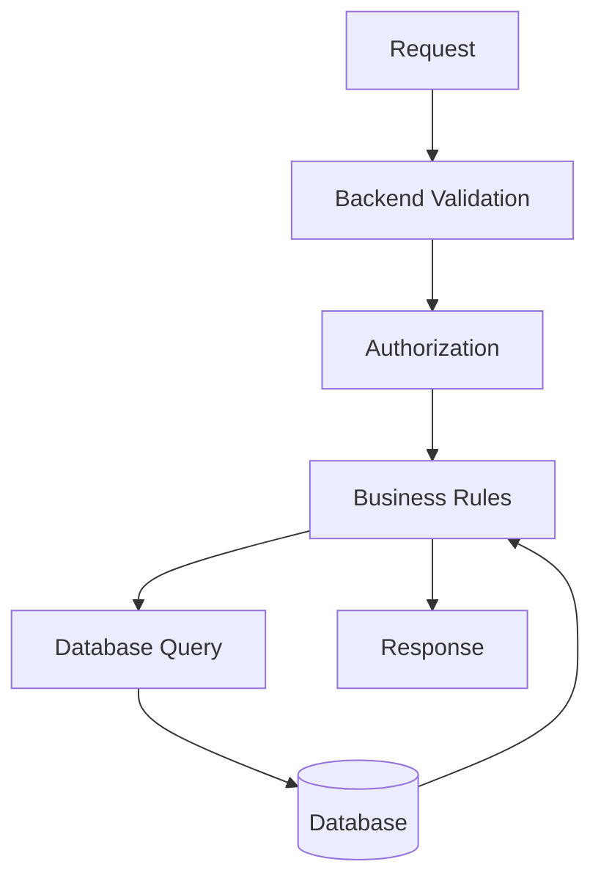

Do not put all business meaning into raw database queries.

---

# 3. Relational Databases

A relational database organizes information into tables.

Common relational databases include:

- PostgreSQL
- MySQL
- MariaDB
- SQLite
- Microsoft SQL Server
- Oracle Database

A table resembles a spreadsheet, but a database provides stronger rules and query capabilities.

Example:

```text
products
```

| id | name | price | available |
|---:|---|---:|---|
| 101 | Keyboard | 79.99 | true |
| 102 | Mouse | 29.99 | true |
| 103 | Monitor | 249.99 | false |

---

# 4. Tables, Rows, and Columns

## Table

A table stores records of one general type.

Examples:

```text
users
products
orders
payments
messages
```

## Row

A row represents one record.

```text
101 | Keyboard | 79.99 | true
```

## Column

A column represents one attribute.

```text
id
name
price
available
```

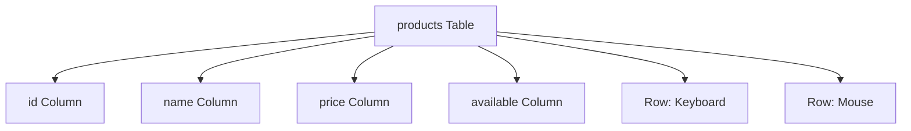

---

# 5. SQL

SQL stands for:

```text
Structured Query Language
```

SQL is used to communicate with relational databases.

SQL can:

- Retrieve data
- Insert records
- Update records
- Delete records
- Create tables
- Add indexes
- Define constraints
- Start transactions

SQL is declarative.

You describe what data you want, and the database determines how to retrieve it.

---

# 6. Creating a Table

Example:

```sql
CREATE TABLE products (
  id INTEGER PRIMARY KEY,
  name TEXT NOT NULL,
  price DECIMAL(10, 2) NOT NULL,
  available BOOLEAN NOT NULL DEFAULT TRUE
);
```

This defines:

```text
id:
  Integer and primary key

name:
  Text and required

price:
  Decimal number and required

available:
  Boolean, required, default true
```

The exact SQL syntax varies slightly between database systems.

---

# 7. Primary Keys

A primary key uniquely identifies a row.

Example:

```text
products.id
```

Possible values:

```text
101
102
103
```

A primary key should be:

- Unique
- Stable
- Present for every row
- Efficient to look up

Example:

```sql
CREATE TABLE users (
  id INTEGER PRIMARY KEY,
  email TEXT NOT NULL
);
```

The database prevents two rows from having the same primary key.

---

# 8. Generated Identifiers

Many databases generate IDs automatically.

Example:

```sql
CREATE TABLE products (
  id BIGSERIAL PRIMARY KEY,
  name TEXT NOT NULL
);
```

Or in systems supporting identity columns:

```sql
CREATE TABLE products (
  id BIGINT GENERATED ALWAYS AS IDENTITY PRIMARY KEY,
  name TEXT NOT NULL
);
```

The exact syntax depends on the database.

Other identifier strategies include:

- UUIDs
- Application-generated strings
- Public slugs
- Distributed IDs

---

# 9. Foreign Keys

A foreign key connects one table to another.

Suppose each order belongs to a user:

```sql
CREATE TABLE orders (
  id INTEGER PRIMARY KEY,
  user_id INTEGER NOT NULL,
  status TEXT NOT NULL,
  FOREIGN KEY (user_id) REFERENCES users(id)
);
```

Here:

```text
orders.user_id
```

refers to:

```text
users.id
```

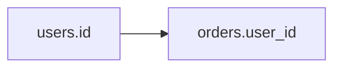

A foreign key helps protect relationship integrity.

---

# 10. One-to-Many Relationships

A user may have many orders.

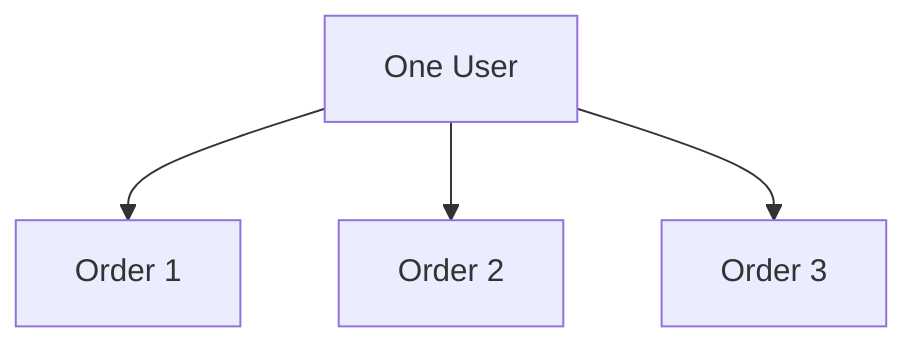

Database structure:

```text
users
  id

orders
  id
  user_id
```

The `orders.user_id` column identifies the user who owns each order.

---

# 11. Many-to-Many Relationships

A product may belong to many categories.

A category may contain many products.

This usually requires a join table:

```text
products
categories
product_categories
```

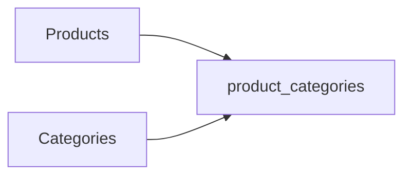

Example:

```sql
CREATE TABLE product_categories (
  product_id INTEGER NOT NULL,
  category_id INTEGER NOT NULL,
  PRIMARY KEY (product_id, category_id),
  FOREIGN KEY (product_id) REFERENCES products(id),
  FOREIGN KEY (category_id) REFERENCES categories(id)
);
```

---

# 12. `SELECT`

Retrieve rows:

```sql
SELECT *
FROM products;
```

Select specific columns:

```sql
SELECT id, name, price
FROM products;
```

Selecting only needed columns is often better than always using `*`.

Benefits:

- Smaller results
- Clearer contracts
- Less data exposure
- Potentially better performance

---

# 13. `WHERE`

Filter rows:

```sql
SELECT id, name, price
FROM products
WHERE available = TRUE;
```

Multiple conditions:

```sql
SELECT id, name, price
FROM products
WHERE available = TRUE
  AND price < 100;
```

Use parentheses when combining `AND` and `OR`:

```sql
SELECT *
FROM products
WHERE available = TRUE
  AND (price < 50 OR name = 'Keyboard');
```

---

# 14. Sorting and Limiting

Sort results:

```sql
SELECT id, name, price
FROM products
ORDER BY price ASC;
```

Descending:

```sql
SELECT id, name, price
FROM products
ORDER BY price DESC;
```

Limit results:

```sql
SELECT id, name, price
FROM products
ORDER BY price ASC
LIMIT 20;
```

Pagination may use:

```sql
LIMIT 20 OFFSET 40;
```

For very large datasets, cursor-based pagination may perform better.

---

# 15. `INSERT`

Add a row:

```sql
INSERT INTO products (name, price, available)
VALUES ('Keyboard', 79.99, TRUE);
```

Insert multiple rows:

```sql
INSERT INTO products (name, price, available)
VALUES
  ('Keyboard', 79.99, TRUE),
  ('Mouse', 29.99, TRUE);
```

Avoid constructing SQL by concatenating raw user input.

Use parameterized queries.

---

# 16. `UPDATE`

Update matching rows:

```sql
UPDATE products
SET price = 69.99
WHERE id = 101;
```

Always be careful with `WHERE`.

Dangerous:

```sql
UPDATE products
SET available = FALSE;
```

This updates every product.

Safer:

```sql
UPDATE products
SET available = FALSE
WHERE id = 101;
```

---

# 17. `DELETE`

Delete a specific row:

```sql
DELETE FROM products
WHERE id = 101;
```

Dangerous:

```sql
DELETE FROM products;
```

This deletes every row in the table.

Before destructive operations:

```sql
SELECT *
FROM products
WHERE id = 101;
```

Verify that the target is correct.

---

# 18. Joins

A join combines related tables.

Users:

```text
users
id | name
42 | Alex
```

Orders:

```text
orders
id | user_id | status
9001 | 42 | pending
```

Query:

```sql
SELECT
  users.name,
  orders.id,
  orders.status
FROM users
JOIN orders
  ON orders.user_id = users.id
WHERE users.id = 42;
```

Result:

```text
Alex | 9001 | pending
```

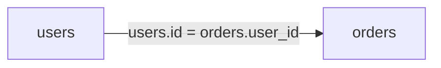

---

# 19. Common Join Types

## `INNER JOIN`

Returns rows with matching records in both tables.

```sql
SELECT *
FROM users
INNER JOIN orders
  ON orders.user_id = users.id;
```

## `LEFT JOIN`

Returns all rows from the left table, even if no match exists.

```sql
SELECT *
FROM users
LEFT JOIN orders
  ON orders.user_id = users.id;
```

Useful for finding users who have no orders.

```sql
SELECT users.id, users.name
FROM users
LEFT JOIN orders
  ON orders.user_id = users.id
WHERE orders.id IS NULL;
```

---

# 20. Aggregation

Aggregation calculates summaries.

Count products:

```sql
SELECT COUNT(*)
FROM products;
```

Average price:

```sql
SELECT AVG(price)
FROM products;
```

Total order value:

```sql
SELECT SUM(total)
FROM orders;
```

Group by status:

```sql
SELECT status, COUNT(*)
FROM orders
GROUP BY status;
```

Possible result:

```text
pending   12
paid      45
shipped   31
```

---

# 21. `GROUP BY` and `HAVING`

`WHERE` filters rows before grouping.

`HAVING` filters groups after aggregation.

```sql
SELECT user_id, COUNT(*) AS order_count
FROM orders
GROUP BY user_id
HAVING COUNT(*) > 5;
```

This finds users with more than five orders.

---

# 22. Constraints

Constraints enforce database rules.

Common constraints:

```text
PRIMARY KEY
FOREIGN KEY
NOT NULL
UNIQUE
CHECK
DEFAULT
```

Example:

```sql
CREATE TABLE users (
  id INTEGER PRIMARY KEY,
  email TEXT NOT NULL UNIQUE,
  age INTEGER CHECK (age >= 0)
);
```

Constraints protect data even if application code contains a bug.

---

# 23. Database Constraints vs Application Validation

Use both.

Application validation gives useful messages:

```text
Email address is invalid.
```

Database constraints protect final storage:

```text
email must be unique
```

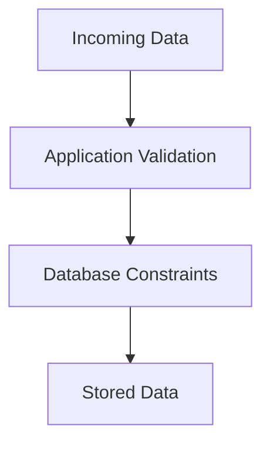

The database should not be your only validation layer, and the frontend should not be your only enforcement layer.

---

# 24. Indexes

An index helps the database find rows efficiently.

Example:

```sql
CREATE INDEX products_available_idx
ON products(available);
```

For email lookup:

```sql
CREATE UNIQUE INDEX users_email_idx
ON users(email);
```

Indexes can improve reads but add costs:

- Storage
- Slower inserts
- Slower updates
- Maintenance work

Create indexes based on actual query patterns.

---

# 25. Query Plans

Databases can explain how they plan to execute a query.

PostgreSQL example:

```sql
EXPLAIN
SELECT *
FROM products
WHERE category_id = 5;
```

More detailed:

```sql
EXPLAIN ANALYZE
SELECT *
FROM products
WHERE category_id = 5;
```

Inspect:

- Sequential scans
- Index scans
- Join methods
- Estimated rows
- Actual rows
- Execution time

A query that works correctly may still need optimization.

---

# 26. Transactions

A transaction groups operations into one logical unit.

Example order process:

```text
1. Create order.
2. Reduce inventory.
3. Record payment status.
```

If inventory update fails, you may not want the order created alone.

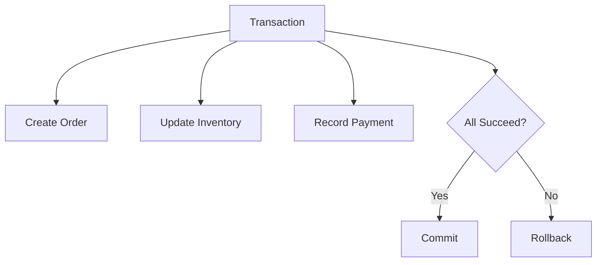

---

# 27. ACID

Relational databases often aim to provide ACID properties.

## Atomicity

All operations succeed together or fail together.

## Consistency

Data remains within defined rules.

## Isolation

Concurrent transactions do not improperly interfere.

## Durability

Committed data survives failures according to the database’s guarantees.

---

# 28. Transactions in SQL

Example:

```sql
BEGIN;

UPDATE inventory
SET quantity = quantity - 1
WHERE product_id = 123
  AND quantity > 0;

INSERT INTO order_items (order_id, product_id, quantity)
VALUES (9001, 123, 1);

COMMIT;
```

If something fails:

```sql
ROLLBACK;
```

The exact transaction design must handle concurrency and verify affected rows.

---

# 29. Connection Pools

Opening a database connection can be expensive.

A connection pool reuses connections:

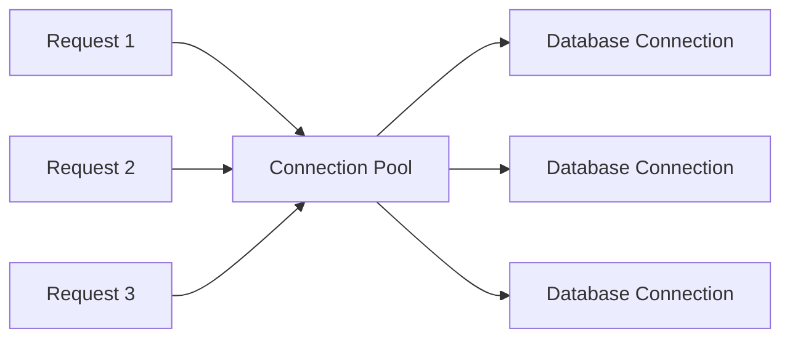

Too few connections:

```text
Requests wait.
```

Too many:

```text
Database becomes overloaded.
```

Monitor:

```text
Pool size
Active connections
Idle connections
Wait time
Connection errors
```

---

# 30. Parameterized Queries

Never build SQL by concatenating raw input.

Dangerous conceptual example:

```javascript
const sql =
  "SELECT * FROM users WHERE email = '" + email + "'";
```

Safer:

```javascript
const result = await db.query(
  "SELECT * FROM users WHERE email = $1",
  [email]
);
```

The database receives the query structure and values separately.

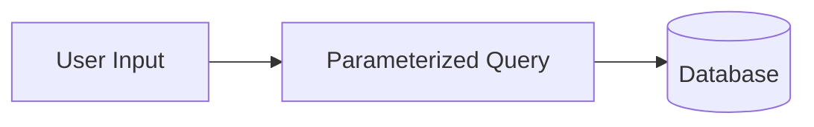

This helps prevent SQL injection.

---

# 31. N+1 Queries

An N+1 problem occurs when an application makes:

```text
1 query for a collection
+ 1 query for each item
```

Example:

```text
Load 100 orders
Then load items for each order
= 101 queries
```

Possible solutions:

- Join related data
- Batch queries
- Eager loading
- Data loader
- Better API design
- Caching

---

# 32. Soft Deletion

Instead of physically deleting a row, an application may mark it deleted:

```sql
UPDATE users
SET deleted_at = CURRENT_TIMESTAMP
WHERE id = 42;
```

Queries then exclude deleted rows:

```sql
SELECT *
FROM users
WHERE deleted_at IS NULL;
```

Soft deletion can help with:

- Recovery
- Auditing
- Legal retention
- Accidental deletion prevention

But it adds complexity because every query must apply the correct filter.

---

# 33. Database Migrations

A migration is a versioned database change.

Example:

```text
001_create_users.sql
002_create_products.sql
003_add_order_status.sql
```

A migration might contain:

```sql
ALTER TABLE orders
ADD COLUMN status TEXT NOT NULL DEFAULT 'pending';
```

Store migrations in version control.

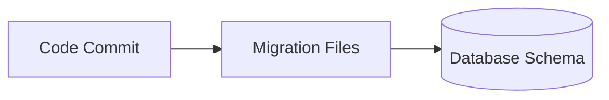

---

# 34. Backend-to-Database Flow

A backend request might follow:

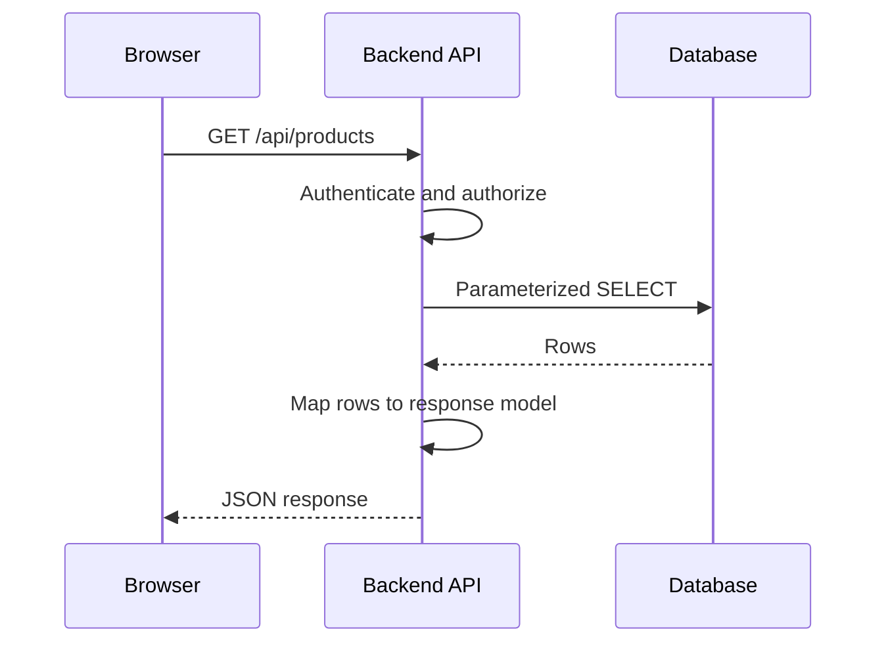

The backend should avoid exposing:

- Raw database errors
- Internal table names
- Password hashes
- Internal notes
- Database credentials
- Unfiltered records

---

# 35. Database Backups

Backups protect against:

- Hardware failure
- Accidental deletion
- Corruption
- Bad migrations
- Ransomware
- Operator mistakes

A backup strategy should include:

```text
Automated schedules
Encryption
Separate storage
Retention
Restore testing
Monitoring
```

A backup that has never been restored should not be assumed reliable.

---

# 36. Database Security

```text
[ ] Database is not publicly exposed unnecessarily.
[ ] Application uses a limited database account.
[ ] Administrative accounts are separate.
[ ] Connections are protected where appropriate.
[ ] Credentials are not in source control.
[ ] Queries are parameterized.
[ ] Backups are encrypted.
[ ] Database access is logged.
[ ] Sensitive columns are protected.
[ ] Patches and upgrades are managed.
```

---

# 37. Primer Exercise 1 — Design Tables

Design tables for an online store:

```text
users
products
orders
order_items
```

Possible structure:

```text
users:
  id
  email
  name

products:
  id
  name
  price
  available

orders:
  id
  user_id
  status
  created_at

order_items:
  id
  order_id
  product_id
  quantity
  price_at_purchase
```

Ask:

```text
Which columns are primary keys?
Which columns are foreign keys?
Why store price_at_purchase?
What happens if a product price changes?
```

---

# 38. Primer Exercise 2 — Write Queries

List available products:

```sql
SELECT id, name, price
FROM products
WHERE available = TRUE;
```

Find a user’s orders:

```sql
SELECT id, status, created_at
FROM orders
WHERE user_id = 42
ORDER BY created_at DESC;
```

Count orders by status:

```sql
SELECT status, COUNT(*)
FROM orders
GROUP BY status;
```

---

# 39. Primer Exercise 3 — Join Users and Orders

```sql
SELECT
  users.name,
  orders.id,
  orders.status
FROM users
JOIN orders
  ON orders.user_id = users.id
WHERE users.id = 42;
```

Explain:

```text
What table is the starting point?
What columns connect the tables?
What rows are returned?
```

---

# 40. Primer Exercise 4 — Think About Transactions

Suppose an order requires:

```text
Create order
Reduce inventory
Create order item
```

What could go wrong if each statement runs independently?

Possible failure:

```text
Order is created.
Inventory update fails.
User sees an order that cannot be fulfilled.
```

Design a transaction that either completes all required changes or rolls them back.

---

# 41. Common Beginner Mistakes

## Mistake 1: Connecting the browser directly to a private database

Use a backend boundary.

## Mistake 2: Concatenating raw input into SQL

Use parameterized queries.

## Mistake 3: Forgetting `WHERE` in `UPDATE` or `DELETE`

This can change every row.

## Mistake 4: Returning raw database records

Map them to safe API responses.

## Mistake 5: Ignoring indexes

Correct queries can still be too slow.

## Mistake 6: Creating indexes on every column

Indexes have write and storage costs.

## Mistake 7: Ignoring transactions

Multi-step operations can leave partial state.

## Mistake 8: Treating IDs as permissions

Authorization still needs ownership and role checks.

## Mistake 9: Running untested migrations in production

Use versioned, reviewed, tested migrations.

## Mistake 10: Assuming backups work without restore testing

Test recovery regularly.

---

# 42. Key Concepts to Remember

```text
Database:
  System for storing and retrieving data.

Table:
  Collection of related records.

Row:
  One record.

Column:
  One attribute.

Primary key:
  Unique identifier for a row.

Foreign key:
  Reference to a row in another table.

SQL:
  Language for relational databases.

Query:
  Request for database information or action.

Join:
  Combines related tables.

Constraint:
  Rule enforced by the database.

Index:
  Structure that speeds up lookups.

Transaction:
  Group of operations treated as one unit.

Migration:
  Versioned schema change.

Connection pool:
  Reusable set of database connections.

Parameterized query:
  Query that keeps structure separate from input values.
```

---

# 43. Final Database Mental Model

A production web request often follows this path:

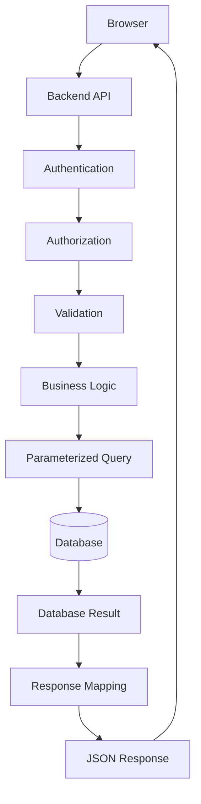

The most important lesson is:

> The database stores important information, but the backend controls how that information is accessed, interpreted, validated, and exposed.
