# Foundation Primers

# Primer 8 — Security Fundamentals for Web Learners  
## Trust Boundaries, Threats, Authentication, Authorization, Encryption, Secrets, and Safe Input

---

# Primer Overview

Security is not a single feature.

It is the practice of protecting:

- Users
- Accounts
- Data
- Applications
- Infrastructure
- External services
- Business operations
- Availability

Security problems often occur because an application makes an unsafe assumption:

```text
The browser will not modify this value.
The user will only use the normal interface.
The URL identifier is enough to prove ownership.
The client-side check cannot be bypassed.
The hidden field is private.
The token will never leak.
The file extension proves the file type.
The database is not reachable.
```

A secure system assumes the opposite:

```text
Any client can send any request.
Any client-side value can be modified.
Any external input can be malformed.
Any credential can eventually be exposed.
Any dependency can fail.
```

The central security model is:

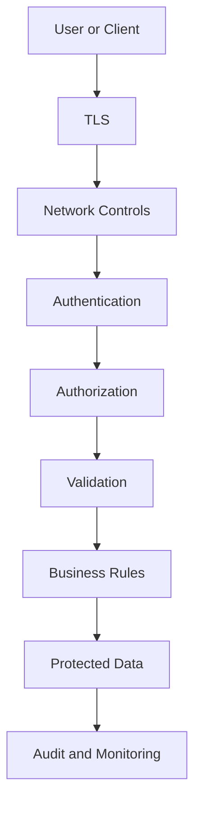

This primer explains:

- Security goals
- Trust boundaries
- Threats and assets
- Authentication
- Authorization
- Sessions
- Cookies
- Tokens
- Passwords
- MFA
- Encryption
- HTTPS
- Secrets
- Input validation
- Output encoding
- SQL injection
- XSS
- CSRF
- File upload security
- Rate limiting
- Least privilege
- Logging
- Incident response
- Safe development habits

---

# 1. The Three Core Security Goals

Security is often explained using the CIA triad.

```text
Confidentiality
Integrity
Availability
```

## Confidentiality

Only authorized parties can access information.

Example:

```text
User A cannot read User B’s private messages.
```

## Integrity

Data cannot be changed improperly or without detection.

Example:

```text
An attacker cannot silently change an order total.
```

## Availability

Authorized users can access the system when needed.

Example:

```text
A traffic spike does not make the application unusable.
```

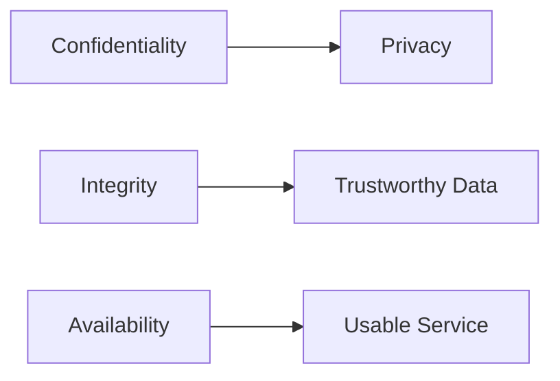

---

# 2. Security vs Privacy

Security and privacy overlap but are not identical.

## Security

Protects systems and data from unauthorized access, use, change, or disruption.

## Privacy

Concerns how personal data is collected, used, shared, retained, and deleted.

Example:

```text
Security:
  Prevent unauthorized access to an email address.

Privacy:
  Decide whether collecting that email address is necessary and how long to retain it.
```

A system can be secure but still collect more personal data than necessary.

---

# 3. Trust Boundaries

A trust boundary is a boundary between environments with different levels of trust.

Important boundaries include:

```text
Browser ↔ Backend
Backend ↔ Database
Backend ↔ External Service
Public Network ↔ Private Network
Application ↔ Uploaded File
Developer Machine ↔ Production
```

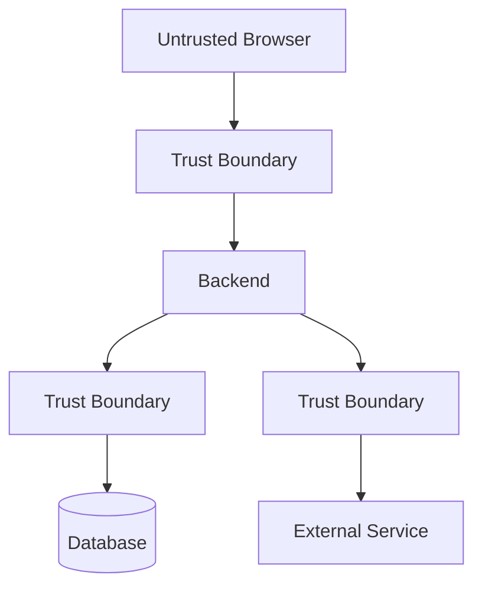

At each boundary, apply:

- Authentication
- Validation
- Authorization
- Logging
- Rate limiting
- Safe error handling

---

# 4. Assets, Threats, and Controls

Security planning starts by identifying assets.

## Assets

```text
Passwords
User data
Orders
Payment records
API keys
Database
Application availability
Source code
Business logic
```

## Threats

```text
Account takeover
Data theft
Unauthorized changes
Fraud
Malware
Service disruption
Credential leakage
```

## Controls

```text
MFA
Authorization
Encryption
Backups
Rate limits
Input validation
Monitoring
```

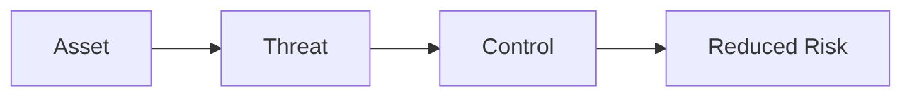

---

# 5. Authentication

Authentication answers:

```text
Who are you?
```

Common methods:

- Passwords
- Passkeys
- MFA
- One-time codes
- Session cookies
- Bearer tokens
- OAuth
- OpenID Connect
- API keys
- Mutual TLS

A simplified login flow:

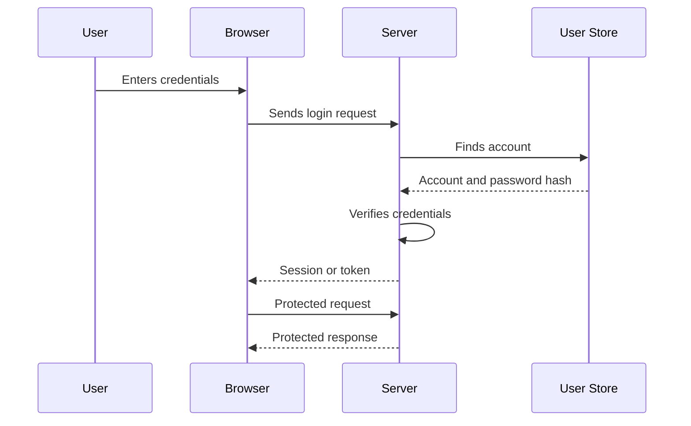

---

# 6. Authorization

Authorization answers:

```text
What are you allowed to do?
```

A user may be authenticated but not authorized.

Example:

```text
The user is signed in.
The user cannot access administrator settings.
```

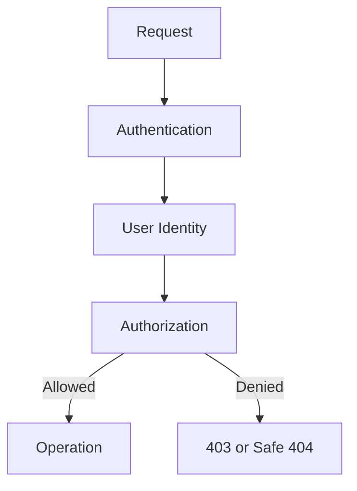

---

# 7. Authentication vs Authorization

| Question | Security concept |
|---|---|
| Who is this caller? | Authentication |
| Is the credential valid? | Authentication |
| What can this caller access? | Authorization |
| Can this user edit this record? | Authorization |
| Can this service call this method? | Authorization |

Never use a user ID supplied by the client as proof of identity.

Bad request:

```json
{
  "userId": 42,
  "role": "admin"
}
```

The server should determine identity from trusted authentication data.

---

# 8. Password Security

Never store plaintext passwords.

Bad:

```text
alex@example.com | myPassword123
```

Safer:

```text
alex@example.com | salted-password-hash
```

Use password-specific hashing algorithms such as:

```text
Argon2id
bcrypt
scrypt
PBKDF2
```

A password hash should be:

- One-way
- Salted
- Computationally expensive
- Resistant to brute-force attacks

---

# 9. Password Salts

A salt is a unique random value added during password hashing.

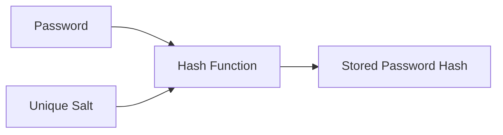

Salts ensure that two users with the same password do not necessarily have the same stored hash.

They also make precomputed hash tables less effective.

---

# 10. Password Policies

Useful practices:

```text
Allow long passwords.
Block known compromised passwords.
Support password managers.
Rate-limit login attempts.
Offer MFA.
Secure password reset.
Notify users of changes.
```

Avoid rules that make passwords harder to use without meaningfully improving security.

For example, forcing short passwords with excessive symbol rules may encourage predictable patterns.

---

# 11. Multi-Factor Authentication

MFA combines multiple factors.

```text
Something you know:
  Password

Something you have:
  Security key or authenticator app

Something you are:
  Biometric factor
```

A login flow:

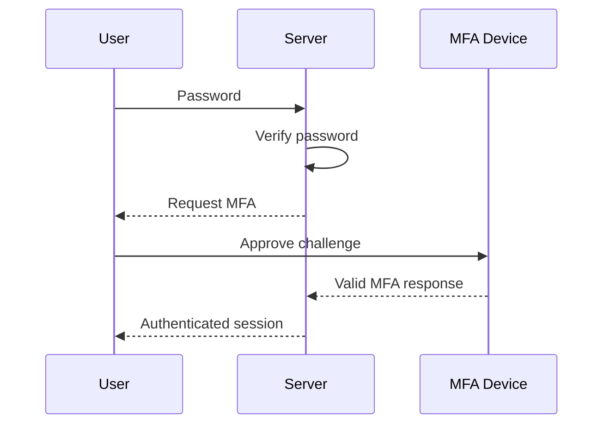

MFA reduces the impact of stolen passwords.

Recovery flows must be protected too.

---

# 12. Passkeys

Passkeys use public-key cryptography.

The private key remains on the user’s device or credential system.

The server stores the public key.

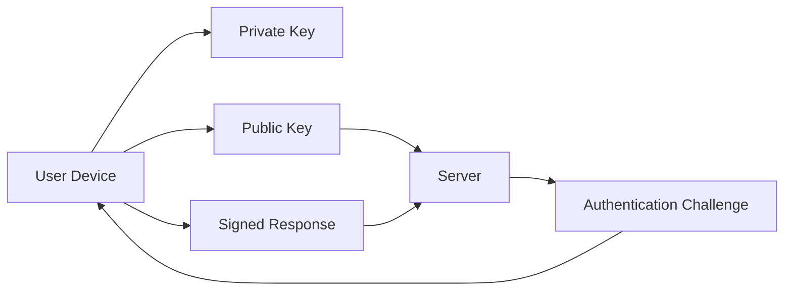

Passkeys can reduce risks from:

- Password reuse
- Phishing
- Weak passwords
- Stolen password databases

---

# 13. Sessions

A session links multiple requests to an authenticated user.

The browser may store:

```http
session_id=abc123
```

The server stores:

```text
session_id:
  abc123

user:
  42

expires:
  ...
```

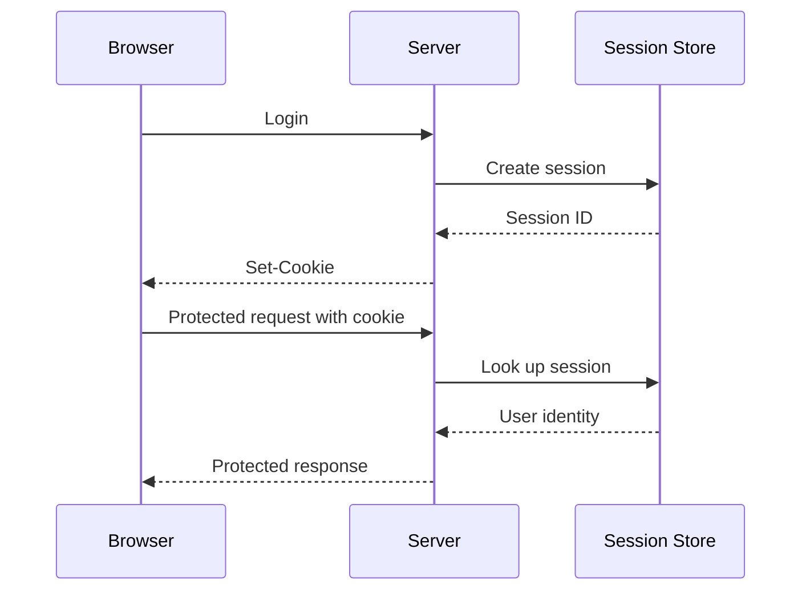

---

# 14. Secure Cookies

Example:

```http
Set-Cookie: session_id=abc123; Secure; HttpOnly; SameSite=Lax; Path=/
```

## Secure

Sends the cookie only over HTTPS.

## HttpOnly

Prevents normal JavaScript access.

## SameSite

Controls cross-site cookie behavior.

## Path

Limits paths where the cookie applies.

## Domain

Controls applicable domain scope.

## Max-Age or Expires

Controls lifetime.

---

# 15. Session Security Checklist

```text
[ ] Use HTTPS.
[ ] Use Secure cookies.
[ ] Use HttpOnly for session cookies where appropriate.
[ ] Configure SameSite deliberately.
[ ] Rotate session after login.
[ ] Expire sessions.
[ ] Invalidate sessions on logout.
[ ] Protect session storage.
[ ] Do not log session IDs.
[ ] Revoke sessions after important account changes.
```

---

# 16. Token Authentication

An API may use:

```http
Authorization: Bearer access-token
```

The server validates:

```text
Signature
Expiration
Issuer
Audience
Scopes
Token type
```

A token is not automatically safe just because it is encoded.

Anyone who obtains a bearer token may be able to use it until it expires or is revoked.

---

# 17. Access Tokens and Refresh Tokens

Access tokens are often short-lived.

Refresh tokens obtain new access tokens.

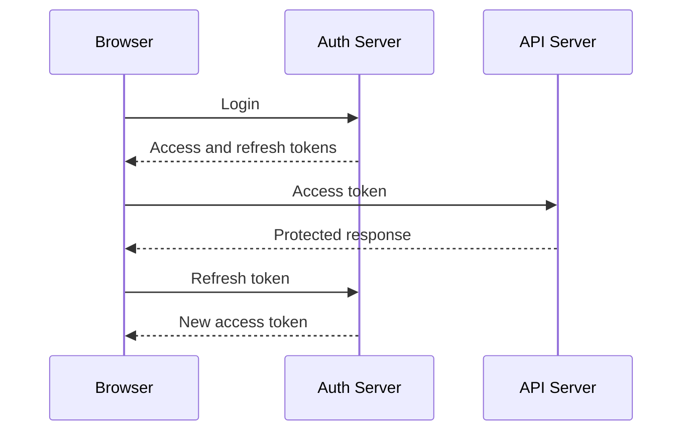

Refresh tokens require strong protection and revocation strategies.

---

# 18. Least Privilege

Least privilege means granting only the permissions necessary.

Examples:

```text
A reporting service can read reports.
It cannot delete users.

A worker can consume its queue.
It cannot administer the entire database.

A support role can view limited account data.
It cannot access payment secrets.
```

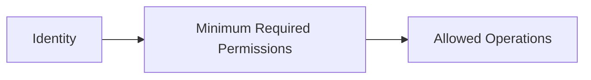

Least privilege limits damage if an identity is compromised.

---

# 19. Input Validation

Treat all external input as untrusted.

Inputs include:

```text
Query parameters
Path parameters
Request bodies
Headers
Cookies
File uploads
Webhooks
External API data
```

Validate:

```text
Type
Length
Format
Range
Required fields
Allowed values
Nested structure
Business rules
```

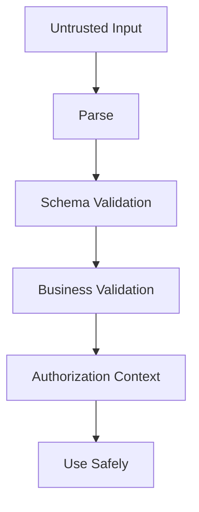

---

# 20. Client Validation vs Server Validation

Frontend validation:

```text
Fast feedback
Better usability
Fewer unnecessary requests
```

Backend validation:

```text
Security
Correctness
Data integrity
Business-rule enforcement
```

Use both, but never rely only on frontend validation.

A malicious client can send:

```json
{
  "price": 0.01
}
```

The server must calculate the actual price.

---

# 21. SQL Injection

SQL injection occurs when untrusted input changes a database query.

Unsafe:

```javascript
const query =
  "SELECT * FROM users WHERE email = '" + email + "'";
```

Safer:

```javascript
const result = await db.query(
  "SELECT * FROM users WHERE email = $1",
  [email]
);
```

Use:

- Parameterized queries
- Prepared statements
- Trusted query builders
- Safe ORM patterns

---

# 22. Cross-Site Scripting

XSS occurs when attacker-controlled content is interpreted as executable browser code.

Potential sources:

```text
Comments
Profile names
Search terms
Imported content
URL parameters
CMS data
Third-party content
```

Safer text insertion:

```javascript
element.textContent = userInput;
```

Be cautious with:

```javascript
element.innerHTML = userInput;
```

If HTML is required, sanitize it with a well-maintained sanitizer and define what markup is allowed.

---

# 23. Output Encoding

Encode output based on its context.

Contexts include:

```text
HTML
JavaScript
CSS
URL
SQL
Shell command
Log format
```

Data safe in one context may be dangerous in another.

For example:

```text
A string safe for plain text
may not be safe inside an HTML attribute.
```

Use framework-provided escaping and safe APIs where possible.

---

# 24. Cross-Site Request Forgery

CSRF tricks an authenticated browser into sending an unwanted request.

This is especially relevant when authentication uses automatically sent cookies.

Defenses include:

- SameSite cookies
- CSRF tokens
- Origin checks
- Referer checks
- Avoiding state-changing `GET`
- Intentional request headers

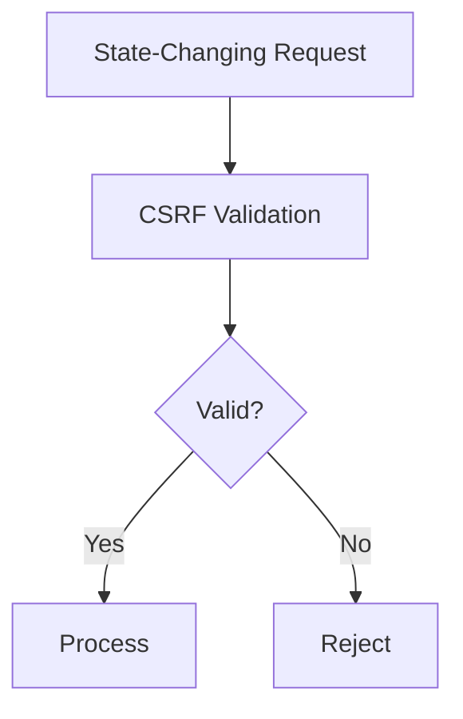

---

# 25. Clickjacking

Clickjacking occurs when a user is tricked into clicking a hidden or overlaid interface.

Defenses:

```http
X-Frame-Options: DENY
```

or:

```http
Content-Security-Policy: frame-ancestors 'none'
```

If embedding is needed, allow only trusted origins.

---

# 26. File Upload Security

Files should be treated as untrusted input.

Validate:

```text
Size
Extension
Declared content type
Actual file signature
Image dimensions
Filename
Archive contents
Malware status
User permission
```

Safer upload flow:

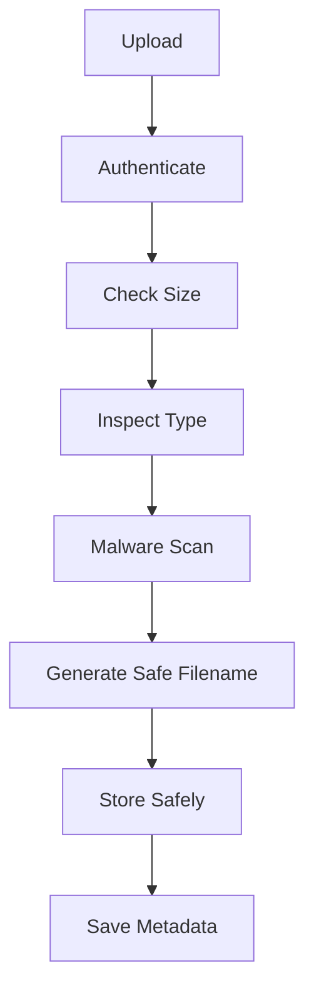

Do not serve uploaded files from an executable directory.

---

# 27. Path Traversal

Path traversal attempts to access files outside an allowed directory.

Example malicious input:

```text
../../private/config.txt
```

Defenses:

- Generate server-side filenames
- Avoid direct user-controlled paths
- Resolve canonical paths
- Restrict allowed directories
- Reject traversal attempts
- Store objects by opaque identifiers

---

# 28. Server-Side Request Forgery

SSRF occurs when user input causes the server to request unintended destinations.

Potential targets:

```text
localhost
Private IP ranges
Cloud metadata endpoints
Internal admin tools
Private databases
```

If an application fetches user-provided URLs:

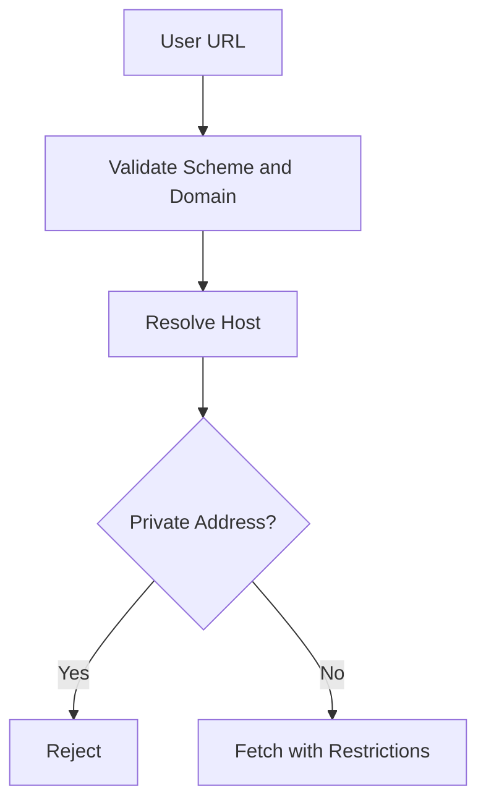

Also validate redirect destinations and resolved IP addresses.

---

# 29. Open Redirects

An open redirect allows an attacker to send users through your domain to an arbitrary destination.

Potentially unsafe:

```text
/redirect?next=https://attacker.example
```

Safer strategies:

- Allow only relative paths
- Use an allowlist
- Reject external schemes
- Validate destination hosts
- Avoid passing arbitrary URLs through redirects

---

# 30. Secrets

Secrets include:

```text
Database passwords
API keys
Payment provider secrets
Encryption keys
Signing keys
Cloud credentials
Private certificates
Webhook secrets
```

Do not store secrets in:

```text
Frontend JavaScript
Public repositories
URLs
Screenshots
Logs
Shared documents
```

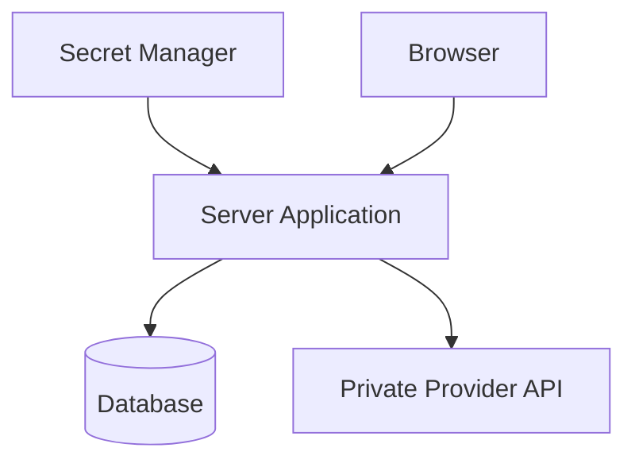

---

# 31. Secret Rotation

If a secret may be exposed:

```text
1. Revoke or rotate it.
2. Investigate where it appeared.
3. Inspect logs for misuse.
4. Deploy the replacement.
5. Remove the old value from active systems.
6. Review source history and backups.
7. Improve prevention.
```

Removing a secret from the latest file does not remove it from Git history or logs.

---

# 32. Rate Limiting

Rate limiting protects expensive or sensitive endpoints.

High-priority targets:

```text
Login
Password reset
MFA verification
Search
File uploads
Reports
Public APIs
Webhooks
```

A rate-limited response:

```http
429 Too Many Requests
Retry-After: 60
```

Rate limits may be based on:

```text
IP
User
Account
API key
Organization
Endpoint
```

---

# 33. Dependency Security

Dependencies may contain vulnerabilities.

Practices:

```text
[ ] Keep dependencies updated.
[ ] Remove unused packages.
[ ] Scan dependency trees.
[ ] Review advisories.
[ ] Lock versions where appropriate.
[ ] Scan container images.
[ ] Test security updates.
[ ] Monitor abandoned packages.
```

A dependency should be treated as part of your application’s attack surface.

---

# 34. Database Security

Protect databases through:

```text
Private network placement
Firewall restrictions
Least-privilege accounts
Parameterized queries
Encryption in transit
Encryption at rest
Strong credentials
Backups
Patching
Access logs
```

Typical architecture:

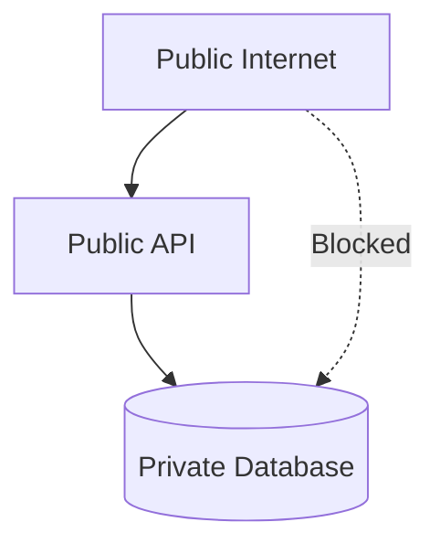

---

# 35. Logging Security

Logs should help with investigation without creating a new data leak.

Avoid logging:

```text
Passwords
Access tokens
Session IDs
Private keys
Full payment numbers
Sensitive personal data
```

Redact:

```http
Authorization: Bearer REDACTED
Cookie: session_id=REDACTED
```

Use structured logs:

```json
{
  "event": "authorization_denied",
  "userId": "42",
  "resource": "order",
  "resourceId": "9001",
  "requestId": "req_abc123"
}
```

---

# 36. Audit Logs

Audit logs record important security-sensitive events.

Examples:

```text
Login
Logout
Password change
MFA change
Role change
Permission change
Payment refund
Account deletion
API key creation
Administrator access
```

Audit logs should be:

```text
Protected
Time-stamped
Searchable
Tamper-resistant
Access-controlled
Retained appropriately
```

---

# 37. HTTPS and TLS

HTTPS protects:

```text
Confidentiality
Integrity
Server authentication
```

Use HTTPS for:

```text
Login
APIs
Forms
Payments
Uploads
Account pages
Administrative tools
```

HTTPS does not protect against:

```text
Broken authorization
Weak passwords
XSS
SQL injection
Malicious browser extensions
Compromised servers
Business logic errors
```

---

# 38. Security Headers

Useful headers include:

```http
Strict-Transport-Security
Content-Security-Policy
X-Content-Type-Options
X-Frame-Options
Referrer-Policy
Permissions-Policy
Cross-Origin-Opener-Policy
Cross-Origin-Resource-Policy
```

Configure them based on the application’s needs.

An incorrect security header can break legitimate functionality, so test changes.

---

# 39. CORS Security

CORS controls whether browser JavaScript may read cross-origin responses.

Prefer explicit origins:

```http
Access-Control-Allow-Origin: https://app.example.com
```

Be cautious with:

```http
Access-Control-Allow-Origin: *
```

especially for private or credentialed requests.

CORS does not replace authorization. Non-browser clients can often make requests without browser CORS enforcement.

---

# 40. Account Recovery

Password reset flows should use:

```text
Short-lived tokens
Single-use tokens
Secure random generation
Rate limits
Generic responses
No token logging
Session invalidation when appropriate
Notifications for account changes
```

Avoid revealing whether an account exists:

```text
If the account exists, recovery instructions have been sent.
```

---

# 41. Threat Modeling Exercise

Choose a feature such as:

```text
Profile image upload
```

Identify:

## Assets

```text
User account
Uploaded image
Storage system
Application availability
```

## Threats

```text
Malware upload
Oversized file
Unauthorized upload
Path traversal
Private image exposure
Storage exhaustion
```

## Controls

```text
Authentication
Authorization
File-size limits
Content inspection
Safe filenames
Private storage
Rate limiting
Monitoring
```

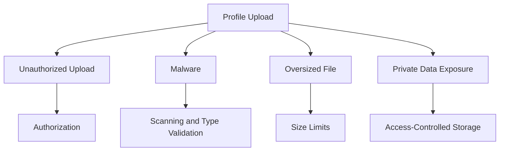

---

# 42. Security Exercise — Authorization

Imagine:

```text
User A owns order 1001.
User B owns order 1002.
```

Test:

```text
User A reads order 1001 → allowed
User A reads order 1002 → denied
User B edits order 1001 → denied
Administrator reads both → allowed according to policy
Unauthenticated user reads either → denied
```

Ask:

```text
Where is identity obtained?
Where is ownership checked?
What status code is returned?
What information is exposed on denial?
```

---

# 43. Security Exercise — Input Validation

For an order endpoint:

```json
{
  "productId": 123,
  "quantity": 2
}
```

Test:

```json
{}
```

```json
{
  "productId": "123",
  "quantity": 2
}
```

```json
{
  "productId": 123,
  "quantity": -1
}
```

```json
{
  "productId": 123,
  "quantity": 999999999
}
```

```json
{
  "productId": 123,
  "quantity": 2,
  "price": 0.01
}
```

The backend should:

- Validate types
- Validate ranges
- Check inventory
- Ignore or reject unauthorized fields
- Calculate the price independently

---

# 44. Common Beginner Mistakes

## Mistake 1: Trusting hidden form fields

Hidden fields can be modified.

## Mistake 2: Hiding buttons as authorization

Users can call endpoints directly.

## Mistake 3: Putting secrets in frontend code

Browser code is observable.

## Mistake 4: Treating Base64 as encryption

Base64 is encoding, not protection.

## Mistake 5: Logging tokens

Logs may be widely accessible.

## Mistake 6: Trusting file extensions

Actual file contents must be inspected.

## Mistake 7: Using `GET` for destructive operations

Browsers and crawlers may trigger them unexpectedly.

## Mistake 8: Returning detailed internal errors

Attackers can learn infrastructure details.

## Mistake 9: Assuming HTTPS solves application security

HTTPS protects the channel, not the logic.

## Mistake 10: Checking only roles

Resource ownership and tenant boundaries also matter.

---

# 45. Key Concepts to Remember

```text
Confidentiality:
  Prevent unauthorized reading.

Integrity:
  Prevent unauthorized modification.

Availability:
  Keep services usable.

Authentication:
  Identify the caller.

Authorization:
  Determine permissions.

Trust boundary:
  Boundary between different trust levels.

Least privilege:
  Grant only necessary access.

Validation:
  Check external input before using it.

Encryption:
  Protect data using cryptographic keys.

Session:
  Server-managed interaction identity.

Token:
  Credential representing identity or permission.

XSS:
  Untrusted content executes as browser code.

CSRF:
  Unwanted authenticated browser request.

SQL injection:
  Input changes database query meaning.

SSRF:
  Input causes server to access unintended destinations.

Rate limiting:
  Restrict request frequency.

Audit log:
  Record security-sensitive actions.
```

---

# 46. Final Security Mental Model

A secure web request should pass through multiple controls:

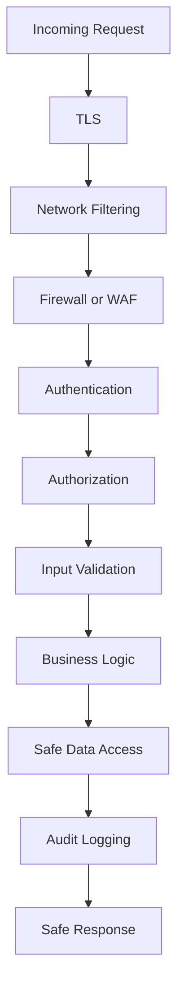

The most important lesson is:

> Never trust the client to enforce rules that matter to security, money, privacy, or data integrity.
