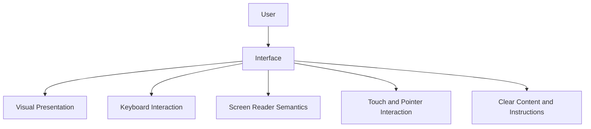
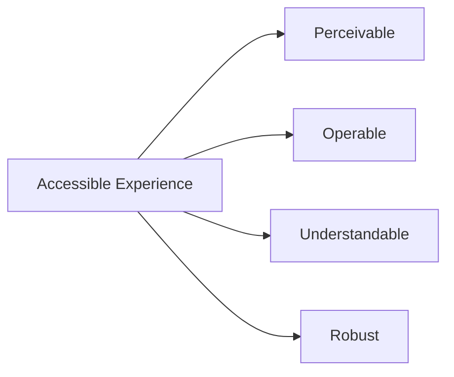
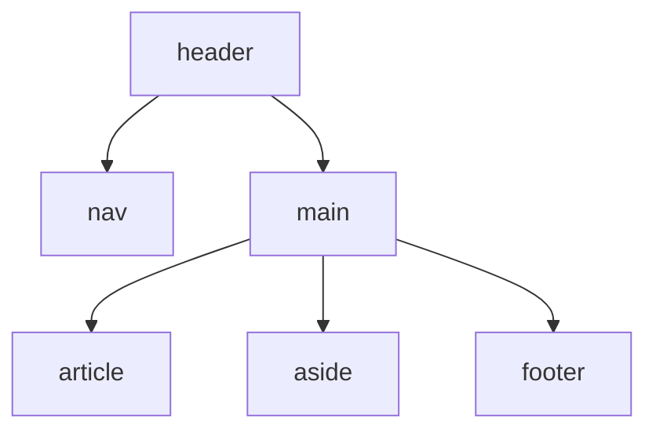
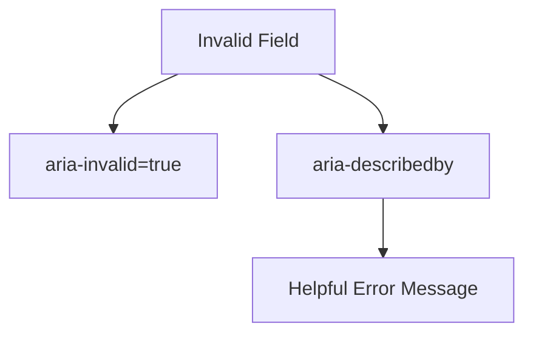
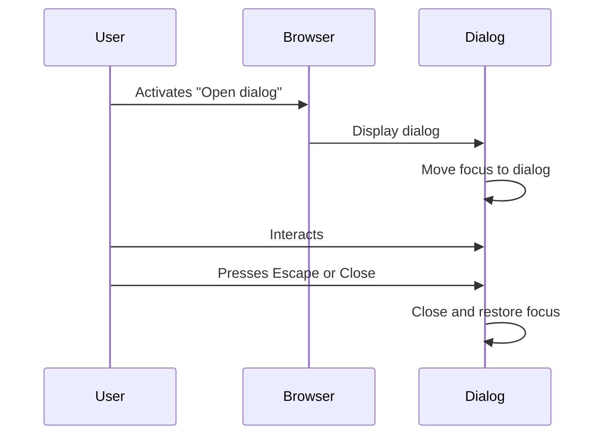
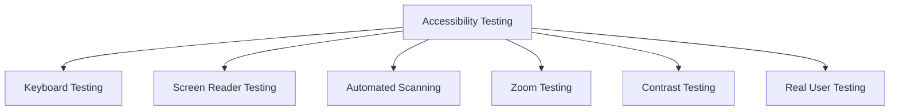
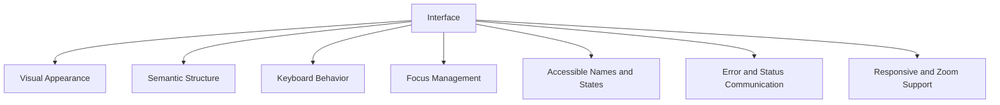

# Foundation Primers

# Primer 9 — Web Accessibility Fundamentals  
## Semantic HTML, Keyboard Navigation, Focus, Forms, Screen Readers, Color, and Inclusive Interfaces

---

# Primer Overview

Web accessibility means designing websites and applications that people with different abilities can use.

Accessibility benefits people who:

- Use screen readers
- Navigate with keyboards
- Have limited motor control
- Have low vision or color-vision differences
- Are deaf or hard of hearing
- Experience cognitive disabilities
- Use magnification or browser zoom
- Use voice-control software
- Have temporary injuries
- Use slow connections or older devices

Accessibility is not a separate feature added at the end.

It is part of good interface architecture.

A useful model is:



A page may look correct visually but still be difficult or impossible to use with:

- A keyboard
- A screen reader
- Zoom
- High contrast
- Voice control
- Reduced motion settings

This primer explains:

- What accessibility means
- Why semantic HTML matters
- Headings and landmarks
- Links and buttons
- Keyboard navigation
- Focus management
- Forms and labels
- Error messages
- Images and alternative text
- Color and contrast
- Tables
- Dialogs and menus
- Dynamic content
- ARIA
- Motion and animation
- Responsive and zoom-friendly design
- Testing accessibility
- Common accessibility mistakes

---

# 1. Accessibility Is About Access

An accessible interface allows users to:

```text
Perceive information
Understand information
Navigate the interface
Operate controls
Complete tasks
Recover from errors
```

A useful question is:

> Can someone complete the same important task using a different input method or assistive technology?

For example:

```text
Can the user:
- Open the menu without a mouse?
- Submit the form using a keyboard?
- Understand which field has an error?
- Hear the name of an icon-only button?
- Tell which content changed?
- Zoom the page without losing access?
```

---

# 2. The Four Accessibility Principles

Accessibility is often organized around four principles:

```text
Perceivable
Operable
Understandable
Robust
```

## Perceivable

Users can receive the information.

Examples:

- Text alternatives for images
- Captions for video
- Sufficient color contrast
- Content that works with magnification

## Operable

Users can interact with the interface.

Examples:

- Keyboard navigation
- Visible focus
- Sufficient target size
- No keyboard traps
- Controls that do not require precise pointer movement

## Understandable

Users can understand the content and behavior.

Examples:

- Clear labels
- Consistent navigation
- Helpful error messages
- Predictable controls

## Robust

The content works across browsers and assistive technologies.

Examples:

- Semantic HTML
- Correct roles and states
- Valid form structure
- Accessible names



---

# 3. Semantic HTML

Semantic HTML communicates the purpose of content.

Prefer:

```html
<header>
  <nav>...</nav>
</header>

<main>
  <article>...</article>
</main>

<footer>...</footer>
```

over:

```html
<div class="header">
  <div class="nav">...</div>
</div>

<div class="main">
  <div class="article">...</div>
</div>
```

Semantic elements give browsers and assistive technologies meaningful structure.

---

# 4. Landmarks

Landmarks identify major regions of a page.

Common landmarks:

```html
<header>
<nav>
<main>
<aside>
<footer>
```

A page might look like:



Screen-reader users may navigate between landmarks instead of reading every element sequentially.

Use one primary `main` region per page where appropriate.

---

# 5. Headings

Headings create a document outline.

```html
<h1>Account Settings</h1>

<h2>Profile</h2>
<h3>Display Name</h3>

<h2>Security</h2>
<h3>Password</h3>
```

Use headings based on meaning, not only visual size.

Do not choose:

```html
<h3>Small text</h3>
```

just because you want smaller text.

Use CSS for appearance:

```css
h3 {
  font-size: 1rem;
}
```

A well-structured heading hierarchy helps users:

- Understand page organization
- Navigate sections
- Scan content
- Find relevant information

---

# 6. Links and Buttons

Use links for navigation:

```html
<a href="/orders">View orders</a>
```

Use buttons for actions:

```html
<button type="button">Open filters</button>
```

A link says:

```text
Go somewhere.
```

A button says:

```text
Perform an action here.
```

Avoid fake controls:

```html
<div onclick="submitOrder()">Submit</div>
```

This lacks built-in:

- Keyboard behavior
- Focus behavior
- Button semantics
- Assistive-technology information

Use:

```html
<button type="button" onclick="submitOrder()">
  Submit
</button>
```

---

# 7. Keyboard Accessibility

Some users do not use a mouse.

They may navigate with:

```text
Tab
Shift + Tab
Enter
Space
Arrow keys
Escape
```

Test your application using only a keyboard.

Important questions:

```text
Can I reach every interactive control?
Can I see where focus is?
Can I operate menus?
Can I close dialogs?
Can I submit forms?
Can I recover from errors?
Can I avoid irrelevant controls?
```

---

# 8. Keyboard Focus

Focus identifies the element currently receiving keyboard input.

A focused element should have a visible focus indicator.

Do not remove it without replacing it:

```css
*:focus {
  outline: none;
}
```

This can make keyboard navigation impossible to follow.

Better:

```css
button:focus-visible,
a:focus-visible,
input:focus-visible {
  outline: 3px solid #2563eb;
  outline-offset: 2px;
}
```

The focus indicator must have sufficient contrast and should not be hidden behind other elements.

---

# 9. Focus Order

Focus order should generally follow the visual and logical reading order.

Poor structure:

```text
Visual order:
  Menu
  Main content
  Search

Keyboard order:
  Search
  Hidden control
  Menu
  Main content
```

Avoid unnecessary positive `tabindex` values:

```html
<button tabindex="5">...</button>
```

Positive tabindex values can create confusing focus order.

Usually prefer:

```html
<button>...</button>
```

or:

```html
<button tabindex="0">...</button>
```

Native controls already participate in normal keyboard navigation.

---

# 10. `tabindex`

Common values:

```text
No tabindex:
  Native controls use normal order.

tabindex="0":
  Element becomes keyboard focusable in normal order.

tabindex="-1":
  Element can receive programmatic focus but is skipped by normal Tab navigation.

Positive tabindex:
  Usually avoid.
```

Example:

```javascript
dialogHeading.focus();
```

The heading may use:

```html
<h2 tabindex="-1">Order complete</h2>
```

This allows programmatic focus after opening the dialog.

---

# 11. Keyboard Traps

A keyboard trap occurs when focus enters a component but the user cannot leave it using the keyboard.

Potential causes:

- Custom modal
- Embedded widget
- Incorrect focus handling
- Custom keyboard navigation
- Incomplete menu logic

For every interactive component, verify:

```text
Can focus enter?
Can focus move within?
Can focus leave?
Can Escape close it when appropriate?
```

---

# 12. Forms and Labels

Every form control should have an accessible label.

Correct:

```html
<label for="email">Email address</label>
<input id="email" name="email" type="email" />
```

The `for` value must match the input’s `id`.

Incorrect:

```html
<label>Email address</label>
<input name="email" type="email" />
```

The label is not explicitly associated with the input.

A wrapping label also works:

```html
<label>
  Email address
  <input name="email" type="email" />
</label>
```

---

# 13. Placeholder Text Is Not a Label

Avoid using only:

```html
<input placeholder="Email address" />
```

Placeholder text disappears when the user types and may have insufficient contrast.

Use a label:

```html
<label for="email">Email address</label>
<input
  id="email"
  name="email"
  type="email"
  placeholder="you@example.com"
/>
```

The placeholder may provide an example, but it should not replace the label.

---

# 14. Required Fields

Mark required fields clearly.

HTML:

```html
<label for="email">
  Email address <span aria-hidden="true">*</span>
</label>

<input
  id="email"
  name="email"
  type="email"
  required
  aria-required="true"
/>
```

Do not communicate required status only through color.

Explain it near the form:

```text
Fields marked with * are required.
```

---

# 15. Form Errors

An error should identify:

```text
Which field is invalid
What is wrong
How to fix it
```

Example:

```html
<label for="email">Email address</label>

<input
  id="email"
  name="email"
  type="email"
  aria-invalid="true"
  aria-describedby="email-error"
/>

<p id="email-error">
  Enter a valid email address, such as name@example.com.
</p>
```



---

# 16. Focus After Form Errors

When a form submission fails, consider moving focus to:

- The first invalid field
- A summary of errors
- The form heading

Example:

```javascript
const firstInvalid = form.querySelector(":invalid");

if (firstInvalid) {
  firstInvalid.focus();
}
```

For a large form, an error summary can help:

```html
<div role="alert" tabindex="-1">
  <h2>There are 2 errors</h2>
  <a href="#email">Email is invalid</a>
</div>
```

---

# 17. Fieldsets and Legends

Group related controls with `fieldset` and `legend`.

```html
<fieldset>
  <legend>Preferred contact method</legend>

  <label>
    <input type="radio" name="contact" value="email" />
    Email
  </label>

  <label>
    <input type="radio" name="contact" value="phone" />
    Phone
  </label>
</fieldset>
```

This gives the group a meaningful label.

Useful for:

- Radio groups
- Related checkboxes
- Address sections
- Payment methods
- Preferences

---

# 18. Images and Alternative Text

Meaningful image:

```html

```

Decorative image:

```html

```

The `alt` text should communicate the image’s purpose.

Ask:

```text
Why is this image here?
What information would the user lose without it?
```

Do not write:

```text
Image of
Picture of
Photo of
```

unless that wording is important.

---

# 19. Complex Images

Charts and diagrams may need longer descriptions.

Example:

```html


<p id="sales-description">
  Sales increased from January through June, with the highest value in June.
</p>
```

Associate the description where appropriate.

For complex data, provide a text table or textual summary.

---

# 20. Icons

An icon-only button needs an accessible name.

Poor:

```html
<button>
  <svg>...</svg>
</button>
```

Better:

```html
<button aria-label="Close dialog">
  <svg aria-hidden="true">...</svg>
</button>
```

If visible text exists:

```html
<button>
  <svg aria-hidden="true">...</svg>
  Close
</button>
```

Do not make decorative icons part of the accessible name unless they convey unique information.

---

# 21. ARIA

ARIA stands for Accessible Rich Internet Applications.

ARIA adds roles, states, and properties when native HTML does not fully express a custom component.

Examples:

```html
<button
  aria-expanded="false"
  aria-controls="menu"
>
  Menu
</button>
```

```html
<div
  role="status"
  aria-live="polite"
>
  Saving...
</div>
```

Important principle:

> Prefer native HTML before adding ARIA.

A native button usually provides better behavior than:

```html
<div role="button" tabindex="0">
```

If you create a custom role, you must also implement its expected keyboard and interaction behavior.

---

# 22. `aria-label`

Use `aria-label` when a control needs a name that is not visible.

```html
<button aria-label="Search">
  <svg aria-hidden="true">...</svg>
</button>
```

Do not use `aria-label` to hide a visible, meaningful label unnecessarily.

---

# 23. `aria-labelledby`

Use `aria-labelledby` to refer to another element that labels the current element.

```html
<h2 id="dialog-title">Delete account</h2>

<div
  role="dialog"
  aria-labelledby="dialog-title"
>
  ...
</div>
```

This keeps the visible heading as the accessible name.

---

# 24. `aria-describedby`

Use `aria-describedby` for supporting text or instructions.

```html
<label for="password">Password</label>

<input
  id="password"
  type="password"
  aria-describedby="password-help"
/>

<p id="password-help">
  Use at least 12 characters.
</p>
```

The user can receive both:

```text
Name:
  Password

Description:
  Use at least 12 characters.
```

---

# 25. Live Regions

Live regions announce dynamic changes to assistive technologies.

Example:

```html
<div role="status" aria-live="polite">
  Product added to cart.
</div>
```

Useful for:

- Save confirmations
- Search result counts
- Cart updates
- Background operation status
- Form submission results

Use the least disruptive announcement level appropriate to the situation.

---

# 26. `role="alert"`

Alerts communicate important, time-sensitive messages.

```html
<div role="alert">
  Payment failed. Check your card details.
</div>
```

Do not use alerts for every minor visual update. Excessive announcements can overwhelm screen-reader users.

---

# 27. Dialogs and Modals

A dialog should:

```text
Have an accessible name
Move focus into the dialog
Keep focus within while open when appropriate
Provide a clear close control
Restore focus when closed
Support Escape when appropriate
Prevent interaction with inaccessible background content
```



A native `<dialog>` element may provide useful behavior, but test it across supported browsers and assistive technologies.

---

# 28. Menus and Dropdowns

A simple navigation list may not need a complex ARIA menu pattern:

```html
<nav aria-label="Main navigation">
  <a href="/products">Products</a>
  <a href="/orders">Orders</a>
</nav>
```

Application menus with keyboard behavior are more complex.

If you create one, define:

```text
Arrow-key behavior
Enter and Space behavior
Escape behavior
Focus movement
Expanded state
Selected state
```

Do not use `role="menu"` merely because something visually looks like a dropdown.

---

# 29. Tables

Use tables for tabular data.

```html
<table>
  <caption>Recent orders</caption>
  <thead>
    <tr>
      <th scope="col">Order</th>
      <th scope="col">Status</th>
      <th scope="col">Total</th>
    </tr>
  </thead>
  <tbody>
    <tr>
      <td>#9001</td>
      <td>Shipped</td>
      <td>$159.98</td>
    </tr>
  </tbody>
</table>
```

Use:

```text
caption
thead
tbody
th
scope
```

Do not use tables only for page layout.

---

# 30. Color and Contrast

Do not communicate information through color alone.

Poor:

```text
Red means unavailable.
Green means available.
```

Better:

```text
Red icon + "Unavailable"
Green icon + "Available"
```

Check contrast for:

- Body text
- Buttons
- Links
- Form borders
- Focus indicators
- Placeholder text
- Disabled controls where relevant

Accessibility tools can measure contrast, but also test real usage conditions such as glare, dim screens, and zoom.

---

# 31. Links and Focus Indicators

Links should be recognizable without relying only on color.

A common pattern:

```css
a {
  text-decoration: underline;
}
```

Focus must remain visible:

```css
a:focus-visible {
  outline: 3px solid currentColor;
  outline-offset: 3px;
}
```

Avoid making links indistinguishable from ordinary text.

---

# 32. Motion and Animation

Some users experience discomfort or distraction from motion.

Respect the reduced-motion preference:

```css
@media (prefers-reduced-motion: reduce) {
  *,
  *::before,
  *::after {
    animation-duration: 0.01ms;
    animation-iteration-count: 1;
    transition-duration: 0.01ms;
    scroll-behavior: auto;
  }
}
```

Avoid:

- Flashing content
- Excessive parallax
- Motion that prevents task completion
- Auto-playing animations that cannot be paused

---

# 33. Audio and Video

Provide:

```text
Captions
Transcripts
Controls
Audio descriptions where appropriate
Text alternatives
```

Example:

```html
<video controls>
  <source src="/lesson.mp4" type="video/mp4" />
  <track
    kind="captions"
    src="/lesson-en.vtt"
    srclang="en"
    label="English"
  />
</video>
```

Never rely only on audio to communicate important information.

---

# 34. Zoom and Text Scaling

Users may enlarge text or zoom the page.

Avoid:

```html
<meta
  name="viewport"
  content="width=device-width, initial-scale=1, maximum-scale=1"
/>
```

Restricting zoom can make content inaccessible.

Test the interface at:

```text
100%
200%
400% where practical
```

Check:

- Horizontal overflow
- Overlapping content
- Hidden controls
- Truncated text
- Dialog size
- Mobile navigation
- Form usability

---

# 35. Responsive Accessibility

Responsive design should preserve access to functionality.

At small widths:

```text
Navigation remains usable.
Controls remain reachable.
Text remains readable.
Tables have an accessible alternative.
Dialogs fit the viewport.
Buttons remain large enough to activate.
```

Do not hide critical content solely because the screen is narrow.

---

# 36. Focus Management in Single-Page Applications

When a route changes without a full page reload, screen-reader users may not automatically know that the content changed.

Consider:

- Moving focus to the new page heading
- Announcing route changes
- Updating the document title
- Preserving logical focus
- Avoiding focus loss

Example:

```javascript
document.title = "Orders - Example Store";
heading.focus();
```

A route transition should have an understandable result for keyboard and assistive-technology users.

---

# 37. Loading and Error States

Accessible loading state:

```html
<div role="status" aria-live="polite">
  Loading orders...
</div>
```

Accessible error:

```html
<div role="alert">
  Orders could not be loaded. Try again.
</div>
```

Do not communicate state only by:

- Color
- Spinner animation
- Position change
- Visual icon without text

---

# 38. Disabled Controls

A disabled control may be visually obvious but not always understandable.

```html
<button disabled>
  Submit
</button>
```

Explain why when useful:

```html
<button disabled aria-describedby="submit-help">
  Submit
</button>

<p id="submit-help">
  Complete all required fields before submitting.
</p>
```

Be careful with custom disabled states implemented only through CSS.

```css
.button.disabled {
  opacity: 0.5;
}
```

This may still be keyboard-focusable and clickable unless behavior is explicitly handled.

---

# 39. Native HTML First

Native elements already provide built-in behavior.

Prefer:

```html
<button>
<a>
<input>
<select>
<textarea>
<details>
<dialog>
```

before creating custom controls with:

```html
<div>
<span>
```

Native controls usually provide:

- Keyboard behavior
- Focus behavior
- Semantics
- Browser support
- Assistive-technology integration

---

# 40. Accessibility Testing Layers

Use multiple testing methods.



No single tool catches everything.

---

# 41. Manual Keyboard Test

Test a complete workflow with only the keyboard:

```text
1. Reload the page.
2. Press Tab.
3. Observe focus.
4. Use Enter or Space.
5. Navigate forms.
6. Trigger validation.
7. Open and close dialogs.
8. Use Escape.
9. Complete the task.
```

Check for:

```text
Keyboard traps
Invisible focus
Unexpected focus jumps
Unreachable controls
Mouse-only interactions
```

---

# 42. Screen Reader Testing

Screen readers vary by operating system.

Examples include:

- VoiceOver
- NVDA
- JAWS
- TalkBack

Test:

```text
Page title
Headings
Landmarks
Links
Buttons
Forms
Errors
Dynamic updates
Dialog labels
Table structure
```

Listen for whether the interface conveys the same important information as the visual design.

---

# 43. Automated Testing Tools

Automated tools can detect common problems:

- Missing image alternative text
- Missing form labels
- Poor contrast
- Invalid ARIA
- Missing document language
- Duplicate IDs
- Heading issues

Automated tools are valuable but incomplete.

They cannot fully judge:

```text
Whether alt text is meaningful
Whether instructions are clear
Whether focus behavior makes sense
Whether a workflow is understandable
```

---

# 44. Accessibility Exercise 1 — Inspect a Form

Given:

```html
<form>
  <input placeholder="Email" />
  <input placeholder="Password" type="password" />
  <div onclick="submitForm()">Login</div>
</form>
```

Identify problems:

```text
No labels
Placeholder used as label
No input names
Fake button
No keyboard behavior
No submit semantics
No error structure
```

Improve it:

```html
<form>
  <label for="email">Email address</label>
  <input id="email" name="email" type="email" required />

  <label for="password">Password</label>
  <input id="password" name="password" type="password" required />

  <button type="submit">Log in</button>
</form>
```

---

# 45. Accessibility Exercise 2 — Improve an Icon Button

Poor:

```html
<button>
  <svg>...</svg>
</button>
```

Improved:

```html
<button aria-label="Open search">
  <svg aria-hidden="true">...</svg>
</button>
```

Ask:

```text
Can a screen reader identify the button?
Can a keyboard user focus it?
Is the focus indicator visible?
Does pressing Enter activate it?
```

---

# 46. Accessibility Exercise 3 — Test a Modal

For a modal, verify:

```text
[ ] Open button has a clear name.
[ ] Dialog has an accessible name.
[ ] Focus moves into the dialog.
[ ] Focus does not get lost.
[ ] Close control is keyboard-accessible.
[ ] Escape closes it if appropriate.
[ ] Background content is not incorrectly interactive.
[ ] Focus returns to the opening control.
```

---

# 47. Common Beginner Mistakes

## Mistake 1: Using `div` for buttons

Use a real `<button>`.

## Mistake 2: Removing focus outlines

Provide a visible replacement.

## Mistake 3: Using placeholder text as labels

Use actual labels.

## Mistake 4: Communicating errors only through color

Add text and semantic relationships.

## Mistake 5: Adding ARIA everywhere

Prefer native HTML.

## Mistake 6: Making icon-only controls unlabeled

Provide an accessible name.

## Mistake 7: Creating custom dropdowns without keyboard behavior

Use native controls or implement the complete pattern.

## Mistake 8: Disabling zoom

Users may need magnification.

## Mistake 9: Forgetting focus after route changes

Single-page applications must manage focus intentionally.

## Mistake 10: Assuming automated tools prove accessibility

Manual and user testing are still necessary.

---

# 48. Accessibility Checklist

```text
[ ] Page has a meaningful title.
[ ] HTML language is declared.
[ ] Headings are logical.
[ ] Landmarks are meaningful.
[ ] Links describe destinations.
[ ] Buttons describe actions.
[ ] All controls are keyboard-accessible.
[ ] Focus is visible.
[ ] No keyboard traps exist.
[ ] Forms have labels.
[ ] Required fields are identified.
[ ] Errors identify fields and corrections.
[ ] Images have appropriate alternative text.
[ ] Decorative images are hidden from assistive technology.
[ ] Color is not the only way to communicate.
[ ] Contrast is sufficient.
[ ] Text can be resized.
[ ] Layout works at narrow widths.
[ ] Motion respects reduced-motion preferences.
[ ] Video has captions.
[ ] Dialogs manage focus.
[ ] Dynamic updates are announced appropriately.
[ ] Tables use correct headers.
[ ] Automated checks are supplemented with manual testing.
```

---

# 49. Final Accessibility Mental Model

An accessible interface communicates structure and behavior through more than visual appearance.



The most important lesson is:

> Build with semantic HTML first, preserve keyboard access, communicate state clearly, and test the complete workflow using different ways of interacting with the interface.
