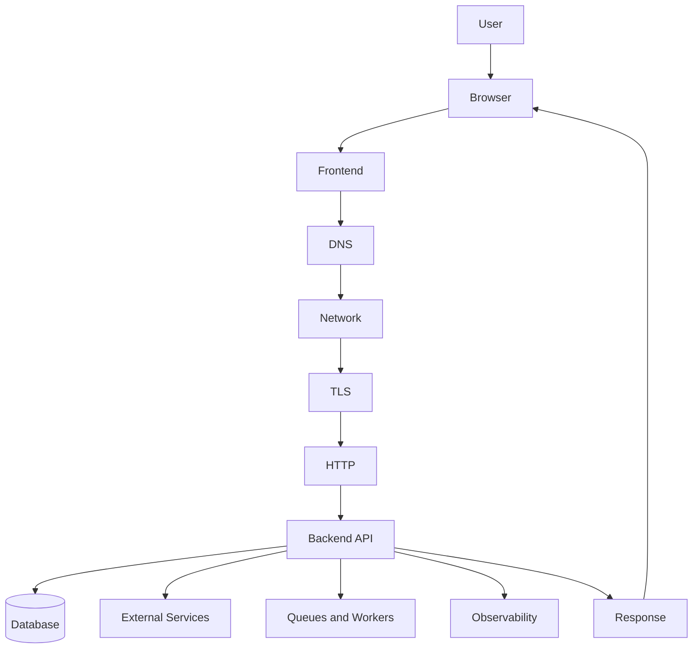
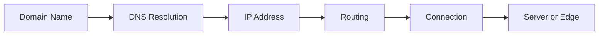
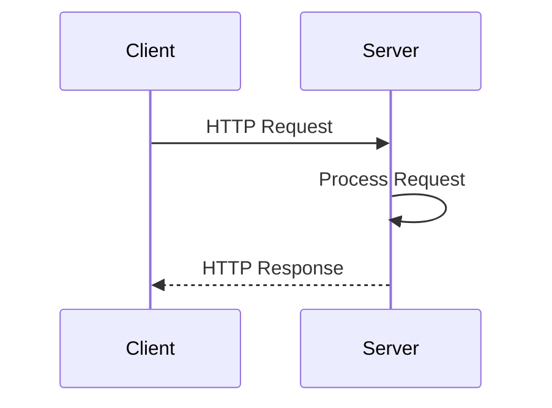
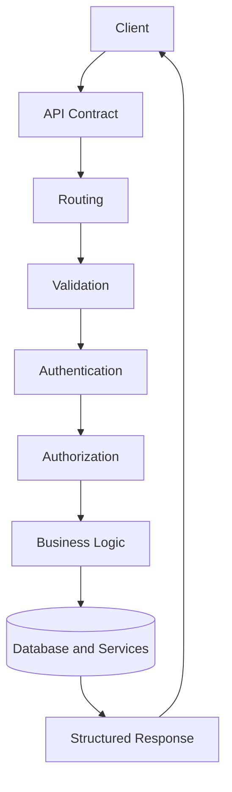
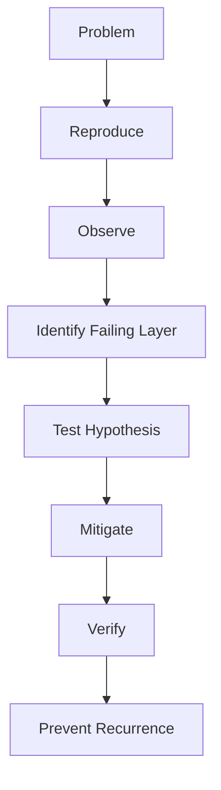
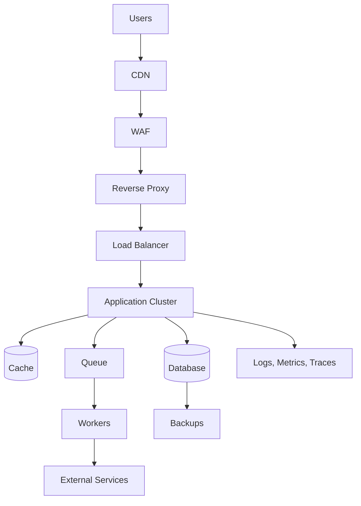
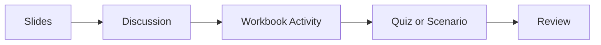

# Web Mechanics, Architecture & Network Fundamentals  
## Slide Deck — Parts 0–6

This presentation deck supports the **Web Mechanics, Architecture & Network Fundamentals** learning series.

It contains **208 slides** covering:

```text
Part 0 — Introduction to the Series
Part 1 — Deconstructing Software Architecture
Part 2 — How the Internet and the Web Work
Part 3 — HTTP, HTTPS, and the Request-Response Cycle
Part 4 — RESTful Services and API Paradigms
Part 5 — Network Inspection and Diagnostic Workflows
Part 6 — Performance, Reliability, Security, and Production Delivery
```

The deck is designed as a visual companion to the tutorials, student notes, workbooks, quizzes, scenarios, rubrics, and trainer materials.

---

# Deck Purpose

The slides help learners understand how modern web applications work across their complete lifecycle:



The deck emphasizes:

- Where code executes
- How systems communicate
- Which component owns each responsibility
- Which data is authoritative
- Where trust boundaries exist
- How requests travel
- How failures are diagnosed
- How systems become secure, performant, reliable, and operationally manageable

---

# Part 0 — Introduction to the Series

Part 0 establishes the overall mental model.

Topics include:

- Web applications as distributed systems
- Client-server communication
- Frontend and backend boundaries
- Internet versus Web
- Protocols
- Requests and responses
- Trust boundaries
- Sources of truth
- Performance
- Reliability
- Observability
- Architectural tradeoffs

The central request journey is:

```text
User action
  ↓
Browser
  ↓
Frontend
  ↓
DNS
  ↓
Network
  ↓
TLS
  ↓
HTTP
  ↓
Backend
  ↓
Database and services
  ↓
HTTP response
  ↓
Browser rendering
```

---

# Part 1 — Deconstructing Software Architecture

Part 1 explains how web applications divide responsibilities between the browser and server.

Topics include:

- Frontend responsibilities
- Backend responsibilities
- The browser as a runtime
- HTML structure
- CSS presentation
- JavaScript behavior
- Frontend rendering
- Backend business logic
- Authentication
- Authorization
- Database access
- File storage
- External services
- API contracts
- Client-side state
- Server-side state
- Static websites
- Server-side rendering
- Client-side rendering
- Static generation
- Hybrid rendering
- Full-stack frameworks
- Monoliths
- Microservices
- Serverless functions
- Queues and workers

The deck emphasizes that:

> Client-side validation improves usability, while server-side validation enforces security and correctness.

It also reinforces that browser execution is not a security boundary because client-side code can be inspected and modified. [1]

---

# Part 2 — How the Internet and the Web Work

Part 2 explains how computers locate and communicate with one another.

Topics include:

- The Internet versus the Web
- Network layers
- Packets
- Packet switching
- IPv4
- IPv6
- Public IP addresses
- Private IP addresses
- NAT
- Domain names
- DNS
- Recursive resolvers
- Root DNS
- TLD servers
- Authoritative DNS servers
- DNS records
- DNS caching
- TTL
- Routers
- Switches
- ISPs
- Autonomous networks
- Latency
- Bandwidth
- Jitter
- Packet loss
- Ports
- Data centers
- Origin servers
- CDNs
- Load balancers
- Firewalls
- Private networks

The central model is:



---

# Part 3 — HTTP, HTTPS, and the Request-Response Cycle

Part 3 explains HTTP as the communication language of the Web.

Topics include:

- HTTP
- HTTPS
- URL structure
- Schemes
- Hosts
- Ports
- Paths
- Query strings
- Fragments
- HTTP methods
- Request lines
- Request headers
- Request bodies
- Response status lines
- Response headers
- Response bodies
- Cookies
- Sessions
- Bearer tokens
- Redirects
- Caching
- Compression
- Content negotiation
- TLS
- Certificates
- Symmetric encryption
- Asymmetric cryptography
- CORS
- Security boundaries

The deck specifically covers URL components such as:

```text
Scheme
Authority
Host
Port
Path
Query
Fragment
```

It also emphasizes that paths identify resources or application routes and do not necessarily map directly to physical files. [1]

A simplified HTTP exchange:



---

# Part 4 — RESTful Services and API Paradigms

Part 4 explains how software systems design and consume APIs.

Topics include:

- APIs
- API consumers
- API providers
- API contracts
- Resources
- Representations
- Collections
- CRUD
- Resource-oriented URLs
- Path parameters
- Query parameters
- Statelessness
- Idempotency
- Pagination
- Filtering
- Sorting
- Searching
- API errors
- Authentication
- Authorization
- Rate limiting
- Versioning
- Backward compatibility
- GraphQL
- RPC
- JSON-RPC
- gRPC
- Serialization
- JSON
- XML
- Multipart form data
- Binary formats
- API gateways
- Synchronous APIs
- Asynchronous APIs

The deck compares the main API paradigms:

```text
REST:
  Resources and HTTP methods

GraphQL:
  Client-selected data graph

RPC:
  Remote procedures and actions
```

A general API flow is:



---

# Part 5 — Network Inspection and Diagnostic Workflows

Part 5 turns the conceptual material into practical diagnostic workflows.

Topics include:

- Browser Developer Tools
- Console
- Network panel
- Preserve log
- Disable cache
- Request filters
- Request URLs
- HTTP methods
- Query parameters
- Request headers
- Request payloads
- Response headers
- Response bodies
- Status-code analysis
- Timing
- DNS lookup time
- Connection time
- TLS time
- TTFB
- Download time
- Waterfall analysis
- Initiators
- cURL
- Postman
- Bruno
- CORS diagnostics
- Authentication diagnostics
- Redirects
- Cookies
- Caching
- Service workers
- Environment mismatches
- Server logs
- Database evidence
- Request IDs

The deck presents the troubleshooting workflow as:



The central rule is:

> Reproduce the problem, inspect the evidence, identify the failing layer, and only then change the code.

The deck also emphasizes that development, staging, and production environments may use different hosts and credentials, so the full request URL should be inspected during diagnosis. [1]

---

# Part 6 — Performance, Reliability, Security, and Production Delivery

Part 6 focuses on taking an application from “working” to “production-ready.”

Topics include:

- Perceived performance
- Critical rendering path
- JavaScript bundle size
- Code splitting
- Lazy loading
- Image optimization
- Font optimization
- Caching
- Cache invalidation
- Database performance
- Indexes
- N+1 queries
- Connection pools
- Timeouts
- Retries
- Exponential backoff
- Circuit breakers
- Graceful degradation
- Availability
- Redundancy
- Backups
- RPO
- RTO
- Security layers
- Secrets management
- Input validation
- XSS
- SQL injection
- CSRF
- Rate limiting
- Logs
- Metrics
- Traces
- Health checks
- Readiness checks
- CI/CD
- Containers
- Reverse proxies
- Load balancers
- Deployment strategies
- Rollbacks
- Incident response

The deck introduces perceived performance and the critical rendering path, including:

```text
HTML parsing
CSS processing
JavaScript execution
Layout
Paint
```

[1]

A production architecture may look like:



---

# Design Principles

The deck follows these principles:

```text
Minimal presentation
White background
Black text
No decorative colors
No images
Text-focused slides
One main idea per slide
Architecture explained through structure and narration
```

The deck is intended to support spoken explanation, discussion, and workbook activities rather than replace the full written tutorials.

---

# How to Use the Deck

## Instructor-led teaching

Use the slides to:

```text
Introduce a topic
Display diagrams
Explain vocabulary
Guide discussions
Set up workbook activities
Review common misconceptions
```

## Self-study

Use the deck to:

```text
Preview a tutorial
Review a completed section
Recall key concepts
Prepare for quizzes
Review before the capstone
```

## Workshop delivery

Pair the slides with:

```text
Student workbooks
Network inspection demonstrations
cURL exercises
Architecture discussions
Scenario analysis
Capstone planning
```

Recommended flow:



---

# Related Materials

This deck should be used alongside:

```text
Core tutorial parts
Foundation primers
Student notes
Student workbooks
Quizzes and tests
Scenario exercises
Rubrics
Trainer guide
Student guide
```

The slide deck provides a visual summary of Parts 0–6. It does not replace the detailed explanations, guided workbook activities, assessments, or capstone materials.
